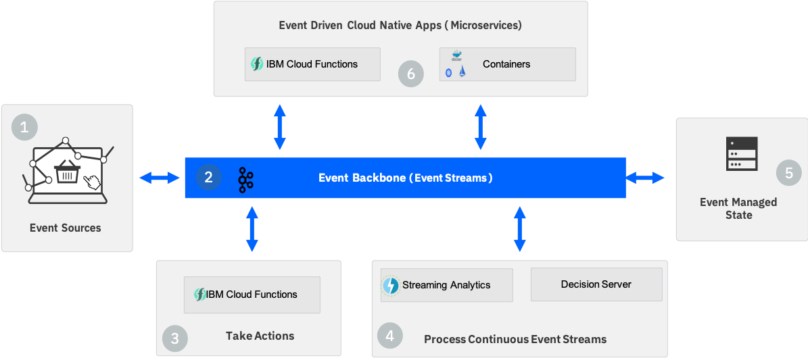
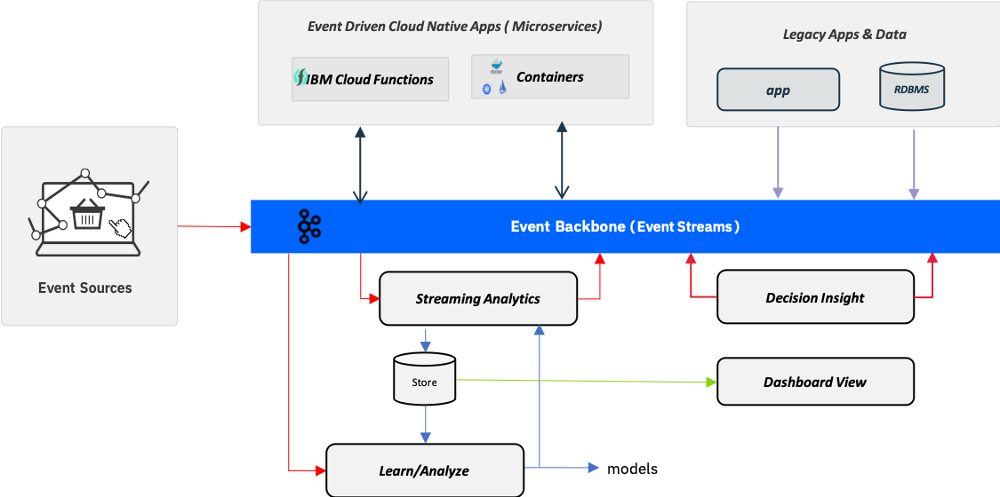

# Event Driven Reference Architecture

The modern digital business works in real time, it informs interested parties of things of interest when they happen, it makes sense of and derives insight from an ever-growing number of event sources, it learns,  it predicts, it's intelligent, it is by nature Event Driven.

For enterprise IT teams, this means embracing event driven as being foundational to the next generation of digital business applications. It will require IT teams to be able to design, develop, deploy and operate event driven solutions, in cloud native styles.

While event driven architectures and reactive programming models are not new concepts the move to Cloud Native architectures with Microservices, Container based workloads and "server-less" computing allow us to revisit event driven in this Cloud Native context.  Indeed we could think of event driven as extending the Resilience, Agility and Scale characteristics of "Cloud Native" to also be Reactive and Responsive:

* Microservices -  Provide the loosely coupled application architecture which enables deployment in highly distributed patters for Resilience, Agility and Scale.
* Cloud Native platforms with Containers and "Server-less deployments"  - Provide the application platform and tools which realize the Resilience Agility and Scale promise of the microservices architectures.
* Event services -  Realizing an Event Driven Architecture (EDA) provide the means to be Reactive and Responsive

Thinking in this way allows us to simplify the concept of the Event Driven Architecture to be about providing the  essential event capabilities to the Cloud Native Platform.

* Being able to communicate and persist events
* Being able to take direct action on events.
* Processing event streams to derive real time insight/intelligence
* Providing communication for event driven microservices

This repository represents the root of related content about the Cloud Native Event Driven Architecture.  It provides guidance  for how to approach the design of event driven solutions,  introduces the Cloud Native Event Driven reference architecture  and provides reusable coding assets for implementation in a cloud native environment.

## Table of Contents

* [Target audiences](#target-audiences)
* [Concepts](#concepts)
* [Reference architecture](#reference-architecture)
* [Extended architecture for machine learning and legacy integration](#extended-architecture)
* [Event Storming](#event-storming)
* [Related repositories](#related-repositories)
* [Contribute to the solution](#contribute)
* [Project Status](#project-status)

## Target audiences

While the content of this repository is mostly technical in nature and is intended for a technical audience, it does also introduce methods such as [Event Storming](#event-storming) which would be used with business leaders to identify key bsuiness domain events and actions. You may find it useful to share this information with your business leaders before engaging them in such activities.

At a high level this is what you should expect to learn by working through the repository and examples.

* As an architect, you will understand how the event driven architecture provides capabilities which support development of event driven solutions.
* As a developer, you will understand how to develop event driven applications.
* As a project manager, you may understand all the artifacts which may be required for an event driven solution.

From the repository you will get starting code, and best practices  which you may want to reuse during your future implementations. The reference architecture has been designed to be portable, and applicable to Public Cloud, Hybrid cloud and across multiple clouds. Examples given are directly deployable in IBM Public Cloud and with IBM Cloud Private.
## Concepts
Before we start looking at the details of the Event Driven Architecture we will quickly examine the core concepts of being event driven:

* Events
* Event streams
* Commands
* Loose Coupling
* Cohesion

[Read more ...](docs/concepts/README.md)

## Reference Architecture

We defined the starting point for a modern Cloud Native Event Driven Architecture to be that it supports at least the following important capabilities:

* Being able to communicate and persist events
* Being able to take direct action on events.
* Processing event streams to derive real time insight/intelligence
* Providing communication for event driven microservices

With an event backbone providing the connectivity between the capabilities, we can visualize a reference Event Driven Architecture as below.

Where:

* IBM Event Streams : provides a Kafka Event Backbone withPub/Sub communication,  event log, and simple event stream processing.
* IBM Cloud Functions : Provides a simplified programming model to take action on an event  with serverless  compute.
* Streaming Analytics : Provides continuous ingest and analytical processing across multiple event streams.
* Decision Server Insights: Provides the means to take action on events and event streams through business rules
* Event Driven Microservices applications run as server-less functions or containerized workloads are connected via pub/sub event communication through the event backbone.
* Event Stores provide optimized persistence (data stores), for event sourcing, CQRS  and analytical use cases.

Now we will take a detailed look at each of these component areas which make up the reference architecture:

1- **Event sources**

The modern digital business is driven by events,  events come into the business and events need to be pushed outside of the business.  For our Cloud Native Event Driven Architecture we consider event sources to be all of those things which may generate events which are of interest to the business. This could include, events coming from, IoT devices, mobile apps, web apps, database triggers or microservices.

In general terms, an *Event Source*, or event producer is any component capable of creating an event notification and publishing it to the event backbone, but lets look at some specific types of producer to better understand the opportunity with event driven.

[Read more ...](docs/evt-src/README.md)

2- **The Event Backbone** is the center of the Event driven architecture providing the event communication and persistence layer with the following capabilities.
 * Pub/Sub style event communication between event producers and consumers
 * An Event Log to Persist events for a period of time
 * Replay of events
 * Subscriptions from multiple consumers

 [Read more ...](docs/evt-backbone/README.md)

3- **Taking an Action** after an event has occurred is one of the fundamental operations for any event driven solution  **IBM Cloud Functions** provides a simplified *Action* programming model, enabling developers to simply write the *action* code and have Cloud Functions, manage the compute workload.

With this simplified action model:

 * A business event of interest would be published to the event backbone
 * The *action* for the event would be written as a cloud Functions action
 * Cloud Functions would be configured to subscribe to the event and use it as a trigger to start the *action*
 * Cloud functions manages the start-up of the required compute resources.
 * Cloud functions managed execution of the action code
 * Cloud functions manages the shut-down of the compute resources when the action is complete

 [Read more ...](docs/evt-action/README.md)

4- **Processing continuous Event Streams to derive real time insights/intelligence** is an essential element of modern event driven solutions. Specialized  *event stream processing engines* provide the means to run stateful analytical and complex event processing  workloads across multiple real time event streams while maintaining low latency in processing times.

Including these engines as part of the Event Driven Architecture enables:

* Analysis and Understanding of real time event streams
* Extracting real time event data from the stream so that Data Scientists can understand and derive ML models
* Running analytical processes, Machine Learning models in line in real time  against the event stream.
* Matching of complex event patterns across multiple streams and time windows to make decisions and take actions

[Read more ...](docs/rt-analytics/README.md)

5- **Event Managed State**: While the prime focus for an event driven architecture is for processing events, there are cases where we need to persist events for post processing and queries by other applications.  With the event backbone we have a builtin *Event Log* which provides the means to store and reply events published to the backbone, however when we consider the full scope of Event Driven solutions there are other use cases and types of store that we should support. This includes:

 * Event Stores optimized for analytics
 * Event Sourcing as a pattern for recording state changes and updates across distributed systems
 * Command Query Response Separation ( CQRS ) as an optimization which separates updates and reads across different stores

[Read more ...](docs/evt-state/README.md)

6- **Event Driven Cloud Native Apps (Microservices)** The event driven architecture must also reach across into our application platform. Developers will build applications which interact with events and are themselves event driven, that is they will both produce and consume events via the event backbone.  In this context we can view the Event Backbone as being part of the microservices mesh, providing the communication between microservices, and therefore enabling the support of loosely coupled event driven microservices as the foundation for an agile application architecture.

For maximum flexibility the architecture should support both the *Server-less* and *container* based run time models which are core to the modern Cloud Native Approach.

IBM Cloud functions provides a *server-less* compute model and simplified programming model for event drive microservices with the complexities of managing active consumer service instances abstracted into the server-less compute stack.

[Read more ...](docs/servicemesh/README.md)

## Extended Architecture

The Event Driven Reference Architecture provides the framework to support event driven applications and solutions,  the extended architecture provides the connections for

  * Integration with legacy apps and data resources
  * Integration with Analytics/Machine learning to derive real time insights

The architecture diagram below shows how these capabilities fit to form an extended event driven architecture.

[Read more ...](docs/extended-arch/readme.md)

## Event Storming

When it comes to the design of event driven solutions there are some additional methods which can be utilized to help understand the business events and actions that make up a business.

**Event Storming**,  is a workshop format for quickly exploring complex business domains by focusing on *domain events* generated in the context of a business process or a business application. It focuses on communication between product owner, domain experts and developers.

**Insights Storming**, is an extension to the event storming workshop and encourages a forward looking approach to consider the  insights, (predictive models)  which would make a difference to the business when we look at actions for key business events. What if instead of seeing a *system has failed event*  ( events are something that has happened) we could see a predictive or derived event , the *system will fail in 3 days* , we could take preventative actions.

For more details please read the following chapters.

* [Event Storming Methodology](docs/methodology/readme.md)
* [Insights Storming Methodology](docs/methodology/InsightStorming/readme.md)

## Applicability of an EDA

EDAs are typically not used for distributed transactional processing because this can lead to increased coupling and performance degradation. But as seen in previous section, using message backbone to support communication between microservices to ensure data consistency is a viable pattern. The use of EDAs for batch processing is also restricted to cases where the potential for parallelizing batch workloads exist.  Most often EDAs are used for event driven applications that require near-realtime situation awareness and decision making.

## Related repositories

* [Container shipment solution](https://github.com/ibm-cloud-architecture/refarch-kc): this solution presents real time analytics, pub-sub architecture pattern and micro-service communication on Kafka.
* [Predictive maintenance - analytics and EDA](https://github.com/ibm-cloud-architecture/refarch-asset-analytics) how to mix Apache Kafka, stateful stream, Apache Cassandra and ICP for data to develop machine learning model deployed as a service.

## Compendium

* [Getting started with IBM Streams Analytics on IBM Cloud](https://console.bluemix.net/docs/services/StreamingAnalytics/t_starter_app_deploy.html#starterapps_deploy)
* [IBM Streams Analytics Samples](https://ibmstreams.github.io/samples/)
* [Kafka summary and deployment on IBM Cloud Private](./docs/kafka/readme.md)
* [Service mesh](https://github.com/ibm-cloud-architecture/refarch-integration/blob/master/docs/service-mesh/readme.md)
* [Serverless](https://github.com/ibm-cloud-architecture/refarch-integration/tree/master/docs/serverless)
* [API for declaring messaging handlers using Reactive Streams](https://github.com/eclipse/microprofile-reactive-messaging/blob/master/spec/src/main/asciidoc/architecture.asciidoc)
* [Microservice patterns - Chris Richardson](https://www.manning.com/books/microservices-patterns)

## Contribute

We welcome your contribution. There are multiple ways to contribute: report bugs and improvement suggestion, improve documentation and contribute code.
We really value contributions and to maximize the impact of code contributions we request that any contributions follow these guidelines:

* Please ensure you follow the coding standard and code formatting used throughout the existing code base
* All new features must be accompanied by associated tests
* Make sure all tests pass locally before submitting a pull request
* New pull requests should be created against the integration branch of the repository. This ensures new code is included in full stack integration tests before being merged into the master branch.
* One feature / bug fix / documentation update per pull request
* Include tests with every feature enhancement, improve tests with every bug fix
* One commit per pull request (squash your commits)
* Always pull the latest changes from upstream and rebase before creating pull request.

If you want to contribute, start by using git fork on this repository and then clone your own repository to your local workstation for development purpose. Add the up-stream repository to keep synchronized with the master.

## Project Status
[10/2018] Just started

## Contributors

* Lead development [Jerome Boyer](https://www.linkedin.com/in/jeromeboyer/)
* Lead offerings [Andy Gibbs](https://www.linkedin.com/in/andy-g-3b7a06113/)
* [IBM Streams Analytics team]
* [IBM Event Stream team]
* [IBM Decision Insight team]

Please [contact me](mailto:boyerje@us.ibm.com) for any questions.
