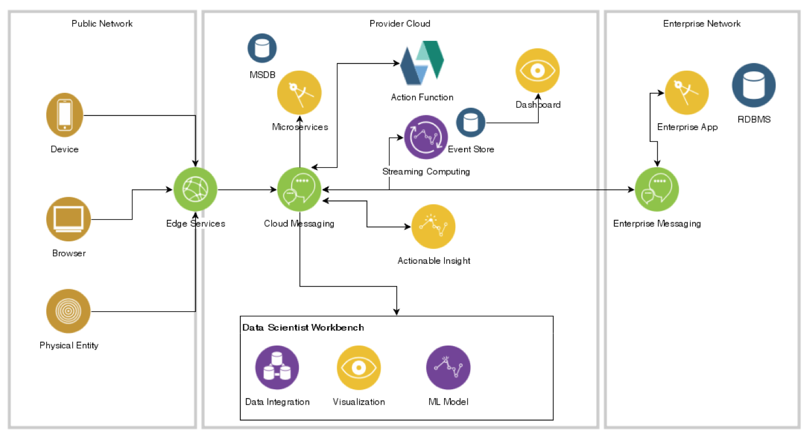
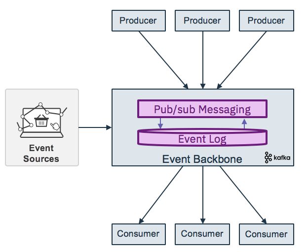

# Event Driven Architecture Reference Architecture
Today IT architectures are hybrid cloud and event driven: most businesses are using cloud deployment as part of their IT strategy and millions of events are created in this context.
Event-Driven Architecture (EDA) is a software architecture that enables the sending of events from event producers to event consumers in a decoupled manner. An event, more precisely an event notification, is a timestamped, immutable message that is delivered from event producers to event consumers via an asynchronous mechanism, sometimes called an event channel. EDA is only decoupled in the sense that event producers are not aware of event consumers and vice versa but this is sufficient to make event-driven systems more flexible, scalable and adaptable.
Adopting an event driven architecture brings [loosely coupled](#loosely-coupled) components and simplify microservices integration. EDAs are conceptually simple, but the large scale implementation of an EDA is anything but simple.

This repository represents the root of related content about Event Driven Architecture and groups guidances and reusable coding assets for EDA.

## Table of Contents
* [Target Audiences](#target-audiences)
* [Reference Architecture](#architecture)
* [Concepts](#concepts)
* [Related repositories](#related-repositories)
* [Contribute to the solution](#contribute)
* [Project Status](#project-status)

## Target audiences
You will be greatly interested by the subjects addressed in this solution if you are...
* an architect, you will get a deeper understanding on how all the components work together, and how to address.
* a developer, you will get a broader view of the solution end to end and get existing starting code, and practices you may want to reuse during your future implementation. We focus on event driven solution in hybrid cloud addressing patterns and non functional requirements as CI/CD, Test Driven Development, resiliency, ...
* a project manager, you may understand all the artifacts to develop in an EDA solution, and we may help in the future to do project estimation.

## Architecture
The high level component view can be summarized in the diagram below:

To document the components we are adding numbering:

1- Data and event sources reference events coming from IoT device, mobile app, webapp, database triggers or microservices. Click stream from webapp or mobile app are common events used for real time analytics. An event producer is any component capable of creating an event notification and publishing it to an event channel.
2- Event consumers are any components capable of receiving and reacting to event notifications. Event consumers carry out activities as diverse as detecting  business threats and opportunities, performing actions, or monitoring event flows. Like event producers, software modules that are event consumers should aim to be cohesive and loosely coupled.
In modern architecture consumer are functions as a service, traditional applications (in the enterprise network) and microservices. Microservices are also producers. As microservice persists its own data in its own store, and architects may leverage EDA to manage data consistency between services. We are addressing this pattern in [the service-mesh section below](#service-mesh).
3- CEP consumers: Some types of event consumers are specials in the sense that they are designed specifically for event processing. Sometimes referred to as event processing engines, such components may be capable of simple event processing, complex event processing (CEP) or event stream processing (ESP). Specializations in the way commercial and open source products implement these capabilities constitute the basis for our discussion concerning the non-functional aspects of event-driven architecture.
4- The Event Backbone is the center of the Event driven architecture, proving the event communication layer with event log. It enables the delivery of events from event producers to consumers using a pub/sub style. It supports at least the following capabilities:
 * store events for a period of time, allowing for potential downtime of the event consumers (ideally implemented with an event log)
 * deliver event once only
 * handle subscriptions from multiple consumers
 * mediate, filter, aggregate and transform Events

It propagates events, which may be a hierarchy of messaging hub. The pub/sub style is used

5- Dashboard: Event based solution needs to present different type of user interface:  operational dashboards to assess the state of the runtime components and business oriented dashboard, also known as Business Activity Monitoring.
There is a need to keep visibility of event paths inside the architecture. Dashboards will be connected to the event backbone and to event store.

6- Data scientist workbench:
There are opportunities to have data scientists connecting directly event subscriber from their notebook to do real time data analysis, data cleansing and even train and test model on the data from the event payload. The data can be kept in data store but the new model can be deployed back to the streaming analytics component...

## Concepts

### Loosely cloupling
Loose coupling is one of the main benefits of event-driven processing. It allows event producers to emit events without any knowledge about who is going to consume those events. Likewise, event consumers do not have to be aware of the event emitters. Because of this, event consuming modules and event producer modules can be implemented in different languages or use technologies that are different and appropriate for specific jobs. Loosely coupled modules are better suited to evolve independently and, when implemented right, result in a significant decrease in system complexity.

Loose coupling, however, does not mean “no coupling”. An event consumer consumes events that are useful in achieving its goals and in doing so establishes what data it needs and the type and format of that data. The event producer emits events that it hopes will be understood and useful to consumers thus establishing an implicit contract with potential consumers. For example, an event notification in XML format must conform to a certain schema that must be known by both the consumer and the producer.  One of the most important things that you can do to reduce coupling in an event-driven system is to reduce the number of distinct event types that flow between modules. To do this you have pay attention to the cohesiveness of those modules.

### Cohesion
Cohesion is the degree to which related things are encapsulated together in the same software module. At this point, for the purposes of our EDA discussion, we define module as an independently deployable software unit that has high cohesion.  Cohesion is strongly related to coupling in the sense that a highly cohesive module communicates less with other modules, thus reducing the number of events, but most importantly, the number of event types in the system. The less modules interact with each other, the less coupled they are.
Achieving cohesion in software while at the same time optimizing module size for flexibility and adaptability is hard but it is something that should be aimed for. Designing for cohesion starts with a holistic understanding of the problem domain and good analysis work. Sometimes it must also take into account the constraints of the supporting software environment. Monolithic implementations should be avoided, as should implementations that are excessively fine-grained.  

### Event Backbone
The Event Backbone propagates events. The pub/sub style is used. The event log represents the original source of truth and support the concept of event sourcing (see below) and event replay.

  

The Key features of an event Backbone:
*	Capability to store events for a period of time, allowing for potential downtime of the event consumers (ideally implemented with an event log)
* Immutable data : Consistent replay for evolving application instances
* Facilitate many consumers: Shared central “source of truth”
* Event log history is becoming a useful source for data scientists and machine learning model derivation

•	capability for once only event delivery
•	capability to handle subscriptions
•	capability to mediate and transform

Supporting products:
* [kafka](http://apache.kafka.org) and see also our [kafka article](https://github.com/ibm-cloud-architecture/refarch-analytics/tree/master/docs/kafka) on how to support HA and deployment to kubernetes.
* [IBM Event Streams](http://)
* [IBM MQ](): We are addressing and delivering some simple MQ messaging solution as part of the integration solution and the lift and shift MQ workload to IBM Cloud.

### Real-time analytics
The real-time analytics component supports
* Continuous event ingestion and analytics
* Correlation across events and streams
* Windowing and stateful compute
* Consistent/high-volume streams of data

The application pattern can be represented by the following diagram:

* many sources of event are in the ingestion layer via connectors and event producer code.
* the data preparation involves data transformation, filtering, correlate, aggregate some metrics and data enrichment by leveraging other data sources.
* detect and predict events pattern using scoring, classification
* decide by applying business rules and business logic
* act by triggering process, business services, modifying business entities...

### Function as a service
As a event consumer functions deliver stateless discrete step or task for the global event processing. The serverless approach will bring cost efficiency for the just on-demand invocation. It fits well in post processing with the event processing.
Cloud functions provides a simple way for developers to write code which takes action on an event.
Serverless computing model, complete abstraction of infrastructure away from the developer
No need to worry about infrastructure/scaling  
Supports event notifications and event commands
Cost model reflects simple event processing, pay for event processing compute time only

* [Serverless - FaaS](docs/serverless/README.md)

### Decision Insights
Decision insight is a stateful operator to manage business decision on enriched event linked to business context and business entities. This is the cornerstone to apply business logic and best action using time related business rules.
[See this note too](docs/dsi/README.md)

IBM [Operational Decision Manager Product documentation](https://www.ibm.com/support/knowledgecenter/en/SSQP76_8.9.1/com.ibm.odm.itoa.overview/topics/con_what_is_i2a.html)

### Service mesh
We are starting to address service mesh in [this note](https://github.com/ibm-cloud-architecture/refarch-integration/blob/master/docs/service-mesh/readme.md), and adopting messaging as a microservice communication backbone involves using at least the following patterns:
* microservice publish events when something happens in the scope of their control, for example an update in the business entities they are responsible of.
* microservice interested by other business entities, subscribe to those events and it can update its own states and business entities when receiving such events. Business entity keys needs to be unique, immutable.
* Business transactions are not ACID and span multiple services, they are more a series of steps, each step is supported by a microservice responsible to update its own entities. We talk about eventual consistency of the data.
* the message broker needs to guarantee that events are delivered at least once and the microservices are responsible to manage their offset from the stream source and deal with inconsistency, by detecting duplicate events.   
* at the microservice level, updating data and emitting event needs to be an atomic operation, to avoid inconsistency if the service crashes after the update to the datasource and before emitting the event. This can be done with an eventTable added to the microservice datasource and an event publisher that read this table on a regular basis and change the state of the event once published. Another solution is to have a database transaction log reader or miner responsible to publish event on new row added to the log.
* One other approach to avoid the two phase commit and inconsistency is to use an Event Store or event sourcing to keep trace of what is done on the business entity with enough data to rebuild the data. Events are becoming facts describing state changes done on the business entity.

### Command Query Responsibility Segregation

## Related repositories
* [Predictive maintenance - analytics and EDA](https://github.com/ibm-cloud-architecture/refarch-asset-analytics) how to mix Apache Kafka, stateful stream, Apache Cassandra and ICP for data to develop machine learning model deployed as a service.

## Compendium
* [Getting started with IBM Streams Analytics on IBM Cloud](https://console.bluemix.net/docs/services/StreamingAnalytics/t_starter_app_deploy.html#starterapps_deploy)
* [IBM Streams Analytics Samples](https://ibmstreams.github.io/samples/)
* [Kafka summary and deployment on IBM Cloud Private](https://github.com/ibm-cloud-architecture/refarch-analytics/tree/master/docs/kafka)
* [Service mesh](https://github.com/ibm-cloud-architecture/refarch-integration/blob/master/docs/service-mesh/readme.md)
* [Serverless](https://github.com/ibm-cloud-architecture/refarch-integration/tree/master/docs/serverless)
* [API for declaring messaging handlers using Reactive Streams](https://github.com/eclipse/microprofile-reactive-messaging/blob/master/spec/src/main/asciidoc/architecture.asciidoc)

## Contribute
We welcome your contribution. There are multiple ways to contribute: report bugs and improvement suggestion, improve documentation and contribute code.
We really value contributions and to maximize the impact of code contributions we request that any contributions follow these guidelines
* Please ensure you follow the coding standard and code formatting used throughout the existing code base
* All new features must be accompanied by associated tests
* Make sure all tests pass locally before submitting a pull request
* New pull requests should be created against the integration branch of the repository. This ensures new code is included in full stack integration tests before being merged into the master branch.
* One feature / bug fix / documentation update per pull request
* Include tests with every feature enhancement, improve tests with every bug fix
* One commit per pull request (squash your commits)
* Always pull the latest changes from upstream and rebase before creating pull request.

If you want to contribute, start by using git fork on this repository and then clone your own repository to your local workstation for development purpose. Add the up-stream repository to keep synchronized with the master.

## Project Status
[10/2018] Just started

## Contributors
* Lead development [Jerome Boyer](https://www.linkedin.com/in/jeromeboyer/)
* [Andy Gibb]()
* [IBM Streams Analytics team]
* [IBM Event Stream team]

Please [contact me](mailto:boyerje@us.ibm.com) for any questions.
