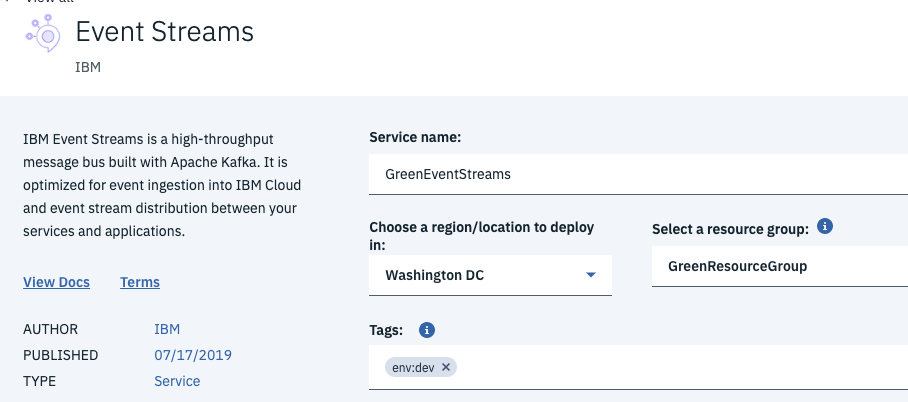
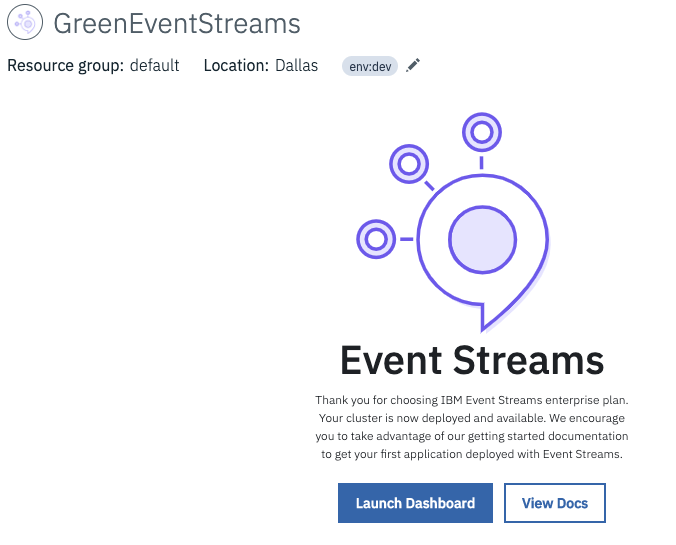
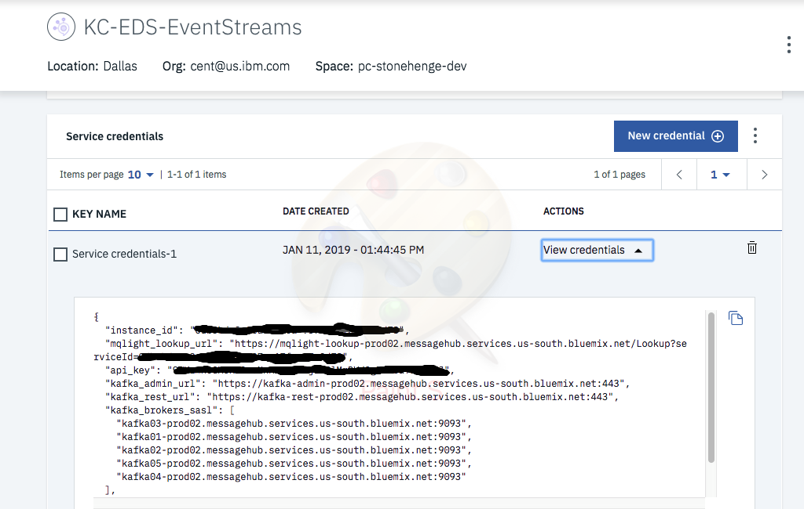
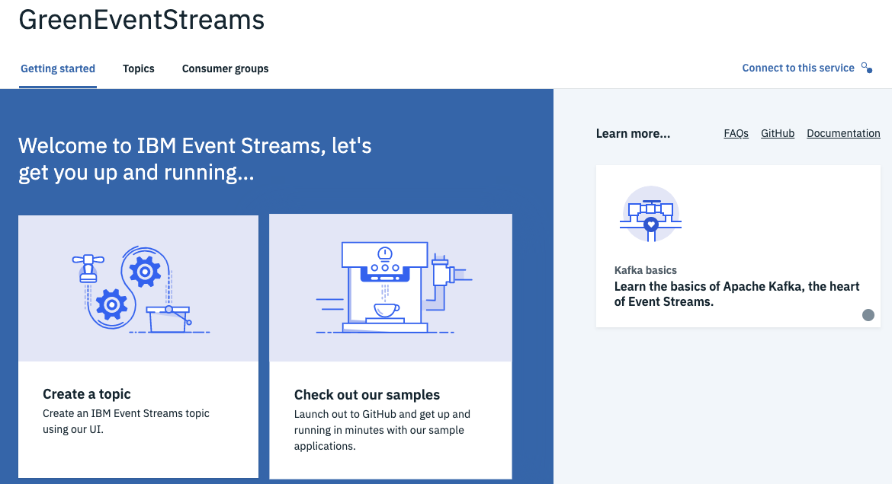
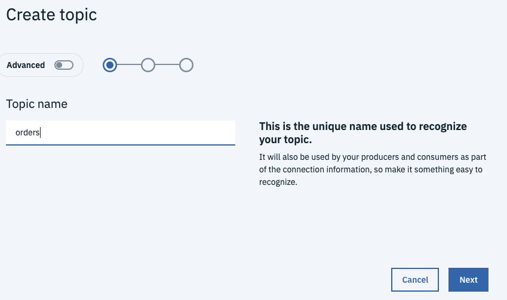
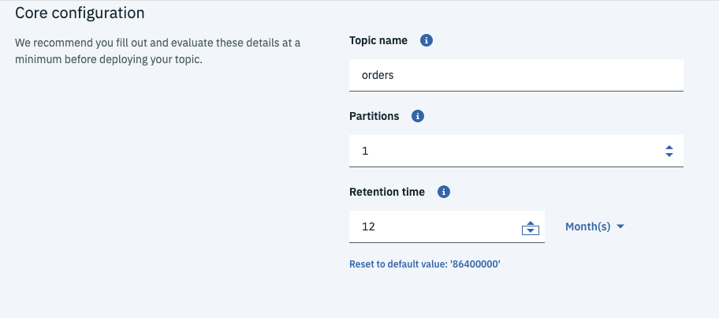
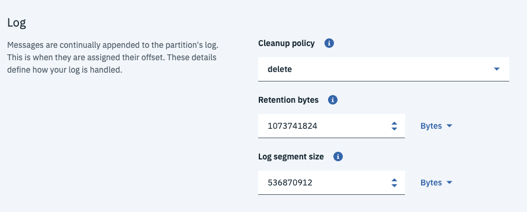
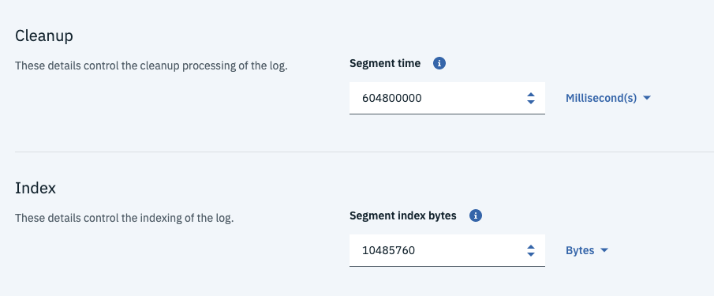

# Event Stream Service on IBM Cloud

The installation instructions are here: [ibm.github.io/event-streams](https://ibm.github.io/event-streams/installing/installing/).

## Things to consider before installation

* Software and hardware [pre-requisites](https://ibm.github.io/event-streams/installing/prerequisites/) 
* Can start small with the 3 brokers cluster. See [configuration note](https://ibm.github.io/event-streams/installing/configuring/)
* Be sure the servers running the nodes and then event streams pods have enough resource available, using `free -m` linux command for memory and `df` for disk
* Define the persistence strategy to support persisting logs from the Kafka topic and zookeepers metadata. 
* Do you need to encrypt traffic to the cluster with your own certificates?
* Do you want to use TLS for pod to pod communication?
* For geo-replication defines the number of workers dedicated to do replication.

## Provision the service
To provision your service, go to the IBM Cloud Catalog and search for `Event Streams`. It is in the *Integration* category. Create the service and specify a name, a region and a resource group, add a tag if you want to, then select the enterprise plan. 

Once the service is provisioned you should reach the welcome page:

## Add service credentials

In the service credentials create new credentials to get the Kafka brokers list, the admim URL and the api_key needed to authenticate the consumers or producers.

 

The api key and the broker urls will be used to set kubernetes secrets needed by the producer and consumer services. 

## Add topic with advanced properties

Launch the dashboard:

and then select the 'create a topic' tile to add the topics needed for the solution. Enter a name and select Advanced switch:

In the advanced configuration, specify the number of partition and event retention time: for topic with not a lot of events, topic can keep data for a long period of time. 

As events are persisted in log, we need to specify the cleanup policy, `delete or comprest`, and the size limit for retention, which control the maximum size a partition (which consists of log segments) can grow to before brokers discard old log segments to free up space if topic is set to use the "delete" retention policy.

Log segment size correspond to the topic configuration, `segment.bytes`, which controls the segment file size for the log. Retention and cleaning are always done one file at a time, so a larger segment size means fewer files but less granular control over retention.

`segment.ms` cotrols the time period after which Kafka will force the log to roll even if the segment file isn't full to ensure that retention can delete or compact old data.

`segment.index.bytes` controls the size of the index that maps offsets to file positions. You generally should not need to change this setting.

The admin REST api offers way to configure more parameters.