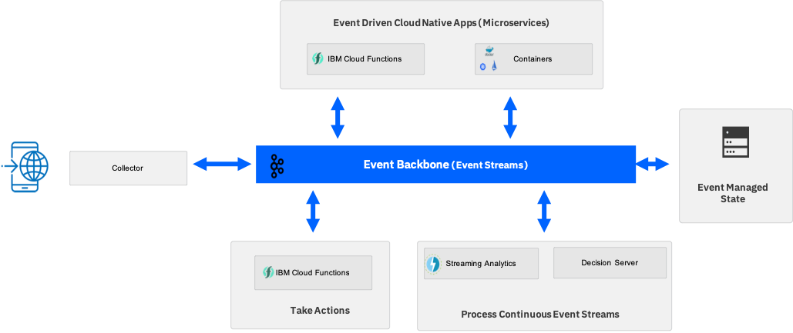

# Event Sources

When you consider an event-driven architecture, think about event producers and event consumers as the interaction points with events. As you develop event-driven applications following a microservices architecture, the microservices you develop play the role of both event producers and event consumers, with the events being passed as the communication payload between them.
However, as you look at the wider opportunities that being event driven offers, you need to widen your view and consider event sources that come from beyond the application code you are writing.  These are events that may be produced from outside our immediate system but have business relevance or enable us to gain valuable insights into things that are affecting your business.

Here is a list of common event sources:

* IOT devices or sensors showing device status changes
* Click Stream data from web or mobile applications
* Mobile applications (HTTP to Back-end for Front-end service and then to topic)
* Geospacial data
* Weather alerts
* Social media feeds
* Real-time voice feeds
* Other messaging backbone
* Data change event streams from databases (change data capture)

## IOT devices and sensors

With IOT devices and sensors you typically have a gateway providing the connectivity for the device, and a level of event enrichment and filtering. In terms of domain driven design you would see the device and gateway as being the technical domain and the event-driven reference architecture as providing the infrastructure for the applications in a business domain.
In practice, the IOT gateway or platform provides the connectivity and is the point of filtering and consolidation of events so that only business-relevant events are passed up to the business domain. The gateway can also be the point where the technical event is enhanced to relate to something recognizable at the business level.  One example of this is to relate a device number or identifier in the event to something that the business recognizes.

## Clickstream data

Clickstream data is often used to understand the behavior of users as they navigate their way through web or mobile apps. It provides a recording of the actions they take, such as the clicks, the mouse-movements, and the gestures.  Analysis of the clickstream data can lead to a deep understanding of how users actually interact with the application. It enables you to detect where users struggle and to look for ways to improve the experience.

Processing the clickstream in real time in an event-driven architecture can also give rise to the opportunity to take direct action in response to what a user is currently doing, or more accurately has just done.

There are various "collectors" that enable collection of standard clickstream events and allow custom actions to be collected as events typically through tags in Javascript.  

Within the Apache Open Source communities the [Divolte](https://divolte.io/) collector is an example of one of these collectors that directly publishes events to Kafka topics.

## Microservices as event producers and consumers

The event-driven reference architecture provides support for event-driven microservices, this is microservices are connected and communicate via the pub/sub communication protocol within the Event Backbone.

With Kafka as the event backbone and pub/sub messaging provider, microservices can use the Kafka API's to publish and listen for events.

# Event standards and schemas

Where you have control as the producer of an event we should consider having an event schema and following a standard to provide the best opportunity for portability of the solutions across cloud environments.
With a lack of formal standards, a working group under the Cloud Native Computing Foundation (CNCF) has recently been formed to define and propose [Cloud Events](https://cloudevents.io/) as the standard.

Our recommendation is to follow CloudEvents where we have the ability to define the event structure and so pass "CloudEvents" through the event backbone.

## Supporting products

* [IBM Mobile](https://www.ibm.com/mobile)
* [IBM MQ](https://www.ibm.com/cloud/mq)
* [IBM Internet of Things platform](https://console.bluemix.net/catalog/services/internet-of-things-platform)
* [IBM Streaming Analytics](https://www.ibm.com/cloud/streaming-analytics)
* [Kafka Producer API for Java](https://kafka.apache.org/10/javadoc/?org/apache/kafka/clients/producer/KafkaProducer.html)
* [Weather Company Data](https://console.bluemix.net/catalog/services/weather-company-data)
* [Voice Agent with Watson](https://console.bluemix.net/catalog/services/voice-agent-with-watson)

## Code references

The following code repositories can be used for event sourcing inspiration:

* [ship movements/ container metrics event producer as a microservice](https://github.com/ibm-cloud-architecture/refarch-kc-ms)
* [Container stream analytics](https://github.com/ibm-cloud-architecture/refarch-kc-streams)
* [Pump Simulator](https://github.com/ibm-cloud-architecture/refarch-asset-analytics/tree/master/asset-event-producer#pump-simulator) to send New Pump/ Asset event or Metric events to emulate intelligent IoT Electrical Pump.
* [Simple text message producer](https://github.com/ibm-cloud-architecture/refarch-asset-analytics/tree/master/asset-event-producer#basic-text-message-pubsubscribe)
* As well as the starting application generated from IBM Event Streams. See such app in the folder `gettingStarted` and explanation in the [starter App](https://github.com/ibm-cloud-architecture/refarch-eda/tree/master/gettingStarted/EDAIESStarterApp)

