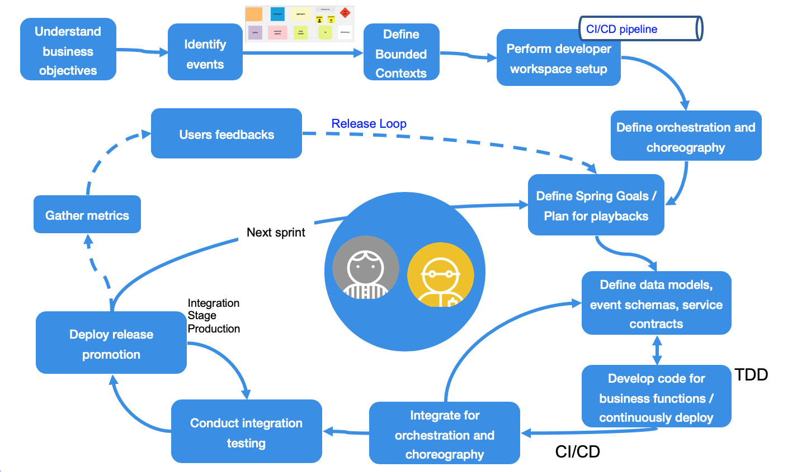

# Event driven methodology

!!! Warning
    Still under development

The event-driven microservices implementation methodology does not differ from agile microservice development, but some specific development activities needs to be added to the traditional workflow. 

The following figure illustrates the iterative loops aroung sprint activities, combined with a larger loop for release software to production and learn from there.

The main actors represented here are the architect or technical squad leader responsible to conduct the technical assessments and to solve problems, and the developers responsible to develop components and microservices. 

The activities start by [understanding business objectives](https://www.ibm.com/cloud/garage/practices/discover/build-a-business-objective/), hypothesis and measurement [metrics](https://www.ibm.com/cloud/garage/practices/discover/define-metrics/) for evaluating the business impacts of this new software project. This activity is based on design thinking techniques and [IBM Garage methodology](https://www.ibm.com/cloud/garage/method/discover). As part of an event driven implementation we want to focus on **identifying the events**, using the [event storming workshop](eventstorming.md) which engages the business and product owner into defining the process flow from an events point of view. The event storming workshop uses predefined constructs to discover the process, events, commands, data, actors and business policies. 

The combination of event storming and Domain Driven Design helps to build bounded context and the Ubiquitous Language. Applying and [iterative approach for design](https://www.ibm.com/cloud/garage/practices/code/practice_iterative_design/), and development, developers define the microservices to develop and define the way to manage the communication between those services. The goal is to address the data flow and how to support the data eventual consistency.

As part of the devops adoption practice, it is very important that the project team and developers put in place an efficient development pipeline, and a workspace adapted to continuously deploy code to the different environments and continuously validate the code quality with unit tests (for the business logic) and integration tests for the contract testing and interactions testing.

A specific problem of distributed system is to define how the integration logic is performed, specially around data consistency and transaction. The two approaches are [orchestration](../evt-microservices/ED-patterns/#services-orchestration) and [choreography](../evt-microservices/ED-patterns/#services-choreography). The choice has an impact on the implementation of each microservices and should not be overseen. It is possible to start by the choreography as it impacts the less the microservices coding and enforce loosely coupling and move to orchestration when needed.

Once those foundations are defined, the traditional iterative and incremental development tasks are performed. As any integration implementation, the challenge is to maintain clear support for the interface definition and the **data model** used for communication. In the case of events the payload is most likely a json or xml type. With XML, XSD are used and per construct the schema management is well defined. With Json you can use **schema registry** and may use approach like [Apache Avro](https://avro.apache.org/) to define schema.
