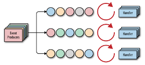
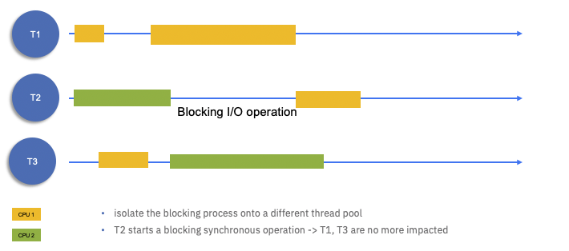

This chapter describes how event-driven architecture addresses the implementation of reactive systems and 
presents the most recent technologies to implement such event-driven responsive solutions.

## Overview

### Cloud native

A buzzy set of words which has some concrete requirements. The [12 factors app](https://12factor.net/) defines 
the needs for modern business service apps or webapps to be a good citizen in cloud deployment:

* **Codebase**: One codebase tracked in version control, many deploys.
* **Dependencies**: Explicitly declare and isolate dependencies.
* **Config**: store config in the environment.
* **Backing services**: Treat backing services as attached resources.
* **Build, release, run**: Strictly separate build and run stages.
* **Processes**: Execute the app as one or more stateless (which may be challenged in
case of event streaming and real-time analytics) processes
* **Port binding**: Export services via port binding.
* **Concurrency**: Scale out via the process model.
* **Disposability**: Maximize the robustness with fast startup and graceful shutdown.
* **Dev/prod parity**: Keep development, staging, and production as similar as possible.
* **Logs**: Treat your logs as event streams.
* **Admin processes**: Run admin/management tasks as one-off processes.

Achieving cloud native is not an easy task. Avoid vendor locking by using specific vendor
services to keep data, messaging... Hybrid cloud applications run on multiple clouds, 
mixing private and public clouds, to reduce response time and prevent global unavailability 
as recently demonstrated by AWS outtages.  Kubernetes helps delivering an abstraction on top
of cloud providers, and uses them as infrastructure as a services, and bring your own platform.
Kubernetes facilitates reactive systems through responsiveness and resilience. 

### Distributed systems

From [Leslie Lamport's definition](https://www.microsoft.com/en-us/research/publication/specifying-systems-the-tla-language-and-tools-for-hardware-and-software-engineers/): 

> A distributed system is one in which the failure of a computer you didn’t even know existed can render your own computer unusable.

we need to design application for transient, intermittent, or complete failure and resilience.
Complex exchanges involving multiple services cannot expect all the participants and the network
 to be operational for the complete duration of that exchange. 

Always ask ourselves: **How would you detect failures? How would you handle them gracefully?**

When designing a distributed solution, we need to keep in mind that the CAP theorem prevents 
a distributed data store from simultaneously providing more than two 
out of the three guarantees of Consistency, Availability and Partition tolerance. 

With simple synchronous calls between services leads to time coupling and enforces programming
in sequence. The code must gracefully handle faulty responses and the absence of response. 
Quarkus/Vert.x has a router that can be intercepted to simulate communication loss, wrong response or delay, this is vertically helpful to test for failure.
See [Clement Escoffier's code sample](https://github.com/cescoffier/reactive-systems-in-java/tree/main/chapter-3).

Combining time-out and retries, is a common development practice, but we can’t assume the service
was not invoked and retrying may reprocess the same request multiple times. Service needs to support
idempotence: multiple requests with same content, results in the same state and same output.
Idempotence can be implemented using unique identifiers added to the payload so consumer can identify same request. But server applications need to keep
state of those ids, which means using Storage, which is under the CAP theorem. We may
include an in-memory data grid such as Infinispan or Hazelcast, an inventory service such as Apache ZooKeeper,
a distributed cache as Redis. 

### Reactive systems

Modern business applications embrace the strong need to be responsive, bringing immediate 
response and feedbacks to the end user or system acting on it at the moment it needed. 
Modern solution based on microservices needs to support load increase and failure and developers are
adopting the reactive manifesto and use modern programming libraries and software to support 
the manifesto characteristics. 

The [reactive manifesto](https://www.reactivemanifesto.org/) defines four characteristics modern cloud native application needs to support:

 


* **Responsive**: deliver a consistent quality of service to end users or systems, react quickly and consistently to events happening in the system.
* **Elastic**: The system stays responsive under varying workload, it can scale up and down the resource utilization depending of the load to the system.
* **Resilient**: stay responsive in the face of failure, this is a key characteristics. It implies distributed systems.
* **Message driven**: the underlying behavior is to have an asynchronous message driven backbone, to enable loose coupling of the application components by exchanging asynchronous messages to minimize or isolate the negative effects of resource contention, coherency delays and inter-service communication network latency. It is the base to support the other reactive characteristics. It also helps for isolation and support location transparency.

Reactive architecture is an architecture approach aims to use asynchronous messaging or event driven architecture to build Responsive, Resilient and Elastic systems. 
Relying on message passing enables the *responsive* characteristics and more, like flow control 
by monitoring the messages in the system and applying backpressure when necessary.

Under the "reactive" terms we can see two important caveats:

* **Reactive systems** is a group of application components which can heal and scale automatically. It address data consistency, cross domain communication, orchestration, failure, recovery... 
* **Reactive programming** is a subset of asynchronous programming and a paradigm where the availability of new information drives the logic forward rather than having control flow driven by a thread-of-execution. This is the adoption of non-blocking IO and event-based model.

The following figure illustrates well how those two paradigms work together to deliver business value:

 

We recommend to go over [this excellent IBM article on defining reactive](https://developer.ibm.com/articles/defining-the-term-reactive) to go deeper into those concepts.

### Commands and Events

Those two concepts are very fundamental to implement well distributed applications. 

* **Commands**: represent action a user or system wants to perform. HTTP APIs pass commands. Commands are sent to a specific service and result is sent back to the caller.
* **Events**: are actions that have successfully completed. An event represents a fact. They are immutable. 

By looking at your solution in terms of commands and events, you focus on the behavior, workflow, instead of the structure.

Events are wrapped into Messages. But Commands can also being passed via messaging and asynchronous communication. Most likely strong consistency is needed and queuing systems are used as message brokers.

### Is it for me?

We have learnt from years of point to point microservice implementations, that embrassing 
asynchronous communication helps a lot to support scaling, integration, coupling and failover. 
So adopting reactive design and implementation may look complex at first but is becoming a 
necessity in the long run. In e-commerce, a lot of monolithic applications were redesigned 
to adopt reactive manifesto characteristics to support scaling the business needs and respond 
to sporadic demand. In the world of big data, collecting, aggregating, applying real time 
analytics, decisions and AI need to scale and respond to events at the time of occurence. 

## EDA and reactive systems

The adoption of event driven microservice implementation fits well into the reactive manifesto, where most of the work presented in this git repository started by adopting Kafka as event 
backbone, it is too reductor to think EDA is just Kafka. EDA supports reactive systems at large, and developing event-driven microservice should use reactive libraries to support 
non-blocking IO and event bus for inter process communication. Also microservices is part of the game, functions / serverless are also in scope and with serverless 2.0, 
Knative eventing is one of the new kid in the play.

The manifesto stipulates "message driven" while EDA is about events and commands. 
Events represent unmmutable data and facts about what happened, and components subscribe to those event
streams. Command demands the consumer to process the content data sent and gives an answer.
Both are sent via messages, and transported and managed by brokers. 
For sure we define event-driven implementations to cover both. And we should not be purist and opinionated 
about messaging versus eventing: it will not make any sense to say: you are using queue to exchange message 
while we produce events to topic. 

The following figure illustrates the combination of synchronous communication, sending commands to reactive
system, supported by reactive applications link together via messaging.


With messaging applications can scale horizontally giving the elastic need of the reactive manifesto. They 
are also more resilient as messages are kept until consumed or for a long period of time and consumer can restart
from where they were in the ordered log. 

Reactive systems are not only exchanging messages. Sending and receiving messages must be done efficiently and Reactive promotes the use of nonblocking I/Os.
Which leads to reactive programming and supporting libraries, like Vert.x, Mutiny, reactive messaging...

## Technology review 

### Concurrency

The following figure illustrates the traditional Java multi-threading approach to handle request and 
access I/Os on a two CPUs computer. When the second thread starts working on the IO the CPU is locked 
and the CPU yellow is supporting 2 threads (1 and 3)

 

On public clouds, the blocking I/O approach inflates your monthly bill; on private clouds, 
it reduces the deployment density.

Non blocking IO framework or library adopts the `reactor pattern` where requests are internally
asynchronous events processed, in order, by an event loop running in one thread, and handlers 
(or callbacks) are used to process the response.

  

The above figure and next one are coming from Clement Escoffier's book 
[Building reactive microservice in Java](https://developers.redhat.com/promotions/building-reactive-microservices-in-java).

In multi CPUs, cores and threading computer, the reactors can run in parallel, with one event 
loop per core:

 

With non-blocking I/O the I/O operation can be allocated to another pool and the allocation of CPU 
to thread is well balanced: 

 
 

Vert.X is the open source library to build such non-blocking I/O app, and using `vertices` to support 
scalable concurrent processor, which executes one event loop thread. `vertices` communicate asynchronously 
via an event bus.  

### Reactive programming

[Reactive programming is about observing asynchronous streams](https://reactivex.io/). Streams can be seen as a pipe in which events flow. 
We observe the events flowing—such as items, failures, completion, cancellations—and implement side effects.

You structure your code around streams and build chains of transformation, also called pipeline. Reactive programming libraries offer 
countless operators that let you create, combine, filter, and transform the object emitted by streams.

One important consideration is the speed of items processing by the consumer. If it is too slow compare to the producer, there will be a big proble, that 
can be solved efficiency by using backprassure protocol. Reactive Streams is such backpressure protocol. It defines the concept of Subscriber
who requests the Publisher a certain amount of items. The consumer controls the flow, as when items are received and processed, consumers can ask for more.
Producer is not strongly coupled to the consumer as they participate together to the stream processing. Producer uses a Subscription object to act as a contract
between the participants.

different libraries support the Reactive Streams protocol, like Mutiny, RxJava, Project Reactor...

### Vert.x

We do not need to reintroduce [Vert.X](https://vertx.io/), but with the large adoption of Quarkus 
to develop new JVM based microservice, Vert.x is an important library to understand. The main concepts 
used are:

* An application would typically be composed of multiple vertices running in the same Vert.x instance and communicate with each other using events via the `event bus`.
* vertices remain dormant until they receive a message or event.
* Message handling is ideally asynchronous, messages are queued to the event bus, and control is returned to the sender
* Regular vertices are executed in the event loop
* Worker vertices are not executed on the event loop, which means they can execute blocking code
* Two event loops per CPU core thread
* No thread coordination mechanisms to manipulate a verticle state
* A verticle can be deployed several times as part of a container for example
* `Event bus` is used by different vertices to communicate through asynchronous message passing  (JSON)
(point to point, pub / sub, req / resp)
* We can have in memory event bus or clustered cross nodes, managed by Vert.x with a TCP protocol

Quarkus HTTP support is based on a non-blocking and reactive engine (Vert.x and Netty). All the HTTP requests your application receive are handled by event loops (IO Thread) and then are routed towards the code that manages the request. Depending on the destination, it can invoke the code managing the request on a worker thread (Servlet, Jax-RS) or use the IO Thread (reactive route).


 

(Images src: quarkus.io)

The application code should be written in a non-blocking manner using SmallRye Mutiny or RsJava 
libraries.

So when interactive with different services using kafka as an inter service communication layer 
the producer and consumer are handlers and the internal processing can be schematized as:


 


Vert.x and reactive messaging applications may be combined to byild reactive systems to support the reactive manifesto:

 

* To achieve **resilience** and **responsiveness**, microservice can scale vertically using vertices inside the JVM and horizontally via pod 
scaling capability within a Kubernetes cluster. The inter-communication between vertices is done via `event bus` and managed by the Vert.x library 
using virtual addresses, service discovery and event bus. 
* Internal service communication (even cross pods) and external cross service boundary are **message driven**. Using Kafka, they are also 
durable improving resilience and recovery.
* Kubernetes enforces part of the reactive manifesto at the container level: **elasticity** and resilience with automatic pod recovery and scheduling.


### MicroProfile reactive messaging

The [MicroProfile Reactive messaging](https://download.eclipse.org/microprofile/microprofile-reactive-messaging-1.0/microprofile-reactive-messaging-spec.pdf) specification  aims  to  deliver  applications  embracing  the characteristics of reactive systems as stated by reactive manifesto. It enables non-blocking, asynchronous message passing between services, giving them the ability to scale, fail, and evolve independently.

To summarize the main concepts, developer declares channels as way to get incoming or outgoing messages between CDI Java beans and connector to external message brokers:

  

The potential matching declarations for the connector, for the above figure, may look like below:

```shell
# Kafka connector to items topic mapped to the item-channel
mp.messaging.incoming.item-channel.connector=smallrye-kafka
mp.messaging.incoming.item-channel.topic=items

```

For code which defines the 'outhoing' and 'incoming' message processing see [this quarkus guide](https://quarkus.io/guides/reactive-messaging), the EDA quickstart code templates
for [producer](https://github.com/ibm-cloud-architecture/eda-quickstarts/tree/main/quarkus-reactive-kafka-producer) and [consumer](https://github.com/ibm-cloud-architecture/eda-quickstarts/tree/main/quarkus-reactive-kafka-consumer)

```Java
public class OrderService {

    @Channel("orders")
	public Emitter<OrderEvent> eventProducer;

		public OrderEntity createOrder(OrderEntity order) {
    		try {
			// build orderPayload based on cloudevent from order entity
			Message<OrderEvent> record = KafkaRecord.of(order.getOrderID(),orderPayload);
			eventProducer.send(record);
			logger.info("order created event sent for " + order.getOrderID());
		} catch (Exception e) {
			e.printStackTrace();
		}
}
```


JMS and message driven bean, were the messaging APIs to asynchronously communicate with other applications. 
They support transaction and so it is an heavier protocol to use. They do not support asynchronous IO. 

When building microservices, the CQRS and event-sourcing patterns provide an answer to the data sharing between microservices. 
Reactive Messaging can also be used as the foundation to CQRS and Event-Sourcing  mechanisms.

A lot of EDA repositories demonstrating EDA concepts are using microprofile 3.0 Reactive Messaging, as it simplifies the implementation 
to produce or consume messages to messaging middleware like Kafka.

When you use `@Incoming` and `@Outgoing` annotations, the runtime framework (Open Liberty or Quarkus) creates a Reactive Streams component for 
each method and joins them up by matching the channel names.

A [simple guide](https://quarkus.io/guides/kafka) from Quarkus web site with integration with Kafka. 

Open Liberty supports this [specification implementation](https://openliberty.io/blog/2019/09/13/microprofile-reactive-messaging.html).


### Mutiny

[Mutiny](https://smallrye.io/smallrye-mutiny) is a modern reactive programming library to provide more natural, readable reactive code. It supports asynchrony, non-blocking programming and streams, events, back-pressure and data flows.

With Mutiny both Uni and Multi expose event-driven APIs: you express what you want to do upon a given event (success, failure, etc.). These APIs are divided into groups (types of operations) to make it more expressive and avoid having 100s of methods attached to a single class.

[This section of the product documentation](https://smallrye.io/smallrye-mutiny/#_uni_and_multi) goes over some examples on how to use Uni/ Multi.

### AMQP 

[Advanced Message Queueing Protocol](https://www.amqp.org/) is an international standard for interoperability between messaging middlewares. IBM MQ [supports AMQP client](https://www.ibm.com/support/knowledgecenter/en/SSFKSJ_9.2.0/com.ibm.mq.dev.doc/amqp_scen_clients_mq.htm) via specific AMQP channel. Clients can connect to the queue manager and send / receive messages to / from queue. 

### Knative eventing

[Knative](https://knative.dev/) is Kubernetes based platform to develop serverless. Major value proposition is a simplified deployment syntax with automated scale-to-zero and scale-out based on HTTP load. 

Knative consists of the following components:

* Eventing - Management and delivery of events
* Serving - Request-driven compute that can scale to zero

See the [RedHat Knative cookbook](https://redhat-developer-demos.github.io/knative-tutorial/knative-tutorial/index.html) for a simple tutorial.

## Code samples

* [Vert.x kafka client](https://vertx.io/docs/vertx-kafka-client/java/)
* [Experiences writing a reactive Kafka application](https://developer.ibm.com/tutorials/transforming-a-kafka-application-to-be-reactive/)

## More...

* [Reactive Systems Explained - Book from Grace Jansen - Peter Gollmar](https://www.oreilly.com/library/view/reactive-systems-explained/9781492077336/)
* [Reactive Java Modules show how to build an event-driven, streams-optimized Kafka-based Java application. You will use the Eclipse MicroProfile Reactive Messaging API and Open Liberty to build it and then you'll learn how to test it in true-to-production environments by using containers with MicroShed testing.](https://ide.skillsnetwork.site/reactive-java-workshop)
* [Resiliency discussion in IBM architecture center](https://www.ibm.com/cloud/architecture/architectures/resilience)
* Clement Escoffier's book [Building reactive microservice in Java](https://developers.redhat.com/promotions/building-reactive-microservices-in-java)