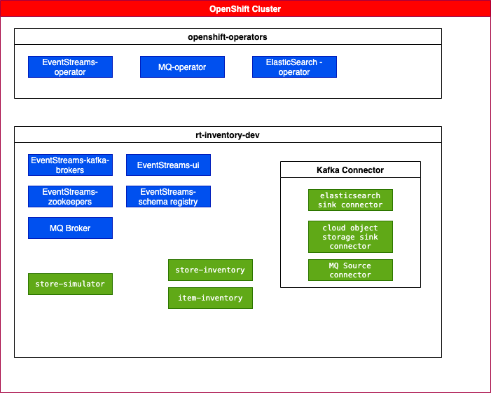
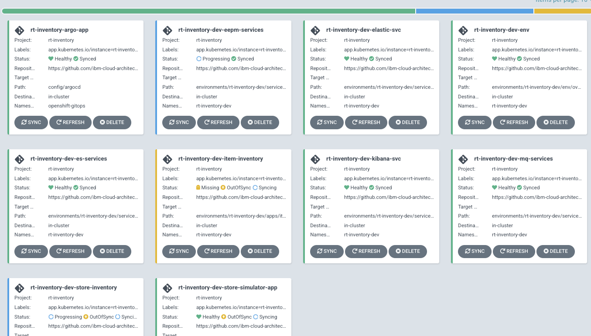

 


### A little bit more on environments

For demonstration purpose, only the `rt-inventory-dev` environment is detailed. One ArgoCD app: [rt-inventory-dev-env](https://github.com/ibm-cloud-architecture/eda-rt-inventory-gitops/blob/main/config/argocd/rt-inventory-dev-env-app.yaml) is monitoring
 the folder [environments/rt-inventory-dev/env/overlays](https://github.com/ibm-cloud-architecture/eda-rt-inventory-gitops/tree/main/environments/rt-inventory-dev/env/overlays) which define the namespace and roles,... 
Each application of the solution are also monitored by an ArgoCD and their declarations are done using standard kubernetes manifests. Here is an exampe of app tree structure:

```
── store-inventory
│   ├── base
│   │   └── kustomization.yaml
│   ├── kustomization.yaml
│   ├── overlays
│   │   └── kustomization.yaml
│   └── services
│       └── store-inventory
│           ├── base
│           │   ├── config
│           │   │   ├── configmap.yaml
│           │   │   ├── deployment.yaml
│           │   │   ├── kustomization.yaml
│           │   │   ├── rolebinding.yaml
│           │   │   ├── route.yaml
│           │   │   ├── service.yaml
│           │   │   └── serviceaccount.yaml
│           │   └── kustomization.yaml
│           ├── kustomization.yaml
│           └── overlays
│               └── kustomization.yaml
```

The last intesting part is to declare the products used within the Cloud Pak for Integration, and deployed in the context of
the respective environments. Everything is in `services` folder. The tree looks like below:

```
── apicurio
│   ├── base
│   │   ├── es-kafka-topics.yaml
│   │   ├── kustomization.yaml
│   │   └── registry.yaml
│   └── overlays
│       └── kustomization.yaml
├── event-endpoint
│   ├── base
│   │   ├── eventendpointmanager-eepm-eda.yaml
│   │   └── kustomization.yaml
│   └── overlays
│       ├── kustomization.yaml
│       └── v10.0.4.0
│           ├── kustomization.yaml
│           └── patch-version.yaml
├── ibm-eventstreams
│   ├── base
│   │   ├── es-topics.yaml
│   │   ├── eventstreams-dev.yaml
│   │   ├── kustomization.yaml
│   │   ├── scram-user.yaml
│   │   └── tls-user.yaml
│   └── overlays
│       ├── kustomization.yaml
│       └── v10.5
│           ├── kustomization.yaml
│           └── patch-version.yaml
├── ibm-mq
│   ├── base
│   │   ├── kustomization.yaml
│   │   └── qmgr.yaml
│   └── overlays
│       ├── kustomization.yaml
│       └── v9.2.4
│           ├── kustomization.yaml
│           └── patch-channel.yaml
├── kconnect
│   ├── README.md
│   ├── kafka-connect.yaml
│   ├── kafka-cos-sink-connector.yaml
│   ├── kustomization.yaml
│   └── mq-source.json
└── kustomization.yaml
```

With the public docker images, and the public GitOps repository, the solution can be deployed to an OpenShift cluster with or without Cloud Pak for Integration already deployed.


### Run on your laptop


### Install Yourself on OpenShift

It is possible to do a step by step deployment of the solution without any gitops deployment. This is more like a lab tutorial, where you can progress more slowly and verify
the result at each steps.

Go to the `rt-inventory-gitops/ocp-demo-step-by-step` folder and follow the [README instructions](https://github.com/ibm-cloud-architecture/eda-rt-inventory-gitops/tree/main/ocp-demo-step-by-step) to make
a step by step approach creating records with the simulator, see them in MQ Queue, start the Kafka Connector MQ source, to move data to Event Streams topic, then
do the kafka streams processing. 

### Run with gitops on openshift

In this approach, we propose to use a GitOps repository and deploy the solution using few scripts and `oc` CLI commands.
In the figure below, all the components are deployed with OpenShift GitOps. The blue components are IBM product components like Event Streams and MQ operators and some other operators, like Elastic Search.
The green rectangles represent the microservices and kafka connectors source or sink deployed as part of the solution.



See next guided tour for GitOps approach.

--- 

# Use Case Guided Tour

## Bootstrap GitOps

Bootstrapping GitOps is mostly to install the MQ, Event Streams, APIC Connect, OpenShift Gitops, and ElasticSearch operators, and do any pre-requisites like entitlement keys.

We prefer to keep the bootstrap instructions in the source repository, therefore follow [the up to date instructions](https://github.com/ibm-cloud-architecture/eda-rt-inventory-gitops#bootstrap-gitops) from the gitops main readme.

## Deploy the Solution

Once operators are deployed. 

* Deploying the full solution is by starting ArgoCD app of apps:

  ```sh
  oc apply -k config/argocd
  ```

* Access the OpenShift GitOps (ArgoCD) console

  ```sh
   chrome https://$(oc get route openshift-gitops-server -o jsonpath='{.status.ingress[].host}'  -n openshift-gitops)
   ```

The expected set of ArgoCD apps looks like (and all should be green):

  

  * **rt-inventory-Argo-app** is an app of apps
  * **rt-inventory-dev-env** is for the rt-inventory-dev namespace
  * **rt-inventory-dev-services** is for event streams, kafka connect cluster and mq deployments in dev-env namespace
  * **rt-inventory-store-simulator-app** is for the simulator app used in the demo.
  * **rt-inventory-item-inventory** for the item aggregator application
  * **rt-inventory-store-inventory** for the store aggregator application
  * **rt-inventory-dev-eepm-service** for Event End Point management
  * **rt-inventory-dev-elastic-svc** for Elastic Search deployment
  * **rt-inventory-dv-kibana-svc** for Kibana

* Verify pods

```sh
  oc project rt-inventory-dev
  oc get pods

  NAME                                         READY   STATUS    RESTARTS   AGE
  dev-kafka-cruise-control-6d6bf8b774-99rwl    2/2     Running   0          4d
  dev-kafka-entity-operator-75f7bc8f5c-x4vkt   3/3     Running   0          4d
  dev-kafka-kafka-0                            1/1     Running   0          4d
  dev-kafka-kafka-1                            1/1     Running   0          4d
  dev-kafka-kafka-2                            1/1     Running   0          4d
  dev-kafka-zookeeper-0                        1/1     Running   0          4d
  dev-kafka-zookeeper-1                        1/1     Running   0          4d
  dev-kafka-zookeeper-2                        1/1     Running   0          4d
  item-inventory-669fd4fffc-4fvhk             1/1     Running   0          30h
  store-inventory-7df98556ff-f2ndq            1/1     Running   0          29h
  store-simulator-56f8958498-mvhp9             1/1     Running   0          4d
  dev-entity-operator-74d7dc5cfb-ksv68                              3/3     Running     0          5d21h
  dev-ibm-es-ac-reg-77bfbf84b9-qn8ln                                2/2     Running     0          5d21h
  dev-ibm-es-admapi-6f6bcd465c-h8scj                                1/1     Running     0          5d21h
  dev-ibm-es-metrics-9c4679cd-n5bb7                                 1/1     Running     0          5d21h
  dev-ibm-es-recapi-775bf874b9-gqbdn                                1/1     Running     0          5d21h
  dev-ibm-es-ui-5d488967d4-6v2tm                                    2/2     Running     0          5d21h
  eda-eepm-mgmt-27885b45-postgres-55b548f64f-nqs6f                  0/1     Init:0/1    0          4d23h
  eda-eepm-mgmt-27885b45-postgres-backrest-shared-repo-7b58fjdd7s   1/1     Running     0          12d
  eda-eepm-mgmt-27885b45-postgres-pgbouncer-5575bc4595-c9zng        1/1     Running     0          12d
  eda-kconnect-cluster-connect-78ccb7cc56-jh2ck                     1/1     Running     0          4d17h
  elasticsearch-es-default-0                                        1/1     Running     0          36m
  elasticsearch-es-default-1                                        1/1     Running     0          36m
  elasticsearch-es-default-2                                        1/1     Running     0          36m
  kibana-kb-67f4c87c65-9whwz                                        1/1     Running     0          36m
  store-mq-ibm-mq-0                                                 1/1     Running     1          4d19h
  ```


