# Demonstrating Event Streams from A to Z

What a typical demonstration script will include are:

* Review Event Streams Components
* Operator based deployment and Day 2 operations
* Topic creation
* Producer application
* Consumer application, consumer group concepts, offset concepts
* User access, authentication mechanism
* Monitoring
* Event Streaming
* Geo-replication

## Pre-requisites

We suppose Event Streams is installed on OpenShift cluster, and you have access to the OpenShift Console to demonstrate Operators. Adapt the content according to the audience and the level of their Kafka knowledge.

Be sure to have a `git` client, `oc` cli and `docker` or `podman` installed on your computer.

### cloudctl and es cli

Be sure to keep cloudctl up to date:

```sh
oc get route -n ibm-common-services
# on mac
curl -kLo cloudctl https://cp-console.apps.an.os.example.abc.com:443/api/cli/cloudctl-darwin-amd64
chmod +x cloudctl
```

Verify and install `es cli`: Go to the Event Streams UI > Toolbox > CLI section.

```sh
cloudctl plugin install ./es-plugin
# initialize the plugin 2to your connected cluster
cloudctl es init
```
## Review Event Streams components

Narative: Event Streams is the IBM packaging of different Open Source projects to support in integrated user experience to deploy and manage Kafka  on OpenShift cluster. The following figure illustrates such components:


* Event streams ([Apache Kafka](https://kafka.apache.org) packaging) runs on OpenShift cluster.
* The deployment and the continuous monitoring of Event Streams resources definition and deployed resources is done via Operator ([Strimzi open source project](http://strimzi.io/))
* Event Streams offers a user interface to manage resources and exposes simple dashboard. We will use it during the demonstration.
* The schema management is done via schema registry and the feature is integrated in Event Streams user interface but in the back end, is supported by [Apicur.io registry](http://apicur.io/registry)
* External event sources can be integrated via the [Kafka Connector framework](https://kafka.apache.org/documentation/#connect) and Event Streams offers [a set of connectors](https://ibm.github.io/event-streams/connectors/) and can partner to other companies to get specific connectors.
* External sinks can be used to persist messages for longer time period that the retention settings done at the topic level. S3 buckets can be use, IBM Cloud object storage, and Kafka Sink connectors. There is [this cloud object storage lab](https://ibm-cloud-architecture.github.io/refarch-eda/use-cases/connect-cos/), or [S3 sink with Apache Camel lab](https://ibm-cloud-architecture.github.io/refarch-eda/use-cases/connect-s3/) to present such integrations.
* Event Streams monitoring is done using Dashboards in Event Streams user interface but also in OpenShift monitoring and Kibana dashboard.
* Green components are application specifics, and represent event-driven microservices (see [eda-quickstart templates](https://github.com/ibm-cloud-architecture/eda-quickstarts)) or Kafka Streaming apps, or [Apache Flink](https://flink.apache.org/) apps.
* For cluster optimization, Event Streams integrate Cruise Control, with goal constraints, to act on cluster resource usage.

<details>
<summary style="margin-left: 40px">More argumentations</summary>
<ul>
<li>Kafka is essentially a distributed platform to manage append log with a pub/sub protocol to get streams of events. Messages are saved for a long period of time.</li>
<li>Kafka connectors can also being support by APP Connect integration capabilities or [Apache Camel kafka connectors](https://camel.apache.org/camel-kafka-connector/1.0.x/reference/index.html).</li>
<li>To learn more about [Kafka Connector see our summary](https://ibm-cloud-architecture.github.io/refarch-eda/technology/kafka-connect/)</li>
</ul>
</details>

    

## Concepts

If needed there are some important concepts around Kafka to present [see this kafka technolog overview](https://ibm-cloud-architecture.github.io/refarch-eda/technology/kafka-overview/).

## High Availability

High availability is ensured by avoiding single point of failure, parallel processing and replications. The following figure is a golden topology for OpenShift with Event Streams components deployed. Event Streams Brokers run
in OpenShift worker nodes, and it may be relevant to use one broker per worker nodes. 


Kafka connectors, or streaming applications runs in worker node too and access brokers via mutual TLS authentication and SSL encryption.

Kafka brokers are spread accross worker nodes using anti-affinity policies.

???- "Read more"
    * [Kafka High availability deeper dive](https://ibm-cloud-architecture.github.io/refarch-eda/technology/kafka-overview/advance/#high-availability)
    * See the [OpenShift golden topology article](https://production-gitops.dev/infrastructure/golden-topology/) in production deployment site.
    * A production [deployment descriptor for Event Streams](https://github.com/ibm-cloud-architecture/eda-gitops-catalog/blob/main/cp4i-operators/event-streams/operands/prod-small/eventstreams-prod.yaml)
    * [Product documentation on planning installation](https://ibm.github.io/event-streams/installing/planning/)
## Operator based deployment

1. Explain the concept of **Operator Hub** and search for Event Streams, to explain this is one way to install the operator to manage all cluster instances deployed to the OpenShift environment. Operator can automatically
deploys new product version once released by IBM.

    

1. Use the OpenShift Console, and select the project where Event Streams is deployed. On left menu select `Operators > Installed Operators`, scroll to select IBM Event Streams, you are now in the Operator user interface, from where you can see local resources and create new one.

    

1. Go to the `Event Streams` menu and select existing cluster definition

    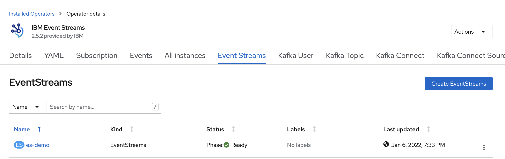

1. This is now the view of the cluster definition as it is deployed. Select the `YAML` choice and see the `spec` elements. 

    

    You can highlight that it will be easy to add a broker by changing the `spec.strimziOverrides.kafka.replicas` value. Also in this view, the `Samples` menu presents some examples of cluster definitions. You can more discussion in a GitOps approach for Day1 and Day 2 operations as a demonstration extension. (See later [GitOps section](#day-2-operations))

    Kafka brokers, Zookeeper nodes or other components like Apicurio can all be scaled to meet your needs: 

    * Number of replicas
    * CPU request or limit settings
    * Memory request or limit settings
    * JVM settings

1. Broker, zookeepers, user interface, schema registry, ... are pods in a namespace:

    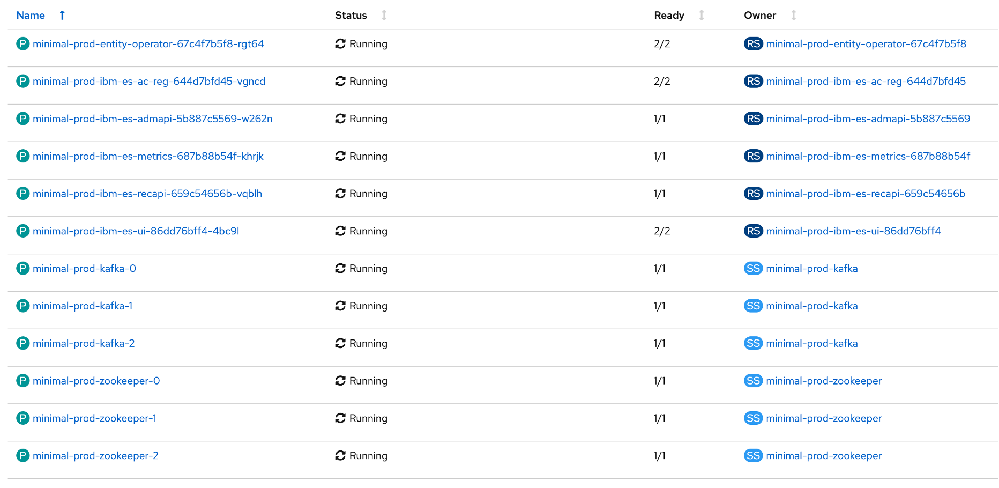

1. If needed, you can explain the concept of persistence and Storage class: Kafka save records on disk for each broker, and so it can use VM disk or network file systems. As Kubernetes deployed application, Event Streams define persistence via persistence claim and expected quality of service using storage class.

    

    Going to the Storage > PersistenceVolumesClaims in OpenShift console, you can explain that each broker has its own claim, OpenShift allocated Persistence Volumes with expected capacity. The Storage class was defined by OpenShift administrator, and in the example above, it use CEPH storage.

???- "Read more"
    * [Cepth and block devise](https://docs.ceph.com/en/latest/rbd/rbd-kubernetes/)
    * [Kafka Brokers](https://ibm-cloud-architecture.github.io/refarch-eda/technology/kafka-overview/#kafka-components) and architecture

## Review Event Stream user interface features

1. Go to the user interface by selecting the Admin UI URL in the Event Streams details view, or by getting the exposed routes, with a command like: (change the event stream cluster name from `es-demo`)

    ```sh
    chrome $(oc get eventstreams es-demo -o jsonpath='{.status.adminUiUrl}')
    ```

    you should reach the home page

    

1. The set of features available from this home page, are **topic management, schema registry, consumer groups, monitoring, and toolbox**... you will review most of those features in the demo.

## Topic management

Topics are append log, producer applications publish records to, and consumer applications subscribe too. Kafka messages themselves are immutable. Deletion and compaction of data are administrative operations.


1. Navigate to the topic main page: if some topics are present, explain the replicas and partitions concepts.

    

    * **replicas** is to support record replication and ensure high availability. Producer can wait to get acknowledgement of replication. Replicas needs to be set to 3 to supports 2 broker failures at the same time. 
    * **partition** defines the number of append logs managed by the broker. Each partition has a leader, and then follower brokers that replicate records from the leader. Partitions are really done to do parallel processing at the consumer level. 
    * The following diagram can be used to explain those concepts. 

    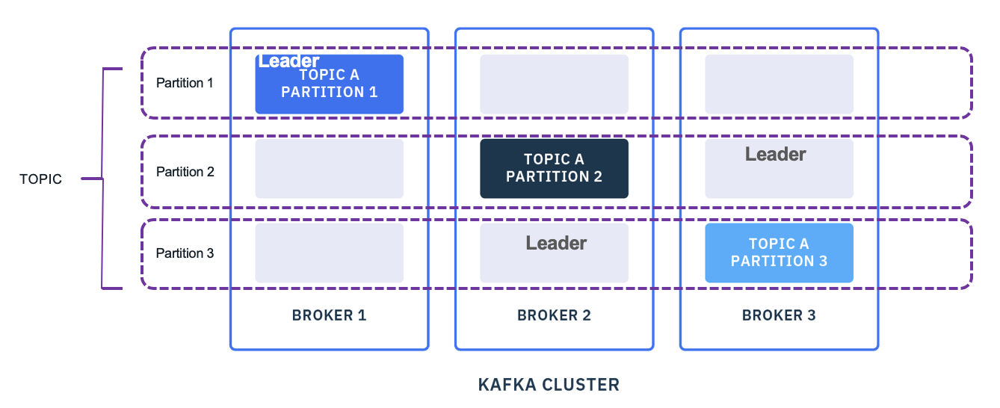

1. Create a topic for the **Starter** app, using the user interface:

    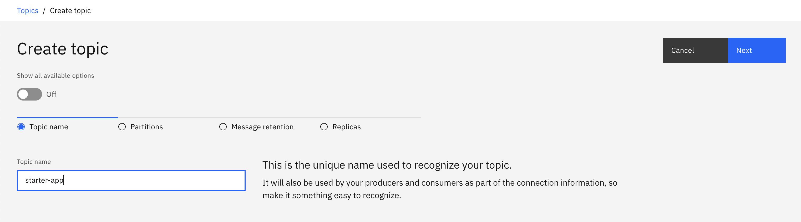

    Use only one partition, if needed explain that having one partition is easier to keep messages in their order of publish.

    

    The default retention time is 7 days, Kafka is keeping data for a long time period, so any consumer applications can come and process messages at any time. It helps for microservice resilience and increase decoupling.


    

    Finally the replicas for high availability. 3 Is the production deployment, and in-sync replicas = 2, means producer get full acknowledge when there is 2 replicas done. Broker partition leader keeps information of in-sync replicas.

    

1. Explain that topic can be created via yaml file. Go to the [rt-inventory GitOps - es-topics.yaml](https://github.com/ibm-cloud-architecture/eda-rt-inventory-gitops/blob/main/environments/rt-inventory-dev/services/ibm-eventstreams/base/es-topics.yaml) and explain some of the parameters.

1. We will go over the process of adding new topic by using GitOps in [this section](/#topic-management-with-gitops)

???- "Read more"
    * [Topic summary](https://ibm-cloud-architecture.github.io/refarch-eda/technology/kafka-overview/#topics)
    * [Kafka topic configuration](https://kafka.apache.org/documentation/#topicconfigs)
    * [Understand Kafka producer](https://ibm-cloud-architecture.github.io/refarch-eda/technology/kafka-producers/)
    * [Review Consumer](https://ibm-cloud-architecture.github.io/refarch-eda/technology/kafka-consumers/)
    * [Replication and partition leadership](https://ibm-cloud-architecture.github.io/refarch-eda/technology/kafka-overview/advance/#replication-and-partition-leadership)


## Run the Starter Application

1. Go to the `Toolbox` and explain, that there is a **Starter** application that can help you testing producing events and consuming them. You may have already downloaded this application. It will take time to do it during any live demonstration, so better to be prepared. Also we have packaged a docker image with this application that you can run to demonstrate. The starter application runs on your local laptop and is remote connected to the Event Streams cluster. 

    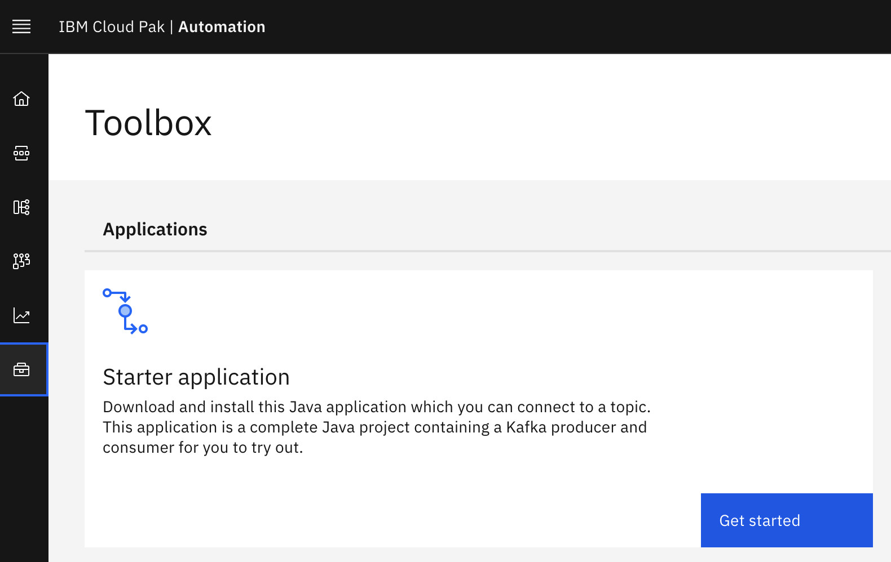
   
   * Download `es-cert.p12` and `kafka.properties` from the toolbox > Generate properties:

    

   * Enter the name of the application, select the topic created previously, and download the generated properties. 
   
1. Unzip somewhere and open a Terminal window on your laptop, go to the folder you have unzipped the file and start the app:

    ```sh
    docker run -ti -p 8080:8080 -v  $(pwd)/kafka.properties:/deployments/kafka.properties -v  $(pwd)/truststore.p12:/deployments/truststore.p12  quay.io/ibmcase/es-demo
    ```

1. Got to [http://localhost:8080](http://localhost:8080), then select the star producing message.

    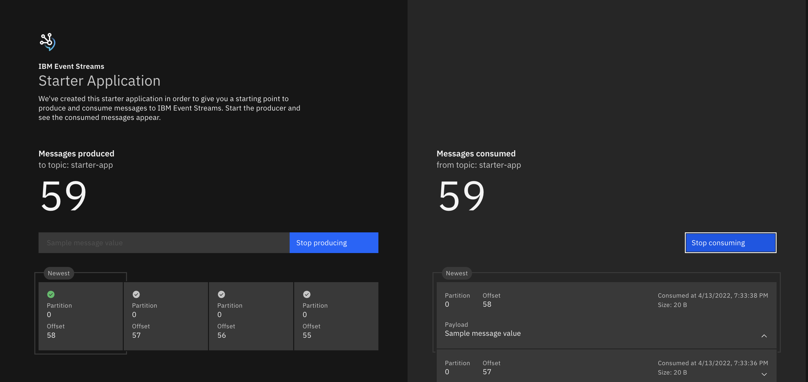

1. Go back to the Event Streams console, Topic management, and the `starter-app` topic, select the `Messages` tab and go to any messages. Explain that each messages has a timestamp, and an offset that is an increasing number.  Offset are used by consumer to be able to replay from an older message, or when restarting from a failure. Offset management at the consumer application level is tricky, if needed you can have a deeper conversation on this topic later after the demonstration.

    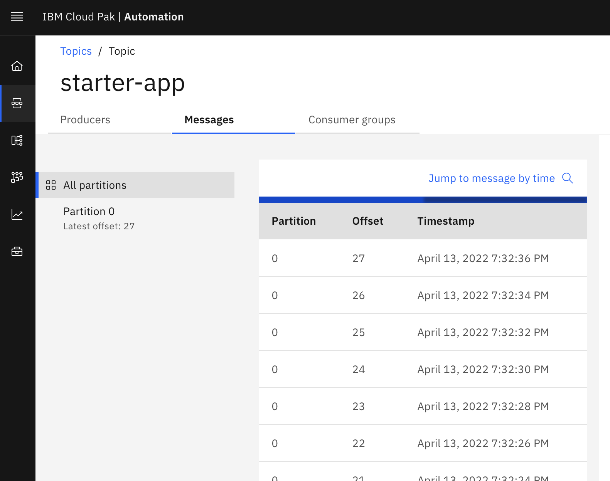

1. At the topic level, it is possible to see the consumer of the topic: Go to the `Consumer groups` tab, to see who are the consumer, if the consumer is active or not (this will be controlled by the heartbeat exchanges when consumer poll records and commit their read offset). 

    

    One important metric in this table is the unconsumed partition value. If the number of partitions is more than 1 and there are less than the number of consumer than of partition, then it means a consumer is processing two or more partitions.

1. Going by to the starter application, you can start consuming the records. This is to demonstrate that consumer can connect at anytime, and that it will quickly consume all messages. Stopping and restarting is also demonstrating that consumer, continues from the last read offset.

There is an alternate of running this application on your laptop, it can be deployed directly to the same OpenShift cluster, we have defined `deployment and config map` to do so.

???- "Deploy starter app on OpenShit"
    * Use the same `kafka.properties` and `truststore.p12` files you have downloaded with the starter application to create two kubernetes secrets holding these files in your OpenShift cluster

    ```sh
    oc create secret generic demo-app-secret --from-file=./kafka.properties
    oc create secret generic truststore-cert --from-file=./truststore.p12
    ```

    * Clone the following GitHub repo that contains the Kubernetes artifacts that will run the starter application.

    ```sh
    git clone https://github.com/ibm-cloud-architecture/eda-quickstarts.git
    ```

    * Change directory to where those Kubernetes artefacts are.

    ```sh
    cd eda-quickstarts/kafka-java-vertz-starter
    ```

    * Deploy the Kubernetes artefacts.

    ```sh
    oc apply -k app-deployment
    ```

    * Get the route to the starter application running on your OpenShift cluster.

    ```sh
    oc get route es-demo -o=jsonpath='{.status.ingress[].host}'
    ```

    * Point your browser to that url to work with the IBM Event Streams Starter Application.

## Back to the Cluster configuration

Event Streams cluster can be configured with Yaml and you can review the following cluster definition to explain some of the major properties
[EDA GitOps Catalog - example of production cluster.yaml](https://github.com/ibm-cloud-architecture/eda-gitops-catalog/blob/main/cp4i-operators/event-streams/operands/prod-small/eventstreams-prod.yaml):

| Property | Description |
| --- | --- |
| replicas | specify the # of brokers or zookeeper |
| resources | CPU or mem requested and limit |
| listeners | Define how to access the cluster: External with scram authentication and TLS encryption, and internal using TLS authentication or PLAIN. |
| entity operators | Enable topic and user to be managed by operator |
| Rack awareness | To use zone attribute from node to allocate brokers in different AZ |
| Cruise Control | Open source for cluster rebalancing |
| Metrics | To export different Kafka metrics to Prometheus via JMX exporter |

For Kafka, the following aspects of a deployment can impact the resources you need:

* Throughput and size of messages
* The number of network threads handling messages
* The number of producers and consumers
* The number of topics and partitions
## Producing messages

The [product documentation - producing message section goes into details](https://ibm.github.io/event-streams/about/producing-messages/) of the concepts. 
For a demonstration purpose, you need to illustrate that you can have multiple types of Kafka producer:

* Existing Queuing apps, which are using IBM MQ, and get their messages transparently sent to Event Streams, using IBM MQ Streaming Queue and MQ Source Kafka Connector
* Microservice application publishing events using Kafka producer API, or reactive messaging in Java Microprofile. For nodejs, python there is a c library that supports the Kafka API. We have code template for that
* Change data capture product, like [Debezium](https://debezium.io/), that gets database updates and maps records to events in topic. One topic per table. Some data transformation can be done on the fly.
* Streaming applications, that do stateful computing, real-time analytics, consuming - processing - publishing events from one to many topics and produce to one topic. 
* App connect flow can also being source for events to Events Streams, via connectors.

The following diagram illustrates those event producers.


Each producer needs to get URL to the broker, defines the protocol to authenticate, and gets server side TLS certificate, the topic name, and that's it to start sending messages.

For production deployment, event structures are well defined and schema are used to ensure consumer can understand how to read messages from the topic/partition. Event Streams offers a schema registry to manage those schema definitions.

You can introduce the schema processing with the figure below:


???- "Schema flow explanations"
    * (1) Avro or Json schemas are defined in the context of a producer application. As an example you can use the [OrderEvent.avsc in the EDA quickstart](https://github.com/ibm-cloud-architecture/eda-quickstarts/blob/main/quarkus-reactive-kafka-producer/src/main/avro/OrderEvent.avsc) project. 
    * They are uploaded to Schema registry, you will demonstrate that in 2 minutes
    * (2) Producer application uses Serializer that get schema ID from the registry 
    * (3) Message includes metadata about the schema ID
    * (4) So each message in a topic/partition may have a different schema ID, which help consumer to be able to process old messages
    * (5) Consumers get message definitions from the central schema registry.

### Schema registry 

1. Get the OrderEvent schema definition using the command below:

    ```sh
        curl https://raw.githubusercontent.com/ibm-cloud-architecture/eda-quickstarts/main/quarkus-reactive-kafka-producer/src/main/avro/OrderEvent.avsc > OrderEvent.avsc
    ```

1. Go to the Schema registry in the Event Streams console, and click to `Add Schema`

    

1. In the `Add schema` view, select `Upload definition`, select the `OrderEvent.avsc`

    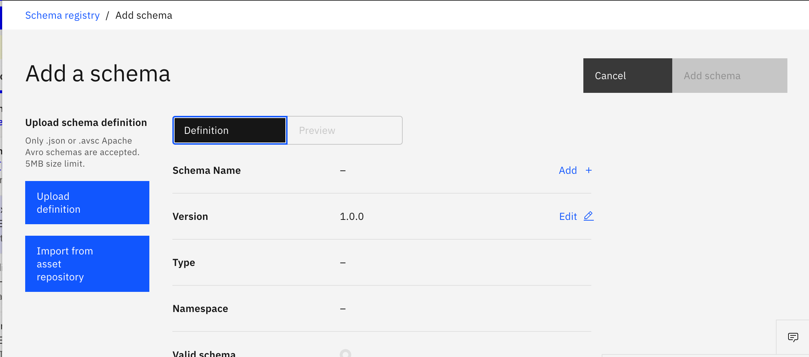

1. The first OrderEvent schema is validated, 

    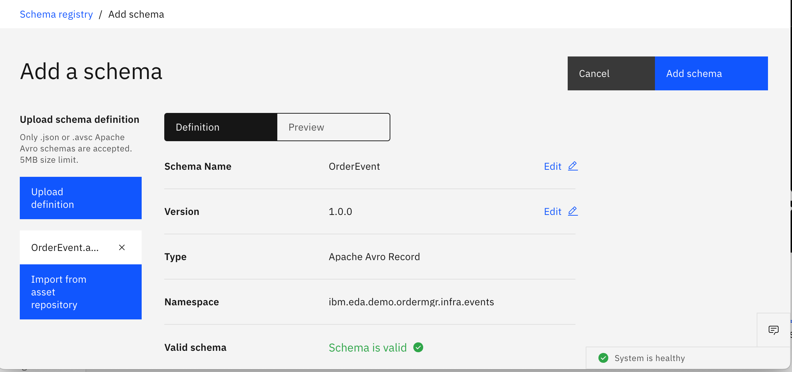

1. You can see its definition too

    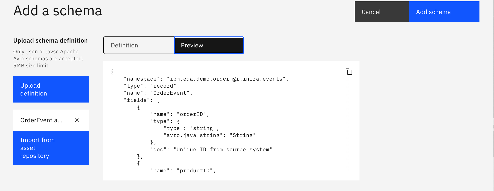

1. Do not forget to press `Add schema` to save your work. Now the schema is visible in the registry

    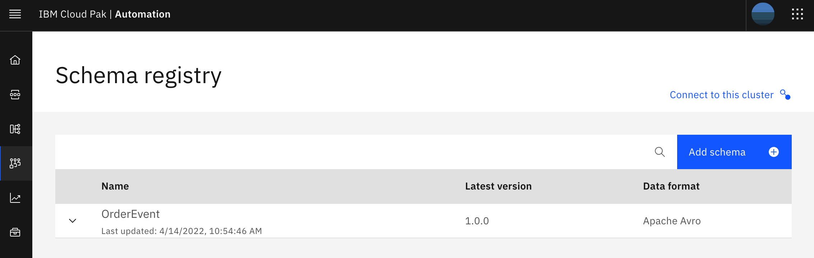


Now any future producer application discussions should be around level of control of the exactly once, at most once delivery, failover and back preasure.
This is more complex discussion, what is important to say is that we can enforce producer to be sure records are replicated before continuing, we can 
enforce avoiding record duplication, producer can do message buffering and send in batch, so a lot of controls are available depending of the application needs.

???- "Reading more"
    * [Producer best practices and considerations](https://ibm-cloud-architecture.github.io/refarch-eda/technology/kafka-producers/)
    * [Using the outbox pattern with Debezium and Quarkus](https://ibm-cloud-architecture.github.io/vaccine-solution-main/solution/orderms/)
    * [DB2 debezium lab](https://ibm-cloud-architecture.github.io/refarch-eda/use-cases/db2-debezium/)
    * [Playing with Avro Schema](https://ibm-cloud-architecture.github.io/refarch-eda/technology/avro-schemas/)
    * [Event Streams product documentation](https://ibm.github.io/event-streams/about/producing-messages/)
## Consumer application - consumer group

If you need to explain the concept of consumer group, and how consumer gets data from Topic/partition, the following figure will help supporting the discussion:


???- "Explanations"
    * Consumer application define a property to group multiple instances of those application into a group.
    * Topic partitions are only here to support scaling consumer processing
    * Brokers are keeping information about group, offset and partition allocation to consumer 
    * When a consumer is unique in a group, it will get data from all partitions.
    * We cannot have more consumer than number of topic, if not the consumer will do nothing
    * Membership in a consumer group is maintained dynamically
    * When the consumer does not send heartbeats for a duration of `session.timeout.ms`, then it is considered unresponsive and its partitions will be reassigned.
    * For each consumer group, Kafka remembers the committed offset for each partition being consumed.
    * [Understanding offset](https://ibm-cloud-architecture.github.io/refarch-eda/technology/kafka-consumers/#offset-management)
    * [Get more details on consumer best practices](https://ibm-cloud-architecture.github.io/refarch-eda/technology/kafka-consumers/)

Recall that offset is just a numeric identifier of a consumer position of the last record read within a partition. Consumers periodically need to commit the offsets they have received, to present a recovery point in case of failure.

For reliable consumers, it means the commitment of the read offset is done by code once the consumer is done with its processing. There is an important limitation within App Connect Kafka consumer node as there is no way to commit by code, so do not propose App Connect as a viable solution if you need to do not loose message. Or support adding new java custom code to do the management of offset.

From Event Streams demonstration point of view, we can only demonstrate consumer groups for a given topic, and if consumers are behind in term of reading records from a partition.

1. In the Event Streams console go to the `Topics` view and `Consumer Groups tab` of one of the topic. The figure below shows that there is no active member for the consumer groups , and so one partition is not consumed by any application.

    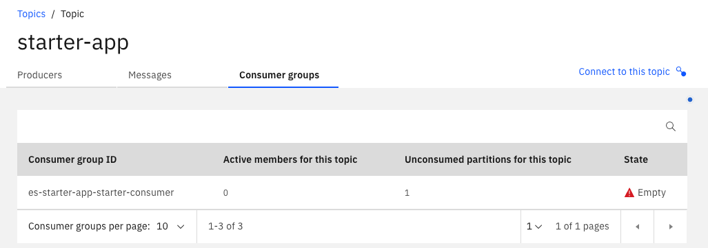

1. Another view is in the `Consumer Groups` which lists all the consumer groups that have been connected to any topic in the cluster: This view helps to assess if consumer are balanced. Selecting one group will zoom into the partition and offset position for member of the group. Offset lag is what could be a concern. The consumer lag for a partition is the difference between the offset of the most recently published message and the consumer's committed offset.

    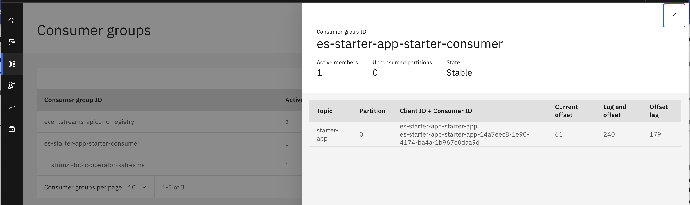

    *Consumer lag may show that consumers are not processing records at the same pace that producer is publishing them. This could not be a problem, until this lag is becoming too high and compaction or retention by time or size will trigger, removing old records. In this case consumers will miss messages.*


???- "Reading more"
    * [Review Consumer](https://ibm-cloud-architecture.github.io/refarch-eda/technology/kafka-consumers/)
    * [Product documentation - Consuming messages](https://ibm.github.io/event-streams/about/consuming-messages/)

## User management and security

There are two types of user management in Event Streams: the human users, to access the user interface and the application users to access Brokers and Kafka Topics.

Application users are defined with KafkaUser custom resources. The Yaml also describes access control list to the topic. The [following KafkaUser yaml file](https://github.com/ibm-cloud-architecture/eda-rt-inventory-gitops/blob/main/environments/rt-inventory-dev/services/ibm-eventstreams/base/tls-user.yaml) is an example of application user used to authenticate with mutual TLS.

Such user can also being created by using the `connect to the cluster` option in Event Streams console.

The Acces Control Lists are defined by specifying the resource type and the type of operation authorized. User certificates and passwords are saved in secrets. The ACL rules define the operations allowed on Kafka resources based on the username:

    ```yaml
        acls:
      - resource:
          type: topic
          name: 'rt-'
          patternType: prefix
        operation: Write
      - resource:
          type: topic
          name: '*'
          patternType: literal
        operation: Read
      - resource:
          type: topic
          name: '*'
          patternType: literal
        operation: Create
    ```

For human authentication, users are defined using IBM Cloud Pak foundational services Identity and Access Management (IAM). Things to keep in mind:

* IAM is in Cloud Pak | Administation console. A URL like: https://cp-console.apps........ibm.com/common-nav/dashboard
* Need to define a team for resources, administrator users... using he Administration console and IAM menu:

    

    Define new team, with connection to an active directory / identity provider:

    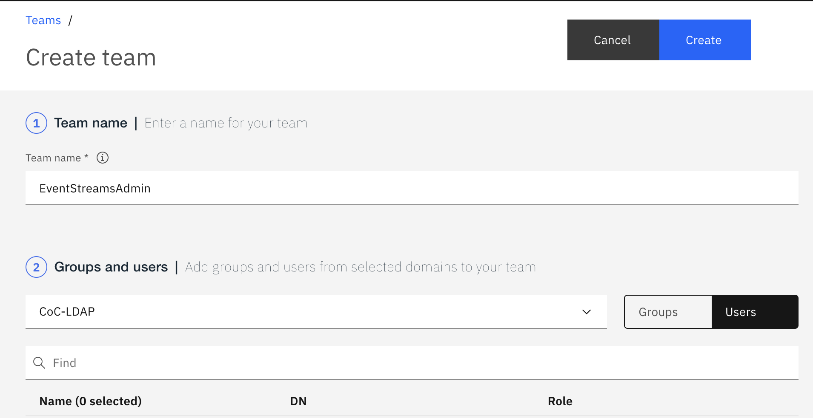

* Any groups or users added to an IAM team with the `Cluster Administrator` or `Administrator` role can log in to the Event Streams UI and CLI

    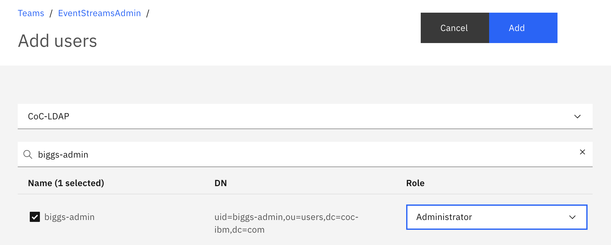

    or non admin user:

    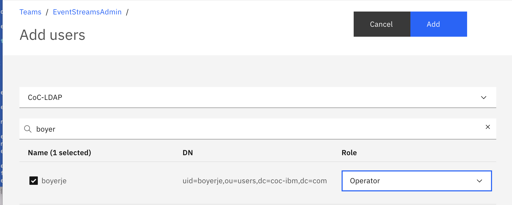

* Any groups or users with the Administrator role will not be able to log in until the namespace that contains the Event Streams cluster is added as a resource for the IAM team.

    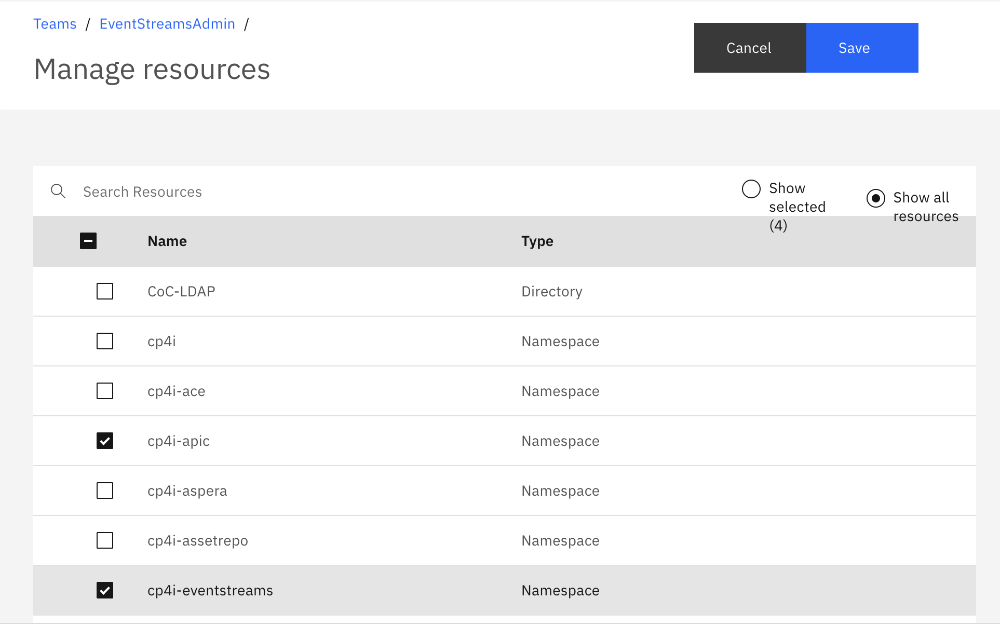

* If the cluster definition includes `spec.strimziOverrides.kafka.authorization: runas`, users are mapped to a Kafka principal 


???- "Read more"
    * [Managing access - product documentation](https://ibm.github.io/event-streams/security/managing-access/#assigning-access-to-users) 
    * [Managing team with IAM](https://www.ibm.com/docs/en/cpfs?topic=users-managing-teams)
    * [ACL and authorization](https://kafka.apache.org/documentation/#security_authz)
    * [ACLs rule schema reference ](https://strimzi.io/docs/operators/latest/configuring.html#type-AclRule-reference)
## Kafka Connect

Kafka connect is used to connect external systems to Event Streams brokers. For production deployment the Kafka connect connectors run in cluster, (named distributed mode), to support automatic balancing, dynamic scaling and fault tolerance. In the figure below, we can see Kafka Connect cluster builds with 3 worker processes. The configuration if such worker is done with one file, that can be managed in your GitOps. (An example of such file is [here](https://github.com/ibm-cloud-architecture/eda-rt-inventory-gitops/blob/main/environments/rt-inventory-dev/services/kconnect/kafka-connect.yaml)) 


Event Streams Operator supports custom resource to define Kafka connect cluster. Each connector is represented by another custom resource called KafkaConnector.

When running in distributed mode, Kafka Connect uses three topics to store configuration, current offsets and status.

Once the cluster is running, we can use custom resource to manage the connector. For example to get a MQ Source connector
definition example, you can browse [this yaml](https://github.com/ibm-cloud-architecture/eda-rt-inventory-gitops/blob/main/environments/rt-inventory-dev/apps/mq-source/kafka-mq-src-connector.yaml) which specifies how to connect to the MQ broker
and how to create records for Kafka.

```yaml
apiVersion: eventstreams.ibm.com/v1alpha1
kind: KafkaConnector
metadata:
  name: mq-source
  labels:
    eventstreams.ibm.com/cluster: eda-kconnect-cluster
spec:
  class: com.ibm.eventstreams.connect.mqsource.MQSourceConnector
  tasksMax: 1
  config:
    mq.queue.manager: QM1
    mq.connection.name.list: store-mq-ibm-mq.rt-inventory-dev.svc
    mq.channel.name: DEV.APP.SVRCONN
    mq.queue: ITEMS
    mq.bath.size: 250
    producer.override.acks: 1
    topic: items
    key.converter: org.apache.kafka.connect.storage.StringConverter
    value.converter: org.apache.kafka.connect.storage.StringConverter
    mq.record.builder: com.ibm.eventstreams.connect.mqsource.builders.DefaultRecordBuilder
    mq.connection.mode: client
    mq.message.body.jms: true
    mq.record.builder.key.header: JMSCorrelationID
```

to improve connector source throughput we can control the producer properties like the acknowledge level expected.

The real time inventory demo includes MQ source connector.

???- "Read more"
    * [Event Streams documentation - kafka connect](https://ibm.github.io/event-streams/connecting/connectors/)
    * [Kafka Connect technology deeper dive](https://ibm-cloud-architecture.github.io/refarch-eda/technology/kafka-connect/)
## Monitoring

The IBM Event Streams UI provides information about the health of your environment at a glance. In the bottom right corner of the UI, a message shows a summary status of the system health.

* Using the JMX exporter, you can collect JMX metrics from Kafka brokers, ZooKeeper nodes, and Kafka Connect nodes, and export them to Prometheus

!!! Warning
    Be aware IBM Cloud Pak foundational services 3.8 and later does not include Prometheus so you will get [Event Streams metrics not available](https://ibm.github.io/event-streams/troubleshooting/metrics-not-available/). On Biggs as of 04/19/22, the cluster configuration was done. If you need to do it on your cluster see those files: [cluster-monitoring-cm.yaml](https://github.com/ibm-cloud-architecture/eda-rt-inventory-gitops/blob/main/environments/rt-inventory-dev/services/ibm-eventstreams/base/cluster-monitoring-cm.yaml) and [pod-monitors.yaml](https://github.com/ibm-cloud-architecture/eda-rt-inventory-gitops/blob/main/environments/rt-inventory-dev/services/ibm-eventstreams/base/pod-monitors.yaml)

1. Assess Event Streams cluster state: Go to the project where the cluster runs, select one of the Kafka Pod. You can see the pod via the OpenShift workloads menu, or by using the Event Streams Operator > Resources and then filter on pods:

    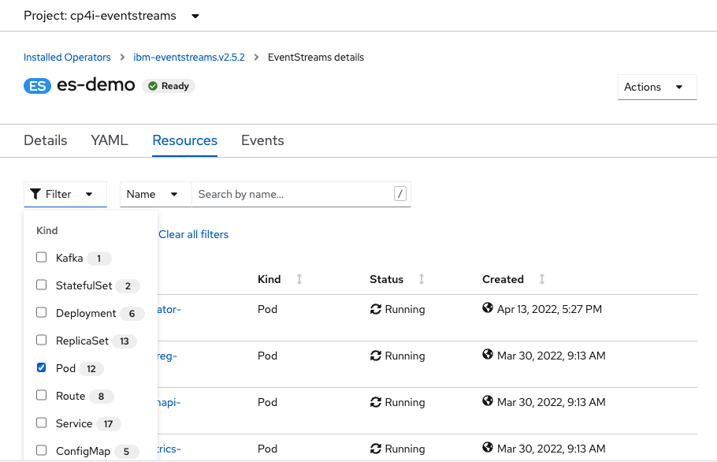

    Select one of the pods and go to the metrics to see memory, CPU, network and filesystem usage metrics.

    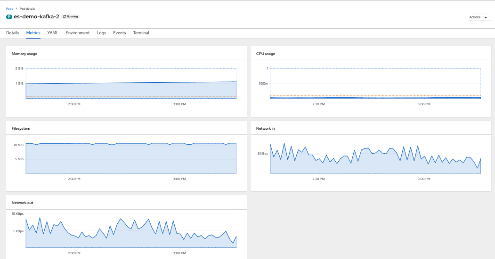

1. Access the Cloud Pak | Administration console to select Monitoring

    

1. Switch organization to select where `Event Streams` is running

    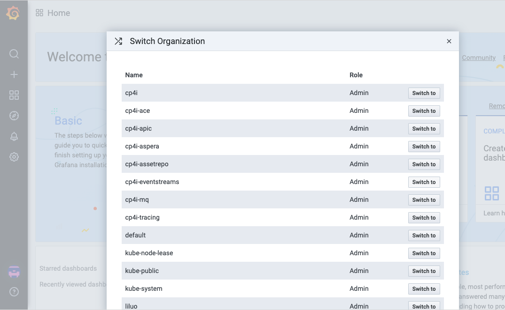

1. Then go to the grafana Dashboard menu on the left > Manage and select event streams dashboard

    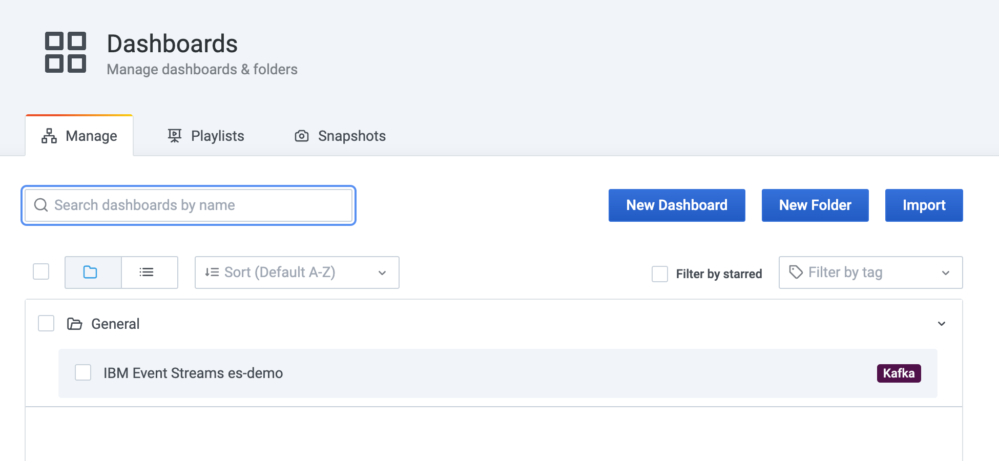

1. In the Grafana dashboard select the namespace for event streams  (e.g. `cp4i-eventstreams`), the cluster name (`es-demo`), the brokers, and the topic to monitor.  

    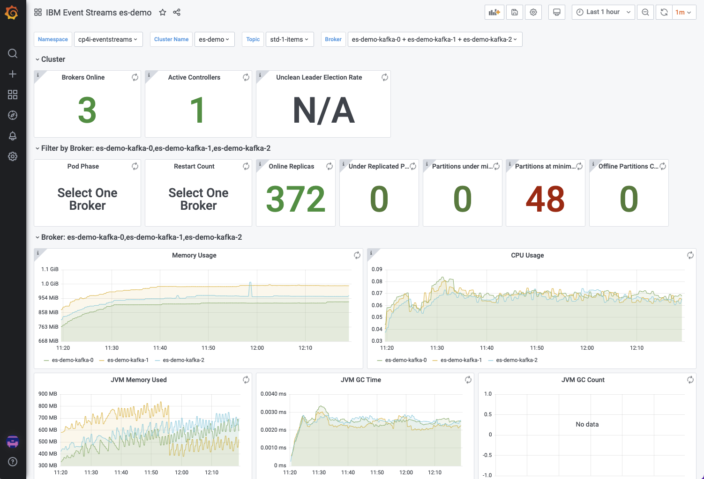

???- "More reading"
    * [Product documentation](https://ibm.github.io/event-streams/administering/deployment-health/)
    * [EDA monitoring study](https://ibm-cloud-architecture.github.io/refarch-eda/technology/kafka-monitoring/)
    * [Event Streams Monitoring on OpenShift lab](https://ibm-cloud-architecture.github.io/refarch-eda/use-cases/monitoring-on-ocp/)
    * [Creating alert from Prometheus](https://ibm-cloud-architecture.github.io/refarch-eda/use-cases/monitoring-on-ocp/#create-an-alert)
## Event Streaming 

### Kafka Streams

### Apache Flink as your streaming platform
## Real-time inventory demo

It is possible to propose a more complex solution to illustrate modern data pipeline using components like 
MQ source Kafka Connector, Kafka Streams implementation and Cloud Object Storage sink, Elastic Search and Pinot.

This scenario implements a simple real-time inventory management solution based on some real life MVPs we developed in 2020. 
For a full explanation of the use case and scenario demo go to [this chapter](https://ibm-cloud-architecture.github.io/refarch-eda/scenarios/realtime-inventory/#use-case-overview) in EDA reference architecture.


The solution can be deployed using few commands or using GitOps. Here are the simplest steps if you are using the [CMC CoC environment with CP4I installed](https://cmc.coc-ibm.com/):

1. Clone the gitops repo:

    ```sh
    git clone https://github.com/ibm-cloud-architecture/eda-rt-inventory-gitops
    ```
1. Login to OpenShift console and then start the deployment of the solution, under the namespace `rt-inventory-dev` namespace

    ```sh
    make multi-tenants
    ```

* [Description of the scenario and demo script](https://ibm-cloud-architecture.github.io/refarch-eda/scenarios/realtime-inventory/)
* [GitOps project to deploy the solution](https://github.com/ibm-cloud-architecture/eda-rt-inventory-gitops)
*  [EDA GitOps Catalog to deploy Cloud Pak for Integration operators](https://github.com/ibm-cloud-architecture/eda-gitops-catalog)
## Geo-replication

Two main concepts to talk about: replication to a passive Event Streams cluster, or to an active cluster.
Geo Replication is the IBM packaging of Mirror Maker 2. 

### Demonstrating Geo Replication

The geo-replication feature creates copies of your selected topics to help with disaster recovery.

### Mirror Maker 2

Mirror Maker 2 is a Kafka Connect framework to replicate data between different Kafka Cluster, so it can be used between Event Streams clusters, but also between Confluent to/from Event Streams, Kafka to/from Event Streams...

The following diagram can be used to present the MM2 topology


### Active - Passive


### Active - Active


 
???- "Read more"
    * [Geo Replication - Product documentation](https://ibm.github.io/event-streams/georeplication/about/)
    * [EDA techno overview for Mirror Maker 2](https://ibm-cloud-architecture.github.io/refarch-eda/technology/kafka-mirrormaker/)
    * [EDA lab on mirror maker 2](https://ibm-cloud-architecture.github.io/refarch-eda/use-cases/kafka-mm2/)
## Day 2 operations

In this section, you should be able to demonstrate some of the recurring activities, operation team may perform for the Event Streams and OpenShift platform for maintenance:

    * Change Cluster configuration
    * Add topic or change topic configuration like adding partition
    * 
### GitOps 

The core idea of GitOps is having a Git repository that always contains declarative descriptions of the infrastructure currently desired in the production environment and an automated process to make the production environment matches the described state in the repository. Git is the source of truth for both application code, application configuration, dependant service/product deployments, infrastructure config and deployment.

In the following figure we just present the major components that will be used to support GitOps and day 2 operations: 


???- "Explanations"
    * cluster configuration, topics, users ACL are defined as yaml resources in the solution GitOps. [Cluster example for prod](https://github.com/ibm-cloud-architecture/eda-rt-inventory-gitops/tree/main/environments/rt-inventory-stage/services/ibm-eventstreams/base/eventstreams-prod.yaml)
    * (1) Operator definitions are also defined in the gitops and then change to the version subscription will help do product upgrade. [Event Streams subscription](https://github.com/ibm-cloud-architecture/eda-gitops-catalog/blob/main/cp4i-operators/event-streams/operator/base/subscription.yaml) with [overlays](https://github.com/ibm-cloud-architecture/eda-gitops-catalog/tree/main/cp4i-operators/event-streams/operator/overlays/v2.5) for a new version.
    * (2) ArgoCD apps are [defined in the GitOps](https://github.com/ibm-cloud-architecture/eda-rt-inventory-gitops/blob/main/config/argocd/rt-inventory-dev-es-services-app.yaml) and then once running on the GitOps Server, will monitor changes to the source gitOps content 
    * (3) when change occurs, the underlying kubernetes resources are modified
    * (4) Operator maintains control to the runtime pods according to the modified manifest

Cloud Pak for integration, event streams, MQ, API Connect operators help to support deployment as a Day 1 operation, but also support maintenance or Day 2 operations. Operator is constantly watching your cluster’s desired state for the software installed and act on them.

Using a GitOps approach, we can design a high-level architecture view for the deployment of all the event-driven solution components: as in previous figure, operators, ArgoCD apps, cluster, topics... are defined in the solution gitops and then the apps deployment, config map, service, secrets, routes are also defined according to the expected deployment model.


In the figure above, the dev, and staging projects have their own Event Streams clusters. Production is in a separate OpenShift Cluster and event streams cluster is multi-tenant.

We are using a special Git repository to manage a catalog of operator definitions/ subscriptions. This is the goal of the [eda-gitops-catalog repository](https://github.com/ibm-cloud-architecture/eda-gitops-catalog).

A solution will have a specific gitops repository that manages services (operands) and application specifics deployment manifests.

### Start the GitOps demo

To be able to do continuous deployment we need to have some ArgoCD apps deployed on GitOps server. 
In all gitOps demos, we assume you have a fork of the [eda-rt-inventory-gitops](https://github.com/ibm-cloud-architecture/eda-rt-inventory-gitops). 

If you are not using a cluster with cp4i-eventstreams already installed in the `cp4i-eventstreams`, you may need to
modify the [Copy Secret job ()]() so it can get the `ibm-entitlement-key` from the good namespace.

1. If not done yet, jumpstart GitOps

    ```sh
    oc apply -k demo/argocd
    ```
1. Access to the ArgoCD console

    ```sh
     chrome https://$(oc get route openshift-gitops-server -o jsonpath='{.status.ingress[].host}'  -n openshift-gitops)
    ```
1. User is `admin` and password is the result of 

    ```sh
    oc extract secret/openshift-gitops-cluster -n openshift-gitops --to=-
    ```

1. You should have two apps running in the default scope/ project.

    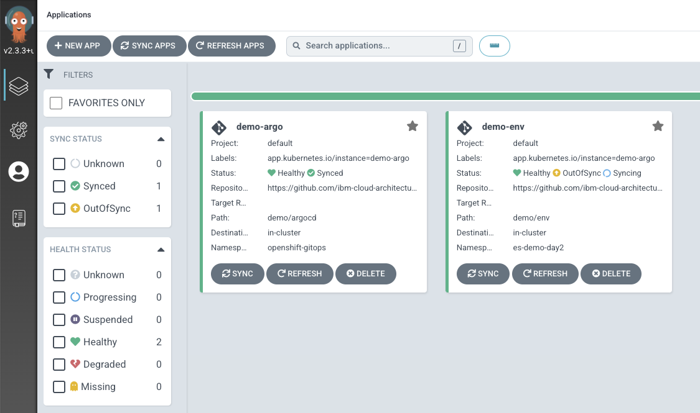

    The argocd apps are monitoring the content of the demo/ env folder and once deployed, you should have a simple Event Streams node with one zookeeper under the project `es-demo-day2`.

### Event Streams cluster definition with GitOps

The goal of this section is to demonstrate how to define an Event Stream cluster with configuration and change the number of replicas. This is a very simple use case to try to use the minimum resources. So the basic cluster definition use 1 broker and 1 zookeeper. 
The file is [es-demo.yaml](https://github.com/ibm-cloud-architecture/eda-rt-inventory-gitops/blob/main/demo/env/es-demo.yaml). it is using Event Streams version 10.5.0 and one replicas

1. In GitOps console, if you go to the demo-env app, you will see there is one Kafka broker and also a lot of Kubernetes resources defined

    

1. In the `es-demo-day2` project, use `oc get pods` to demonstrate the number of brokers

    ```sh
    NAME                                    READY   STATUS      RESTARTS   AGE
    cpsecret-48k2c                          0/1     Completed   0          11m
    demo-entity-operator-558c94dc57-lxp6s   3/3     Running     0          24m
    demo-ibm-es-admapi-6678c47b95-hg82v     1/1     Running     0          14m
    demo-ibm-es-metrics-b974c7585-jpfc7     1/1     Running     0          14m
    demo-kafka-0                            1/1     Running     0          24m
    demo-zookeeper-0                        1/1     Running     0          25m
    ```

1. Modify the number of replicas

    ```yaml
        kafka:
            replicas: 2
    ```

1. Commit and push your changes to your git repository and see ArgoCD changing the configuration, new pods should be added.

1. You can enforce a refresh to get update from Git and then navigate the resources to see the new brokers added (demo-kafka-1):

    

Adding a broker will generate reallocation for topic replicas.

### Event Streams Cluster upgrade

This will be difficult to demonstrate but the flow can be explain using the OpenShift Console.

1. First you need to be sure the cloud pak for integration services are upgraded. (See [this note](https://www.ibm.com/docs/en/cloud-paks/cp-integration/2021.4?topic=upgrading))
1. Two things to upgrade in this order: Event Streams operator and then the cluster instances.

    You can upgrade the Event Streams operator to version 2.5.2 directly from version 2.5.x, 2.4.x, 2.3.x, and 2.2.x..

    You can upgrade the Event Streams operand to version 11.0.0 directly from version 10.5.0, 10.4.x

1. Start by presenting the version of an existing running Cluster definition

    

1. May be show some messages in a topic, for example the Store Simulator may have sent messages to the `items` topic
1. Go to the `openshift-operators` and select the event streams operator, explain the existing chaneel then change the channel number

    

    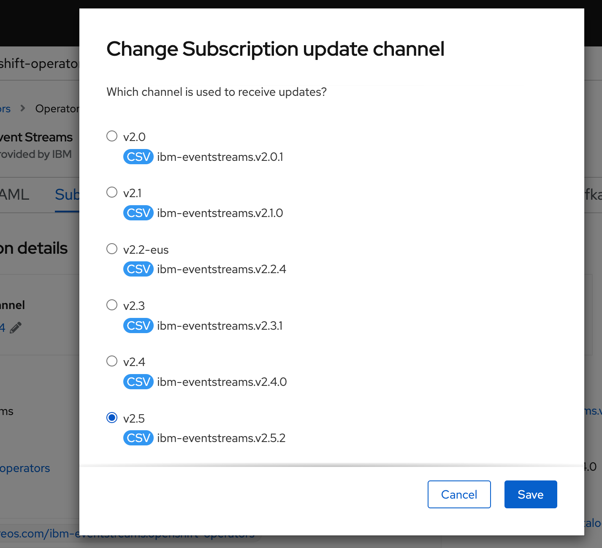

    * Event Streams instance must have more than one ZooKeeper node or have persistent storage enabled.
    * Upgrade operator is by changing the channel in the operator subscription. All Event Streams pods that need to be updated as part of the upgrade will be gracefully rolled. Where required ZooKeeper pods will roll one at a time, followed by Kafka brokers rolling one at a time.

1. Update the cluster definition version to new version (10.5.0 in below screen shot), thne this will trigger zookeeper and kafka broker update.

    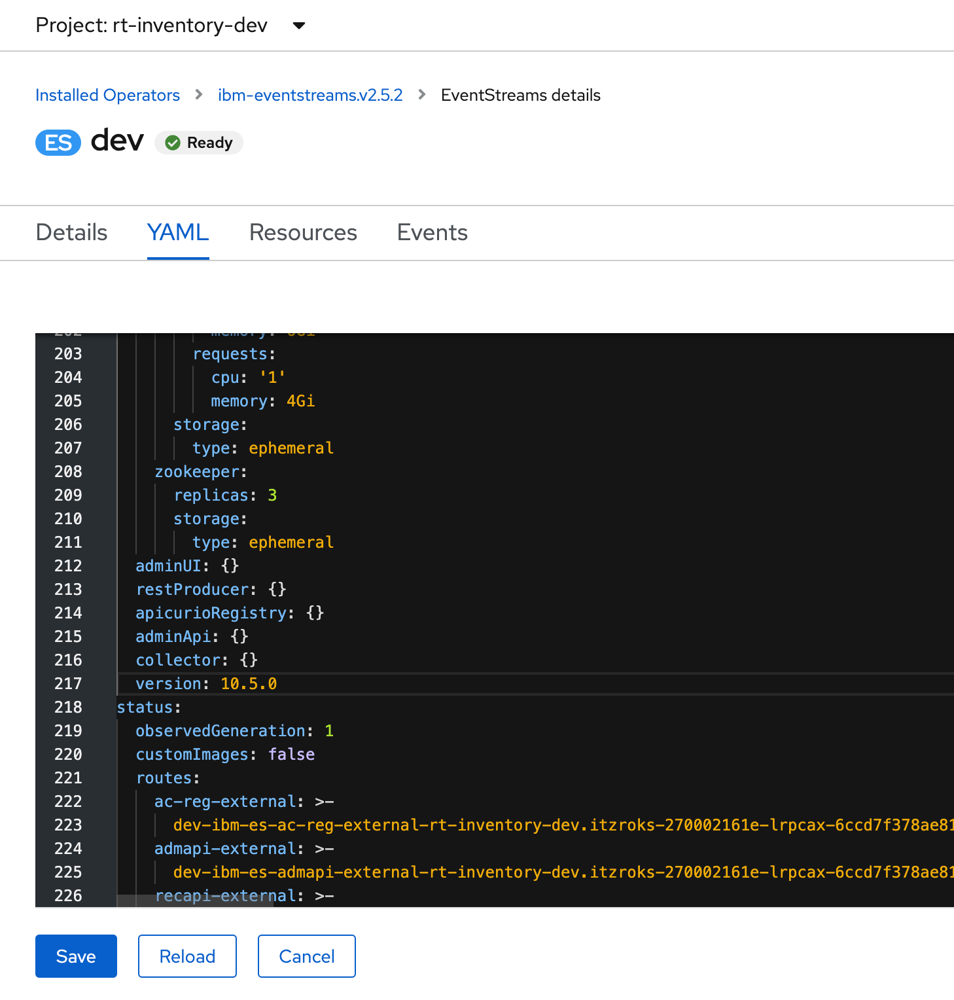
### Topic management with GitOps

The goal of this section is to demonstrate how to change topic definition using Argocd and git.


1. Modify the file [es-topic.yaml](https://github.com/ibm-cloud-architecture/eda-rt-inventory-gitops/blob/main/demo/env/es-topic.yaml) by adding a new topic inside this file with the following declaration:

    ```yaml
    apiVersion: eventstreams.ibm.com/v1beta1
    kind: KafkaTopic
    metadata:
    name: demo-2-topic
    labels:
        eventstreams.ibm.com/cluster: demo
    spec:
    partitions: 1 
    replicas: 1
    ```

1. Commit and push your changes to your git repository and see ArgoCD changing the configuration, new pods should be added.
1. Do `oc get kafkatopics` or go to Event Streams operator in the `es-demo-day2` project to see all the Event Streams component instances.

### Repartitioning

1. You can demonstrate how to change the number of partition for an existing topic (`rt-items`) from 3 to 5 partitions:

    ```sh
    oc apply -f environments/rt-inventory-dev/services/ibm-eventstreams/base/update-es-topic.yaml
    ```

1. Add more instances on the consumer part: taking the `store-aggregator` app and add more pods from the deployment view in OpenShift console, or change the deployment.yaml descriptor and push the change to the git repository so GitOps will catch and change the configuration:

    

    ```sh
    # modify https://github.com/ibm-cloud-architecture/eda-rt-inventory-gitops/blob/main/environments/rt-inventory-dev/apps/store-inventory/services/store-inventory/base/config/deployment.yaml
    oc apply -f environments/rt-inventory-dev/apps/store-inventory/services/store-inventory/base/config/deployment.yaml
    ```

???- "Read more"
    * [Event Streams doc on Kafka tools mapping to cli](https://ibm.github.io/event-streams/getting-started/using-kafka-console-tools/)
### Clean your gitops

* Remove the ArgoCD apps

```sh
oc delete -k demo/argocd 
```

* Remove resources

```sh
 oc delete -k demo/env
```

???- "Read more"
    * [Event driven solution with GitOps](https://ibm-cloud-architecture.github.io/refarch-eda/use-cases/gitops/)
    * [EDA GitOps Catalog](https://github.com/ibm-cloud-architecture/eda-gitops-catalog)
    * [Real time inventory demo gitops](https://github.com/ibm-cloud-architecture/eda-rt-inventory-gitops)

## OpenShift Cluster version upgrade

There may be some questions around how to migrate a version for OCP. 

### Principles
For clusters with internet accessibility, Red Hat provides over-the-air updates through an OpenShift Container Platform update service as a hosted service located behind public APIs.

Due to fundamental Kubernetes design, all OpenShift Container Platform updates between minor versions must be serialized.

### What can be demonstrated

At the demo level, you can go to the Administration console in `Administration > Cluster Settings` you get something like this:

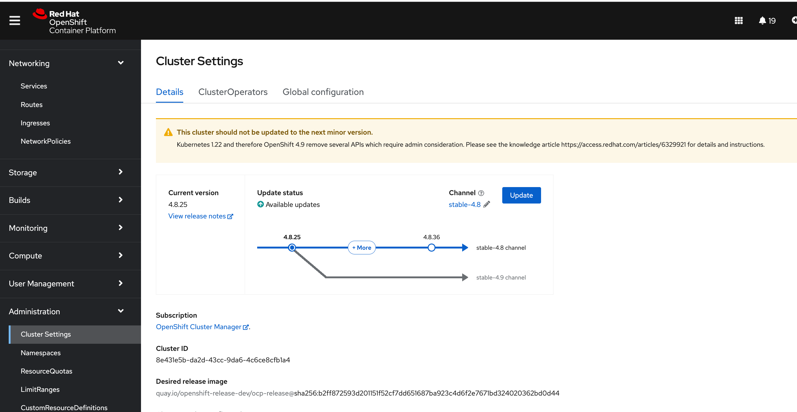

* If you want to upgrade version within the same release

    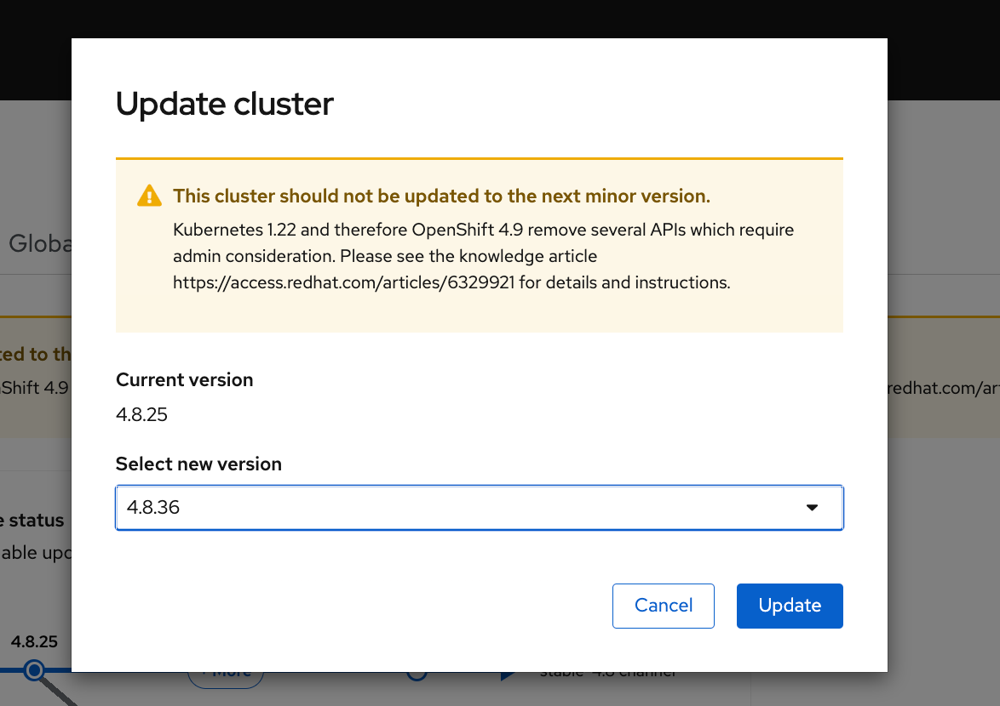

* Or upgrade release change the Channel version:

    

As the operation will take sometime, it is not really demonstrable easily. 

???- "Read more"
    * [Openshift understanding upgrade channels release](https://docs.openshift.com/container-platform/4.9/updating/understanding-upgrade-channels-release.html)
    * [Canary rollout](https://docs.openshift.com/container-platform/4.9/updating/updating-cluster-within-minor.html#update-using-custom-machine-config-pools-canary_updating-cluster-within-minor)