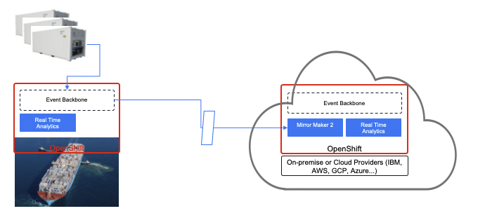

# Resiliency

The reduction in inter-dependency between applications that is enabled in an Event-Driven architecture enables increased resiliency. If services fail, they can restart autonomously and, subsequently, recover events and replay them if needed. Their ability to self-heal means that the functionality of the whole system is less reliant on certain services being immediately available. We are detailing how consumer offset management works and how to rebuild data projection after recovery [in the **Kafka Consumer article**](../../technology/kafka-consumers/).

Reduced coupling between services means they do not need to have any knowledge of the services to which they produce or from whom they consume. There are a number of advantages to this. For example, even if a service goes down, events will still be produced or consumed once it has recovered, known as 'Guaranteed Delivery'. 

For instance, let's say we run a shipping company that operates a fleet of container ships. The containers themselves could be smart IoT devices, in that they collect data about the health of the container (temperature, position etc). At the vessel level, we can use edge computing with local event backbone to do some simple aggregations and correlations before sending those data back at regular intervals to a central onshore monitoring platform. If the ship network goes offline and the refrigerator containers can not send back the data, it can still be collected and will be sent once the service is available again. We have resilience between data centers. Here is diagram illustrating those concepts with some underlying technologies.

 

Applications on the right, run in a data center or cloud provider, and receive aggregate data coming from the Kafka cluster running on the vessel. The topic data replication is done via [**Mirror Maker 2**](../../technology/kafka-mirrormaker/). A second level of real time analytics could compute aggregates between all the vessels sailing over seas. If the connection is lost the mirroring will get the records when reconnecting. On the vessel level, multiple brokers ensure high availability, and replication cross broker ensures data resilience. Real time analytic components can scale horizontally, even when computing global aggregate by using [**kafka streams capability** of Ktable and store](../../technology/kafka-streams/#interactive-queries). 