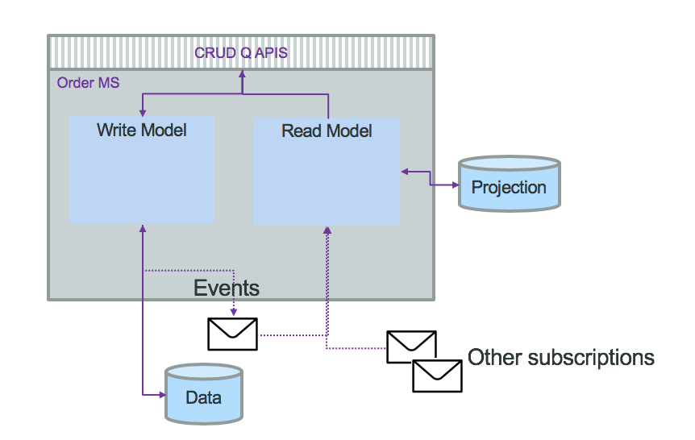

# Command Query Responsibility Segregation (CQRS) pattern

## Problems and Constraints

An app accesses data both to read the data and to modify the data. The primitive data tasks are often expressed as create, read, update, and delete (CRUD); using them is known as CRUDing the data. App code usually does not make much distinction between the tasks; individual operations often mix reading the data with changing the data as needed.

As part of application modernisation and the adoption of microservice, the database per service approach leads to interesting challenges of how to support business queries joining different data sources. 

Each microservice should store and manage its own data, user interface may need to display data from several microservices, or a business report needs to combined data from multiple microservices. Where this query should be implemented?

Another example is an enterprise database of record managing data required by many apps. It can become overloaded with too many clients needing too many connections to run too many threads performing too many transactions—such that the database becomes a performance bottleneck and can even crash. If the database contains data that is used by much of the enterprise, how can it be made more scalable?

## Solution and Pattern

The CQRS pattern strictly segregates operations that read data from operations that update data, which can make using data much more manageable in several respects. An operation can read data (the R in CRUD) or can write data (the CUD in CRUD), but not both. Doing so can make the read operations and the write operations simpler to implement because their functionality is more finely focused. The operations can be developed independently, potentially by separate teams. The operations can be optimized independently and can evolve independently, following changing user requirements more easily. These optimized operations can scale better, perform better, and security can be applied more precisely. 


When doing event sourcing and domain driven design, we event source the aggregates or root entities. Aggregate creates events that are persisted. On top of the simple create, update and read by ID operations, the business requirements want to perform complex queries that can't be answered by a single aggregate. By just using event sourcing to be able to respond to a query like "what are the orders of a customer", then we have to rebuild the history of all orders and filter per customer. It is a lot of computation. This is linked to the problem of having conflicting domain models between query and persistence.  
Command Query Responsibility Segregation, CQRS, separates the "command" operations, used to update application state (also named the 'write model'), from the "query/read" operations (the 'read model').  Updates are done as state notification events (change of state), and are persisted in the event log/store. On the "read model" side, you have the option of persisting the state in different stores optimized for how other applications may query/read the data.

The CQRS application pattern is frequently associated with event sourcing.

The following figure presents the high level principles:



The service exposes CUD operations, some basic Read by Id and then queries APIs. The domain model is separated into write and read models. Combined with Event Sourcing (ES) the `write model` goes to the event store. Then we have a separate process that consumes those events and build a projection for future queries. The "write" part may persist in SQL while the read may use document oriented database with strong indexing and query capabilities. Or use in-memory database, or distributed cache... They do not need to be in the same language. With CQRS and ES the projections are retroactives. New query equals implementing new projection and read the events from the beginning of time or the recent committed state and snapshot. Read and write models are strongly decoupled and can evolve independently. It is important to note that the 'Command' part can still handle simple queries, primary-key based, like get order by id, or queries that do not involve joins.

With this structure, the `Read model` microservice will most likely consume events from multiple topics to build the data projection based on joining those data streams. A query, to assess if the cold-chain was respected on the fresh food order shipment, will go to the voyage, container metrics, and order to be able to answer this question. This is where CQRS shines.

A second view of the previous diagram presents how we can separate the API definition and management in a API gateway, the Order command and write model has its own microservice, the event sourcing supported by a Kafka topic, and the query - read model as a set of different microservices or event functions as a service:


The [shipment order microservice](https://github.com/ibm-cloud-architecture/refarch-kc-order-ms) is implementing this pattern. 

Some implementation items to consider: 

* **Consistency** (ensure the data constraints are respected for each data transaction): CQRS without event sourcing has the same consistency guarantees as the database used to persist data and events. With Event Sourcing the consistency could be different, one for the "Write" model and one for the "Read" model. On write model, strong consistency is important to ensure the current state of the system is correct, so it leverages transaction, lock and sharding. On read side, we need less consistency, as they mostly work on stale data. Locking data on the read operation is not reasonable. 
* **Scalability**: Separating read and write as two different microservices allows for high availability. Caching at the "read" level can be used to increase performance response time, and can be deployed as multiple standalone instances (Pods in kubernetes). It is also possible to separate the query implementations between different services. Functions as service / serverless are good technology choices to implement complex queries. 
* **Availability**: As the "write" model is often strongly consistent, it impacts availability. This is a fact. The read model is eventually consistent so high availability is possible. In case of failure the system disables the writing of data but still be able to read them as they are served by different databases and services. 

With CQRS the "write" model can evolve overtime without impacting the read model, unless the event model changes. It adds some cost by adding more tables to implement the query parts. It allows smaller model, easier to understand. 

CQRS results in an increased number of objects, with commands, operations, events,... and packaging in deployable components or containers. It adds potentially different type of data sources. It is more complex. 

Some challenges to always consider: 

* How to support event version management?
* How much data to keep in the event store (history)?
* How to adopt data duplication which results to eventual data consistency. 

The CQRS pattern was introduced by [Greg Young](https://www.youtube.com/watch?v=JHGkaShoyNs), and described in [Martin Fowler's work on microservices.](https://martinfowler.com/bliki/CQRS.html)

As you can see in previous figure, as soon as we see two arrows from the same component, we have to ask ourselves how does it work: the "write model" has to persist Order in its own database and then sends OrderCreated event to the topic... Should those operations be atomic and controlled with transaction? We are detailing this in next section.

### The consistency challenge

As introduced in previous section there is potentially a problem of data consistency: the command part saves the data into the database and is not able to send the event to the topic, then consumers do not see the new or updated data.  
With traditional Java service, using JPA and JMS, the save and send operations can be part of the same transaction and both succeed or both failed.  
With event sourcing pattern, the source of trust is the event source. It acts as a version control system. So the service should start by creating the event (1) and then persists the data into the database, it uses a topic consumer, get the payload from the event (2) and uses this data to save in its local datasource (3). It derives state solely from the events. If it fails to save, it can persist the event to an error log (4) and then it will be possible to trigger the replay, via an admin API and Command Line Interface (5,6), by searching in the topic using this order id to replay the save operation. Here is a diagram to illustrate that process:


This implementation brings a problem on the `createOrder(order): order` operation, as the returned order was supposed to have the order id as unique key, so most likely, a key created by the database... To avoid this we can generate the key by code and enforce this key in the database if the underlying technology supports it. 

It is important to clearly study the Kafka consumer API and the different parameters on how to support the read offset. We are addressing those implementation best practices in [our consumer note.](../kafka/consumers.md)

### CQRS and Change Data Capture

There are other ways to support this dual operations level:

* There is the open source [Debezium tool](https://debezium.io/) to help respond to insert, update and delete operations on database and generate event accordingly. It may not work on all database schema. 
* Write the order to the database and in the same transaction write to an event table. Then use a polling to get the events to send to kafka from this event table and delete the row in the table once the event is sent. 
* Use the Change Data Capture from the database transaction log and generate events from this log. The IBM [Infosphere CDC](https://www.ibm.com/support/knowledgecenter/cs/SSTRGZ_10.2.0/com.ibm.cdcdoc.mcadminguide.doc/concepts/overview_of_cdc.html) product helps to implement this pattern. For more detail about this solution see [this product tour](https://www.ibm.com/cloud/garage/dte/producttour/ibm-infosphere-data-replication-product-tour).

The CQRS implementation using CDC will look like in the following diagram:


What is important to note is that the event needs to be flexible on the data payload. We are presenting a [event model](https://github.com/ibm-cloud-architecture/refarch-kc-order-ms#data-and-event-model) in the reference implementation.

On the view side, updates to the view part need to be idempotent. 

### Delay in the view

There is a delay between the data persistence and the availability of the data in the Read model. For most business applications, it is perfectly acceptable. In web based data access most of the data are at stale. 

When there is a need for the client, calling the query operation, to know if the data is up-to-date, the service can define a versioning strategy. When the order data was entered in a form within a single page application like our [kc- user interface](https://github.com/ibm-cloud-architecture/refarch-kc-ui), the "create order" operation should return the order with its unique key freshly created and the Single Page Application will have the last data. Here is an example of such operation:

```java
@POST
public Response create(OrderCreate dto) {
    Order order = new Order(UUID.randomUUID().toString(), dto.getProductID(),...);
    // ...
    return Response.ok().entity(order).build()
}
```

### Schema change

What to do when we need to add attribute to event?. So we need to create a versioninig schema for event structure. You need to use flexible schema like json schema, [Apache Avro](https://avro.apache.org/docs/current/) or [protocol buffer](https://developers.google.com/protocol-buffers/) and may be, add an event adapter (as a function?) to translate between the different event structures. 

<ToBeCompleted>
