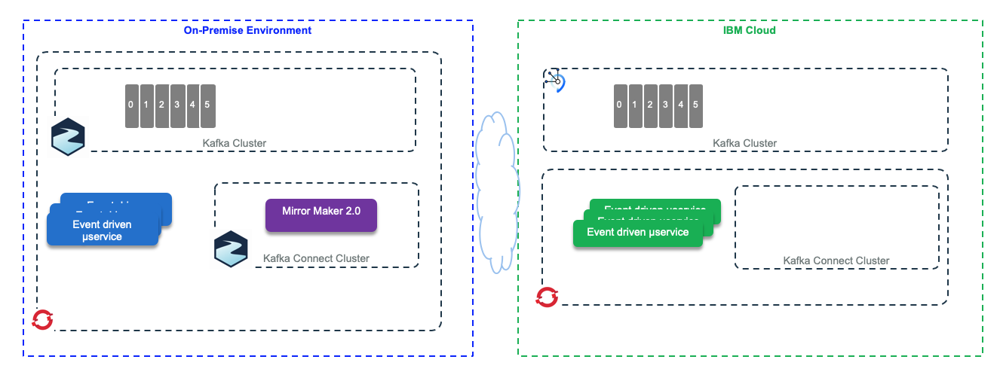

# Data replication in context of EDA

As an introduction to the scope of the data replication in the context of distributed system, we encourage to read our summary in [this article](https://ibm-cloud-architecture.github.io/refarch-data-ai-analytics/data/data-replication/).

In this section we are going to address the data replication in the context of Kafka using IBM Geo Replication and Kafka Mirror Maker 2 and change data capture.

## Problem statement

We suppose we need to replicate data in Kafka topics between different clusters running in different availability zones or data centers. There are multiple motivations for such replication. We can list at least the followings:

* Support disaster recovery, using different data centers to replicate microservice generated data in an active - passive mode.
* Move data closer to end user to improve performance and latency, this is more an active - active model, where the same microservices are deployed on the different data centers.
* The need to build on-premise data aggregation or data lake layer to perform batch analytics jobs from data gathered from different remote environments.
* Isolate secure data from on-premise cluster, with data encryption and data transformation to remove personal identifiable information, but still exchange such data between environments.

We are proposing two environments:

* one running a local, on-premise cluster using Kafka 2.4 open source packaging, like Strimzi vanilla Kafka or Red Hat AMQ Streams, and IBM Event Streams on Cloud.


* one running Event streams on Openshift on-premise, and using Geo-replication to Event Streams on IBM cloud.



Then we want to address two main scenarios:

* [Active - passive](#active-passive), which addresses more a disaster recovery approach where consumers reconnect to a new cluster after the first one fails.
* [Active - active](#active-active) deployments where participant clusters have producers and consumers and some topics are replicated so the messages are processed by different consumers

But first we need to review the new replication capability introduced with Kafka 2.4: Mirror maker 2.0.

## Mirror Maker 2.0

Mirror maker 2.0 is the new feature as part of Kafka 2.4 to support data replication between clusters. It is based on Kafka Connect framework, and it supports data and metadata replication, like the topic configuration, the offset and the consumer checkpoints are synchronously replicated to the target cluster.

Mirror maker uses the cluster name or identifier as prefix for topic, and uses the concept of source topic and target topic. The specification is described in detail in [this issue](https://cwiki.apache.org/confluence/display/KAFKA/KIP-382%3A+MirrorMaker+2.0#KIP-382:MirrorMaker2.0-RemoteTopics,Partitions).

To test the tool, we can use the Strimzi Kafka latest docker image deployed on Openshift cluster (We address Strimzi deployment in [this note](../deployments/strimzi/deploy.md)). For mirror maker, the deployment descriptor are in the [Strimzi project](https://strimzi.io/downloads/) under the `examples/kafka-mirror-maker-2` folder.

To define the clusters and topic configuration we use a properties file. One simple example to replicate from IBM Cloud Event streams to Kafka on premise is in the folder []()
Using the same kafka image we can start a mirror maker container with:

```properties

```

```bash
docker run -ti bitnami/kafka:2 -v $(pwd)/mirror-maker:/home --network docker_default bash
```

## Active - Passive

## Active - Active

* producers, deployed on IBM cloud within Openshift, send messages to Event streams on cloud, on the 'reeferTelemetries` topic. The explanation of the telemetry simulator producer deployment is done [here.](https://ibm-cloud-architecture.github.io/refarch-reefer-ml/infuse/simul-app/#prepare-for-kubernetes-deployment)