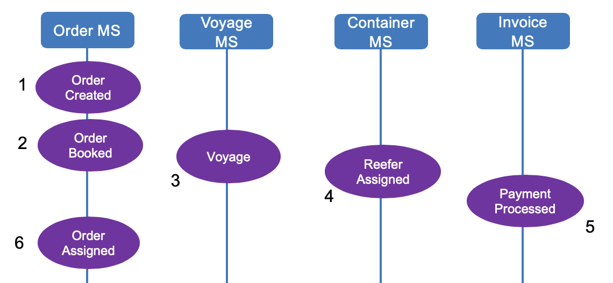
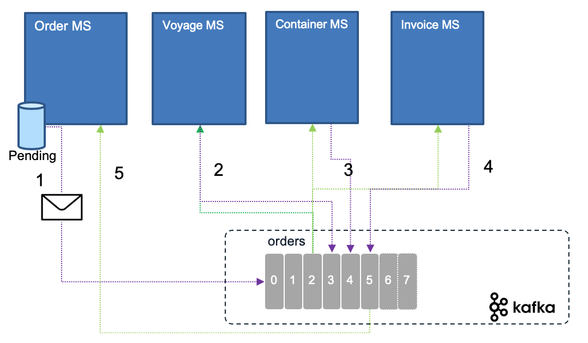
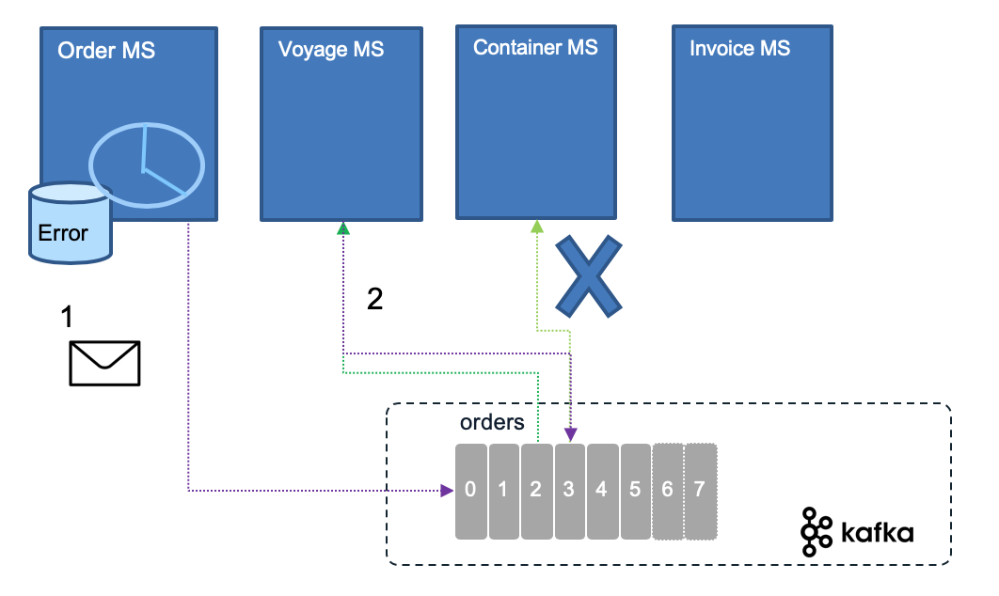
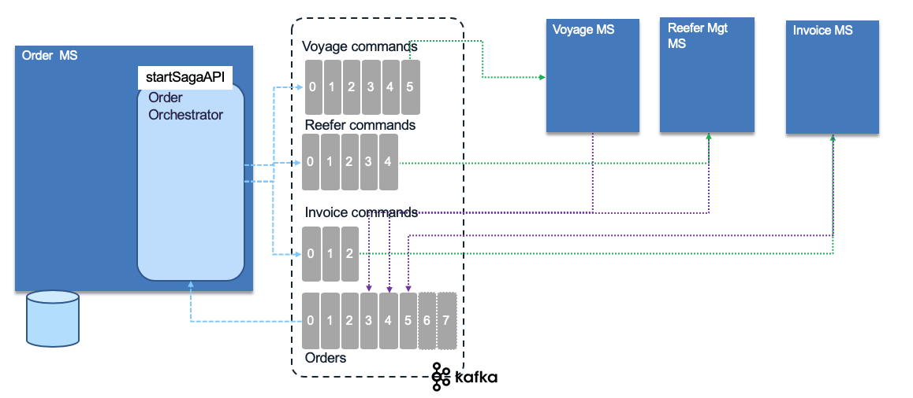

# Saga pattern

## Problems and Constraints

With the adoption of one data source per microservice, there is an interesting challenge on how to support long running transaction cross microservices. With event backbone two phase commit is not an option. 

## Solution and Pattern

Introduced in 1987 [by Hector Garcaa-Molrna Kenneth Salem paper](https://www.cs.cornell.edu/andru/cs711/2002fa/reading/sagas.pdf) the Saga pattern help to support a long running transaction that can be broken up to a collection of sub transactions that can be interleaved any way with other transactions. 

With microservice each transaction updates data within a single service, each subsequent steps may be triggered by previous completion. The following figure, based on [our solution implementation](https://ibm-cloud-architecture.github.io/refarch-kc), illustrates those concepts for an order:

When the order is created, it can be updated at any time by the user until he/she books it as the final order. As soon as the order is booked, the process needs to allocate the voyage, assigns containers and updates the list of containers to load on the ship. Those actions / commands are chained. The final state (in this schema not in the reality as the process has more steps) is the Order assigned state in the order microservice.

SAGA pattern supports two types of implementation: Choreography and Orchestration. 

## Services choreography

With Choreography each service produces and listens to other service’s events and decides if an action should be taken or not.

The first service executes a transaction and then publishes an event. It maintains the business entity status, (order.status) to the pending state until it is completed. This event is listened by one or more services which execute local transactions and publish new events.
The distributed transaction ends when the last service executes its local transaction or when a service does not publish any events or the event published is not polled by any of the saga’s participants.

In case of failure, the source microservice is keeping state and timer to monitor for the completion event.

Rolling back a distributed transaction does not come for free. Normally you have to implement another operation/transaction to compensate for what has been done before. This will be a new event sent by the service responsible of the transaction integrity.

## Services orchestration

With orchestration, one service is responsible to drive each participant on what to do and when.

If anything fails, the orchestrator is also responsible for coordinating the rollback by sending commands to each participant to undo the previous operation.
Orchestrator is a State Machine where each transformation corresponds to a command or message.
Rollbacks are a lot easier when you have an orchestrator to coordinate everything.

See also [this article](https://microservices.io/patterns/data/saga.html) from Chris Richardson on the Saga pattern.