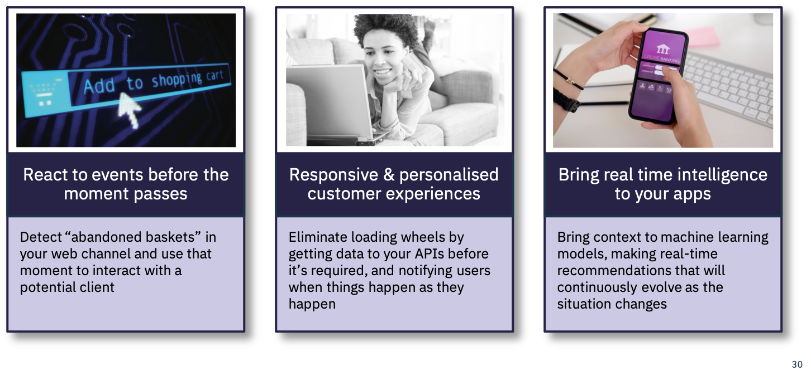
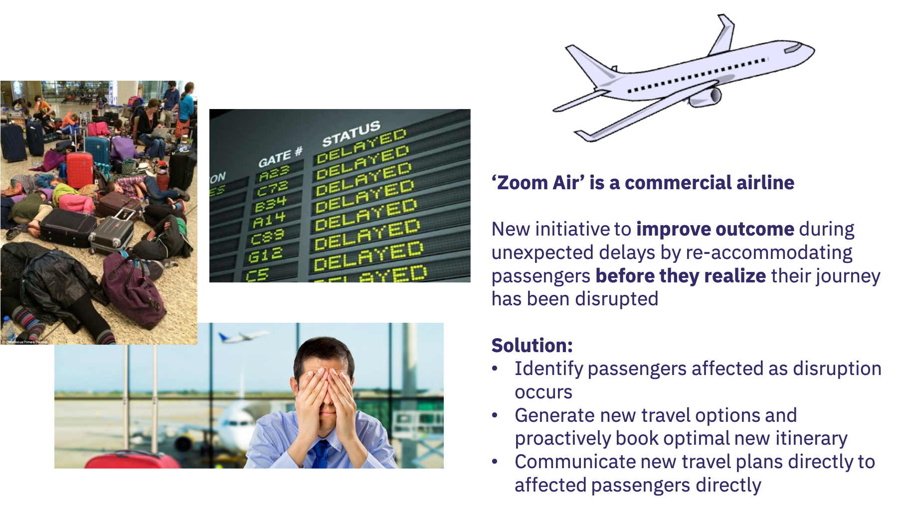

# Event Driven Use Cases

Before we look to specific use cases which naturally lead to an event driven approach, we should step back and remind ourselves what being event driven means:

* Event driven applications and Event Driven Architectures define a style for developing applications or IT solutions
* Event driven applications are *reactive* to things which happen or change in the business
  - Event driven applications make decisions and take actions when things happen/change in the business
* Event driven applications are *responsive*
  - Event driven application provide a notification interaction style ( Inform uses when something happens )
* Event driven applications process continuous streams of events in real time  for insights and actions
* Event Driven applications can be *intelligent applications* applying AI models in real time with the event stream
* An Event Driven Architecture and with event driven microservices provide the greatest opportunity for loose coupling which enables greater business agility

However being event driven also brings challenges

* Event driven applications are harder to visualize, trace and debug
* Event driven application programming is less familiar as is often perceived to be complex
* Event driven systems are typically not transactional or consistent.

With these characteristics in mind, we can  look for the right situations where an event driven approaches provides the best fit for the business problem or opportunity.

## High level Use cases

At a high level the following business drivers are typically suited an event driven approach:

Use case   |  Why Event Driven
--|--
Digital Business Transformation  |The  Digital business need to be both *reactive* and *responsive* to situations which occur in the business. It must detect, understand and act on events
Maximizing customer engagement  | The success of a digital business requires that customer ( users of digital business applications ) are properly engaged with the business through the digital channel. Engagement comes from providing the most appropriate information, at the most appropriate time, in the most appropriate way. The *responsive* nature of event driven systems provides an excellent foundation for this engagement.
Realizing Situational Business Opportunities   |  Respond in real time to business opportunities which become available just for the moment when certain events or combinations of events ( situations ) occur.
Delivering value with connected devices/IOT  |  Connected devices are typically the source of  continuous event streams from which we can derive insights and intelligence and can take actions on through applications.The  Event driven architecture and event driven applications enable us to derive insights/intelligence  from the event streams and to deliver the informed view into the hands of business users in real time.
Application Modernization  |  Application modernization typically follows a lift and shift approach to moving the application to a cloud native run times and an extension approach where new capability may be added in a pure cloud native way.   By *event enabling* the legacy application we can develop extensions as event driven cloud native applications with minimal impact and coupling.
Intelligent apps, realizing the value of AI |  The application of AI  with techniques such as  Machine Learning provides the opportunity to learn and  make predictions, and  recommendations. Integrating machine learning with an event driven approach means that we can bring that *intelligence* into our event driven applications and deliver those intelligent insights, recommendations, predictions into the hands of business users in real time at the right time.
Business Agility  |  Agility has perhaps become the overruling characteristic the business demands of app development in these days of the digital business. Being  able to rapidly and safely change or extend an application to better fit the business opportunity or to extend reach to new opportunities becomes critical. Following an event driven approach and adopting event driven microservices provides the ultimate approach to loose coupling and none disruptive application extension.

## Reactive, Responsive, and  Intelligent

Looking across the high level uses cases we can see three themes which really define the characteristics which event driven can bring to our applications:

Now lets consider some of these characteristics in practice, with  Zoom Air application below:

To deliver this capability with minimal impact on  existing systems, clearly benefits from an event-driven approach. The  unpredictable nature of the events that lead to disruption, become the triggers to take actions ( Reactive ),
notifying the passengers of the change in travel plans when they need it ( responsive )

## Achieve business agility with event driven microservices

Agility has perhaps become the overriding characteristic the digital business demands of modern app development. Being  able to rapidly and safely change or extend an application to better fit the business opportunity or to extend reach to new opportunities becomes critical.

Following an event driven  microservices can provides the ultimate in agility with:

* Loose coupling between component services
* None disruptive application extension.
* Fine grained service scaling

With event driven microservices the services become  produce and consumer events  (notifications ) ,  where the event payload is the representation of  something which has happened which is of significance in the business domain.

With this style  a micro-service produces events, but it does not need to have knowledge of if or when it will be processed.  We are loosely coupled.

We can add a new subscriber to an event to take different and additional action  which may start a complete new path and raft of new capabilities for the application.  We have none disruptive application extension.

Events can only enable us to increase agility if we can
get the right event to the right place ( consuming micro-service )  at the right time.

The cloud native event driven architecture provides the means to do this, to connect events from mobile apps, web apps, legacy apps, IOT devices, directly into the microservices platform and event driven microservices.

### Events for shared State and AI

Events and following an event driven approach requires a change of thinking compared to the data first and data centric view which has underpinned the majority of traditional applications.

An event driven approach with an *Event Backbone* providing a pub/sub communication capability for micro service communication and an event log which enables shared state can bring significant advantages:

Where events are notifications of changes in a business domain, with an event driven approach

* we can easily add new subscriber microservices to add new capabilities to the application as discussed above
* We can also easily and none intrusively add handlers to feed the changes in the business domain into our big data  analytics and machine learning
* With the event log and event stores we also build up a time sequenced history of changes of state. This complete history can provide greater insights for data scientists when develloping machine learning models  
