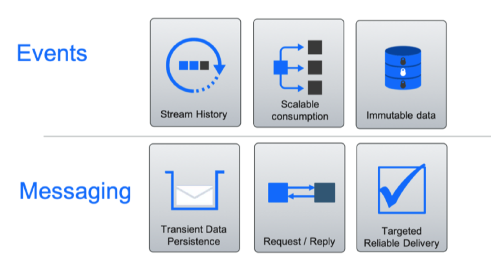

# Event Backbone

The event backbone is the communication layer in the event driven architecture.  It provides the connection between event driven capabilities and in the *Cloud Native* it becomes the Pub/Sub communication layer for event driven microservices.

At this high level we would consider two types of relevant technologies for the event backbone, *Message Brokers* and *Event Logs*.  Both technology types could be used to achieve the event communication style, with the "Publish and subscribe" model however, it is also important to consider other capabilities which are frequently used within event driven solutions:

* Keeping an **Event Log** as a time sequenced as it happened recording of events (Source of the truth).
* Enabling direct **replay** of events.
* Enabling **Event Sourcing** as a way of recording state changes in distributed systems.
* Enabling **programmatic access** to the *continuous event stream*.

When viewed across these wider event driven capabilities, an event log style technology can provide a central component which can support all of these capabilities, whereas a message broker would have to be extended with other components.

## Defining the Event Backbone for the event driven reference architecture

For the event driven architecture we defined the following characteristics to be essential for the *event backbone*

* Pub/Sub communication.
* Facilitate many consumers: Shared central “source of truth”.
* Capability to store events for a given period of time (event log).
* Provide replay of events from history for evolving application instances.
* Provide programmatic access to continuous event stream data.
* Must be highly scalable and resilient to cloud deployment levels.

Looking across these capabilities, the potential technologies, the amount of adoption and community activity around the technologies lead us to selecting *Kafka* as the Open Source technology base for the event backbone.

You can read more about Apache Kafka project here [https://kafka.apache.org](https://kafka.apache.org)

## Supporting products

The IBM Event Streams offering provides a *Kafka* service for the Event Backbone. The service is available as a fully managed service within Public cloud and as a supported build for IBM Cloud Private.

* [IBM Event Streams Public Cloud](https://console.bluemix.net/catalog/services/event-streams)
* [IBM Event Streams Private Cloud](https://www.ibm.com/cloud/event-streams)
* [See also our own Kafka study article](../kafka/readme.md) on how to support high availability and how to deploy to your local environment or to a kubernetes cluster like IBM Cloud Private.

## Messaging versus event streaming

We recommend reading [this article](https://developer.ibm.com/messaging/2018/05/18/comparing-messaging-event-streaming-use-cases/) and [this one](https://developer.ibm.com/messaging/2019/02/05/comparing-messaging-pub-sub-and-event-streams/), to get insight between messaging (focusing on operations / actions to be performed by a system or service) versus event (focusing on the state / facts of a system with no knowledge of the downstream processing. To summarize messaging (like MQ) are to support:

* Transient Data – data is only stored until a consumer has processed the message, or it expires
* request / reply most of the time
* Targeted reliable delivery: targeted to the entity that will process the request or receive the response. Reliable with transaction support.

For events:

* Stream history: consumers are interested by history and not just the most recent event
* Scalable Consumption: A single event is consumed by many consumers with limited impact as the number of consumers grow.
* Immutable Data 

## Deployments

In term of event backbone deployment environment we propose different approaches:

* **[IBM Cloud](https://cloud.ibm.com/)** with the [Event Streams service](https://cloud.ibm.com/catalog/services/event-streams).
    * Deployment discussions for the KC solution are in [this note](https://ibm-cloud-architecture.github.io/refarch-kc/deployments/iks/)
* **IBM Cloud Private**
    * [Event Streams deployment](../deployments/eventstreams/README.md).
    * [Zookeeper deployment](../deployments/zookeeper/README.md) and [Kafka deployment](../deployments/kafka/README.md) for ICP.
* Running locally with docker compose. See [this note](https://ibm-cloud-architecture.github.io/refarch-kc/deployments/local/) for details.
