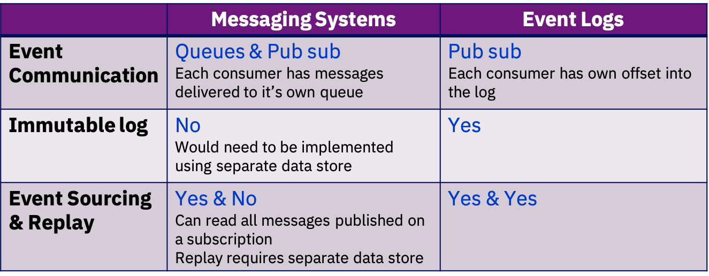

# Event Backbone

The event backbone is the communication layer in the event driven archiecture.  It provives the connection between event drive capabilities and for cloud native it needs become part of the fabric of the mircoservies infrastructure. It needs to provide the Pub/Sub communcaition at scale with minimal latency to enable developers to take benenfit of the loose coupling of event driven microservices.

At this high level we would consider two types of relevant technologies for the event backbone , *Messaging Systems* and *Event Logs*.  Both technology types could be used to achieve the event communication styple, with the Publish and Subscribe model.

However it is also important to consider other cpabilities which event driven solutions typically make use of connected to the *event communication*

* Keeping an **Event Log** as a time sequenced as it happend recording of events  ( Source of the truth )
* Support for event based state management **Event Sourcing**
* Enabling direct *Replay of events*
* Enabling programmatic access to the *continuos event stream*

When viewed across this set of event driven capabilities, the choice bwteen a Messaging System and an Event Log technology becomes clear.

## Event Backbone supported capabilities
*	Capability to store events for a period of time, allowing for potential downtime of the event consumers (ideally implemented with an event log)
* Immutable data : Consistent replay for evolving application instances
* Facilitate many consumers: Shared central “source of truth”
* Event log history is becoming a useful source for data scientists and machine learning model derivation

We are addressing some of those features in our Kafka [summary here](../kafka/readme.md)

## Supporting products:
* [kafka](http://apache.kafka.org)
* [our own kafka article](../kafka/readme.md) on how to support HA and how to deploy to your local environment or to a kubernetes cluster like IBM Cloud Private.
*
## IBM Cloud offerings for the event backnone

The IBM Event Streams offering provides a kafka services which can form the Event Backbone for your event driven architecture.  The service is available as a fully managed service within Public cloud and  and as a supported build withing IBM cloud Private.

For more details please  go to:
* [IBM Event Streams Public Cloud ](https://console.bluemix.net/catalog/services/event-streams)
* [IBM Event Streams Private Cloud ](https://www.ibm.com/cloud/event-streams)
