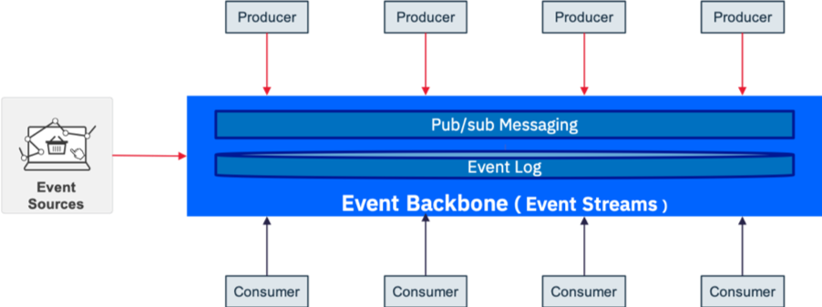

# Event Backbone

Event Backbone enables the delivery of events from event producers to consumers using a pub/sub style.
 The event log represents the original source of truth and support the concept of event sourcing (see below) and event replay.

  

The Key features of an event Backbone:
*	Capability to store events for a period of time, allowing for potential downtime of the event consumers (ideally implemented with an event log)
* Immutable data : Consistent replay for evolving application instances
* Facilitate many consumers: Shared central “source of truth”
* Event log history is becoming a useful source for data scientists and machine learning model derivation

#### Supporting products:
* [kafka](http://apache.kafka.org) and see also [our own kafka article](https://github.com/ibm-cloud-architecture/refarch-analytics/tree/master/docs/kafka) on how to support HA and deployment to kubernetes.
* [IBM Event Streams](https://ibm.github.io/event-streams/)
* [IBM MQ](https://github.com/ibm-cloud-architecture/refarch-mq-messaging): We are addressing and delivering some simple MQ messaging solution as part of the integration solution and the lift and shift MQ workload to IBM Cloud.

UNDER construction!

