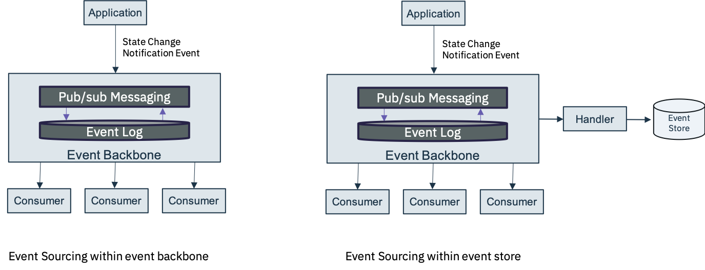
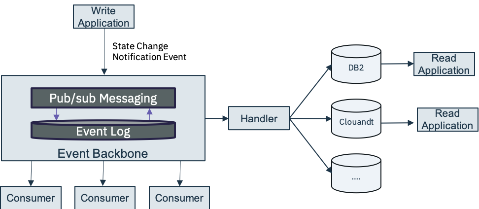

# Event managed state

## Event sourcing

When the state of a system changes, an application issues a notification event of the state change.  Any interested parties can become consumers of the event and take required actions.  The state-change event is stored in an event log or event store in immutable time order.  The event log or store becomes the principal source of truth. The system state can be recreated to a point in time by reprocessing the events at any time in the future. The history of state changes becomes an audit record for the business and is often a useful source of data for data scientists to gain insights into the business.

In some cases the event sourcing pattern is implemented completely within the event backbone, by using the event log and Kafka topics and streams. However, you can also consider implementing the pattern with an external event store, which provides optimizations for how the data may be accessed and used. For example [IBM Db2 Event store](https://www.ibm.com/products/db2-event-store) can provide the handler and event store connected to the backbone and provide optimization for down stream analytical processing of the data.

In operation, the event stores persist all state-changing events for an object with a timestamp in time order, thus creating a time series of changes for objects. The current state of an object can always be derived by replaying the events in the time series. An event store only needs to store three pieces of information:

* The type of event or aggregate.
* The sequence number of the event.
* The data as a serialized blob.

More data can be added to help with diagnosis and audit, but the core functionality only requires a narrow set of fields. This gives rise to a very simple data design that can be heavily optimized for appending and retrieving sequences of records.

## Command Query Responsibility Segregation (CQRS)

The event log leads to more work to support business query as it requires converting the events into the application state suitable to the query.

The CQRS application pattern is frequently associated with event sourcing. In this pattern, you separate the "command" operations, used to update application state, from the "query/read" operations.  Updates are done as state notification events (change of state), and are persisted in the event log/store. On the read side you have the option of persisting the state in different stores optimized for how other applications may query/read the data.

See the following [order management project](https://github.com/ibm-cloud-architecture/refarch-kc-order-ms) for a detail explanation and implementation of the CQRS and event sourcing patterns.

## Event sourcing, CQRS and microservices

With the adoption of microservices you have explicitly separated state, so that a microservice is bounded with its own state. Further, with the use of event sourcing, you create a history log that is not easy to query. The challenge now comes when you need to implement a query that requires a joining of data from multiple services.
There are multiple choices to address service orchestration: API composition or the CQRS pattern. For API composition the query is supported by an operation which integrate with all other microservices and may do some data transformation to combine the results. With this pattern you need to assess for aggregation requirements as they may dramatically impact performance. You may need to assess where to put this API composition component. It can be an API gateway or part of a BFF or even its own microservices.
The other answer is to implement a CQRS pattern where state changes are published as events by multiple related business objects. Each change is persisted in the event log or event store, and a higher level operation subscribes to each event and persists the data in a queryable data store.

## Fearther readings

Read more on this pattern at https://microservices.io/patterns/data/cqrs.html and our [reference implementation](https://github.com/ibm-cloud-architecture/refarch-kc-order-ms)

## Supporting Products

* [IBM Event Streams Public Cloud](https://console.bluemix.net/catalog/services/event-streams)
* [IBM Event Streams Private Cloud](https://www.ibm.com/cloud/event-streams)
* [IBM Db2 Event store](https://www.ibm.com/products/db2-event-store)
