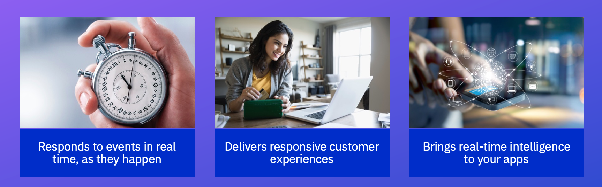

Updated 04/19/2022

## Business use cases

In recent years, due to the business demands for greater responsiveness and awareness of context in 
business decisions, organizations have taken a more strategic approach to supporting EDA.

We have observed the following the main business justifications for adopting real-time processing, event-driven architecture.

* **Response to events in real time**: Get visibility of events cross applications, even if they were not designed as event-producer
and then act on those events, by deriving synthetic events or trigger business processes. Business are looking at better
way to understand user's behavior on their on-line presence, and being able to act quickly for product recommendations,
propose ad-hoc support, gather data for fraud detection, cause analysis of potential customer churn, fraud detection...
* **Deliver responsive customer experiences**: This is also about scaling web applications, locate processing closer to the end users,
be resilient to underlying business services failure, separate read from write models, adoption reactive - manifesto while programming
new business services
* **Brings real-time intelligence**: is about integrating analytics to real-time data streaming. Moving out of batch
processing when it is relevant to compute aggregates on data in motion. This also includes embedding AI model, into the
streaming application. Intelligence also means rule based reasoning, and complex event processing helps to recognize
event patterns and act on them. The use 

Event in 2022, a lot of companies are not aware of what's is going on inside the company and with their customer's interactions.

## Technical use cases 

Recurring technical needs and use cases are specifics for adopting event-driven architecture. 
We can list the following important concerns:

* **Communication layer:**  

  * Adopt messaging and asynchronous communication between applications and 
microservices for loosely coupled services. Messaging helps exchanging
data between services and message brokers are needed to support the persistence and high availability
to produce and consume those data. (See [this note](https://ibm-cloud-architecture.github.io/refarch-integration/service-mesh/readme/#asynchronous-loosely-coupled-solution-using-events) where we present a way to support a service mesh solution using asynchronous event).
The data are pushed as immutables record, or commands are sent with exactly once delivery. Reducing pull data approach. 

  * Pub/sub messaging for cloud native applications to improve communication inter microservices.
  * Support Always-on services with asynchronous data replication.
  * Expose data to any application to consume.
  * Time decoupling is important and consumers fetch data when they want.

* **Reactive systems:** to support reactive, responsive applications for addressing
resiliency, scaling so adopting message buses.

  * Adopt real-time processing moving out of batch processing when possible.

* **Data Agility:**

  * The distributed nature of cloud native applications, means we need to address subjects like availability, consistency and resilience to network partitioning. Data consitency could not be guarantee, without strong transaction support, but multi-cloud, multi data centers, 
application allocations in different container orchestrator, means dealing with eventual consistency.
  * Centralize online data pipeline to decouple applications and microservices.
  * Monitor distributed applications to produce centralized feed of operational data.
  * Logs collector from multiple services.
  * Implement [event sourcing pattern](/patterns/event-sourcing/) out of the box, using configuration to keep message for a long time period. Data are replicated between brokers within the cluster and cross availability zones if needed.
  * As data is visible in highly available manner, persisted in distributed broker cluster, those brokers
are becoming data hub, data buffering for larger data pipeline processing.

* **Near real-time analytics insights:**

  * Compute real-time aggregates, time window based reasoning, and even complex event-processing which looks after event sequencing patterns.
  * Aggregation of event coming from multiple producers.
  * Look at event sequencing patterns
  * Compute next best action from event streams

