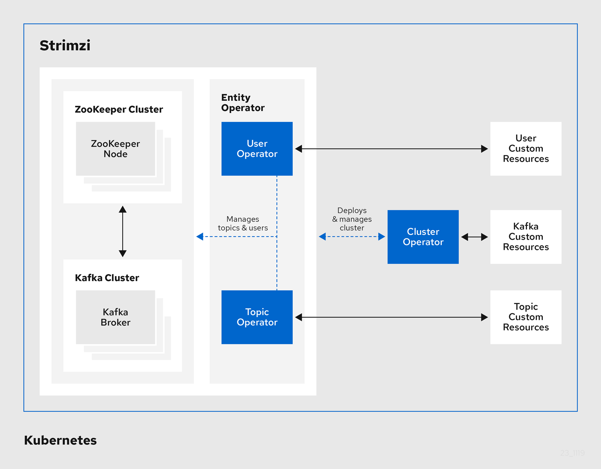
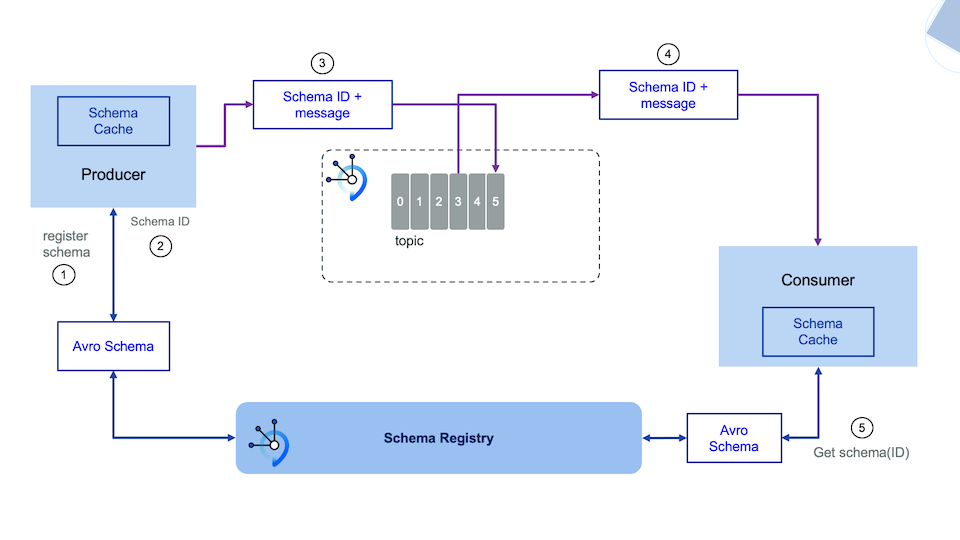

In this `201` content, you should be able to learn more about Kafka, Event Streams, Messaging, and Event-driven solution.


## More Kafka

We have already covered the Kafka architecture in [this section](../../technology/kafka-overview/#kafka-components).
When we deploy Event Streams on Kubernetes, it uses Operator, and it is in fact a wrapper on top of [Strimzi](http://strimzi.io),
the open source kafka operator.

[Developer.ibm learning path: Develop production-ready, Apache Kafka apps](https://developer.ibm.com/learningpaths/develop-kafka-apps/)


### Strimzi

[Strimzi](https://strimzi.io/) uses the Cluster Operator to deploy and manage Kafka (including Zookeeper) and Kafka Connect clusters. 
When the Strimzi Cluster Operator is up and runnning, it starts to watch for certain OpenShift or Kubernetes resources containing the 
desired Kafka and/or Kafka Connect cluster configuration. 



It supports the following capabilities:

* Deploy Kafka OOS on any OpenShift or k8s platform
* Support TLS and SCRAM-SHA authentication, and automated certificate management
* Define operators for cluster, users and topics
* All resources are defined in yaml file so easily integrated into GitOps

The Cluster Operator is a pod used to deploys and manages Apache Kafka clusters, Kafka 
Connect, Kafka MirrorMaker (1 and 2), Kafka Bridge, Kafka Exporter, and the Entity Operator.
When deployed the following commands goes to the Cluster operator:

```shell
# Get the current cluster list
oc get kafka
# get the list of topic
oc get kafkatopics
```

#### Installation on OpenShift

The Strimzi operators deployment is done in two phases:

* Deploy the main operator via Subscription
* Deploy one to many instances of the Strimzi CRDs: cluster, users, topics...

For that we have define subscription and configuration in [this eda-gitops-catalog repo](https://github.com/ibm-cloud-architecture/eda-gitops-catalog). 
So below are the operations to perform:

```shell
 # clone 
 git clone https://github.com/ibm-cloud-architecture/eda-gitops-catalog.git
 # Define subscription
 oc apply -k kafka-strimzi/operator/overlays/stable/
 # The subscription creates an operator pod under the openshift-operators project
 oc get pods -n openshift-operators
 # Create a project e.g. strimzi
 oc new-project strimzi
 # deploy a simple kafka cluster with 3 brokers
 oc apply -k  kafka-strimzi/instance/
 # Verify installation
 oc get pods
 # should get kafka, zookeeper and the entity operator running.
```

The [Strimzi documentation](https://strimzi.io/docs/operators/latest/using.html) is very good to present a lot of configuration and tuning practices.

#### Application

All applications written with Kafka API will work the same way with Strimzi and Event Streams. So developer
can use Strimzi images for their local development.

## Production deployment - High Availability

Kafka clustering brings availability for message replication and failover, see details in this [high availability section.](../../technology/kafka-overview/advance/#high-availability)
This chapter presents replicas, in-synch replicas concepts and addresses some broker failure scenarios that are important to understand.

When looking how Kafka is deployed on Kubernetes / Openshift it is important to isolate each broker
to different worker node as illustrated in [this section](../../technology/kafka-overview/advance/#high-availability-in-the-context-of-kubernetes-deployment).

In end-to-end deployment, the high availability will become more of a challenge for the producer and consumer.
Consumers and producers should better run on separate servers than the brokers nodes. Producer may need
to address back preasure on their own. Consumers need to have configuration that permit to do not enforce
partition to consumer reassignment too quickly. Consumer process can fail and restart quickly and get the same partition allocated.

## Event-driven solution GitOps deployment

The ["event-driven solution GitOps approach" article](../../use-cases/gitops) goes over how to use OpenShift GitOps to deploy Event Streams, MQ, and 
a business solution. You will learn how to bootstrap the GitOps environment and deploy the needed IBM operators then use
custom resource to define Event Streams cluster, topics, users...

The following solution GitOps repositories are illustrating the proposed approach:

* [refarch-kc-gitops](https://github.com/ibm-cloud-architecture/refarch-kc-gitops): For the shipping fresh food overseas solution we have defined. It includes
the SAGA choreography pattern implemented with Kafka
* [eda-kc-gitops](https://github.com/ibm-cloud-architecture/eda-kc-gitops): For the shipping fresh food overseas solution we have defined. It includes
the SAGA orchestration pattern implemented with MQ
* [eda-rt-inventory-gitops](https://github.com/ibm-cloud-architecture/eda-rt-inventory-gitops) to deploy the demo of real-time inventory


## Performance considerations

Read [this dedicated article on performance, resilience, throughput.](../../technology/kafka-overview/advance/#performance-considerations)

## EDA Design patterns 

Event-driven solutions are based on a set of design pattern for application design. In 
[this article](../../patterns/intro/), you will find the different pattern which
are used a lot in the field like

* [Event sourcing](../../patterns/event-sourcing/): persists, to an append log, the states of a business entity, such as an Order, as a sequence of immutable state-changing events.
* [Command Query Responsibility Segregation](../../patterns/cqrs/): helps to separate queries from commands and help to address queries with cross-microservice boundary.
* [Saga pattern:](../../patterns/saga/) Microservices publish events when something happens in the scope of their control like an update in the business entities they are responsible for. A microservice, interested in other business entities, subscribes to those events and it can update its own state and business entities on receipt of these events. Business entity keys need to be unique and immutable.
* [Event reprocessing with dead letter](../../patterns/dlq/): event driven microservices may have to call external services via a synchronous call. We need to process failure in order to get response from those services using event backbone.
* [Transactional outbox](../../patterns/intro/#transactional-outbox): A service command typically needs to update the database and send messages/events.
The approach is to use an outbox table to keep the message to sent and a message relay process to publish events inserted into database to the event backbone. (Source Chris Richardson - Microservices Patterns)


## Kafka Connect Framework

Kafka connect is an open source component for easily integrate external systems with Kafka. 
It works with any Kafka product such as IBM Event Streams, Red Hat AMQ Streams, or Strimzi.
You can learn more about it [in this article](../../technology/kafka-connect/) and with those labs:

  * [Connect to S3 source and sink](../../use-cases/connect-s3/)
  * [Connect to IBM Cloud Object Storage](../../use-cases/connect-cos/)
  * [Connect to a Database with JDBC Sink](../../use-cases/connect-jdbc/)
  * [Connect to MQ queue as source or Sink](../../use-cases/connect-mq/)
  * [Connect to RabbitMQ](../../use-cases/connect-rabbitmq/)

## Integrate with MQ

Using Kafka Connect framework, IBM has a [MQ source connector](https://github.com/ibm-messaging/kafka-connect-mq-source)  
and [MQ Sink connector](https://github.com/ibm-messaging/kafka-connect-mq-sink) to integrate easily between Event Streams and IBM MQ
The [following labs](../../use-cases/connect-mq/) will help you learn more about how to use those connectors
and this [gitops repository](https://github.com/ibm-cloud-architecture/store-mq-gitops) helps you to run a store simulation producing messages to MQ
queue, with Kafka Connector injecting those message to Event Streams.

## Introduction to schema management

Schema management and schema registry are mandatory for doing production deployment, of any Kafka based solution.
To understand the following components read [this note](../../technology/avro-schemas/)



## AsyncAPI

[This article on AsyncAPI management](../../patterns/api-mgt/) presents the value of using AsyncAPI in API Connect.
This blog from development [What is Event Endpoint Management?](https://community.ibm.com/community/user/integration/blogs/dale-lane1/2021/04/08/what-is-event-endpoint-management)
presents the methodology for event endpoint management:

* event description including the event schema, the topic, and thte communication protocol
* event discovery, with centralized management of the API
* self service to easily try the API, but with secure policies enforcement
* decoupled by API helps to abtract and change implementation if needed.

## Debezium change data capture

Change data capture is the best way to inject data from a database to Kafka. 
[Debezium](https://debezium.io/) is the Red Hat led open source project in this area. The [IBM InfoSphere Data Replication](https://www.ibm.com/docs/en/idr/11.4.0?topic=replication-cdc-engine-kafka) is a more advanced solution
for different sources and to kafka or other middlewares. 

One lab [DB2 debezium](../../use-cases/db2-debezium) not fully operational, looking for contributor to complete it.

and an implementation of [Postgresql debezium cdc with outpost pattern](https://github.com/ibm-cloud-architecture/vaccine-order-mgr-pg) and quarkus.

## Mirroring Data

To replicate data between Kafka clusters, Mirror Maker 2 is the component to use. It is based on Kafka connector
and will support a active-passive type of deployment or active active, which is little bit more complex.


See the detail [Mirror Maker 2 technology summary](../../technology/kafka-mirrormaker/)

