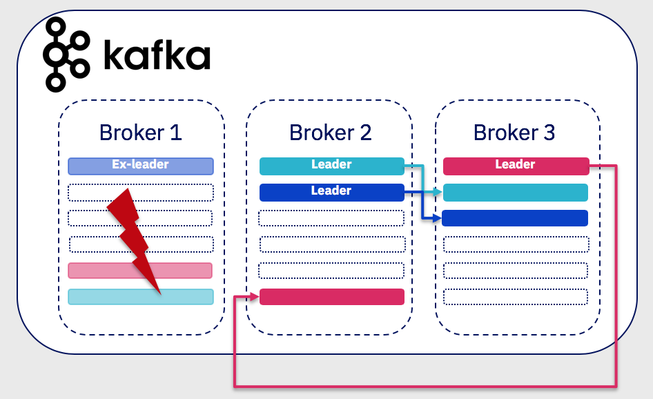
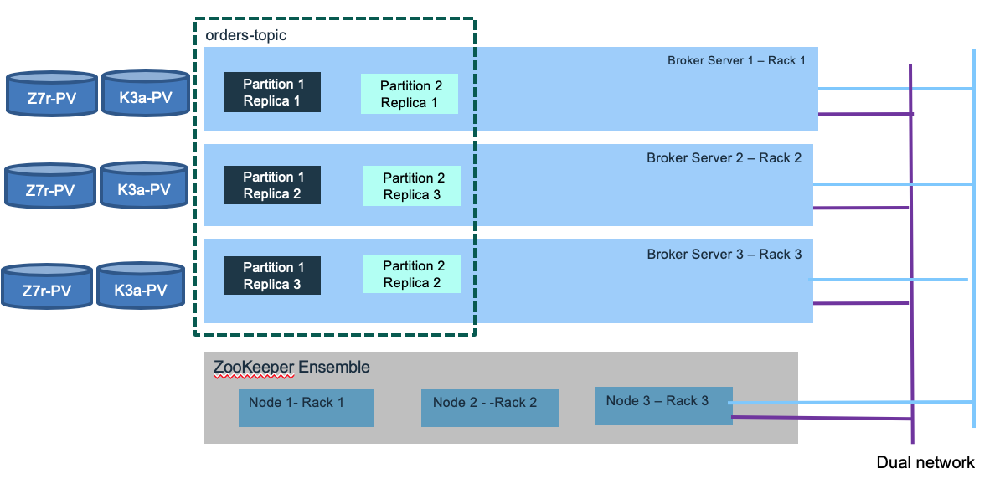

# IBM Event Streams / Kafka Architecture Considerations

If you need to know the key concepts read [this article](./readme.md). 

## High Availability

As a distributed cluster, kafka brokers ensure high availability to process new events. Topic has replication factor to support not loosing data in case of broker failure. You need at least 3 brokers to ensure availability and a replication factor set to 3 for each topic, so no data will be lost. Partition enables data locality, elasticity, scalability, high performance, parallelism, and fault tolerance. Each partitition is replicated at least 3 times and allocated in different brokers. One replicas is the **leader**. In the case of broker failure (broker 1 in figure below), one of the existing partition in the remaining running brokers will take the leader role (e.g. red partition in broker 3):



The keys in the data record determine the partitioning of data in **Kafka**. The records with the same key will be in the same partition.

As kafka is keeping its cluster states in zookeeper, you also need to have at least a three node cluster for zookeeper. Writes to Zookeeper are only performed on changes to the membership of consumer groups or on changes to the Kafka cluster itself. Assuming you are using the most recent kafka version (after 0.9), it is possible to have a unique zookeeper cluster for multiple kafka clusters. But the latency between Kafka and zookeeper needs to be under few milliseconds (< 15ms) anyway. Zookeepers and Brokers should have high availability communication via dual network, and each broker and node allocated on different racks and blades.



Consumers and producers are using a list of bootstrap server names (also named advertiser.listeners) to contact the cluster. The list is used for cluster discovery, it does not need to keep the full set of server names or ip addresses. A Kafka cluster has exactly one broker that acts as the controller. 

Per design Kafka aims to run within a single data center. But it is still recommended to use multiple racks connected with low laterncy dual networks. With multiple racks you will have better fault tolerance, as one rack failure will impact only one broker. There is a configuration property to assign kafka broker using rack awareness. (See [this configuration](https://kafka.apache.org/documentation/#brokerconfigs) from the product documentation).

Always assess the latency requirements and consumers needs. Throughtput is linked to the number of partitions within a topic and having more consumers running in parallel. Consumers and producers should better run on separate servers than the brokers nodes. 
For high availability assess any potential single point of failure, such as server, rack, network, power supply...

The figure below illustrates a kubernetes deployment, where zookeeper and kafka brokers are allocated to 3 worker nodes (We still recommend 5 nodes to support quorum management in case of broker failure) and event driven microservices are deployed in separate nodes. Those microservices are consumers and producers of events from one to many topics. Kafka may be used as event sourcing.


We recommend reading [this event stream article](https://ibm.github.io/event-streams/installing/planning/) for planning installation on k8s. 
To add new broker, we can deploy the runtime to a new server / rack / blade, and give a unique ID. It will process new topic, but it is possible to use tool to migrate some existing topic/ partitions to the new server. The tool is used to reassign partitions across brokers. An ideal partition distribution would ensure even data load and partition sizes across all brokers. 


## High Availability in the context of Kubernetes deployment

The combination of kafka with kubernetes seems to be a sound approach, but it is not that easy to achieve. Kubernetes workloads prefer to be stateless, Kafka is stateful platform and manages its own brokers, and replications across known servers. It knows the underlying infrastructure. In kubernetes, nodes and pods may change dynamically. 

For any Kubernetes deployment real high availability is constrained by the application / workload deployed on it. The Kubernetes platform supports high availability by having at least the following configuration:

* At least three master nodes (always an odd number of nodes). One is active at master, the others are in standby. The election of the master is using the quorum algorithm. 
* Three proxy nodes.
* At least three worker nodes, but with zookeeper and Kafka clusters, we may need to define six nodes as we do not want to have zookeeper nodes with Kafka cluster broker on the same host.
* Externalize the management stack to three manager nodes
* Shared storage outside of the cluster to support private image registry, audit logs, and statefulset data persistence.
* Use `etcd` cluster: See recommendations [from this article](https://github.com/coreos/etcd/blob/master/Documentation/op-guide/clustering.md). The virtual IP manager assigns virtual IP addresses to master and proxy nodes and monitors the health of the cluster. It leverages `etcd` for storing information, so it is important that `etcd` is high available too and connected to low latency network below 10ms.

For IBM Cloud private HA installation see the [product documentation](https://www.ibm.com/support/knowledgecenter/en/SSBS6K_2.1.0.3/installing/custom_install.html#HA)

Traditionally disaster recovery and high availability were always consider separated subjects. Now active/active deployment where workloads are deployed in different data center, is more and more a common request. IBM Cloud Private is supporting [federation cross data centers](https://github.com/ibm-cloud-architecture/refarch-privatecloud/blob/master/Resiliency/Federating_ICP_clusters.md), but you need to ensure to have low latency network connections. Also not all deployment components of a solution are well suited for cross data center clustering.

For **Kafka** context, the *Confluent* website presents an interesting article for [**Kafka** production deployment](https://docs.confluent.io/current/kafka/deployment.html). One of their recommendation is to avoid cluster that spans multiple data centers and specially long distance ones, because of the latency, and the chatty interface between zookeeper and kafka brokers.
But the semantic of the event processing may authorize some adaptations. For sure, you need multiple Kafka Brokers, which will connect to the same ZooKeeper ensemble running at least five nodes (you can tolerate the loss of one server during the planned maintenance of another server). One Zookeeper server acts as a lead and the two others as stand-by.

The diagram above illustrates a simple deployment where zookeeper servers and kakfka brokers are running in pods, in different worker nodes. It is a viable solution to start deploying solution on top of kafka. When you have bigger cluster, it may be interesting to separate Zookeeper from **Kafka** nodes to limit the risk of failover, as zookeeper keeps state of the **Kafka** cluster. You will limit to have both the zookeeper leader and one kafka broker dying at the same time. We use Kubernetes [anti-affinity](https://kubernetes.io/docs/concepts/configuration/assign-pod-node/#affinity-and-anti-affinity) to ensure they are scheduled onto separate worker nodes that the ones used by zookeeper. It uses the labels on pods with a rule like:
> **Kafka** pod should not run on same node as zookeeper pods.  

Here is an example of such spec:

```yaml
apiVersion: v1
kind: Pod
metadata:
  name: with-pod-affinity
spec:
  affinity:
    podAntiAffinity:
          requiredDuringSchedulingIgnoredDuringExecution:
            labelSelector:
            matchExpressions:
            - key: name
              operator: In
              values:
              - gc-zookeeper
          topologyKey: kubernetes.io/hostname
```

We recommend doing the [running zookeeper in k8s tutorial](https://kubernetes.io/docs/tutorials/stateful-application/zookeeper) for understanding such configuration.
Provision a **fast storage class** for persistence volume.

**Kafka** uses the log.dirs property to configure the driver to persist logs. So you need to define multiple volumes/ drives to support log.dirs.

Zookeeper should not be used by other applications deployed in k8s cluster, it has to be dedicated for one **Kafka** cluster only.

In a multi-cluster configuration being used for disaster recovery purposes, messages sent between clusters will have different offsets in the two clusters. It is usual to use timestamps for position information when restarting applications for recovery after a disaster. We are addressing offset management in one of our consumer projects [here](https://github.com/ibm-cloud-architecture/refarch-asset-analytics/).

For configuring ICP for HA on VmWare read [this note](https://github.com/ibm-cloud-architecture/refarch-privatecloud/blob/master/Configuring_ICP_for_HA_on_VMware.md).

For **Kafka** streaming with stateful processing like joins, event aggregation and correlation coming from multiple partitions, it is not easy to achieve high availability cross clusters: in the strictest case every event must be processed by the streaming service exactly once. Which means:

* producer emits data to different sites and be able to re-emit in case of failure. Brokers are known by producer via a list of hostnames and port numbers.
* communications between zookeepers and cluster nodes are redundant and safe for data losses
* consumers ensure idempotence... They have to tolerate data duplication and manage data integrity in their persistence layer.

Within Kafka's boundary, data will not be lost, when doing proper configuration, also to support high availability the complexity moves to the producer and the consumer implementation.

**Kafka** configuration is an art and you need to tune the parameters by use case:

* Partition replication for at least 3 replicas. Recall that in case of node failure,  coordination of partition re-assignments is provided with ZooKeeper.
* End to end latency needs to be measured from producer (when a message is sent) to consumer when it is read. A consumer is able to get a message when the broker finishes replicating to all in-synch replicas.
* Use the producer buffering capability to pace the message to the broker. Can use memory or time based threshold.
* Define the number of partitions to drive consumer parallelism. More consumers running in parallel the higher is the throughput.
* Assess the retention hours to control when old messages in topic can be deleted
* Control the maximum message size the server can receive.    

Zookeeper is not CPU intensive and each server should have a least 2 GB of heap space and 4GB reserved. Two cpu per server should be sufficient. Servers keep their entire state machine in memory, and write every mutation to a durable WAL (Write Ahead Log) on persistent storage. To prevent the WAL from growing without bound, ZooKeeper servers periodically snapshot their in memory state to storage. Use fast and dynamically provisioned persistence storage for both WAL and snapshot.

### Kubernetes Operator

It is important to note that the deployment and management of stateful application in Kubernetes should, now, use the proposed [Operator Framework](https://github.com/operator-framework) introduced by Red Hat and Google. One important contribution is the [Strinmzi kafka operator](https://github.com/strimzi/strimzi-kafka-operator) that simplify the deployment of Kafka within k8s by adding a set of operators to deploy and manage kafka cluster, manage topics and manage users.

## Multi regions for disaster recovery

With the current implementation it is recommended to have one cluster per data center / availability zone. Consumers and producers are co-located to the brokers cluster. When there are needs to keep some part of the data replicated in both data center, you need to assess what kind of data can be aggregated, and if Kafka mirroring tool can be used. The tool consumes from a source cluster, from a given topic, and produces to a destination cluster with the same named topic. It keeps the message key for partitioning, so order is preserved. 


The above diagram is using Kafka MirrorMaker with a master to slave deployment. Within the data center 2, the brokers are here to manage the topics and events. When there is no consumer running, nothing happen. Consumers and producers can be started when DC1 fails. This is the active/passive model. In fact, we could have consumers within the DC2 processing topics to manage a readonly model, keeping in memory their projection view, as presented in the [CQRS pattern](https://ibm-cloud-architecture.github.io/refarch-eda/evt-microservices/ED-patterns/#command-query-responsibility-segregation-cqrs-pattern). 

The second solution is to use one mirror maker in each site, for each topic. This is an active - actice topology: consumers and producers are on both sites. But to avoid infinite loop, we need to use naming convention for the topic, or only produce in the cluster of the main topic. Consumers consume from the replicated topic. 


When you want to deploy solution that spreads over multiple regions to support global streaming, you need to address the following challenges:

* How do you make data available to applications across multiple data centers?
* How to serve data closer to the geography?
* How to be compliant on regulations, like GDPR?
* How to address no duplication of records?


## MQ integration

IBM has created a pair of connectors, available as source code or as part of IBM Event Streams product. The Source Connector responsible to support the integration from MQ queue to Kafka topic is available in the github repository named [ibm-messaging/kafka-connect-mq-source](https://github.com/ibm-messaging/kafka-connect-mq-source)

while the sink connector, from Kafka topic to MQ queue is at [ibm-messaging/kafka-connect-mq-sink](https://github.com/ibm-messaging/kafka-connect-mq-sink)

The following figure illustrates the high level components.


It is important to note that the Kafka connectors is a cluster deployment for local high availability and scalability. 

We are proposing an MQ to Kafka implementation sample in [the container inventory repository](https://ibm-cloud-architecture.github.io/refarch-container-inventory/) where we mockup the integration of a legacy DB managing shipment container inventory, it runs as a java appm jms producer and consumer on MQ queues. This solution is integrated in the global EDA reference solution implementation and specially the [Reefer container management](https://ibm-cloud-architecture.github.io/refarch-kc-container-ms) microservice. 
