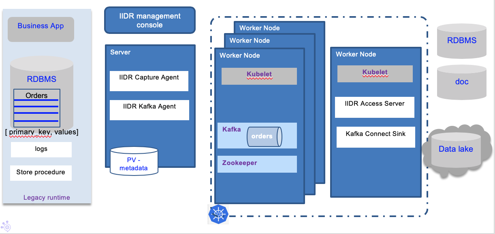
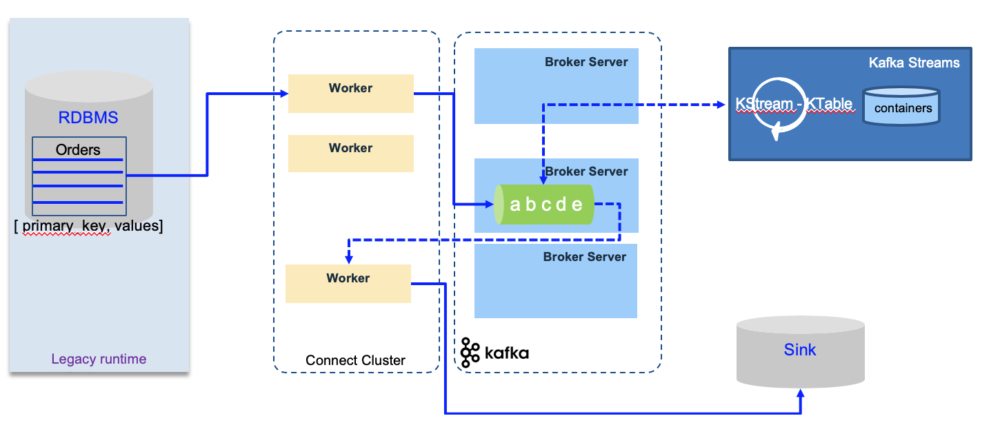

# Data replication

STILL UNDER CONSTRUCTION

!!! abstract
    In this article, we are dealing with database replication from traditional Database, like DB2, to a microservice environment. We are addressing also the coexistence use case where older systems run in parallel to microservices and use eventual data consistency pattern. 

## Concepts

We just to quickly summarize the concepts around data replication. 

* Data Replication is the process of storing data in more than one server on same or different data center.
* Data replication encompasses duplication of transactions on an ongoing basis, so that the replicate is in a consistently updated state and synchronized with the source
* Different data replication techniques:
    * **Transactional Replication**: addresses full initial copies of the database and then receive updates as data changes in the same order as they occur with the publisher: transactional consistency is guaranteed. 
    * **Snapshot Replication**: distributes data exactly as it appears at a specific moment in time does not monitor for updates to the data. Used when data change less often.
    * **Merge Replication**: Data from two or more databases is combined into a single database. It allows both publisher and subscriber to independently make changes to the database. 

### Considerations

The main advantages for data replication are to provide a consistent copy of data across all the database servers, and increase data availability to different client apps. 

Maintaining Data consistency at all different sites involves complex processes, and increase physical resources.

## Business motivations

Among the top three priority of data integration and integriry solution, for 2019, 2020, are ([source IDC](https://www.idc.com/getdoc.jsp?containerId=IDC_P31631)):

* Data intelligence (57%)
* Data replication (50%)
* Application data synch (51%)

Two important use cases:

* Business in Real Time
    * Detect and react to data events as they happen to drive the business, and propagate those changes for others to consume
    * Optimize decision making with  up to the second data, i.e. real time analytics  
* Always On Information
    * High availability with Active-Standby and Active-Active data deployments
    * Data synchronization for zero down time data migrations and upgrades

## Classical data replication architecture

The following diagram presents a generic architecture for data replication, using transaction logs as source for data update, a capture agent to load data and send it over the network to an "Apply / Transform" agent responsible to persist to the target destination. 

The data replication between databases by continuously propagate changes in real time instead of doing it by batch with traditional ETL product, brings data availability and consistency cross systems. It can be used to feed analytics system and data warehouses, for business intelligence activities.

### Data lake technologies

There are multiple alternatives to support data lake component. In our study, two different approaches are used: Hadoop, or kafka. 

* Hadoop is designed to process large relatively static data sets.  It provides a cost effective vehicle for storing massive amounts of data due to its commodity hardware underpinnings that rely on built in fault tolerance based on redundancy. Hadoop is ideal for highly unstructured data and for data that is changing at the file level.  With Hadoop, you don’t change a record in a file.  Rather, you write a new file.  A process reads through the files to discover the data that matters and to filter out unrelated data. It is massively scalable processing. 

* Kafka is designed from the outset to easily cope with constantly changing data and events. It has built in capabilities for data management such as log compaction that enable Kafka to emulate updates and deletes. The data storage may be self described JSON document wrapped in [Apache Avro](https://avro.apache.org/docs/current/) binary format. Kafka exploits the scalability and availability of inexpensive commodity hardware.

Kafka provides a means of maintaining one and only one version of a “record” much like in a keyed database. But an adjustable persistence time window lets you control how much data is retained.

Data Replication solutions provide both bulk and continuous delivery of changing structured operational data to both Hadoop and Kafka.  

There are more and more organizations choosing to replicate their changing operational data to Kafka rather than directly into Hadoop. Kafka’s ability to self manage its storage, emulate the concept of a keyed record and provide self describing structural metadata combined with the benefits of scalability and open source interfaces makes it an ideal streaming and staging area for enterprise analytics.  

If needed data can be staged in Kafka for periodic delivery into Hadoop for a more controlled data lake, preventing the lake from becoming a swamp with millions of files.  

Data stored in Kafka can be consumed by real time microservices and real time analytics engines.

Kafka can also be used as a modern operational data store. It has the built in advantages of low cost scalability and fault tolerance with the benefits of open interfaces and an ever growing list of data producers (feed data into Kafka) and data consumers (pull data from Kafka), all with self managed storage.

Other use cases are related to auditing and historical query on what happened on specific records. Using event sourcing, delivered out of the box with kafka, this will be easier to support. It can be used to propagate data changes to remote caches and invalidate them, to projection view in CQRS microservices, populate full text search in Elasticsearch, Apache Solr...

### Change data capture (CDC)

Another important part of the architecture is the change data capture from the transaction log. 

IBM's [InfoSphere Data Replication (IIDR)](https://www.ibm.com/us-en/marketplace/infosphere-data-replication) captures and replicates data in one run or only replicates changes made to the data, and delivers those changes to other environments and applications that need them in a trusted and guaranteed fashion, ensuring referential integrity and synchronization between sources and targets.

We can combine Kafka and IIDR to support a flexible pub sub architecture for data replication where databases are replicated but event streams about those data can be processed in real time by any applications and microservices.

The combined architecture of a deployed solution looks like in the diagram below:

With the management console, developer can define data replication project, that can includes one to many subscriptions. Subscription defines the source database and tables and target kafka cluster and topics.  

The Kafka cluster is running on kubernetes. 

The first time a subscription is running, a "Refresh" is performed: to allow the source and target to be exactly synchronized before the incremental, changes only get replicated down to the target. This means all the records in the source table will be written as Kafka events. 

When running subscription the first time, kafka topics are added: one to hold the records from the source table, and the second to keep track of which records have already been committed to the target. 

For more detail about this solution see [this product tour](https://www.ibm.com/cloud/garage/dte/producttour/ibm-infosphere-data-replication-product-tour).

### Why adopting kafka for data replication

Using Kafka as a mediation layer brings the following advantages:

* Offload processing
* Data aggregation from multiple sources
* Deliver a common platform for staging to other data consumers
* Provide a storage system for duplicating data
* Buffer unprocessed messages
* Offers throughput and low end-to-end Latency 
* Offers real time processing and retrospective analysis
* Can correlate streaming feeds of disparate formats
* Flexibility of input source and output Targets
* Built in stream processing API on real time feeds with kafka streams
* Commit Log
* Fault tolerance, scalability, multi-tenant nature, speed, light-weight, multiple landing-zones.

## Kafka connect

[Kafka connect](https://kafka.apache.org/documentation/#connect) simplifies the integration between kafka and other systems. It helps to standardize the integration via connectors and configuration files. It is a distributed fault tolerant runtime to be able to easily scale horizontally. The set of connectors help developers to do not reinvent coding consumers and producers.

To get started read [this introduction](https://kafka.apache.org/documentation/#connec) from product documentation. 

The kafka connect workers are stateless and can run easily on kubernetes or as standalone docker process. `Kafka Connect Source` is to get data to kafka, and `Kafka Connect Sink` to get data out of kafka.

A worker is a process. A connector is a re-usable piece of java code packaged as jars, and configuration. Both elements are defined a task. A connector can have multiple tasks. 

With distributed deployment the connector cluster supports easy scaling by adding new worker and performs rebalancing of worker tasks in case of worker failure. The configuration can be sent dynamically to the cluster via REST api.

## Debezium

[Debezium](https://debezium.io/) is an open source distributed platform for change data capture. It retrieves change events from transaction logs from different databases and use kafka as backbone, and kafka connect.
It uses the approach of one table to one topic. 

It can be used to do data synchronization between microservices using CDC at one service level and propagate changes via kafka. The implementation of the CQRS pattern may be simplified with this capability. 

## Requirements

We want to support the following requirements:

* Keep a RDBMS database like DB2 on the mainframe where transactions are supported
* Add cloud native applications in kubernetes environment, with a need to read data coming from the legacy DB, without impacting the DB server with a lot of new queries
* Address writing model, where cloud native apps have to write back to legacy DB
* Replicate data in real time to data lake or cloud based data store.
* Replicated data is for multiple consumers

There are a lot of products which are addressing those requirements, but here we address the integration with Kafka for a pub/sub and event store need.

The following diagram may illustrate what we want to build:

!!! note  
    We are providing a special implementation of the container management service using kafka connect. 

## Recommended Readings

* [IBM InfoSphere Data Replication Product Tour](https://www.ibm.com/cloud/garage/dte/producttour/ibm-infosphere-data-replication-product-tour)
* [Kafka connect hands-on learning from Stéphane Maarek](https://learning.oreilly.com/videos/apache-kafka-series)