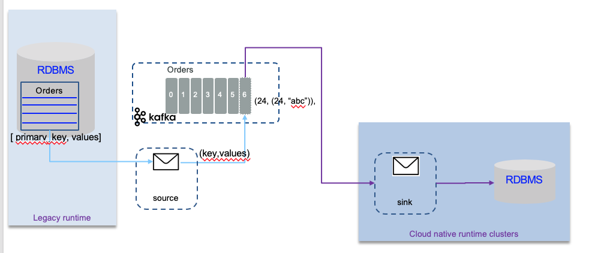
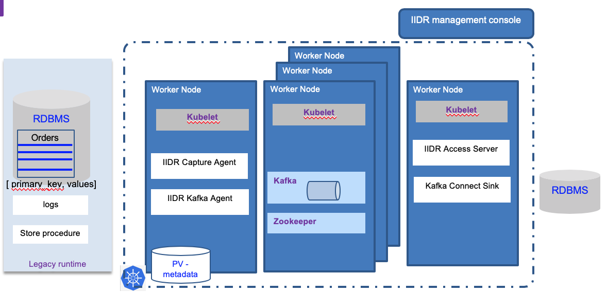

# Data replication

STILL UNDER CONSTRUCTION

In this article, we are dealing with database replication to a microservice environment. This is also known as coexistence use case and can be summarized as supporting the following requirements:

* Keep a RDBMS database like DB2 on the mainframe where transactions are supported
* Add cloud native applications in kubernetes environment, with a need to read data coming from the legacy DB, without impacting the DB server with a lot of new queries
* Address writing model, where cloud native apps have to write back to legacy DB
* Replicate data in real time to data lake or cloud based data store.
* Replicated data is for multiple consumers

There are a lot of products which are addressing those requirements, but here we address the integration with Kafka for a pub/sub and event store need.

The following diagram may illustrate what we want to build:

## Why adopting kafka for data replication

Using Kafka as a mediation layer bring the following advantages:

* Offload Processing
* Aggregation of Data From multiple Sources
* Common Platform for Staging to Other Data Consumers
* Storage System For Duplicating Important Data
* Buffer Unprocessed Messages
* Offers Throughput and Low End-to-End Latency 
* Offers Real Time Processing and Retrospective Analysis
* Can Correlate Streaming Feeds of Disparate formats
* Can Correlate Streaming Feeds of Disparate formats
* Flexibility of Input Source and Output Targets
* Built in Stream Processing on Real Time Feeds
* Flexibility Supporting Business Logic Layering Or Programmatic * Interpretation
* Commit Log
* Statistics
* Red Flag Monitoring
* Fault Tolerance, Scalability, multi-tenant nature, speedy, light-weight, landing-zone

## IBM Data Replication (CDC)

IBM's InfoSphere Data Replication (IIDR) captures and replicates data, and changes made to the data, on relational source systems and delivers those changes to other environments and applications that need them in a trusted and guaranteed fashion, ensuring referential integrity and synchronization between sources and targets.

The basic architecture of a deployed solution looks like in the diagram below:

With the management console, developer can define data replication project, that can includes one to many subscriptions. Subscription defines the source database and tables and target kafka cluster and topics.  

The first time a subscription is running, a Refresh is performed: to allow the source and target to be exactly synchronized before the incremental, changes only get replicated down to the target. This means all the records in the source table will be written as Kafka events. 

When running subscription the first time, kafka topics are added: one to hold the records from the source table, and the second to keep track of which records have already been committed to the target. 

For more detail about this solution see [this product tour](https://www.ibm.com/cloud/garage/dte/producttour/ibm-infosphere-data-replication-product-tour).

## Kafka connect

## Recommended Readings

* [IBM InfoSphere Data Replication Product Tour](https://www.ibm.com/cloud/garage/dte/producttour/ibm-infosphere-data-replication-product-tour)
* 