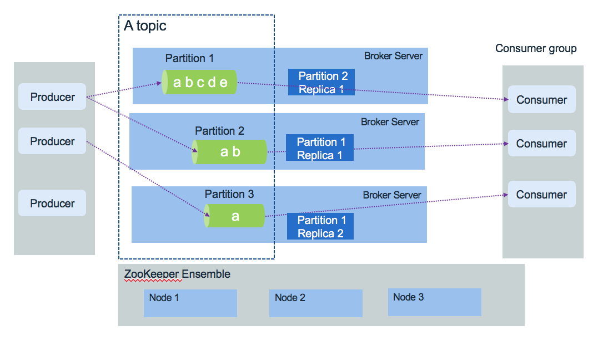

# Apache Kafka

In this article we are summarizing what Apache [**Kafka**](https://Kafka.apache.org/) is and are grouping some references and notes we gathered during our different implementations and  **Kafka** deployment within Kubernetes cluster. We are documenting how to deploy Kafka on IBM Cloud Private or deploying [IBM Event Streams product](https://developer.ibm.com/messaging/event-streams/). This content does not replace [the excellent introduction](https://Kafka.apache.org/intro/) every developer using Kafka should read.

## Introduction

[Kafka](https://Kafka.apache.org/) is a distributed real time event streaming platform with the following key capabilities:

* Publish and subscribe streams of records. Data are stored so consuming applications can pull the information they need, and keep track of what they have seen so far.
* It can handle hundreds of read and write operations per second from many producers and consumers
* Atomic broadcast, send a record once, every subscriber gets it once.
* Store streams of data records on disk and replicate within the distributed cluster for fault-tolerance. Persist data for a given time period before delete.
* Can grow elastically and transparently with no downtime.
* Built on top of the ZooKeeper synchronization service to keep topic, partitions and metadata highly available.

### Use cases

The typical use cases where **Kafka** helps are:

* Centralize online data pipeline to decouple applications and microservices.
* Pub/sub messaging for cloud native application inter microservices.
* Aggregation of event coming from multiple producers.
* Monitor distributed applications to produce centralized feed of operational data.
* Logs collector from multiple services.
* Implement [event soucing pattern](../evt-microservices/ED-patterns.md) out of the box, using configuration to keep message for a long time period. Data are replicated between brokers within the cluster and cross availability zones if needed. 
* Manage loosely coupled communication between microservices. (See [this note](https://ibm-cloud-architecture.github.io/refarch-integration/service-mesh/readme/#asynchronous-loosely-coupled-solution-using-events) where we present a way to support a service mesh solution using asynchronous event)

## Key concepts

The diagram below presents Kafka's key components:  

 

### Brokers

* **Kafka** runs as a cluster of one or more **broker** servers that can, in theory, span multiple data centers. It is really possible if the latency is very low at the 10ms or better as there are a lot of communication between kafka brokers and kafka and zookeepers.  
* The **Kafka** cluster stores streams of records in **topics**. Topic is referenced by producer to send data too, and subscribed by consumers to get data. 

In the figure above, the **Kafka** brokers are allocated on three servers, with data within the topic are replicated three times. In production, it is recommended to use five nodes to authorise planned failure and un-planned failure. 

### Topics 

Topics represent end points to put or get records to.

* Each record consists of a key, a value, and a timestamp.
* Producers publish data records to topic and consumers subscribe to topics. When a record is produced without specifying a partition, a partition will be chosen using a hash of the key. If the record did not provide a timestamp, the producer will stamp the record with its current time (creation time or log append time). Producers hold a pool of buffer to keep records not yet transmitted to the server.
* Kafka store log data in its `log.dir` and topic maps to subdirectories in this log directory.
* **Kafka** uses topics with a pub/sub combined with queue model: it uses the concept of consumer group to divide the processing over a collection of consumer processes, running in parallel, and messages can be broadcasted to multiple groups.
* Consumer performs asynchronous pull to the connected broker via the subscription to a topic.

The figure below illustrates one topic having multiple partitions, replicated within the broker cluster:  
  

### Partitions

Partitions are used by producers and consumers and data replication. Partitions are basically used to parallelize the event processing when a single server would not be able to process all events, using the broker clustering. So to manage increase in the load of messages Kafka uses partitions.

   

* Each broker may have zero or more partitions per topic. When creating topic we specify the number of partition to use. Each partition will run on a separate server. If you have 5 brokers you can define topic with 5 partitions.
* Kafka tolerates up to N-1 server failure without losing any messages. N is the replication factor for a given parition. 
* Each partition is a time ordered immutable sequence of records, that are persisted for a long time period. It is a log. Topic is a labelled log.
* Consumers see messages in the order they are stored in the log.
* Each partition is replicated across a configurable number of servers for fault tolerance. The number of partition will depend on characteristics like the number of consumers, the traffic pattern, etc...
* Each partitioned message has a unique sequence id called **offset** ("abcde, ab, a ..." in the figure above are offsets). Those offset ids are defined when events arrived at the broker level, and are local to the partition. They are unmutable. 
* When a consumer reads a topic, it actually reads data from all the partitions. As a consumer reads data from a partition, it advances its offset. To read an event the consumer needs to use the topic name, the partition number and the last offset to read from. 
* As brokers are stateless, the consumers are responsible to keep track of the offsets.
* Partitions guarantee that data with the same keys will be sent to the same consumer and in order.
* Adding more partition, in the limit of number of brokers, improve throughtput.

### Replication

Each partition can be replicated accross a number of server. The replication factor is capted by the number of brokers. Partitions have one leader and zero or more followers. The leader manages all the read and write requests for the partition. Leader is also responsible to track the in sync replicas. The followers replicate the leader content. 

If a leader fails, followers elect a new one. When a producer sends message, he can control how to get the response from the committed message: wait for all replicas to succeed. Consumers receive only committed messages. 

### Zookeeper

Zookeeper is used to persist the component and platform states and it runs in cluster to ensure high availability. One zookeeper server is the leader and other are used in backup. 

* Kafka does not keep state regarding consumers and producers.
* Depends on kafka version, offsets are maintained in Zookeeper or in **Kafka**: newer versions use an internal Kafka topic called __consumer_offsets. In any case consumers can read next message (or from a specific offset) correctly even during broker server outrages. 
* Access Controls are saved in Zookeeper

### Consumer group

This is the way to group consumers so the processing of event is parallelized. The number of consumers in a group is the same as the number of partition defined in a topic. We are detailinh consumer group implementation in [this note](./consumers.md)

## Architecture

See [this separate note](arch.md)

## Solution considerations

There are a set of design considerations to assess for each **Kafka** solution:

### Topics

Performance is more a function of number of partitions than topics. Expect that each topic has at least one partition. When considering latency you should aim for limiting to hundreds of topic-partition per broker node.

What of the most important question is what topics to use?. What is an event type? Should we use one topic to support multiple event types? 
Let define that an event type is linked to a main business entity like an Order, a ship, a FridgeredContainer. OrderCreated, OrderCancelled, OrderUpdated, OrderClosed are events linked to the states of the Order. The order of those events matter. So the natural approach is to use one topic per data type or schema, specially when using the topic as Event Sourcing where event order is important to build the audit log. You will use a unique partition to support that. The orderID is the partition key and all events related to the order are in the same topic.

The important requirement to consider is the sequencing or event order. When event order is very important then use a unique partition, and use the entity unique identifier as key. Ordering is not preserved across partitions.

When dealing with entity, independent entities may be in separate topics, when strongly related one may stay together.

Other best practices:

* When event order is important use the same topic and use the entity unique identifier as partition key.
* When two entities are related together by containment relationship then they can be in the same topic. 
* Different entities are separated to different topics.
* It is possible to group topics in coarse grained one when we discover that several consumers are listening to the same topics. 
* Clearly define the partition key as it could be an compound key based on multiple entities.

With **Kafka** stream, state store or KTable, you should separate the changelog topic from the others.

### Producers

When developing a record producer you need to assess the following:

* What is the expected throughput to send events? Event size * average throughput combined with the expected latency help to compute buffer size.
* Can the producer batch events together to send them in batch over one send operation?
* Is there a risk for loosing communication? Tune the RETRIES_CONFIG and buffer size
* Assess *once to exactly once* delivery requirement. Look at idempotent producer.

See [implementation considerations discussion](./producers.md)

### Consumers

From the consumer point of view a set of items need to be addressed during design phase:

* Do you need to group consumers for parallel consumption of events?
* What is the processing done once the record is processed out of the topic? And how a record is supposed to be consumed?.
* How to persist consumer committed position? (the last offset that has been stored securely)
* Assess if offsets need to be persisted outside of Kafka?. From version 0.9 offset management is more efficient, and synchronous or asynchronous operations can be done from the consumer code. 
* Does record time sensitive, and it is possible that consumers fall behind, so when a consumer restarts he can bypass missed records?
* Do the consumer needs to perform joins, aggregations between multiple partitions?

See [implementation considerations discussion](./consumers.md)

See [also the compendium note](../compendium.md) for more readings.