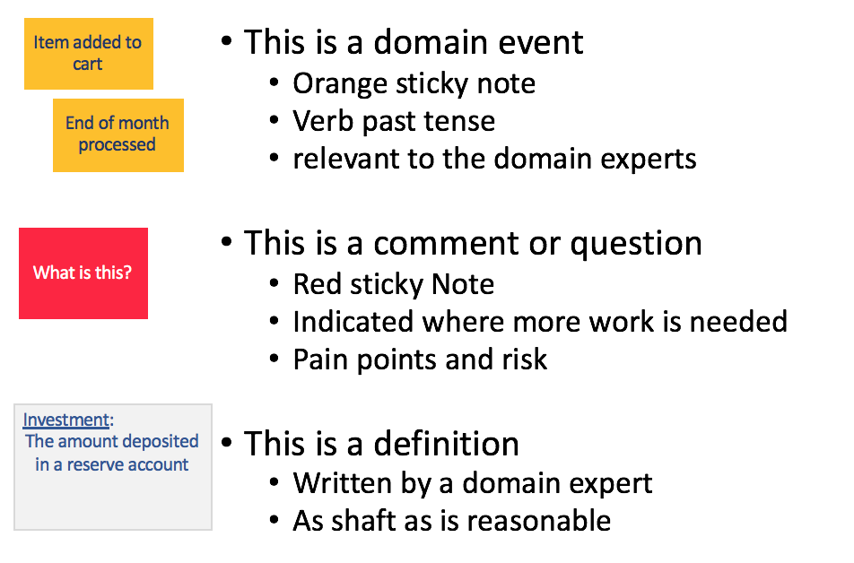
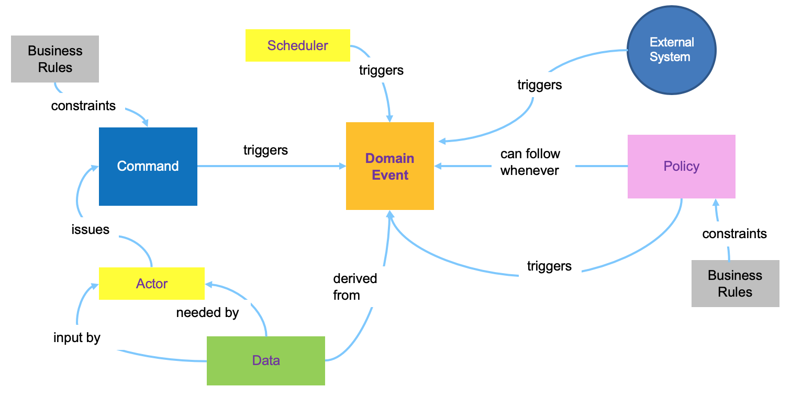
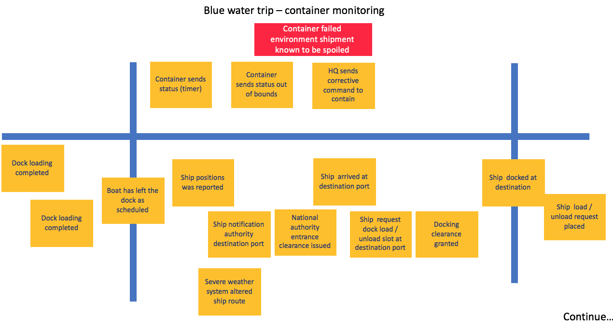

# Event Storming Methodology
EventStorming is a workshop format for quickly exploring complex business domains by focusing on *domain events* generated in the context of a business process or a business application. It focuses on communication between product owner, domain experts and developers.
A **Domain Event** is something meaningful that happened in the domain.

The event storming method was introduced and publicized by Alberto Brandolini in [Introducing Eventstorming](https://www.eventstorming.com/book/) . This approach has been achieved recognition in the Domain Driven Design (DDD) community as a technique facilitating rapid capture of a solution design and improved team understanding of the design. In this chapter we outline the method and also describe refinements and extesions useful in designs for Event Driven Architecture. This includes the addition of an Insight storming step to identify and capture value adding predictive insights about possible future events. The predictive insights are generated using data science analysis, data models, artificial intelligence(AI) or machine learning (ML). 

In this section we describe in general terms all the steps to run an event storming workshop. The output of an actual workshop performing Event storming and Insight Storming on a sample problem - a world wide container shipment, is further detailed in [Container shipment analysis example](https://github.com/ibm-cloud-architecture/refarch-kc/tree/master/analysis/readme.md).

## Conducting the Event and Insight Storming Workshop
An Event Storming Workshop is held after completing a Design Thinking Workshop in which [Personas](https://www.ibm.com/cloud/garage/content/think/practice_personas/) and [Empathy Maps](https://www.ibm.com/cloud/garage/content/think/practice_empathy_maps/) were developed and business pains and goals were defined. The Event storming workshop adds more specific design on the events occuring at each step of the process, natural contexts for microservices and predictive insights to guide operation of the system. This approach is effective in enabling a team including business owners and stakeholders to define a Minimal Viable Prototype ( MVP) design for the solution.  The resulting design will be organized as a collecion of loosely coupled microservices linked through an Event Driven Architecture (EDA) and and one or more  Event Buses. This style of design can be deployed into multicloud execution environments and allows for scaling and agile deployment.     

Preparations for the event storming workship  include: 
* Get a room big enough to hold at least 6 to 8 persons and with enough wall space on which to stick big paper sheets: you will need a lot of wall space to define the models.
* Obtain green, orange, blue, and red square sticky notes, black sharpies and blue painters tape
* Provide guidanance to the participants discouraging the use of open laptops during the meeting 
* Limit the number of chairs - it is important that the team stays focused and connected and conversation flows well.

### Concepts
Many of the concepts addressed during the event storming workshop are defined in the [Domain Driven Design](https://www.ibm.com/cloud/garage/content/code/domain-driven-design/) approach.
The following diagrams present the elements used during the analysis.  We begin with the initial set of concepts used in the process.

 

Domain events are also named 'business events'.  The first step in the event storming process involves:
* identifying all relevant events in the domain and specific process being analyzed,
* writing a very short description of each event on a "sticky" note 
* and placing all of the event "sticky" notes in sequence on a timeline.  

An event is some action or happening which occurred in the system at a specific time in the past.  

Just writing down event descriptions often results in questions to be resolved at a later time, or discussions about definitions that need to be recorded in order to make sure everyone agrees on basic domain concepts.

A timeline of domain events is the critical output of the first step in the event storming process.  It gives everyone a common understanding of when events take place in relation to each other.  You still need to be able to take this initial level of understanding and then take the next step of moving this toward an implementation.  In making that step, you will need to expand your thinking to encompass the idea of a command, which is the action that kicks off the processing to trigger an event.  As part of understanding the role of the command, you will also want to know who invokes a command (Actors) and what information is needed to allow the command to be executed.  This diagram show how those analysis elements are linked together:

* **Actors** consume data via a user interface and use the UI to interact with the system via commands
* **Commands** are the result of some user decision or policy, and act on relevant data which are part of a Read model in the [CQRS](../readme.md#command-query-responsibility-segregation) pattern.
* **Policies** (represented by Lilac stickies) are reactive logic that take place after an event occurs, and trigger other commands. They always start with the phrase "whenever...". Policies can be a manual step a human would follow (such as a documented procedure or guidance), or they may be automated. When applying the [Agile Business Rule Development methodology](http://abrd.github.io) it will be mapped to a Decision within the [Decision Model Notation](https://www.omg.org/spec/DMN/About-DMN/).
* **External systems** produce events.
* **Data** can be presented to users in a user interface or modified by the system.

Events can be created by commands, by external systems (including IOT devices), they can be triggerred by processing of other events or by some period of elapsed time. When an event is repeated or occurs regularly on a schedule, it is often useful to note that by drawing a clock or calendar icon in the corner of the sticky note.

As the events are identified and sequenced into a time line, you will often find that there are multiple independent subsequences which are not directly coupled to each other and represent different perspectives of the system, but occur in overlapped periods of time.  These parallel event streams can be addressed by putting them into separate **swimlanes**  - delineated using horizontal blue painter's tape.  As the events are organized into a timeline ( possibly with swim lanes) it will be possible to identify **pivotal events** .  Pivotal events indicate major changes in the domain and often form the boundary between one phase of the system and onother.  Pivotal events will typically separate (a [bounded context](https://martinfowler.com/bliki/BoundedContext.html) in DDD terms).  Pivotal events are identified with vertical blue painters tape (crossing all the swimlanes).

An example of a section of a completed event time line with pivotal events and swimlanes is shown below.

### Workshop Execution
The goal of the workshop is to better understand the business problem to address with a future application. But the approach can apply to find solutions to bottlenecks or other issues in existing applications as well. The workshop will help the team understand the big picture of the solution by building a timeline of domain events as they occur during the business process life span.

It is important to avoid documenting processing steps; the Event Storming method is not tying to specify a particular implementation. Instead, the focus in initial stages of the workshop is on identifying and sequencing the events which occur in the solution.  The event timeline is a useful represention of steps in the overall communicating what must happen whil remaining open to many possible implementation approaches. 

*  **Step 1: Domain events discovery:**
Begin by writing each domain event into an orange sticky note with a few words and a verb in a past tense. Describe **What's happened**. At first just "storm" the events by having each domain expert generate their individual lists of domain events; you may not need to iniitally place them on the ordered timeline as they write them.  The events must be worded in a way that is meaningful to the domain experts and business stakeholder. You are explaining what happens in business terms, not what happens inside the implementation of the system.

You don't need to describe all the events in your domain, but it is important to cover the process you are interested in exploring from end to end.  Thus, you need to make sure to identify the start and end events and place them on the timeline at the beginning and end of the wall covered with paper.  The other events identified need to be placed between these two endpoints in the closest approximation that the team can agree to a sequential order.  There will be overlaps at this point - don't worry about that; we'll address this later.

* **Step 2: Tell the story:**
In this step, you retell the story by talking about how to relate events to particular personas.  A member of the team (often the facilitator, but others can do this as well) will act this out by taking on the perspective on a persona in the domain (such as a "manufacturer" who wants to ship a widget to a customer) and asking which events follow which other events.  Start at the beginning of that persona's interaction and ask "what happens next?"  Pick up and rearrange the events the team has stormed as this happens as you discover events that are duplicates (take those off the board) or that are in the wrong order (move them into the right order).
 
The key here is to add questions or comments (using the red stickies) when some parts are unclear. This is an indication that the team needs to follow up and make clarifications at a later point. Likewise you want to use this time to document assumptions on the definition stickies.  This is also a good time to rephrase events as you proceed through the story.  Sometimes you will need to rephrase an event description putting the verbing in past tense, or adjusting the terms used to relate clearly to other identified events. 
 
In this step you want to focus on the mainline "happy" end-to-end path in order to avoid getting bogged down in details of exceptions and error handling.  That can be added later.

 * **Step 3: Find the Boundaries:**
 The next step of this part of the process is to find the boundaries of your system by looking at the events. There are two types of boundaries we have seen emerge; first are time boundaries.  Often there are specific key "pivotal events" that indicate a change from one aspect of a system to another.  Often this happens at some sort of hand-off from one persona to another, but it can also happen at a change of geographical, legal or other type of boundary. What you will often see is that the terms used on the event stickies changes at these boundaries.  This is an indication that you are seeing a "bounded context" in Domain Driven Design terms.  Highlight pivotal events by putting up blue painters tape vertically behind the event.
 
 The second type of boundary you may find is a subject boundary.  In this case, you often have multiple simultaneous series of events that only come together at a later time.  In this case your indication is also that you see the same terms being used in the event descriptions for a particular series of events, or those events can be "read" from the point of view of a different persona when you are replaying them.  You can delineate these different sets of simultaneous event streams by blue painters tape applied horizontally, dividing the board into different swim lanes.

Below we show an example of a set of ordered domain events with pivotal events and subject swim lanes indicated.  This example comes an example of applying Event Storming to the domain of Container Shipping and is discussed in more detail in the [Container Shipment Analysis example](https://github.com/ibm-cloud-architecture/refarch-kc/blob/master/analysis/readme.md) .

 

* **Step 4: Locate the Commands:** The next step of the process is where we begin to shift from analysis of the domain to the first stages of system design.  Up until this point, you are simply trying to understand how the events in the domain relate to one another - this is why the participation of domain experts is so critical.  However, in order to build a system that implements the business process you are interested in, we have to move on to the question of how these events come into being.  

Commands are the most common mechanism by which events are created.  The key to finding commands is to ask the question "Why did this event occur?"  In this step, the focus of the process moves to sequence of actions that lead to events - it's finding the causes for which the events record the effects.  In order to understand this, let's go back to some of our previous definitions.  In our terms, A *Command* is an action some persona in the domain performed to create an event.

* **Step 5: Describe the Data:** You can't truly define a command without understanding the data that is needed for the command to execute in order to produce the event.  There are several types of data that we can identify at this step.  First, users (personas) need data from the user interface in order to make decisions before executing a command.  That data forms part of the read model in a CQRS implementation. For each command and event pair we will want to add a data description of the expected attributes and data elements needed to take such a decision. Here is a simple example for a `shipment order placed` event created from a `place a shipment order action`.

  
  
Another important part of the process that becomes more fully fleshed out at this step is the description of *policies* that can trigger the generation of an event from a previous event (or set of events).  

This first level of data definition will help for assessing the microservice scope and responsibility too as we start to see commonalities emerge from the data used among several related events.  That becomes more obvious in the next step.
  
* **Step 6: Identify the Aggregates**: At this point in the method it's time to introduce another concept from Domain Driven Design (DDD) -  the [Aggregate](https://martinfowler.com/bliki/DDD_Aggregate.html).  In DDD, entities and value objects can exist independently, but often, the relations are such that an entity or a value object has no value without its context.  Aggregates provide that context by being those "roots" that comprise one or more entities and value objects that are linked together through a lifecycle.  In Event Storming, they emerge through the process by grouping events and commands that are related.  What you usually find in this grouping will not only consist of related data (entities and value objects) but related actions (commands) that are connected by the lifecycle of that aggregate. Aggregates will end up suggesting micro service boundaries. 

In our example, we see that you can group several command/event pairs (with their associated data) together that are related through the lifecycle of an order for shipping.

* **Step 7: Business Context:** it defines terms and concepts with a clear meaning valid in a clear boundary. (The term definition may change outside of the business unit for which this application is developed). The goal here is to defined the boundaries and the term definitions.

* **Step 8: Looking forward with Insight Storming:**  In Event Storming for Event Driven Architecture (EDA) solutions it is helpful to include an additional method step at this point identifying useful predictive analytics insights.

With Insights Storming we extend the approach to also look forward by considering what if we could know in advance that this event was going to occur. How would this change our actions, what would we do now in advance of that event actually happening ?.

We can think of this as extending the analysis to **Derived Events**, which rather than being the factual recording of a past event som is a forward looking or predictive event = "this event is probably going to happen at some time in the next n hours time. 

Having this forward looking insight combined with the known business data from earlier events can enable both human actors and event triggering policies to make better decisions about how to react to new events as they occur.
Insight storming amounts to asking workshop participants the question: "What data would be helpful at each event trigger to assist the human user or automated event triggering policy make the best possible decision of how and when to act?"

An important motivation driving use of EDA is that it simplifies design and realization of highly responsive systems which react immediately, intelligently, i.e. in a personalized and context aware way, and optimally to new events as they occur. This immediately suggests that predictive analytics and models to generate predictive insights have an important role to play. Predictive analytic insights are effectively probabilistic statements about which future events are likely to occur and what are the likely properties of those events. They are typicaly generated using models created by Data scientists or using Artifical Intalligence or Machine Learning. Correlating or joining independently gathered sources of information may also generate important predictive insights or be input to predictive analytic models.   

Business owners and stakeholders in the Event storming workshop will have good intuitions on:
*  which probabilistic insights are likely to lead to improved or optimal decision making and action? 
   * action could take the form of an immediate response to an event when it occur
   * or it could be proactive behavior to head off an undesirable event 
*  what combined sources of information are likely to help create a model to predict this insight?

  With basic Event Storming we look backwards at each event because an event is something which is known to have already happened. When we identify data needed for an actor or policy to decide when and how to issue a command, there is a tendency to restrict consideration to    properties of earlier known and captured business events.
  
  In an Insight Storming we extend the approach to explicitly look forward and consider *what is the probability that a particular event will occur at some future time and what would be its expected property values?*  How would this change the best action to take when and if this event occurs?  Is there action we can take now proactively, in advance of an expected undesirable event to prevent it happening or mitigate the consequences?
  
 Insights can be published into a bus and subscribed to by any decision step guidance.  A *Derived Event*, is a forward looking and proabilistic view of what is likely to happen rather than being the factual recording of a past event. 
 
 The insight method step amounts to getting workshop participants to identify value adding derived events and the data sources needed for the models generating them.  Adding an Insight Storming step using the questions above into the workship will improve decision making and proactive behavior in the resulting design.  

  Identification of derived events enables integration of analytic models and machine learning into the designed solution. Event and derived event feeds can be processed, filtered, joined, aggregated , modeled and  scored to create valuable predictive insights. 

 New notations specific to the insight step are: 
 * use of a pale blue shape for derived events 
 * use of a parallelogram shape to show when events and derived events are combined to enable deeper insight models and predictions.
  It is important to identify predictive insights early as possible in the development life cycle; adding this step to the event storming workshop is the best opportunity.

The two diagrams below show the results of the insight storming step for the use case of container shipment analysis.  The first diagram captures insights and associated linkages for each refrigerated container, identifying when automated changes to the thermostat settings can be made, when unit maintenance should be scheduled and when the container contents must be considered spoiled.  

  
  
  The second diagram captures insights which could trigger recommendations to adjust ship course or speed in response to expected severe weather forcast for the route ahead or predicted congestion and expected docking and unloading delays at the next port of call. 
  
  

## Event Storming to User Stories / Epics
When developing using agile methodology, one of the important element of the project management is the user stories or epics construction. The commands and policies can be describe easily as user stories, as commands and decisions are done by actors. The actor could be a system too.
For the data we have to support the CUD operations as user stories, mostly supported by a system actor.

  

Events are the result / outcome of a user stories. And can be added as part of the acceptance criteria of the user stories to verify the event really occurs.

## Applying to the container shipment use case
To support one of the implementation solution to validate the Event Driven Architecture, we have developed the event storming and design thinking main artifacts for a [container shipment analysis example](https://github.com/ibm-cloud-architecture/refarch-kc/tree/master/analysis/readme.md) - including monitoring of refrigerated containers .

### Further Readings
* [Introduction to event storming from Alberto Brandolini ](http://ziobrando.blogspot.com/2013/11/introducing-event-storming.html#.VbhQTn-9KK1)
* [Event Storming Guide](https://www.boldare.com/blog/event-storming-guide/)
* [Wikipedia Domain Driven Design](https://en.wikipedia.org/wiki/Domain-driven_design)
* [Eric Evans: "Domain Driven Design - Tacking complexity in the heart of software"](https://www.amazon.com/Domain-Driven-Design-Tackling-Complexity-Software)
* [Patterns related to Domain Driven Design](https://martinfowler.com/tags/domain%20driven%20design.html) by Martin Fowler
