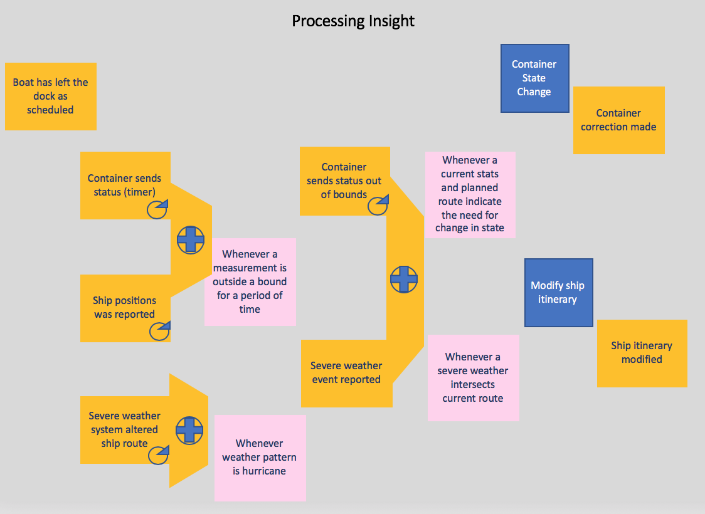

# Event Storming Methodology
EventStorming is a workshop format for quickly exploring complex business domains by focusing on *domain events* generated in the context of a business process or a business application. It focuses on communication between product owner, domain experts and developers.
A **Domain Event** is something meaningful happened in the domain.

## Conducting the Workshop
May be done after a design thinking workshop where persona map and empathy maps are developed and business pains and goals are defined. The Event storming will add deeper context on the process and the events. It will be fit well in deploying application in an Event Driven Architecture.

### Preparation
* Get a room for at least 6 to 8 persons and walls to stick big paper sheets: you need a lot of space on walls to define the models.
* Have green, orange, blue, red squared sticky notes, masking tapes
* Try to limit the chair, it is important the team stays focused, connected and conversation flows well.

### Concepts
A lot of the concepts addressed during the event storming workshop are defined in the Domain Driven Design approach.
The following diagrams present the elements used during the analysis:

 

Domain events are also named 'business events'.

And how those analysis elements are linked together:

* **Actors** consume data via user interface and use UI to act on the system via commands
* **Commands** are the result of some user decision, acting on relevant data which are part of a Read model in the [CQRS](../readme.md#command-query-responsibility-segregation) pattern.
* **Policy** represents reactive logic that takes place after an event occurs, and triggers commands somewhere else. There are written on Lilac sticker and start with "whenever...". Policies can be manual step the human will follow like a procedure or guidances, or can be automated. When applying the [Agile Business Rule Development methodology](http://abrd.github.io) it will be mapped to a Decision within the [Decision Model Notation]().
* **External systems** are producing events.
* **Data** can be presented to user interface or modified by system.
Events can be created by command, external systems and data creation, by timer, ...

Finally when arranging the events in timeline it will be possible to identify pivotal events and swim lanes.

### Workshop Execution
The Goal is to better understand the business problem to address with the future application. But it can apply to search solution to bottleneck in existing application. It starts by the big picture by building a timeline of domain events as they occur during the business process life span.

Avoid to document process step, focus on events. The timeline will represent the high level sequential process.

1. **Step 1: Domain events discovery:**
Name the domain events in orange sticky note using verb in past tense. Describe **What's happened**. At first just "storm" the event, you may not need to place them on the ordered timeline.
The events are relevant to the domain experts.
It may not be needed to discover all the events, but important to cover the process end to end.
Identify the start and stop events.

1. **Step 2: Tell the story:**
 * Retail the story by talking about relating event to persona
 * Add questions when some parts are unclear
 * Document assumptions
 * Rephrase event with past tense if needed
 * Focus on happy path, the things going on, on regular time
 * Add pivotal events
 * Add swim lanes

Here is an example of ordered domain events with pivotal event and swim lanes:
 

1. **Step 3: Commands:** address the why did event happen. The focus is moving to the cause and effect sequence. Command is what people do in the domain to create event.

1. **Step 4: Aggregates**: Aggregates represent business concept with local responsability and grouping events and commands. Most likely aggregates become microservice boundaries.

1. **Step 5: Business Context:** it defines terms and concepts with a clear meaning valid in a clear boundary. (The term definition may change outside of the business unit for which this application is developed). The goal here is to defined the boundaries and the term definitions.

1. **Step 6: Data:**
Data for the user interface so user can make decision are part of the read model. For each command and event we may add data description of the expected attributes and data elements needed to take such decision. Here is a simple example for a `shipment order placed` event created from a `place a shipment order action`.

  

  This first level of data definition will help for assessing the microservice scope and responsibility too.

1. **Step 7: Insight:**
We have the need to add one element to the method to address an important dimension of modern applications integrating analytics and machine learning capabilities:

  

  Events are generated as stream on a regular basis with time stamps. They are filtered, joined, aggregated and scored to assess predictions, classification, scoring,... and to generate `derived events` which may be also joined,....
  The parallelogram construct is used to represent this joining operations. This processing is very important to analyze as early as possible in the development life cycle, and the event storming workshop is the best opportunity.

## Event Storming to User Stories / Epics
When developing using agile methodology, one of the important element of the project management is the user stories or epics construction. The commands and policies can be describe easily as user stories, as commands and decisions are done by actors. The actor could be a system too.
For the data we have to support the CUD operations as user stories, mostly supported by a system actor.

  

Events are the result / outcome of a user stories. And can be added as part of the acceptance criteria of the user stories to verify the event really occurs.

## Applying to the container shipment use case
To support one of the implementation solution to validate the Event Driven Architecture, we have developed the event storming and design thinking main artifacts for a [fridge container shipment process.](https://github.com/ibm-cloud-architecture/refarch-kc/tree/master/analysis/readme.md)

## Extending Event storming for insight
With Event Storming we look backwards at each event becasue an event is something which is known to have already happened at some point of time in the past. With this perspective when we think about data which can help an actor decide when and how to issue a command, there is an implicit suggestion that this is based on properties of earlier known and captured business events.

With insights storming we look to extend the approach to also look forward by considering *what if we could predict  what was likely to happen as as result of that an event occuring*.

[Read more ...](InsightStorming/README.md)

### Further Readings
* [Introduction to event storming from Alberto Brandolini ](http://ziobrando.blogspot.com/2013/11/introducing-event-storming.html#.VbhQTn-9KK1)
* [Event Storming Guide](https://www.boldare.com/blog/event-storming-guide/)
* [Wikipedia Domain Driven Design](https://en.wikipedia.org/wiki/Domain-driven_design)
* [Eric Evans: "Domain Driven Design - Tacking complexity in the heart of software"](https://www.amazon.com/Domain-Driven-Design-Tackling-Complexity-Software)
* [Patterns related to Domain Driven Design](https://martinfowler.com/tags/domain%20driven%20design.html) by Martin Fowler
