---
title: API Management - AsyncAPI
description: API management in the context of reactive solution
--- 

This page summarizes some of the best practices for introducing API Management in development practices and architecture patterns within an enterprise setting.

## Moving from a Pure API Gateway to an API Management system

An API Gateway helps provide security, control, integration, and optimized access to a full range of mobile, web, application programming interface (API), service-oriented architecture (SOA), B2B and cloud workloads. A gateway is used in the following patterns:

* As a **Security Gateway**, placed between the consumer facing firewall and the system of records facing firewall (DMZ). It is used for both policy enforcement and consistent security policies across business channels.
* As an **API Gateway**, both as an internal and external gateway, with centralized service governance and policy enforcement, and with traffic monitoring.
* To provide **connectivity (HTTP) and mediation (XML, JSON) services** in the internal network, close to the system of record. 

API Management gives enterprises greater flexibility when reusing the functionality of API integrations and helps save time and money without trading off security. An API Management system supports a broader scope of features for API lifecycle management, including: 

* API lifecycle management to activate, retire, or stage an API product.
* API governance with security, access, and versioning.
* Analytics, dashboards, and third party data offload for usage analysis.
* API socialization based on a portal for the developer community that allows self-service and discovery.
* An API developer toolkit to facilitate the creation and testing of APIs.

### Classical Pain Points

Some of the familiar pain points that indicate the need for a broader API Management product include:

* Current API details like endpoints, request/response message format, error conditions, test messages, and SLAs are not easily available or not well documented.
* Difficult to tell which subscribers are really using the API and how often, without building a custom solution.
* Difficult to differentiate between business-critical subscribers versus low value subscribers.
* Managing different lines of business and organizations is complex.
* No dynamic scaling built into the solution, which often means making hardware investments for maximum load or worst availability scenarios.
* Difficult to evolve the APIs, such as moving from SOAP based web services to RESTful services to GraphQL
* No support for AsyncAPI to automate and formalize the documentation or code generation of any event-driven APIs.
* The need to ensure consistent security rules
* Integrating CI/CD pipelines with the API lifecycle

## Enterprise APIs across boundaries

If you consider a typical API Management product, it includes a set of components as presented in the figure below that could be deployed on an on-premise Kubernetes-based platform or in several Cloud provider regions. APIs served by different applications or microservices can be deployed in multiple regions but still be managed by one central API Management server.


Here is how it works:

1. An API developer signs on to the API Management cloud services account and accesses the API developer User interface or CLI toolkit. The developer creates the sync API and implements business logic. He maps and integrates the API data model to the back-end schema through the transformation and connectivity service. He tests and deploys the API to the runtime and publishes to the API Management system. He can also create Async APIs from a messaging system by binding channels to topics or queues and define the message payload.
1. The API Product Manager or API owner signs on to the API Management cloud services account and accesses the API Management component. She includes the sync API endpoint to existing API products, and plans and specifies access controls. She publishes the API to the developer portal for external discovery by application developers.
1. An application developer accesses the developer portal and uses search to discover any available APIs.
1. The application developer uses the API in an application and deploys that application to the device
1. The device user opens the application that issues the API request. The request is handled by the API gateway, which performs load balancing and security validation for all API requests. The API gateway also validates access policies with API Management and invokes the API. The API polyglot runtime executes the API and obtains the data payload from the backend. The API response is sent back to the API gateway. Alternatively, APIs exposed by enterprise applications can be executed on that enterprise application runtime. The API gateway forwards the response to the calling application. The API gateway reports usage metrics and analytics to the API Management system.
1. API developers and API owners can log on to the API analytics visualization component to view dashboards on API usage metrics and other analytics.


Deployment across cloud providers could look like the diagram below, using API Connect in Cloud Pak for Integration:

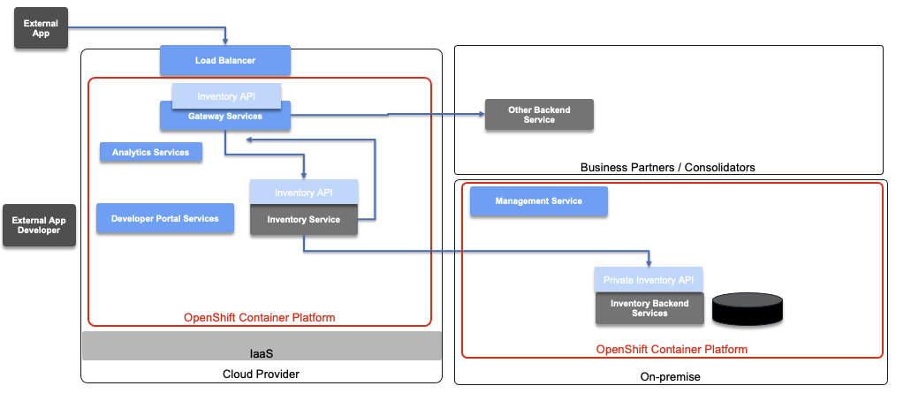

On the left side (green boxes), the consumers of the API register to a Developer portal to get the metadata about the API they want to consume. 
The Developer portal also allows them to test the APIs to better understand how they work. The consumers register their applications as API subscribers. These applications can run on the cloud or on-premise. 

The API Gateway services colocated with the target application services to reduce latency. These would be deployed as <em>StatefulSet</em> on an OpenShift cluster, which means as a set of pods with consistent <em>identities</em>. Identities are defined as:

* <b>Network</b>: A single stable DNS and hostname.
* <b>Storage</b>: As many VolumeClaims as requested.

The StatefulSet guarantees that a given network identity will always map to the same storage identity. 

An API Gateway acts as a reverse proxy, and, in this case, exposes the `Inventory APIs`, enforcing user authentication and security policies, 
and handling traffic monitoring, rate limiting, and statistics. The API Gateway can also perform 
transformations and aggregate various services to fulfill a request. 

The Developer Portals can be separated, or centralized depending on API characteristics exposed from different 
clouds (e.g. different Developer Portals for internal and external APIs). In the example above, the portal
 is deployed onto the Cloud Provider as a container inside an OpenShift cluster. The Analytic service is 
 also a StatefulSet and gets metrics from the gateway.

The application microservices are accessing remote services and this traffic can also go to the API gateway. 
Those services will also integrate with existing backend services running on-premise, whether they are deployed 
or not on OpenShift. 

In the diagram above, the management service for the API Management product is depicted as running on-premise
 to illustrate that it is a central deployment to manage multiple gateways.

Gateway services, Developer Portal services, and Analytics services are scoped to a single region, unlike the 
Management System, which can communicate across availability zones.

The different API Management services run on OpenShift which can help ensure high availability of each of 
the components. 

## Open API

Within the API Management system, the OpenAPI document can be created top-down using a Swagger-based UI or bottom up using Annotation in the Java JAXRS resource classes. 
Either way, the API can be uploaded to the API Management product.

The important parts are to define the operations exposed and the request / response structure of the data model. 

## Support for Async API

Cloud Pak for Integration (CP4I) 2021.1, which includes APIConnect V10, also provides some support for the AsyncAPI specification. 

AsyncAPI is an open source initiative that focuses on making Event-Driven Architectures (EDAs) as easy to work with as REST APIs.

The AsyncAPI specification (currently at 2.0.0) establishes standards for events and EDAs, covering everything "from documentation to code generation,
 and from discovery to event management" [asyncapi.com/docs](https://asyncapi.com/docs). 

The goal is to enable the creation of better tooling in the message-driven space, better governance of asynchronous APIs, 
and standardization in documentation for asynchronous APIs. In short, Async API is to Message-driven architectures 
what OpenAPI is to REST APIs. 

While OpenAPI is the recommended practice for RESTful APIs, adopting AsyncAPI is the recommended practice 
for event-driven APIs.

### AsyncAPI Documents

An AsyncAPI document is a file in either YAML or JSON format that defines and annotates the different components of an event-driven API. 
For example, AsyncAPI can formally describe how to connect to a Kafka cluster, the details of the Kafka topics (channels in AsyncAPI), 
and the type of data in messages. AsyncAPI includes both formal schema definitions and space for free-text descriptions [See this blog](https://dalelane.co.uk/blog/?p=4219).

Here is what it looks like: 


You may have noticed the similarities with OpenAPI. AsyncAPI was initially an adaptation of OpenAPI, which does not include support for the Message Queuing Telemetry Transport (MQTT) and the Advanced Message Queuing Protocol (AMQP). 

The creator of the AsyncAPI specification, Fran Méndez, describes what he did at first with just OpenAPI to make up for the lack of MQTT and AMQP support: "paths were AMQP topics, GET was SUBSCRIBE, and POST was PUBLISH--and ugly hack at best...".
This forced him to write additonal code to support the necessary EDA-based documentation and code generation.

Many companies use OpenAPI, but in real-world situations, systems need formalized documentation and code generation support for both REST APIs and events. 

Here are the structural differences (and similarities) between OpenAPI and AsyncAPI:

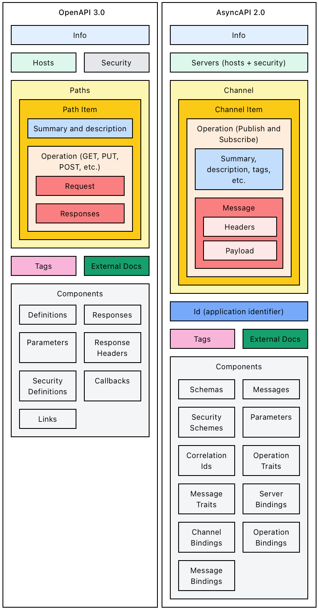

Source: [https://www.asyncapi.com/docs/getting-started/coming-from-openapi](https://www.asyncapi.com/docs/getting-started/coming-from-openapi)

**Note a few things:**

* AsyncAPI is compatible with OpenAPI schemas, which is quite useful since the information flowing in the events is very similar to the one the REST APIs have to handle in requests and responses.
* The message payload in AsyncAPI does not have to be an AsyncAPI/OpenAPI schema; it can be any value such as an Apache Avro schema, which is considered to be one of the better choices for stream data, where data is modeled as streams (see the section titled [Why Use Avro for Kafka](#why-use-avro-for-kafka) below). 
* The AsyncAPI server object is almost identical to its OpenAPI counterpart with the exception that <em>scheme</em> has been renamed to <em>protocol</em> and AsyncAPI introduces a new property called <em>protocolVersion</em>.
* AsyncAPI channel parameters are the equivalent of OpenAPI path parameters, except that AsyncAPI does not have the notion of <em>query</em> and <em>cookie</em>, and header parameters can be defined in the message object. 

### Describing Kafka with AsyncAPI

It is also important to understand how to use AsyncAPI from the perspective of a Kafka user. The following section summarizes what is described in more detail in [this article](https://dalelane.co.uk/blog/?p=4219) written by Dale Lane.

First, there are some minor differences in terminology between Kafka and AsyncAPI that you should note: 

#### Comparing Kafka and AsyncAPI Terminology


### The AsyncAPI Document

Considering the structure in the diagram above, let's look at some of the parts of an AsyncAPI document:

#### Info

The Info section has three parts which represent the minimum required information about the application: <em>title</em>, <em>version</em>, and <em>description</em> (optional), used as follows:

```yaml
asyncapi: 2.0.0
...
info:
  title: Account Service
  version: 1.0.0
  description: This service is in charge of processing user signups
```

In the description field you can use markdown language for rich-text formatting.

#### Id

The Id is the application identifier. It can be a URN (recommended) or URL. The important thing is that it must be a unique ID for your document. Here is an example:

```yaml
asyncapi: '2.0.0'
...
id: 'urn:uk:co:usera:apimgmtdemo:inventoryevents'
...
```

#### Servers

The servers section allows you to add and define which servers client applications can connect to,
 for sending and receiving messages (for example, this could be a list of server objects, each uniquely identifying a Kafka broker).

Here is an example, where you have three Kafka brokers in the same cluster:

```yaml
servers:
  broker1:
    url: andy-broker-0:9092
    protocol: kafka
    protocolVersion: '1.0.0'
    description: This is the first broker
  broker2:
    url: andy-broker-1:9092
    protocol: kafka
    protocolVersion: '1.0.0'
    description: This is the second broker
  broker3:
    url: andy-broker-2:9092
    protocol: kafka
    protocolVersion: '1.0.0'
    description: This is the third broker
```

The example above uses the `kafka` protocol for the different brokers, which is a popular protocol for streaming solutions, but the protocol can be any. 
For example, the most common protocols include: `mqtt` which is widely adopted by the Internet of Things and mobile apps, `amqp`, which is popular 
for its reliable queueing, `ws` for WebSockets, frequently used in browsers, and `http`, which is used in HTTP streaming APIs.

#### Difference Between the AMQP and MQTT Protocols

* <b>AMQP</b> was mainly popularized by RabbitMQ. It provides reliable queuing, topic-based publish-and-subscribe messaging, flexible routing, transactions, and security. 
The main reasons to use AMQP are reliability and interoperability. AMQP exchanges route messages directly in fanout form, by topic, and also based on headers.

* <b>MQTT</b> The design principles and aims of MQTT are much more simple and focused than those of AMQP. it provides publish-and-subscribe messaging (no queues, in spite of the name) and was specifically designed for resource-constrained devices and low bandwidth, 
high latency networks such as dial up lines and satellite links. Basically, it can be used effectively in embedded systems.

When using a <em>broker-centric</em> architecture such as Kafka or MQ, you normally specify the URL of the broker. 
For more classic client-server models, such as REST APIs, your server should be the URL of the server.

One limitation in AsyncAPI documents is that you cannot include multiple Kafka clusters (such as a production cluster and clusters for dev, test, and staging environments) 
in a single document.

One workaround is to list all brokers for all clusters in the same document, and then rely on the description or extension 
fields to explain which ones are in which cluster. This is, however, not recommended because it could 
interfere with code  generators or other parts of the AsyncAPI ecosystem which may consider them as all being
 members of one large cluster.

So, as a best practice, avoid this workaround and stick to one cluster per AsyncAPI document.

<b>NOTE</b>: As with OpenAPI, you can add additional attributes to the spec using the x- prefix, which identifies an entry 
as your own extension to the AsyncAPI specs.

#### Security

If the Kafka cluster doesn’t have auth enabled, the protocol used should be `kafka`. Otherwise, 
if client applications are required to provide credentials, the protocol should be `kafka-secure`. 

To identify the type of credentials, add a security section to the server object. The value you put there
 is the name of a securityScheme object you define in the components section.

The types of security schemes that you can specify aren’t Kafka-specific. Choose the value that describes 
your type of approach to security.

For example, if you’re using SASL/SCRAM, which is a username/password-based approach to auth, you could describe 
this as ```userPassword```. Here is an example:

```yaml
asyncapi: 2.0.0
...
servers:
  broker1:
    url: localhost:9092
    description: Production server
    protocol: kafka-secure
    protocolVersion: '1.0.0'
    security:
    - saslScramCreds: []
...
components:
  securitySchemes:
    saslScramCreds:
      type: userPassword
      description: Info about how/where to get credentials
      x-mykafka-sasl-mechanism: 'SCRAM-SHA-256'

```

The description field allows you to explain the security options that Kafka clients need to use. 
You could also use an extension (with the -x prefix).

#### Channels

All brokers support communication through multiple channels (known as <em>topics</em>, <em>event types</em>, <em>routing keys</em>, <em>event names</em> or other terms depending on the system).
Channels are assigned a name or identifier.

The channels section of the specification stores all of the mediums where messages flow through. 
Here is a simple example:

```yaml
channels:
  hello:
    publish:
      message:
        payload:
          type: string
          pattern: '^hello .+$'
```

In this example, you only have one channel called hello. An app would subscribe to this channel 
to receive hello {name} messages. Notice that the payload object defines how the message must be structured. 
In this example, the message must be of type string and match the regular expression ```'^hello .+$'``` in the
 format hello {name} string.

Each topic (or channel) identifies the operations that you want to describe in the spec. 
Here is another example:

```yaml
asyncapi: '2.0.0'
...
channels:
  my.topic.name:
    description: This is my Kafka topic
    subscribe:
      operationId: someUniqueId
      summary: Interesting messages
      description: You can get really interesting messages from this topic
      tags:
      - name: awesome
      - name: interesting
      ...
```

For each operation, you can provide a unique id, a short one-line text summary, and a more detailed description 
in plain text or markdown formatting.

#### Bindings

AsyncAPI puts protocol-specific values in sections called <em>bindings</em>.

The bindings sections allows you to specify the values that Kafka clients should use to perform the operation. 
The values you can describe here include the consumer group id and the client id.

If there are expectations about the format of these values, then you can describe those by using 
regular expressions: 

```yaml
asyncapi: '2.0.0'
...
channels:
  my.topic.name:
    description: This is my Kafka topic
    subscribe:
      ...
      bindings:
        kafka:
          groupId: 
            type: string
            pattern: '^[A-Z]{10}[0-5]$'
          clientId:
            type: string
            pattern: '^[a-z]{22}$'
          bindingVersion: '0.1.0'
```

You can instead specify a discrete set of values, in the form of enumerations:

```yaml
asyncapi: '2.0.0'
...
channels:
  my.topic.name:
    description: This is my Kafka topic
    subscribe:
      ...
      bindings:
        kafka:
          groupId: 
            type: string
            enum:
            - validone
            - validtwo
          clientId:
            type: string
            enum:
            - validoption
          bindingVersion: '0.1.0'

```

#### Messages

A message is how information is exchanged via a channel between servers and applications. According to the
AsyncAPI specifications, a message must contain a payload and may also contain headers. The headers may be subdivided 
 into protocol-defined headers and header properties defined by the application which can act as supporting
 metadata. The payload contains the data, defined by the application, which must be serialized into a supported
format (JSON, XML, Avro, binary, etc.). Because a message is a generic mechanism, it can support multiple interaction patterns such as event, command, request, or response.

As with all the other levels of the spec, you can provide background and narrative in a description field for the message:

```yaml
asyncapi: '2.0.0'
...
channels:
  my.topic.name:
    ...
    subscribe:
      ...
      message:
        description: Description of a single message
```

### Summary

In short, the following diagram summarizes the sections described above:

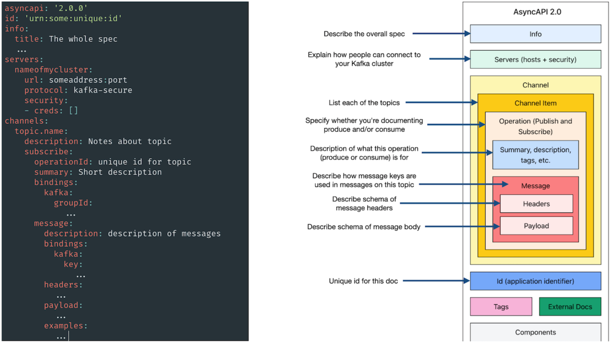

For more information, the official AsyncAPI specifications can be found [here](https://www.asyncapi.com/docs/specifications/2.0.0).

## Why Use Avro for Kafka?

Apache Avro is "an open source data serialization system that helps with data exchange between systems, programming languages, and processing frameworks" (https://www.confluent.io/blog/avro-kafka-data/). Avro is a great fit for stream data because it has the following features:

* Direct mapping to and from JSON, but typically much faster than JSON, with much smaller encodings
* Compact format, making it more efficient for high-volume usage
* Bindings for a wide variety of programming languages
* A rich, extensible schema language defined in pure JSON

## A simple API Management Demo

Besides a new, event-driven approach to its API model, ACME Inc needs a way to securely provide self-service access to different versions of its APIs, 
to enable their developers to discover and easily use these APIs, and to be able to redirect API calls based on several criteria.

IBM API Connect (APIC) is a complete and scalable API Management platform that allows them to do these things, in addition to exposing, managing, and monetizing 
APIs across clouds. API Connect is also available with other capabilities as an IBM Cloud Pak® solution.

The API Management demo demonstrates three main areas of interest: 

* Version Control
* API Documentation & Discovery
* Redirecting to different APIs based on certain criteria

### Types of APIs

An API is a set of functions that provide some business or technical capability and can be called by applications by using a defined protocol. 
Applications are typically mobile or web applications, and they use the HTTP protocol. An API definition is composed of paths, and can be one
 of the following types:

#### REST API 

A REST API is a defined set of interactions that uses the HTTP protocol, typically by using JSON or XML as the data format that is exchanged. 
For example, a data request might use an HTTP GET method, and a data record might use an HTTP POST method. The choice of data format depends 
on the type of application that is calling the API. JSON is commonly used for web pages or mobile applications that present a user interface
(by using JavaScript or HTML), whereas XML has been traditionally used for machine-to-machine scenarios, although that is changing.

In IBM API Connect, you can create REST APIs by using user interface functions to create models and data sources (top-down). 
These are then used by your REST API definition and exposed to your users. API Connect also supports a <em>bottom-up</em> approach where 
you can import existing APIs into the system and benefit from the API Management capabilities of the product.

Alternatively, you can expose and secure your existing APIs by using a Proxy or Invoke policy.

In either case, you can configure your API definition either by using the API Manager, or by writing an OpenAPI 
definition file and publishing it using either API Manager or the command line interface.

#### SOAP API

API Connect also allows you to create SOAP API definitions that are based on an existing Web Services Description Language (WSDL) file. 
You can use this facility to benefit from the capabilities that are provided by API Connect, which include analytics and mapping between variables. 
You can also expose the API by using the Developer Portal for any existing SOAP services in your organization, including any SOAP services that are part of a service-oriented architecture (SOA) or Enterprise Service Bus (ESB) infrastructure.

You can create SOAP API definitions through either the command line interface, or through the API Manager UI.

#### GraphQL

GraphQL is a query language for APIs that gives an application client greater control over what data it retrieves in an API request when compared with a REST API request. IBM® API Connect enables you to create a GraphQL API proxy definition that proxies a backend GraphQL server, and to define rate limiting controls that reflect the amount of data that is returned from the server by a request to the GraphQL API. The Developer Portal also supports testing GraphQL APIs.
See [this dedicated section](#graphql-apis).

#### AsyncAPI

We already address in detail in [previous sections](#asyncapi-documents).

### API Manager

You can manage your APIs by using API Connect's API Manager UI:

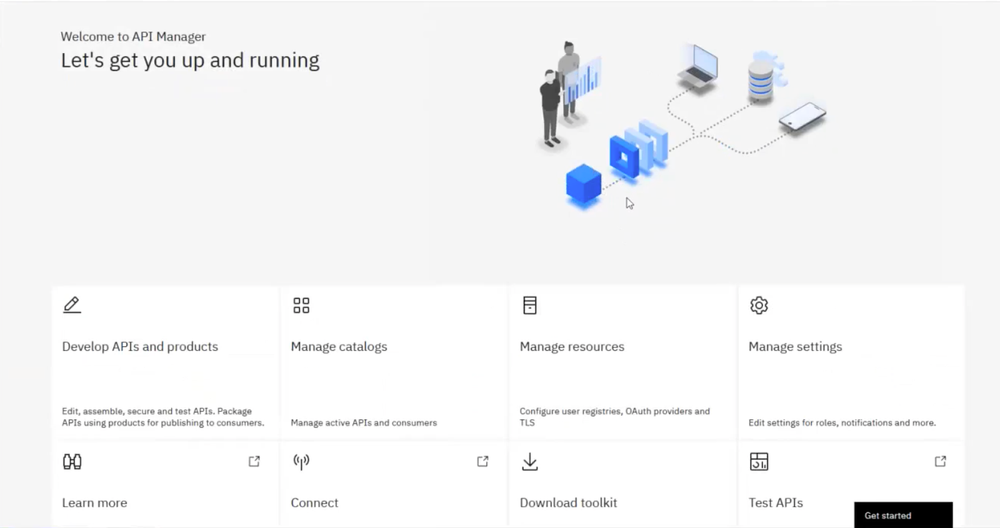

The API Manager UI allows you to manage private internal APIs as well as public external APIs. API Manager is an on-premises offering that provides the capabilities required to externalize and manage your services as REST or SOAP APIs.

### Developer Portal

The Developer Portal is a convenient place to share APIs with application developers. After a Developer Portal has been enabled through the API Manager, and one or more API Products have been published, 
application developers can browse and use the APIs from the Developer Portal dashboard, as shown below:

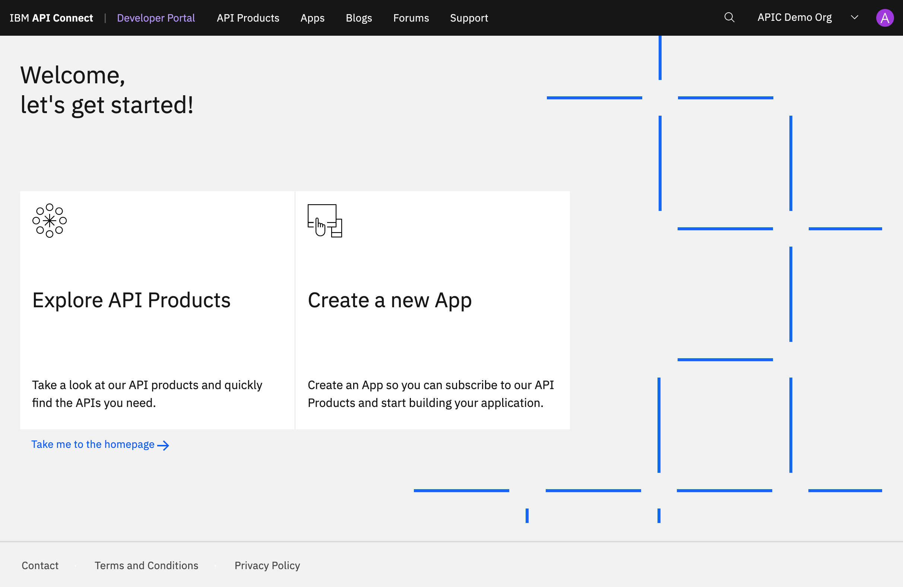


The Developer Portal can be used as is when it is first enabled, or it can be customized to fit the corporate branding and design requirements of a particular organization. 
You can configure the Developer Portal for test and development purposes, or for internal use only.

### Create Capability

Developer can leverage API Connect's <b>Create</b> capability, to build APIs (top-down) with a built-in Swagger (OpenAPI) editor or using a simple guided model-driven approach. 
APIC allows developers to create a new API from scratch or an API based on the schema of an existing data source, such as a database.

#### Creating a REST proxy API from an existing target service

As mentioned earlier, it is also possible to create a REST proxy API from an existing target service (bottom-up) that you import into the API Connect system.
Essentially, if you have an existing REST service that you want to expose through an IBM API Connect API definition, you can create a proxy API and specify the target endpoint by using the API Manager.


### Explore Capability

Developers can use API Connect's <b>Explore</b> capability to quickly examine their new APIs and try their operations.

Developers can add their APIs to the API Connect server and have the choice of running them on the cloud or on-premise, as mentioned above. 
This can be done through API Connect's UI or with the provided CLI. 

Developers and Administrators can then connect to the API Connect Server and see their running APIs, including those that were created as well as 
those that were added based on existing data sources. 

### Subscribing to an API in the Developer Portal

To subscribe to an API, from the Developer Portal, the develper clicks `API Products` to find and subscribe to any available APIs:

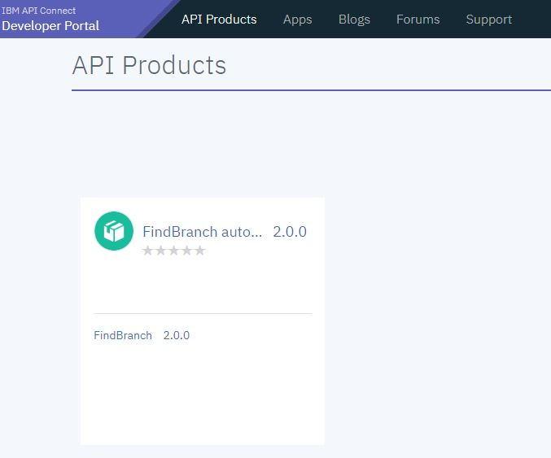

In the example above, an API called <em>FindBranch</em> Version 2.0, which is contained in the <em>FindBranch Auto Products</em> product is available. Clicking ```Subscribe``` enables the developer to use the API:

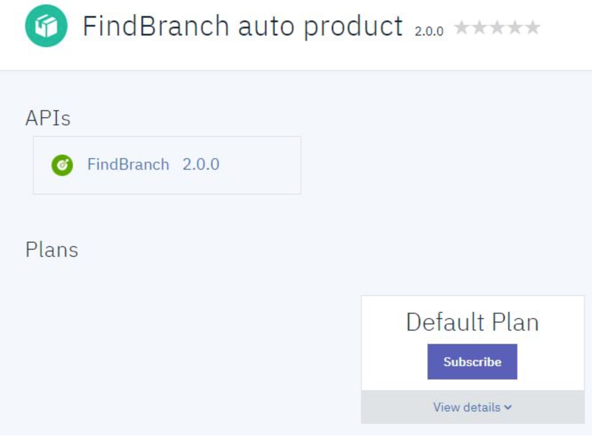

Under the Application heading, the developer can click ```Select App``` for the new application:

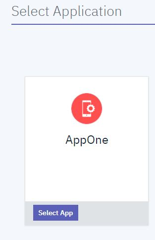

From the next screen below, the developer can click Next:

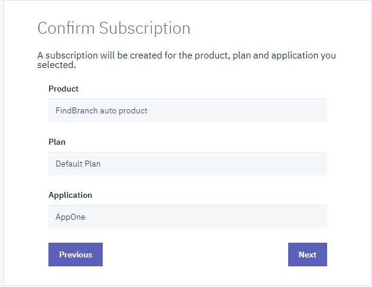

Doing this shows the screen below, which confirms to the developer that his or her applicatin is now subscribed to the selected API under the selected plan. Pressing ```Done``` in the next screen completes the subscription.

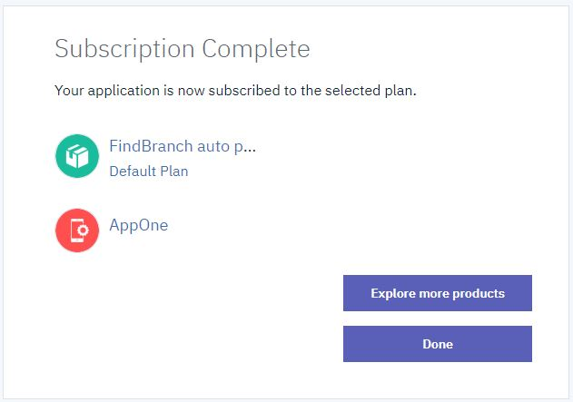


### Testing An API in the Developer Portal

To test an API, the developer clicks ```API Products``` in the Developer Portal dashboard to show all available products:

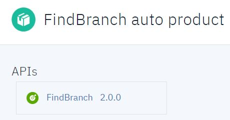

Clicking a product, such as FindBranch auto product, for example, and then clicking the FindBranch API from the provided list shows the available API operations. 

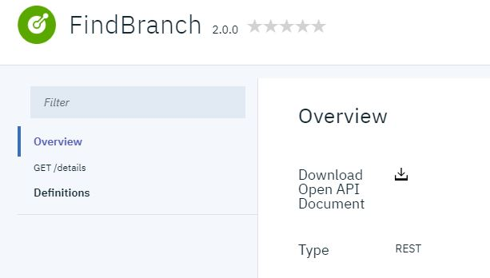

The developer can click ```GET/details```, for instance, to see the details of the GET operation: 

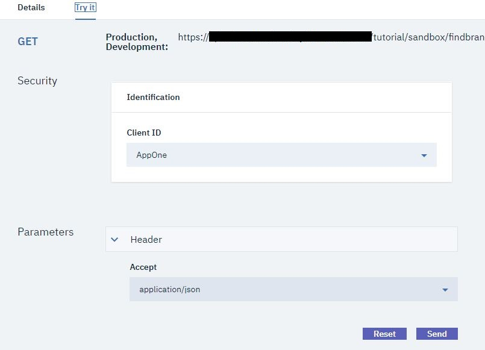

Clicking the ```Try it``` tab and pressing ```Send``` allows the developer to test the API to better understand how it works:

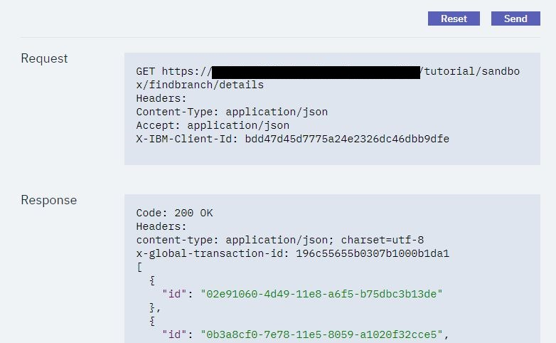

As you can see above, this shows the request/response from invoking the API. API Connect shows a returned response of 200 OK and the message body, indicating that the REST API operation call was successful.

### API Product Managers

Administrators or API Product Managers can make changes such as adding corporate security polices or transformations before publishing the APIs. They can also control the visibility and define the rate limit for the APIs. 

Once the APIs are ready, API Product Managers can expose them for developer consumption and self-service in the Developer Portal. Developers who have signed up can discover and use any APIs which were exposed. 

Because the APIs were documented while they were being created using OpenAPI notation, developers can not only view the APIs but also try them out, as demonstrated in the demo. API Connect provides source code examples
 in several different languages that show how to use the API operations. Languages supported include Curl, Ruby, Python, Java, Go, and Node.js.

### Testing

Besides the small individual tests that you can run from the Developer Portal to understand how an API works, as explained above, it is possible to use <b>API Connect Test and Monitor</b> to effortlessly generate
 and schedule API test assertions. This browser based tool also provides dashboards for monitoring API test assertions and for receiving alerts on the health of your APIs.

You can use an HTTP Client within API Connect Test and Monitor to generate a request to an API and get the expected results:

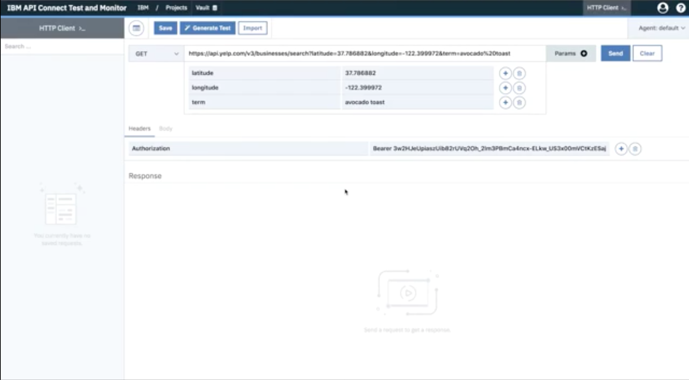

You enter any required parameters and authorization token and press `Send` to send the request. 

API Connect Test and Monitor then shows you the response payload as a formatted JSON object:

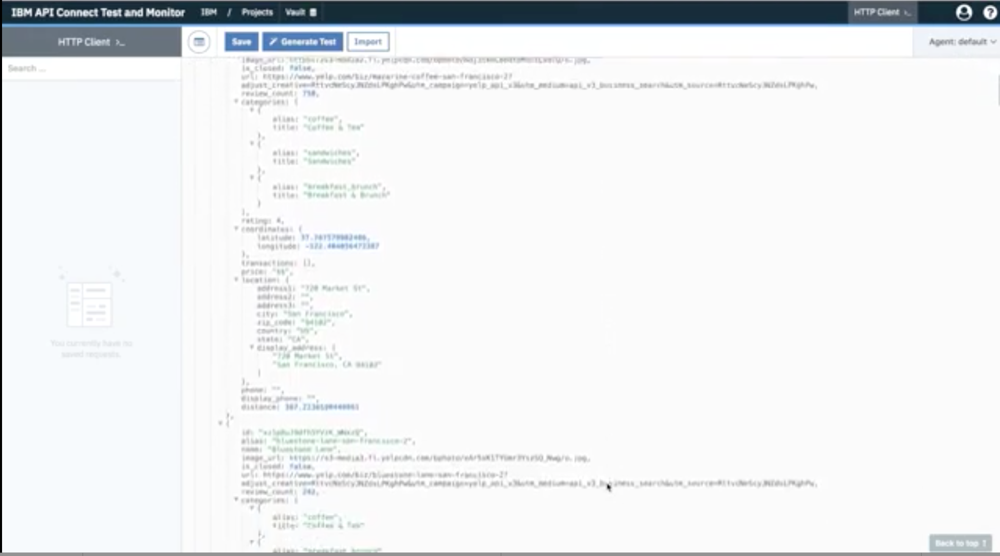


To generate a test, you then click `Generate Test`, and in the dialog that appears name the test and add it to a project. 
When you click the checkmark in the upper right corner of the dialog, API Connect Test and Monitor automatically generates test assertions based on the response payload.

You can add, delete, or modify these assertions, or even add new ones from a broad selection:

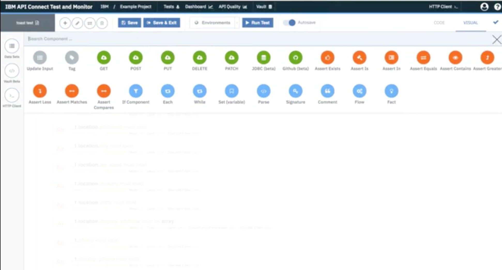

You can also reorder the assertions by dragging and dropping them:

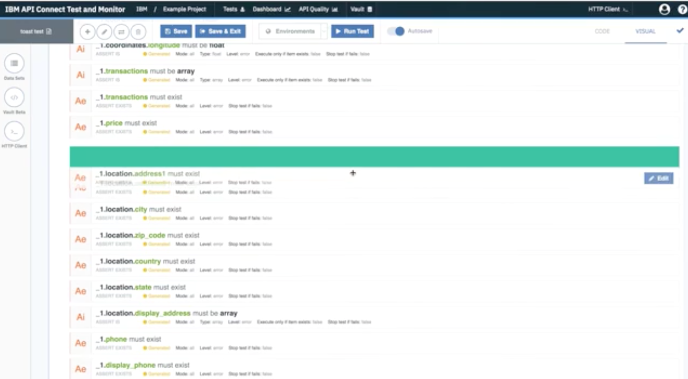

Although coding is not required, if you wish, you change the underlying code by clicking `CODE` to enter the code view:

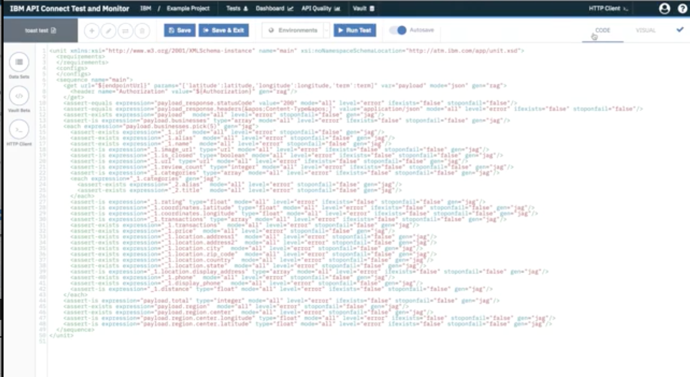

Once you have your test arranged the way you want it, you can run it to generate a test report, which highlights successes and failures:

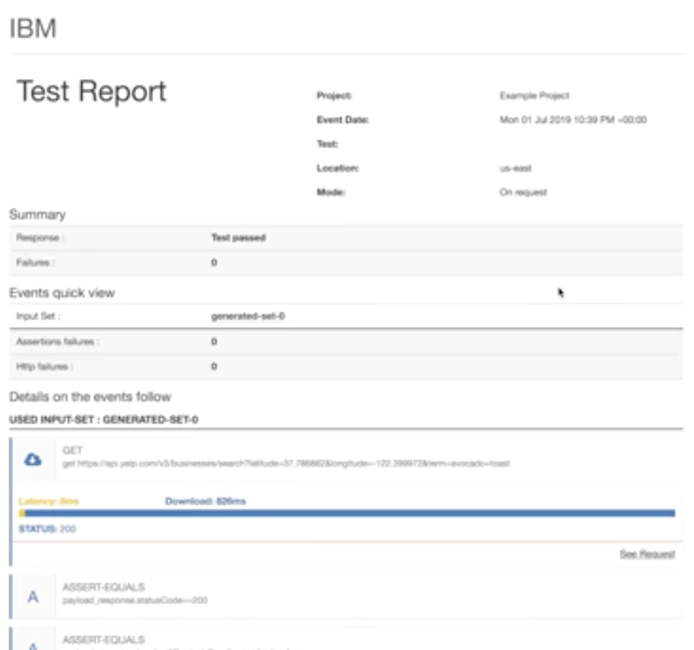

### Test Scheduling

IBM API Connect Test and Monitor also lets you automate test scheduling at regular intervals. To do this, you first save any test you may have open and exit out of the composer. Then publish your test to prepare it for scheduling:

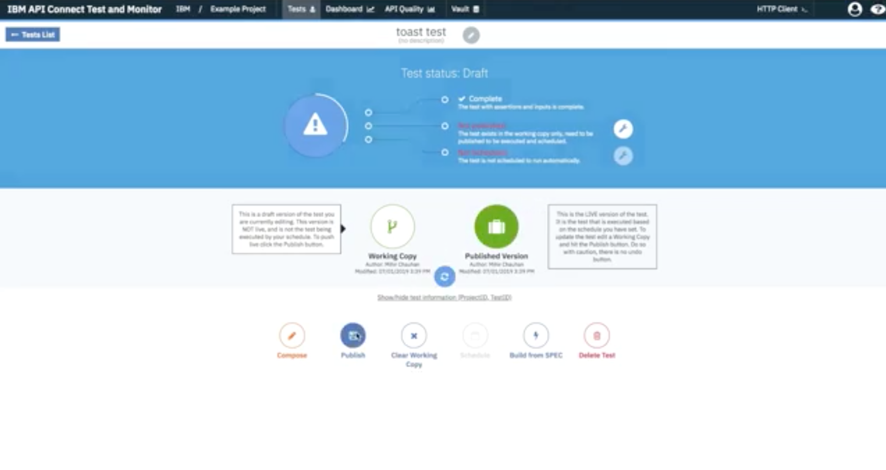

Once your test is published, you can click `Schedule` to schedule regular test intervals. Test and Monitor allows you to tweak the test schedule as necessary. You can create a new run, name it, and choose the times you wish to run your tests:


Clicking `Save Run` schedules the tests. 

Finally, you can access the dashboard to monitor the health of your API:

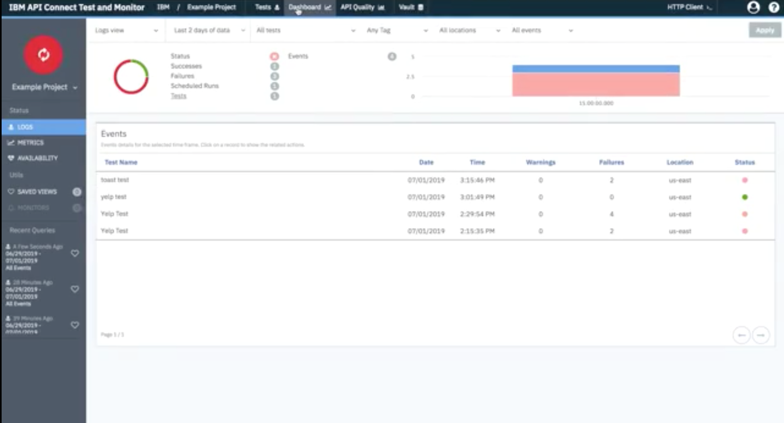

## GraphQL APIs

IBM® API Connect enables you to create a GraphQL API proxy definition that proxies a backend GraphQL server, and to define rate limiting controls that reflect the amount of data that is returned from the server by a request to the GraphQL API. 
The Developer Portal also supports testing GraphQL APIs. 

### Advantages of GraphQL over REST APIs

GraphQL provides the following particular advantages over REST APIs:

* The application client can request only the data that it needs. For example, when retrieving bank account records, request only the account number and current balance for each account, but not the customer name and address details. 
With a REST API request, either the backend REST service must provide separate endpoints for different data subsets, or the application client must retrieve the complete records and then discard the unwanted data.
* The application client can retrieve multiple related resources in a single request. For example, a customer's bank account record might include an array that references other finance products that the customer holds. 
If an application client wants to retrieve the bank account details for a specific customer, and details of the other finance products for that customer, then with a REST API the client would first retrieve the bank account details, 
then make separate requests for each of the other products. A GraphQL API can be designed to allow the client to retrieve all this information in a single request.
* However, this flexibility presents rate limiting challenges, because two seemingly very similar requests might return vastly different amounts of data, and what might have required multiple REST API requests, each counting towards the rate limit, might require only a single GraphQL API request. It is important therefore that rate limiting controls are imposed that reflect the amount of data that is retrieved. API Connect extends the GraphQL standard by providing, in a GraphQL API definition, the ability to configure a range of settings that are used to calculate the complexity of a GraphQL request and an associated cost that counts towards the rate limit.


### Creating a GraphQL proxy API

The  demo also showed how API Connect supports GraphQL. To create a GraphQL proxy API from an existing GraphQL server, click `Add`, then `API (from REST, GraphQL or SOAP)`:

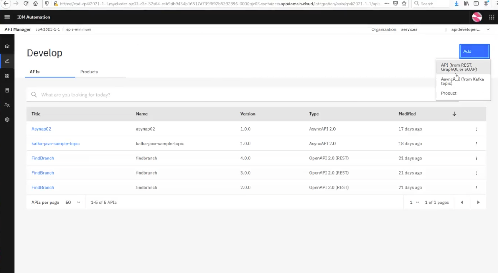

Then select, `From existing GraphQL service (GraphQL proxy)`:

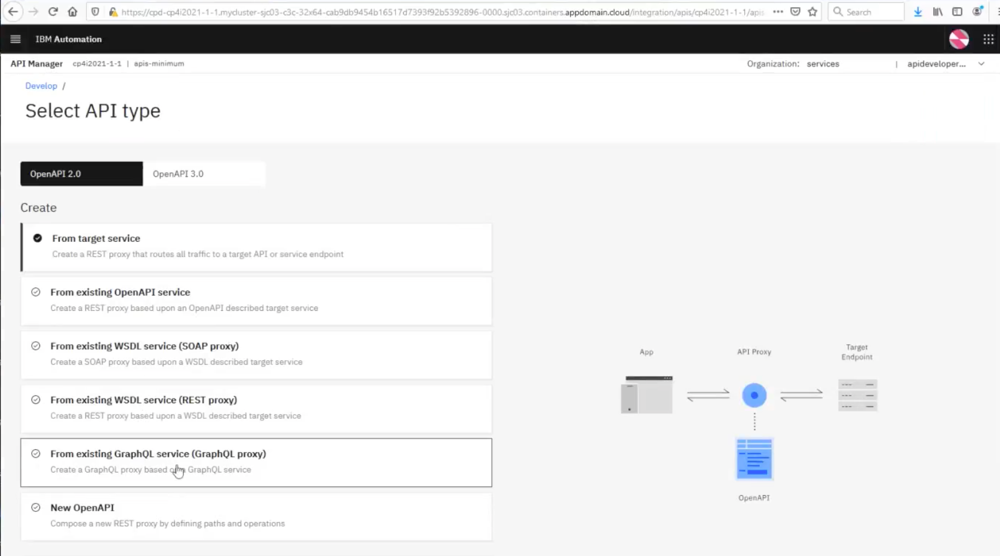

Give it a name and complete the rest of the parameters, especially the GraphQL Server URL field which, of course, cannot be left blank. 

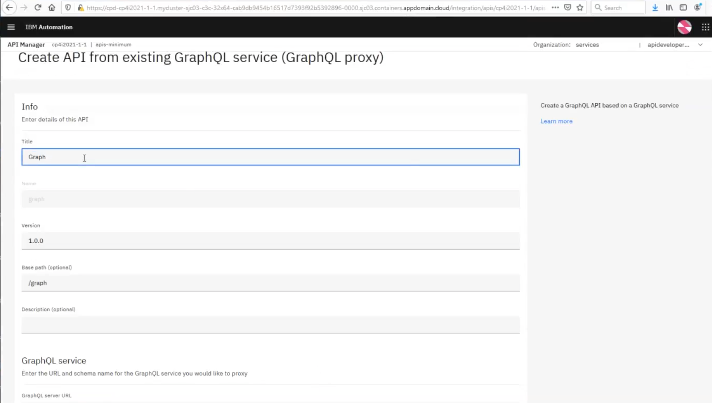

Notice that, once you enter the URL, API Connect will find the service and automatically detect the schema. 

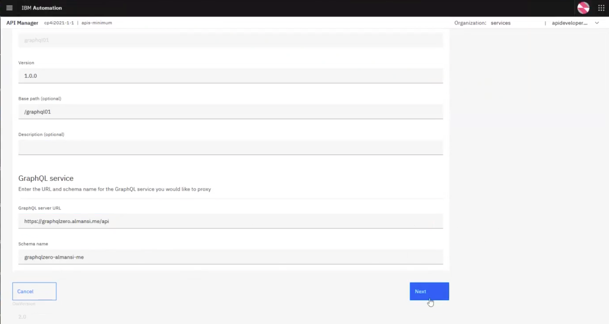

You can click `Next` and API Connect will attempt to connect to the GraphQL server, introspect it, and pull in any objects (in this case, queries and operations) that it can find on that server:

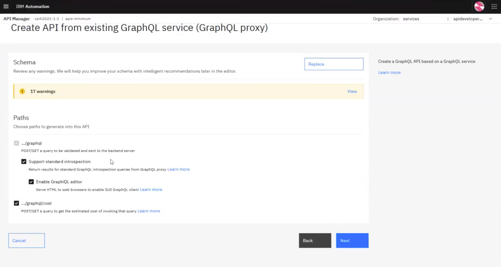

The gateway will sometimes provide warnings (17 in the example above), which are really just recommendations on how you can optimize the query. 

Clicking Next allows you to then activate the API for publishing:


Finally, clicking `Next` shows a screen such as the one below with checkmarks:

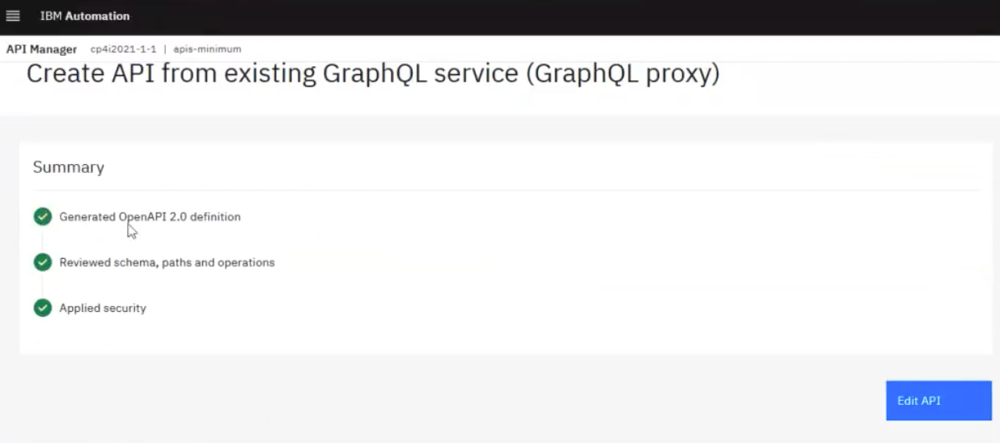

This shows that the gateway was able to connect to the GraphQL server and detect its schema, paths, and operations, validate them, and automatically populate the canvas with different policies, including security policies:

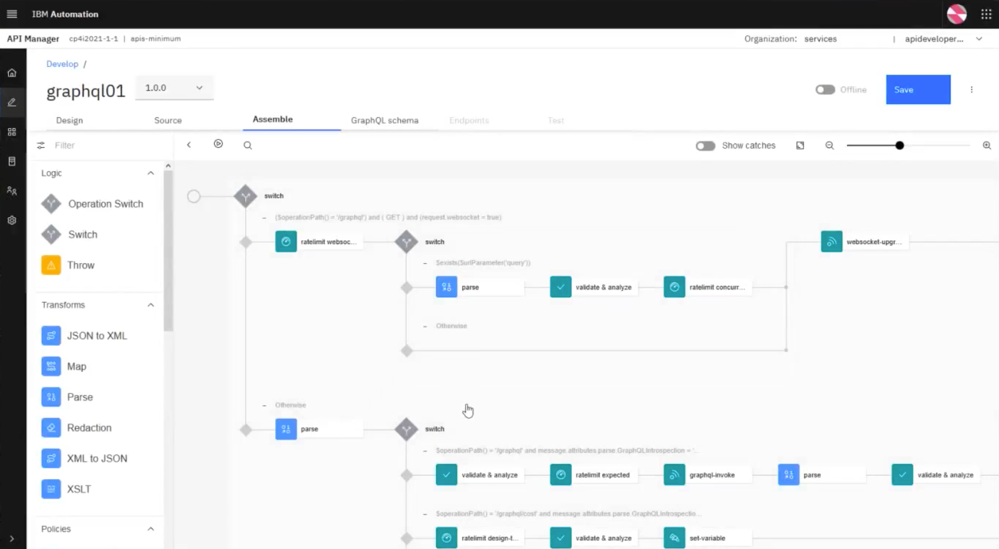


## Further Readings

* [IBM Redbook on Agile Integration](https://www.redbooks.ibm.com/abstracts/sg248452.html)
* [A Demo of Event Endpoint Management - Cloud Pak for Integration](https://community.ibm.com/community/user/integration/blogs/dale-lane1/2021/04/12/a-demo-of-event-endpoint-management])
