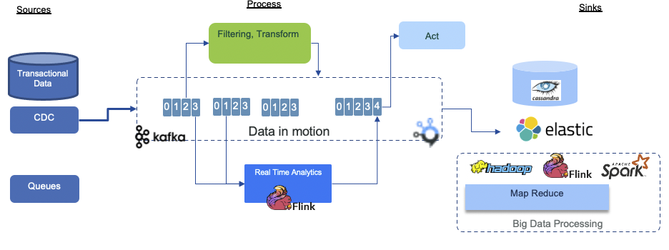

---
title: Situational decision
description: Complex event processing and situational decision
--- 

Enterprises need to identify and act on event streams to address specific business situations. The processing logic groups complex combinations of business events that have or have not occurred in a time frame and at runtime, recognize those situations and react to them with prescribed business actions. Situation detection is an asynchronous, near real-time, and uses temporal and geospatial characteristics of the events to take action. 

As an example, in account hijacking use case, the processing will involve consuming events from  user_login, password_changed, address_changed, new beneficiary added, money_transfert_initiated, in this order and with time windows contraints. The action will freeze the money transfert, alert the account owner, identify the IP address of the logged person, add more data for investigation, or alert operation team...  

## React to multiple complex events with prescribed business actions

Situational decision automation refers to detecting a situation, or an event, and then deciding how to act. The interresting part of this procesing is the integration of multiple event streams and the need to keep state in a context of a business entity. Context is important. The context can be a business entity on which a set of events are important to address. In previous example, the Account entity may be the context on which we want to address the events to better understand the event flow with time constraint. How to keep those business entity state related to real time processing is an implementation challenge. To take business decision, you need more information than just looking at the event payload. 

From a modeling point of view, you need to create a model of business entities and their associated business events, define the target situation, and define the rules to be applied for the situation. [Event storming](../../methodology/event-storming/) helps to identify events and business entities and their relationships. But we need to enhance the method with rule harvesting, situation modeling and action definition. The model and its associated logic are deployed to a situational processing service. The decisions that are made by the situational processing service can be refined and enhanced by using predictive analytics models.

By using situational decision automation as part of an event-driven solution, you can process continuous event streams to derive insights and intelligence. You can analyze an event stream and then extract event data from it so that data scientists can understand and derive machine learning models. You can run analytical processes and machine learning models against the event stream and match complex event patterns across streams and time windows to help you decide and act. The Situational decision automation architecture can help you to build and implement such a solution.

## Benefits of situational decision automation

By adopting decision automation for events, you can optimize your business processes and realize these benefits:

* Spot risks and opportunities by detecting and predicting event patterns, and react to events as they happen
* Make more informed decisions by applying business rules and business logic on data streams
* Improve business responsiveness and minimize compliance risks

## The reference architecture

To make it simple, situational decision acts on event streams, so needs to be connected to event backbones. The reference architecture may look like in the following figure where complex event processing component like Apache Flink will continuously process data streams and generate synthetic events a separate service can act on:

