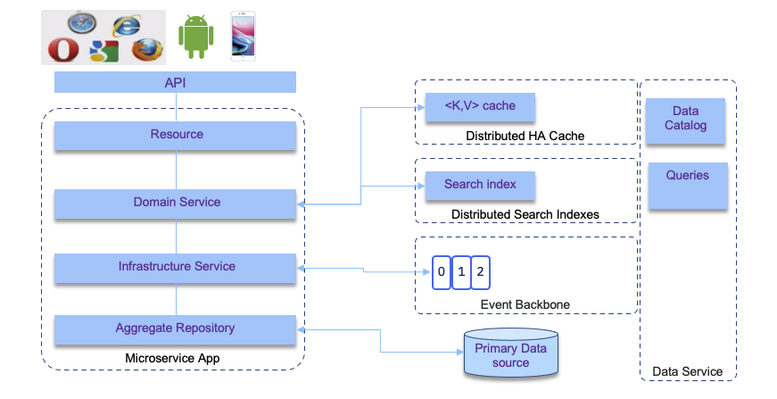

In this article we are highlighting some practices to design and develop data intensive application in the context of microservice solution. This is strongly linked to the adoption of event-driven microservices, but addresses the data consistency and eventual data consistency discussions, as well as the establishment of a data fabric services.

## Context

A typical modern business solution will include a set of microservices working together in choreography to exchange data. The adoption of event-driven microservices, with all the related design patterns, is described in separate articles that you can read [here](../intro/index.md). 

When zooming to a particular data intensive microservice we will find a set of important data centric features that may look like in the diagram below, which presents one component of a bigger distributed system.

The services involved include:

* API to define the service contract: [OpenAPI](https://www.openapis.org/) or [AsynchAPI](https://www.asyncapi.com/)
* Databases to store data for long term - document oriented or SQL based
* Caches to speed up retrieving data for expensive queries
* Search indexes to support search on a corpus
* Stream processing to pub/sub messages, which are now also considered as long duration datastore (Kafka).
* Interactive queries on top of data streams, and aggregates.
* Message contract and schemas
* Unified data service which includes big data storage, but also data catalog and queries on data at rest.

## Subjects of concern

When designing such application we need to address a set of important subjects:

* What is the type of workload on the database? Read heavy, global access query, write heavy or balanced. 
* Expected throughtput? Is there any fluctuation during the day? does it need to scale over time?
* How much data to store? what will be the pattern for this size (Always grow)? How content is access via which expected security and access control?
* What will be the expected durability? Week or forever?
* Expected latency and number of concurrent users?
* How the data model is modeled, does it need to support relationship integrity? Join queries? Structured or semi-structured content?
* Do we need strong schema, or more flexible one?
* Do we need search on unstructured data? NoSql?
* How to ensure data correctness and completeness?
* How to address good performance when exposing data, even when app is running slowly?
* How to scale and address increase in transaction volume and data size?
* What data to expose to other services via messaging ? Which formats?
* What data to expose to other services via APIs ?
* How to support application reliability when some components are not performing within their SLA? How to be fault-tolerant?
* How to test fault-tolerance?
* How does adding horizontal compute power impact the data access?
* How to support disaster recovery?

In modern big data applications, hardware redundancy is not suffisant, the design needs to support unexpected faults, to avoid cascading failures or to support new version deployment with rolling-upgrade capability. 

When addressing scalability and load growth, we need to define the load parameters: 
number of transactions per second, the number of read and write operations, 
the number of active sessions, ... on average and at peak. Each microservice in a 
solution will have its own load characteristics. 

From there, we need to address the following issues:

* How does load growth impact performance while keeping existing compute resources?
* What is the increase of compute resource needed to support same performance while load growth?

The solution problem is a combination of different characteristics to address: read volume, write volume, data store volume, data complexity and size, response time, access logic...

For batch processing the measurement is the throughput: number of records per second or time to process n records. 
For real-time processing the response time measures the time to get a response from a client's point of view after sending a request.

When defining service level agreement, it is important to use the median response time and a percentile of outliers. 
An example the median could be at 300ms at P99 (99/100) under 1s.

Tail latencies, or high percentiles of response time, impact directly user experience and cost money.

## Distributed data

Adopting microservice architecture, means distributed systems and distributed data. The main motivations for that are scalability (load data operations could not be supported by one server), high availability (by sharing the same processing between multiple machines), and reducing latency to distribute data close to the end users.

Vertical scaling is still bounded by hardware resources, so at higher load we need to support horizontal scaling by adding more machines to the cluster or cross multiple clusters.  When adding machines, we may want to adopt different techniques for data sharing: 

* shared memory
* shared storage
* shared nothing: cpu, memory and disk are per node. Cluster manages node orchestration over network. This architecture brings new challenges. 

???- "Compendium"
    * [Designing data intensive application - Martin Kleppmann](https://www.amazon.com/Designing-Data-Intensive-Applications-Reliable-Maintainable/dp/1449373321/ref=sr_1_3?crid=F3G6F7KYQZMH&keywords=designing+data+intensive+applications&qid=1572566804&sprefix=designing+data+%2Caps%2C204&sr=8-3)
    * [Assemble the team to support a data-driven project - author: Stacey Ronaghan](https://www.ibm.com/cloud/garage/practices/culture/assemble-team-for-data-driven-project)
    * [The valuation of data - author: Neal Fishman](https://www.ibm.com/cloud/garage/practices/culture/valuation-of-data/)
    * [Define business objectives - author: Neal Fishman](https://www.ibm.com/cloud/garage/practices/discover/build-a-business-objective)
    * [Recognize the value of data - author: Neal Fishman](https://www.ibm.com/cloud/garage/practices/discover/recognize-value-of-data)
    * [Translate a business problem into an AI and Data Science solution - authors: Tommy Eunice, Edd Biddle, Paul Christensen](https://cloudcontent.mybluemix.net/cloud/garage/practices/discover/business-problem-to-ai-data-science-solution)
    * [Prepare your data for AI and data science - authors: Edd Biddle, Paul Christensen](https://www.ibm.com/cloud/garage/practices/code/data-preparation-ai-data-science/)

    * [Define your data strategy -authors: Beth Ackerman, Paul Christensen](https://www.ibm.com/cloud/garage/practices/think/define-data-strategy/)
    * [Normalize data to its atomic level - author: Neal Fishman](https://www.ibm.com/cloud/garage/practices/think/normalize-data/)
    * [Understand data needs to support AI and Data Science solutions - authors: Tommy Eunice, Edd Biddle, Paul Christensen](https://www.ibm.com/cloud/garage/practices/think/data-needs-for-ai-data-science/)
    * [Run thought experiments by using hypothesis-driven analysis - author: Edd Biddle, Paul Christensen](https://www.ibm.com/cloud/garage/practices/think/thought-experiments-and-hypothesis-driven-analysis/)
    * [Deliver a singular data function - author: Neal Fishman](https://www.ibm.com/cloud/garage/practices/code/deliver-singular-data-function/)
    * [Construct your data topology - authors: Neal Fishman, Paul Christensen](https://www.ibm.com/cloud/garage/practices/code/construct-data-topology/)
    * [Build your data lake design - author: Paul Christensen](https://www.ibm.com/cloud/garage/practices/code/build-data-lake-design/)
    * [Put AI and data science to work in your organization - authors: Edd Biddle, Paul Christensen](https://www.ibm.com/cloud/garage/practices/reason/put-ai-data-science-to-work)
    * [Look behind the curtain of AI - author: Edd Biddle](https://www.ibm.com/cloud/garage/practices/reason/dispel-magic-of-ai)
    * [Select and develop an AI and data science model - author: Edd Biddle](
    https://www.ibm.com/cloud/garage/practices/reason/model-selection-development-ai-data-science)
    * [Enhance and optimize your AI and data science models - author: Edd Biddle](https://www.ibm.com/cloud/garage/practices/reason/optimize-train-ai-model)
    * [Establish data governance - author: Neal Fishman](https://www.ibm.com/cloud/garage/practices/manage/establish-data-governance)
    * [Deploy an AI model - author: Sujatha Perepa](https://www.ibm.com/cloud/garage/practices/run/deploy-ai-model/) 

