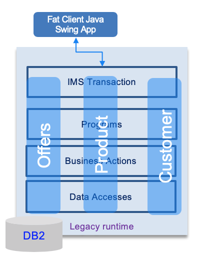
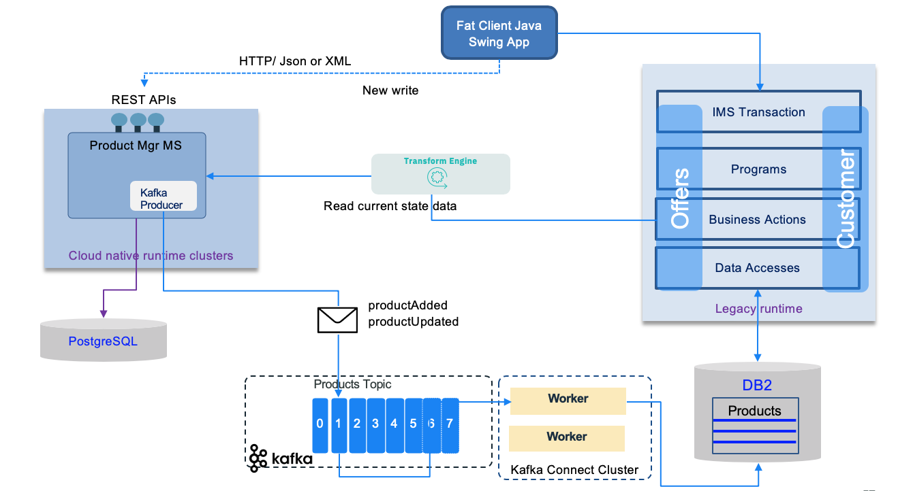

# Introduction

In this set of articles, we will detail some of the most import event-driven patterns that can be utilised during your event-driven microservice implementation.

Adopting messaging (Pub/Sub) as a microservice communication approach involves using, at least, the following patterns:

* [Decompose by subdomain](https://microservices.io/patterns/decomposition/decompose-by-subdomain.html): The domain-driven design approach is useful to identify and classify business
functions and the corresponding microservices that would be associated with them. With the event storming method, aggregates help to find those subdomains of responsibility. (Source Chris Richardson - Microservices Patterns)
* [Database per service](https://microservices.io/patterns/data/database-per-service.html): Each service persists data privately and is accessible only via its API.
Services are loosely coupled limiting impact to other services when schema changes occur in the database. The chosen database technology is driven by business requirements. (Source Chris Richardson - Microservices Patterns)
The implementation of transactions that span multiple services is complex and enforces using the Saga pattern. Queries that span multiple entities are a challenge and CQRS represents an interesting solution.
* [Strangler pattern](#strangler-pattern): Used to incrementally migrate an existing, monolithic, application by replacing a set of features to a microservice but keep both running in parallel.
Applying a domain driven design approach, you may strangle the application using bounded context. But then as soon as this pattern is applied, you need to assess the co-existence between
existing bounded contexts and the new microservices. One of the challenges will be to define where the write and read operations occurs, and how data should be replicated between the contexts.
This is where event driven architecture helps.
* [Event sourcing](../event-sourcing/): persists, to an append log, the states of a business entity, such as an Order, as a sequence of immutable state-changing events.
* [Command Query Responsibility Segregation](../cqrs/): helps to separate queries from commands and help to address queries with cross-microservice boundary.
* [Saga pattern:](../saga/) Microservices publish events when something happens in the scope of their control like an update in the business entities they are responsible for. A microservice, interested in other business entities, subscribes to those events and it can update its own state and business entities on receipt of these events. Business entity keys need to be unique and immutable.
* [Event reprocessing with dead letter](../dlq/): event driven microservices may have to call external services via a synchronous call. We need to process failure in order to get response from those services using event backbone.
* [Transactional outbox](#transactional-outbox): A service command typically needs to update the database and send messages/events.
The approach is to use an outbox table to keep the message to sent and a message relay process to publish events inserted into database to the event backbone. (Source Chris Richardson - Microservices Patterns)

## Strangler pattern

### Problem

How to migrate a monolithic application to a microservice based architecture without doing the huge effort of redeveloping the application from a blank slate. Replacing and rewriting an existing application can be a huge investment. Rewriting a subset of business functions while running current application in parallel may be relevant and reduce risk and velocity of changes.

The figure below illustrates a typical mainframe application, with external Java based user interface connected to the mainframe via iop/corba and with three different applications to manage product, order and customer.

### Solution

The approach is to use a "strangler" interface to dispatch a request to new or old features. Existing features to migrate are selected by trying to isolate sub components.

One of main challenges is to isolate the data store and disover how the new microservices and the legacy application are accessing the shared data. Continuous data replication can be a solution to propagate write model to read model. Write model will most likely stays on the monolitic application, change data capture can be used, with event backbone to propagate change to read model.

The facade needs to be scalable and not a single point of failure. It needs to support new APIs (RESTful) and old API (most likely SOAP).

The following figure illustrates an implementation using an event driven solution with data replication to synchronize the write model to the read model on the mainframe.

## Transactional outbox

When distributed transaction is not supported by the messaging middleware (like current Kafka version), it is important to ensure consistency between the records in the database and the events published. In the reference implementation we used the approach to publish to the topic as soon as an order is received via the API and then the same code, is consuming this events to persist to the database. With this approach if write to the topic operation fails, the application can return an error to the user, if the write operation to the database fails, the code can reload from the non-committed record. 

But there is another solution presented by the transactional outbox. For detailed information about this pattern see the documentation of the pattern in Chris Richardson's site: [Transactional outbox](https://microservices.io/patterns/data/transactional-outbox.html).

To summarize this pattern, the approach is to use an `outbox` table to keep the messages to sent and a message relay process to publish events inserted into database to the event backbone. In modern solution this relay is a change data capture agent. The following schema illustrates the approach:

To get a concrete example of this pattern we have developed a [deep dive lab](../../use-cases/db2-debezium/) using Quarkus Debezium outbox pattern and a DB2 database.