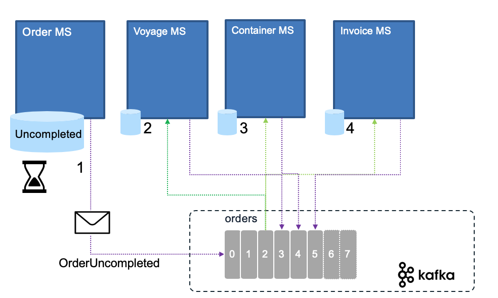

# Saga

Updated 06/18/2022
## Problems and Constraints

With the adoption of one data source per microservice, there is an interesting challenge on how to support long running transaction cross microservices. With event backbone two phase commit is not an option.

## Solution and Pattern

Introduced in 1987 [by Hector Garcaa-Molrna Kenneth Salem paper](https://www.cs.cornell.edu/andru/cs711/2002fa/reading/sagas.pdf) the Saga pattern helps to support a long running transaction that can be broken up to a collection of sub transactions that can be interleaved any way with other transactions.

With microservice each transaction updates data within a single service, each subsequent steps may be triggered by previous completion. The following figure, based on [our solution implementation](https://ibm-cloud-architecture.github.io/refarch-kc), illustrates those concepts for an order transaction:

When the order is created, the business process says, we need to allocate a "voyage" (a Vessel container carrier), assign refrigerator containers and update the list of containers to load on the ship. 
Those actions / commands are chained. The final state (in this schema, not in the reality, as the process has more steps) 
is the Order assigned state in the order microservice.

With a unique application implementation, the integrity between order, voyage and container tables will be done via transactions. 
With distributed system we could not easily apply two phase commit transaction so the Saga pattern will help.

SAGA pattern supports two types of implementation: Choreography and Orchestration.
## Services choreography

With Choreography each service produces and listens to other service’s events and decides if an action should be taken or not.

The first service executes a transaction to its own data store and then publishes an event ( OrderCreated event (1)) as fact about its business entity update. 
It maintains the business entity status, (order.status) to the `Pending` state until the saga is completed. This event is listened by one or more services which execute local
 transactions and publish new events (VoyageAllocated (3), ReeferAssigned (4), PaymentProcessed (5)).
The distributed transaction ends when the last service executes its local transaction or when a service does not publish any events or the event published is not 
polled by any of the saga’s participants. For example, the Order microservice gets all the events from the other services and changed the Order state to be `Accepted`.

In case of failure, the source microservice is keeping state and timer to monitor for the expected completion events.

When a message from any service is missing, the source service, needs to trigger a compensation process:

Rolling back a distributed transaction does not come for free. Normally you have to implement another operation/transaction to compensate for what has been done before. This will be a new event sent by the service responsible of the transaction integrity. In the order example, in the rare case where one of the service is not able to provide a positive response, no voyage found, or no Reefer container found, then the order needs to change to 'Uncompleted' status, and an event to the orders topic will claim the orderID is now uncompleted (OrderUncompleted event Step 1 above) . Any service that has something allocated for this orderId will 'unroll' their changes in their own data source  (Steps 2,3,4 below).

Also it is important to note, that if one of the service is taking time to answer this may not be a problem as the order is in pending state. If the business requirement stipulates to address an order within a small time period then the compensation process may start. Uncompleted orders can be reviewed by a business user for manual handling. Email can be automatically sent to the customer about issue related to his order. There are a lot of different ways to handle order issue at the business level.

[See the eda-saga-choreography repository](https://ibm-cloud-architecture.github.io/eda-saga-choreography/) for our last implementation based on Quarkus, and IBM Event Streams.

## Services orchestration

With orchestration, one service is responsible to drive each participant on what to do and when. As we do not
want to loose any message as part of this orchestration the technology of choice to support strong consistency
and exactly once delivery, is to use IBM MQ, as illustrated by the following figure:

An example of Saga implementation using MQ is described in [this repository](https://github.com/ibm-cloud-architecture/eda-kc-gitops) and the orchestration implemenation with MQ is in the [eda-kc-order-cmd-mq repo](https://github.com/ibm-cloud-architecture/eda-kc-order-cmd-mq).

An alternate approach is to use [Kafka with producer](https://ibm-cloud-architecture.github.io/eda-saga-orchestration/) using full acknowledge, idempotence, and a batch size of 1, and different topics
mostly configured as queue: one consumer in each consumer group, manual commit, poll one message at a time.

It uses the different topics to control the saga by issuing event commands to the different service. It uses the event backbone as a queue processing to 
support the asynchronous invocations. In this case the event should be exactly once delivered and idempotent. Each participant produces response in their 
context and to the order topic. The orchestration layer needs to keep a state machine and acts once all the expected responses are received.

If anything fails, the orchestrator is also responsible for coordinating the compensation process by sending rollback events with orderID and their respective impacted entity key (voyageID, reeferID, transactionID). Each  participant will undo its previous operations.
Orchestrator is a State Machine where each transformation corresponds to a command or message.

See also [this article](https://microservices.io/patterns/data/saga.html) from Chris Richardson on the Saga pattern.

We have implemented the choreography saga pattern in the order management, voyage and refeer management microservices within the [EDA reference implementation solution](https://ibm-cloud-architecture.github.io/refarch-kc/implementation/saga-patterns/) with a detailed explanation of the integration tests to validate the [happy path](https://ibm-cloud-architecture.github.io/refarch-kc/integration-tests/happy-path/), and the [exception path](https://ibm-cloud-architecture.github.io/refarch-kc/integration-tests/saga-pattern/) with compensation.

## Repositories to demonstrate the Saga patterns

* [eda-saga-choreography repository](https://ibm-cloud-architecture.github.io/eda-saga-choreography/)

    * [Order service](https://github.com/ibm-cloud-architecture/refarch-kc-order-cmd-ms.git)
    * [Reefer service](https://github.com/ibm-cloud-architecture/refarch-kc-reefer-ms.git)
    * [Voyage service](https://github.com/ibm-cloud-architecture/refarch-kc-voyage-ms.git)

* [eda-saga-orchestration repository](https://ibm-cloud-architecture.github.io/eda-saga-orchestration/) includes subfolders with the 3 services.
