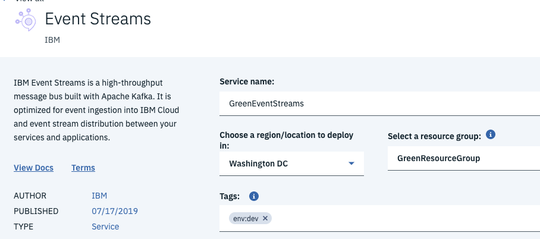
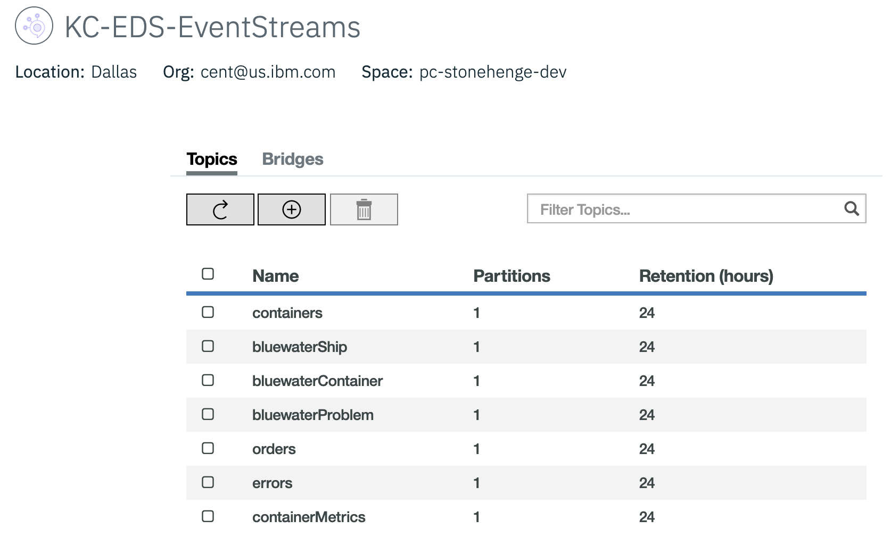
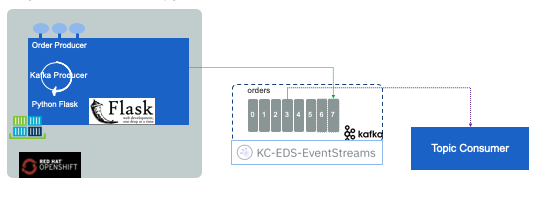

Implementing cloud native, event-driven solution with microservices deployed on kubernetes involves a broad skill set. In this article, we are proposing a deep dive learning journey for developers to adopt event-driven microservice implementation.

This EDA project includes best practices around the technologies used in any event-driven microservice solution implementation. Our [Reefer solution implementation](https://ibm-cloud-architecture.github.io/refarch-kc) tries to illustrate most of those patterns. It includes a set of technologies that represent the modern landscape of cloud native applications (Kafka, maven, java, microprofile, kafka API, Kafka Stream API, Spring boot, Python, Nodejs, and Postgresql) but also some specific analytics and AI components like IBM Streams analytics and machine learning with Jupyter notebook to develop predictive scoring model.

A developer who wants to consume this content does not need to know everything at the expert level. You can progress steps by steps and it will take a 2 to 3 weeks to digest everything.

!!! note
    We expect you have some good understanding of the following technologies:

    * Nodejs / Javascript / Typescripts
    * Java 1.8 amd microprofile architecture
    * Python 3.6
    * Angular 7, HTML, CSS  - This is for the user interface but this is more optional.
    * Maven, npm, bash
    * WebSphere Liberty or OpenLiberty
    * Docker
    * Docker compose
    * Helm
    * Kubernetes
    * Apache Kafka, Kafka API

    We have build a getting started and tutorial list for you to study [here](core-techno-getstarted.md).

## Event Driven Concepts

Now the development of event driven solution involves specific technologies and practices. The following links should be studied in the proposed order:

* [Why Event Driven Architecture now?](https://www.ibm.com/cloud/garage/architectures/eventDrivenArchitecture)

### 1- Reading: Understand EDA fundamentals (8 hours)

The following content is for architects, and developers who want to understand the technologies and capabilities of an event driven architecture.

* Understand the [Key EDA concepts](../concepts/README.md) like events, event streams, events and messages differences...
* Be confortable with the [EDA reference architecture with event backbone, microservices and real time analytics](https://www.ibm.com/cloud/garage/architectures/eventDrivenArchitecture/reference-architecture).
* Which is extended [with machine learning and AI integrated with real time analytics reference architecture](https://www.ibm.com/cloud/garage/architectures/eventDrivenExtendedArchitecture), integrating machine learning workbench and event sourcing as data source, and real time analytics for deployment.
* Review [Event sources - as event producers article](https://www.ibm.com/cloud/garage/architectures/eventDrivenArchitecture/event-driven-event-sources).
* Read the concept of [Event backbone where Kafka is the main implementation](https://www.ibm.com/cloud/garage/architectures/eventDrivenArchitecture/event-driven-event-backbone).
* As kafka is the event backbone, review its [key concepts and building blocks](../kafka/readme.md) and then review how to support [high availability (HA) and disaster recovery (DR) with IBM Event Streams or Kafka Architecture Considerations](../kafka/arch.md).
* Review one of the common industry use case using Kafka, to perform [data replication using kafka and Change Data Capture](https://ibm-cloud-architecture.github.io/refarch-data-ai-analytics/preparation/data-replication/).


### 2- Hands on Lab: Getting started with Event Streams and Kafka (3 hours)

* Start by creating an Event Stream service in IBM Cloud by performing the [IBM Event Stream Getting started](https://cloud.ibm.com/docs/services/EventStreams?topic=eventstreams-getting_started&locale=en-US). To provision your service, go to the IBM Cloud Catalog and search for `Event Streams`. It is in the *Integration* category. Create the service and specify a name, a region/location (select the same as your cluster), and a resource group, add a tag if you want to, then select the standard plan.

!!! warning
    If you are using a non default resource group, you need to be sure your userid as editor role to the resource group to be able to create service under the resource group.



See [this note](../deployments/eventstreams//es-ibm-cloud.md) for creating Event Stream with Enterprise plan.

* Review another getting started from [Apache Kafka quickstart](https://kafka.apache.org/quickstart)
* Finally review the Confluent point of view on [getting started](https://www.confluent.io/blog/apache-kafka-getting-started/) as it covers some of the persona involved in a kafka based solution.

### 3 - Readings : Methodology (2 hours read)

It is important to understand how to start a project using event. This lab persents how to start an event driven solution implementation using the event storming and domain driven design:

* We are proposing a [set of activities](../methodology/readme.md) to develop and release an event-driven solution based on the agile development approach described in the IBM Garage method.
* The adopted approach for event identification is the [Event storming methodology](https://ibm-cloud-architecture.github.io/refarch-eda/methodology/readme/) introduced by Alberto Brandolini in "Introducing event storming book". We have extended it with the event insight practice used to identify potential real time analytics use cases.
* Once the event storming deliver events, commands, aggregates we can start doing some [Domain Design Driven](../methodology/ddd/) exercises and apply it to the business application.

For those of you, who are interested to know how to apply the event storming and domain driven design methodology to the Reefer shipment process,  you can review the following articles:

* [The solution introduction](https://ibm-cloud-architecture.github.io/refarch-kc/introduction) to get a sense of the goals of this application. (10 minutes read)
* followed by the [event storming analysis report](https://ibm-cloud-architecture.github.io/refarch-kc/analysis/readme/) (30 minutes read).
* and [the derived design](https://ibm-cloud-architecture.github.io/refarch-kc/design/readme/) from this analysis. (15 minutes reading)

---

## Hands-on labs

As next steps beyond getting started and reading our technical point of view, you can try different hands-on exercises based on our ["Reefer container shipment solution"](https://ibm-cloud-architecture.github.io/refarch-kc). This application is quite complex and includes different components. You do not need to do all, but you should get a good understanding of all those component implementation as most of the code and approach is reusable for your future implementation.

!!! note
        At the end of this training you should have the following solution up and running (See detailed description [here](https://ibm-cloud-architecture.github.io/refarch-kc/design/architecture/#components-view)):

    

You can run the solution locally, on IBM Cloud Private, on IBM Kubernetes Services or Openshift.


### 4 - Hands on lab: Prepare your local environment (30 mn)

!!! goals
    Install Kafka - zookeeper and postgresql docker images and start them in docker-compose or minikube environment

First be sure to complete the pre-requisites by following [those steps](ttps://ibm-cloud-architecture.github.io/refarch-kc/pre-requisites.md).

Then do one of the following choice:

1. To run a local Kafka / zookeeper backbone using docker compose, in less than 3 minutes follow [the steps described in this note](https://ibm-cloud-architecture.github.io/refarch-kc/deployments/local/#start-kafka-and-zookeeper).
1. Or use [Minikube/ docker kubernetes](https://ibm-cloud-architecture.github.io/refarch-kc/deployments/minikube/#pre-requisites) to get kafka, zookeeper and postgreSQl up and running on a unique node kubernetes cluster.

### 5 - Hands on lab: Prepare IBM Cloud IKS Openshift environment

You can run the solution locally, but you can also deploy it to a kubernetes cluster. So this lab is more optional or you can do it later when you are familar with the solution. If you want to build and run the solution locally go to step 8 below.

So if you are interested by a public cloud deployment, you can follow this tutorial: ["Creating an IBM Cloud Red Hat OpenShift Container Platform cluster"](https://cloud.ibm.com/docs/containers?topic=containers-openshift_tutorial).

Be sure to have administration privilege, within your account, to be able to create cluster. It will take less than 30 minutes to get the cluster provisioned.

You can follow the steps to create the cluster with the console or use the IBM Cloud CLI.

1. Be sure to be logged to your IBM Cloud account:

    ```
    ibmcloud login -a https://cloud.ibm.com  -u <userid> -p <password> -c <accoundID>
    ```

1. Get the private and public vlan IP address for your zone:

    ```
    ibmcloud ks vlans --zone wdc06
    ```

    It will return something like

    ```
    ID        Name                     Number   Type      Router         Supports Virtual Workers
    <private_VLAN_ID to keep secret>          2445     private   bcr01a.wdc06   true
    <public_VLAN_ID to keep secret>           1305    public    fcr01a.wdc06   true

    ```

1. Create a 3 nodes kubernetes cluster using the small hardware footprint, and openshift 3.11 image:

    ```
    ibmcloud ks cluster-create --name greencluster --location wdc06 --kube-version 3.11_openshift --machine-type b3c.4x16.encrypted  --workers 3 --public-vlan <public_VLAN_ID> --private-vlan <private_VLAN_ID>
    ```

1. Verify your cluster once created:

    ```
    ibmcloud ks cluster-get --cluster  greencluster
    ```

    ```
    Retrieving cluster greencluster...
    OK

    Name:                           greencluster
    ID:                             <keep it secret>
    State:                          normal
    Created:                        2019-07-16T20:47:34+0000
    Location:                       wdc06
    Master URL:                     https://<secret_too>.us-east.containers.cloud.ibm.com:21070
    Public Service Endpoint URL:    https://<secret_too>.us-east.containers.cloud.ibm.com:21070
    Private Service Endpoint URL:   -
    Master Location:                Washington D.C.
    Master Status:                  Ready (2 days ago)
    Master State:                   deployed
    Master Health:                  normal
    Ingress Subdomain:              greencluster.us-east.containers.appdomain.cloud
    Ingress Secret:                 greencluster
    Workers:                        3
    Worker Zones:                   wdc06
    Version:                        3.11.104_1507_openshift
    Owner:                          <secret_too>
    Monitoring Dashboard:           -
    Resource Group ID:              <secret_too>
    Resource Group Name:            default

    ```

1. Download the configuration files to connect to your cluster

    ```
    ibmcloud ks cluster-config --cluster greencluster
    ```

    Then export the KUBECONFIG variable.

    ```
    export KUBECONFIG=/Users/<you on your computer>/.bluemix/plugins/container-service/clusters/greencluster/kube-config-wdc06-greencluster.yml
    ```
    Now any `oc` command will work against your remote cluster.

1. Access the Openshift container platform console using the master URL

    Something like: https://<secret_too>.us-east.containers.cloud.ibm.com:21070

    

### 6 - Hands on lab: Create Kafka topics and get service credentials

From the Event Stream services you created in [Lab 2](#lab-2-getting-started-with-event-streams-and-kafka-3-hours) go to the service credentials page, create new credentials to get the Kafka brokers list, the admim URL and the api_key needed to authenticate the consumer or producer code.

 

The Event streams broker API key is needed to connect any consumers or producers to access the service in IBM Cloud.

When those producers and consumers are deployed to kubernetes, the way to share security keys, is to define a kubernetes secret and deploy it to the IKS cluster.

* Define a Event Stream API key secret: to configure a secret under the `greencompute` namespace.

    For kubernetes platform:

    ```shell
    kubectl create secret generic eventstreams-apikey --from-literal=binding='<replace with api key>' -n greencompute
    ```

    For Openshift use the name of the project as namespace
    ```
    kubectl create secret generic eventstreams-apikey --from-literal=binding='<replace with api key>' -n reefer-shipment-solution
    ```

* Verify the secrets:

    ```
    kubectl describe secrets -n greencompute
    ```

    or for openshift using project:

    ```
    kubectl describe secrets -n reefer-shipment-solution
    ```

This secret is used by all the solution microservices which are using Kafka / Event Streams. The detail of how we use it with environment variables, is described in one of the project [here.](https://github.com/ibm-cloud-architecture/refarch-kc-ms/blob/master/fleet-ms/README.md#run-on-ibm-cloud-with-kubernetes-service)

* Finally in the *Manage* panel add the topics needed for the solution. We need at least the following:

 


!!! Note
        In your local deployment the kafka topics are created automatically using the launch script.


### 7 - Hands on lab: Get a simple getting started event producer deployed on openshift with Event Stream

!!! Note
        For local deployment, [smoke test](#perform-the-smoke-tests-locally) scripts helps to show the event produced and consumed.


To validate the IBM Event Stream and the openshift app are communicating, we use a simple order producer app we have developed as part of the Reefer container solution. It is done with python and can be found in [this repository](https://github.com/jbcodeforce/order-producer-python). We use Openshift source to image workflow to deploy this app to Openshift. Follow the steps in the readme as part of the lab.



There are other tools to use to quickly

### 8 - Hands on lab: Build and run the solution locally

!!! goals
    Build and run the solution so you can understand the Java-maven, Nodejs build process with docker stage build.

* [Build and deploy the solution locally using docker compose](https://ibm-cloud-architecture.github.io/refarch-kc/deployments/local/)


### 9 - Hands on: Perform tests

#### Perform the smoke tests locally

Finally, run the smoke tests to assess all the components are running well. For that in the `refarch-kc` project run the script:

For docker-compose:
```
./scripts/smokeTests.sh LOCAL
```

for MINIKUBE:

```
./scripts/smokeTests.sh MINIKUBE
```

You should see an Order created for the "GoodManuf" customer. Then the order is visible in the command and the query microservices.

!!! warning
    To stop docker-compose deployment use the following command:
    ```
    ./scripts/stopLocalEnv.sh  LOCAL
    ```
    or for the minikube
    ```
    stopLocalEnv.sh  MINIKUBE
    ```

#### Optional: Execute integration tests on the local environment

 [Execute the integration tests](https://ibm-cloud-architecture.github.io/refarch-kc/itg-tests/) to validate the solution end to end.

#### Optional: Execute the demonstration script

[Execute the demonstration script](https://ibm-cloud-architecture.github.io/refarch-kc/demo/readme/)


### 10 - Reading: Review the CQRS patterns implementation

* Read [Event driven design patterns for microservice](../design-patterns/ED-patterns.md) with the Command Query Responsability Segregation, event sourcing and saga patterns.

* Review the [Event sourcing design pattern explanations](../design-patterns/event-sourcing.md) and how it is tested with some integration tests:

* Review the [CQRS pattern](../design-patterns/cqrs.md).

* Review the CQRS code in the [order management microservice implementation](https://ibm-cloud-architecture.github.io/refarch-kc-order-ms)

* [Kafka Python API](https://github.com/confluentinc/confluent-kafka-python) and some examples in our [integration tests project](https://ibm-cloud-architecture.github.io/refarch-kc/itg-tests/)
* [Kafka Nodejs API used in the voyage microservice](https://ibm-cloud-architecture.github.io/refarch-kc-ms/voyagems/)


### Lab 11: Run the solution on IBM Cloud

* [Deploying the solution on IBM Cloud Kubernetes Service](https://ibm-cloud-architecture.github.io/refarch-kc/deployments/iks)

Perform smokeTests locally on the solution running on IKS.

### Lab 12: Optional - Run the solution on IBM Cloud Private

* [Deploying the solution on IBM Cloud Private](https://ibm-cloud-architecture.github.io/refarch-kc/deployments/icp)

### Lab 13: Data replication with Kafka

One of the common usage of using Kafka is to combine it with a Change Data Capture component to get update from a "legacy" data base to the new microservice runtime environment.

We are detailing an approach in [this article](https://ibm-cloud-architecture.github.io/refarch-data-ai-analytics/preparation/data-replication/).

### Lab 14: Real time analytics and Machine learning

* [IBM Cloud Streaming Analytics introduction](https://cloud.ibm.com/catalog/services/streaming-analytics) and [getting started](https://cloud.ibm.com/docs/services/StreamingAnalytics?topic=StreamingAnalytics-gettingstarted#gettingstarted)

* [Apply predictive analytics on container metrics for predictive maintenance use case](https://ibm-cloud-architecture.github.io/refarch-kc-container-ms/metrics/)


### Other subjects

* [Develop a toolchain for one of the container manager service](https://ibm-cloud-architecture.github.io/refarch-kc-container-ms/cicd/)
* [Our Kubernetes troubleshooting notes](https://github.com/ibm-cloud-architecture/refarch-integration/blob/master/docs/icp/troubleshooting.md)

* [Kafka monitoring](../kafka/monitoring.md)


* [IBM Event Streams - stream analytics app](https://developer.ibm.com/streamsdev/docs/detect-events-with-streams/) Event detection on continuous feed using Streaming Analytics in IBM Cloud.

* Read how to [process continuous streaming events](https://www.ibm.com/cloud/garage/architectures/eventDrivenArchitecture/event-driven-event-streams)
* [Event-driven cloud-native applications](https://www.ibm.com/cloud/garage/architectures/eventDrivenArchitecture/event-driven-cloud-native-apps)

* The Cloud Private [IBM Event Streams](https://www.ibm.com/cloud/event-streams) product running on  private cloud
* Read introduction to [act on events with IBM Cloud Functions](../evt-action/README.md)

## Slack channel

Contact us on '#eda-ac` channel under the [ibmcase.slack.com](http://ibmcase.slack.com) workspace.
