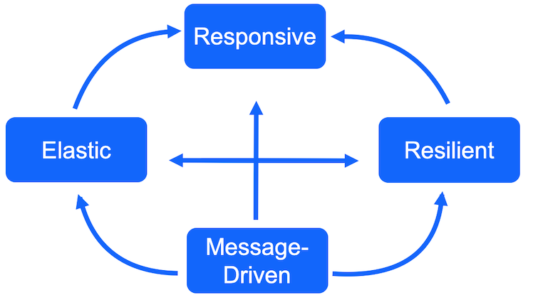
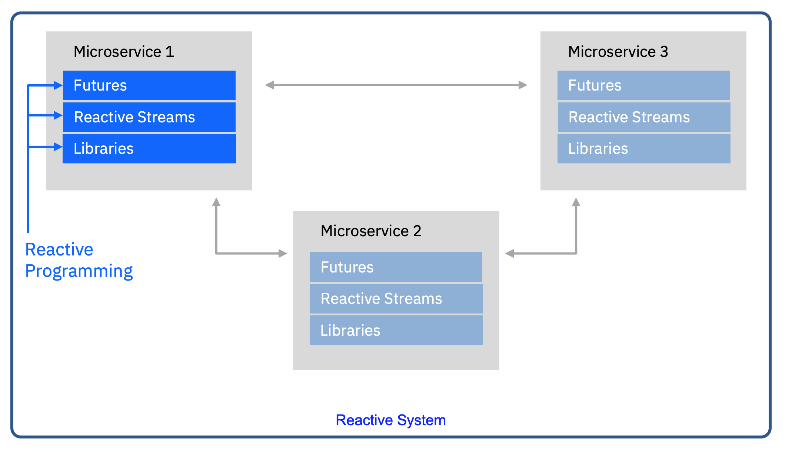

<InlineNotification kind="warning">
<strong>Updated 10/15/2020 - still working progress</strong> Updated /./
</InlineNotification>


This chapter describes how event driven architecture addresses the implementation of reactive systems and goes over the most recent technologies to implement such event-driven responsive solutions.

<AnchorLinks>
    <AnchorLink>Overview</AnchorLink>
    <AnchorLink>EDA and reactive systems</AnchorLink>
    <AnchorLink>Technology review</AnchorLink>
    <AnchorLink>More...</AnchorLink>
</AnchorLinks>

## Overview

Modern business applications embrace the strong need to be responsive, bringing immediate response and feedbacks to the end user or system acting on it at the moment it needed. Modern solution based on microservices need to support load and failure and developers adopt the reactive manifesto and modern programming libraries and software to support the manifesto characteristics. 

The [reactive manifesto](https://www.reactivemanifesto.org/) defines four characteristics modern cloud native application needs to support:

 


* **Message driven**: the underlying behavior is to have an asynchronous message driven backbone, to enable loose coupling of the application components by exchanging asynchronous messages to minimize or isolate the negative effects of resource contention, coherency delays and inter-service communication network latency. It is the base to support the other reactive characteristics. It also helps for isolation and support location transparency.
* **Elastic**: The system stays responsive under varying workload, it can scale up and down the resource utilization depending of the load to the system.
* **Resilient**: stay responsive in the face of failure, this is a key characteristics. It implies distributed systems.
* **Responsive**: deliver a consistent quality of service to end users or systems, react quickly and consistently to events happening in the system.

Reactive architecture is an architecture approach aims to use asynchronous messaging or event driven architecture to build Responsive, Resilient and Elastic systems. 

Under the "reactive" terms we can see two important caveats:

* **Reactive systems** is a group of application components which can heal and scale automatically. It address data consistency, cross domain communication, orchestration, failure, recovery... 
* **Reactive programming** is a subset of asynchronous programming and a paradigm where the availability of new information drives the logic forward rather than having control flow driven by a thread-of-execution. This is the adoption of non-blocking IO and event-based model.

The following figure illustrates well how those two paradigms work together to deliver business value:

 

We recommend to go over [this excellent IBM article on defining reactive](https://ibm.biz/DefiningReactive
) to go deeper into those concepts.

### Is it for me?

We have learnt from years of point to point microservice implementations, that embrassing asynchronous communication helps a lot to support scaling, integration, coupling and failover. So adopting reactive design and implementation may look complex at first but is becoming a necessity in the long run. In e-commerce, a lot of monolithic applications were redesigned to adopt reactive manifesto characteristics to support scaling the business needs and respond to sporadic demand. In the world of big data, collecting, aggregating, applying real time analytics, decisions and AI need to scale and respond to events at the time of occurence. 

## EDA and reactive systems

The adoption of event driven microservice implementation fits well into the reactive manifesto, where most of the work presented in this git repository started by adopting Kafka as event backbone, it is too reductor to think EDA is just Kafka. EDA supports reactive systems at large, and developing event-driven microservice should use reactive libraries to support non-blocking IO and event bus for inter process communication. Also microservices is part of the game, functions / serverless are also in scope and with serverless 2.0, knative eventing is one of the new kids in the play.

The manifesto stipulates "message driven" while EDA is about events. Events represent unmmutable data and facts about what happened, and components subscribe to those event streams. Message content data sent to a specific destination or consumer. For sure we define EDA implementations to cover both. And we should not be purist and opinionated about that much: it will not make any sense to say: you are using queue to exchange message while we produce events in topic, are different architectures, we see them to be part of a larger asynchronous based architecture. 

## Technology review 

### Concurrency

The following figure illustrates the traditional Java multi-threading approach to handle request and access I/Os on a two CPUs machine. When the second thread starts working on the IO the CPU is locked and now CPU yellow is supporting 2 threads (1 amd 3)

 

Non blocking IO framework or library adopts the `reactor pattern` where requests are now internal asynchronous events processed, in order, by an event loop running in one thread, and handlers (or callbacks) are used to process the response.

 

The above figure and next one are coming from Clement Escoffier's book [Building reactive microservice in Java](https://developers.redhat.com/promotions/building-reactive-microservices-in-java).

In multi CPUs, cores and threading computer, the reactors can run in parallel, with one event loop per core:

 

With non-blocking IO the IO operation can be allocated to another pool and the allocation of CPU to thread is well balaned: 

 

Vert.X is the open source library to build such non-blocking IO app, and using `vertices` to support scalable concurrent processor, which executes one event loop thread. `vertices` communicate asynchronously via an event bus.  

### Vert.x

We do not need to reintroduce [Vert.X](https://vertx.io/), but with the large adoption of Quarkus to develop new JVM based microservice, Vert.x is an important library to understand. The main concepts used in EDA are:

* An application would typically be composed of multiple vertices running in the same Vert.x instance and communicate with each other using events via the `event bus`.
* vertices remain dormant until they receive a message or event.
* Message handling is ideally asynchronous, messages are queued to the event bus, and control is returned to the sender
* Regular vertices are executed in the event loop
* Worker vertices are not executed on the event loop, which means they can execute blocking code
* Two event loops per CPU core thread
* No thread coordination mechanisms to manipulate a verticle state
* A verticle can be deployed several times as part of a container for example
* `Event bus` is used by different vertices to communicate through asynchronous message passing  (JSON)
(point to point, pub / sub, req / resp)
* We can have in memory event bus or clustered cross nodes, managed by Vert.x with a TCP protocol

Quarkus HTTP support is based on a non-blocking and reactive engine (Vert.x and Netty). All the HTTP requests your application receive are handled by event loops (IO Thread) and then are routed towards the code that manages the request. Depending on the destination, it can invoke the code managing the request on a worker thread (Servlet, Jax-RS) or use the IO Thread (reactive route).

 

(Images src: quarkus.io)

The application code should be written in a non-blocking manner using SmallRyie Mutiny or RsJava libraries.

So when interactive with different services using kafka as an inter service communication layer the producer and consumer are handlers and the internal processing can be schematized as:

 

### MicroProfile reactive messaging

The [MicroProfile Reactive messaging](https://download.eclipse.org/microprofile/microprofile-reactive-messaging-1.0/microprofile-reactive-messaging-spec.pdf) specification  aims  to  deliver  applications  embracing  the characteristics of reactive systems as stated by reactive manifesto. It enables non-blocking, asynchronous message passing between services, giving them the ability to scale, fail, and evolve independently.

To summarize the main concepts, developer declares channels as way to get in going or out going messages between  CDI Java beans, and connector to external message brokers:

 

The potential matching declarations for the above figure, may look like below for the connector:

```shell
# Kafka connector to items topic mapped to the item-channel
mp.messaging.incoming.item-channel.connector=smallrye-kafka
mp.messaging.incoming.item-channel.topic=items


```

And the code which defines a Kafka streams topology on the in coming messages:

```Java

```
See [this quarkus guide](https://quarkus.io/guides/reactive-messaging)

JMS and message driven bean, was the messaging API to asynchronously communicate with other application. It supports transaction and so it is an heavier protocol to use. They do not support asynchronous IO. 

When building microservices, the CQRS and event-sourcing patterns provide an answer to the data sharing between microservices. Reactive Messaging can also be used as the foundation to CQRS and Event-Sourcing  mechanism.

A lot of EDA repositories demonstrating EDA concepts are using microprofile 3.0 Reactive Messaging, as it simplifies the implementation to produce or consume messages to messaging middleware like Kafka.

When you use `@Incoming` and `@Outgoing` annotations, the runtime framework (Open Liberty or Quarkus) creates a Reactive Streams component for each method and joins them up by matching the channel names.

A [simple guide](https://quarkus.io/guides/kafka) from Quarkus web site with integration with Kafka. 

Open Liberty supports this [specification implementation](https://openliberty.io/blog/2019/09/13/microprofile-reactive-messaging.html).

### Reactive systems

The following diagram illustrates how things work together to support the reactive manifesto:

 

* To achieve **resilience** and **responsiveness**, microservice can scale vertically using vertices inside the JVM and horizontally via pod scaling capability on Kubernetes cluster. The inter-communication between vertices is done via `event bus` and managed by the Vert.x library using virtual addresses, service discovery and event bus. 
* Internal service communication (even cross pods) and external cross service boundary are **message driven**. Using Kafka, they are also durable improving resilience and recovery.
* Kubernetes enforces part of the reactive manifesto at the container level: **elasticity** and resilience with automatic pod recovery and scheduling.

### Mutiny

[Mutiny](https://smallrye.io/smallrye-mutiny) is a modern reactive programming library to provide more natural, readable reactive code. It supports asynchrony, non-blocking programming and streams, events, back-pressure and data flows.

With Mutiny both Uni and Multi expose event-driven APIs: you express what you want to do upon a given event (success, failure, etc.). These APIs are divided into groups (types of operations) to make it more expressive and avoid having 100s of methods attached to a single class.

[This section of the product documentation](https://smallrye.io/smallrye-mutiny/#_uni_and_multi) goes over some examples on how to use Uni/ Multi.

### AMQP 

[Advanced Message Queueing Protocol](https://www.amqp.org/ is an internaltional standard for interoperability between messaging middleware. IBM MQ [supports AMQP client](https://www.ibm.com/support/knowledgecenter/en/SSFKSJ_9.2.0/com.ibm.mq.dev.doc/amqp_scen_clients_mq.htm) via specific AMQP channel. Clients can connect to the queue manager and send / receive messages to / from queue. 

### Knative eventing

[Knative](https://knative.dev/) is Kubernetes based platform to develop serverless. Major value proposition is a simplified deployment syntax with automated scale-to-zero and scale-out based on HTTP load. 

Knative consists of the following components:

* Eventing - Management and delivery of events
* Serving - Request-driven compute that can scale to zero

See the [RedHat Knative cookbook](https://redhat-developer-demos.github.io/knative-tutorial/knative-tutorial/index.html)for a simple tutorial.

## Code samples

* [Vert.x kafka client](https://vertx.io/docs/vertx-kafka-client/java/)
* [Experiences writing a reactive Kafka application](https://developer.ibm.com/tutorials/transforming-a-kafka-application-to-be-reactive/)

## More...

* [Reactive Systems Explained - Book from Grace Jansen - Peter Gollmar](ibm.biz/ReactiveReport)
* [Reactive Java Modules show how to build an event-driven, streams-optimized Kafka-based Java application. You will use the Eclipse MicroProfile Reactive Messaging API and Open Liberty to build it and then you'll learn how to test it in true-to-production environments by using containers with MicroShed testing.](https://ide.skillsnetwork.site/reactive-java-workshop)
* [Resiliency discussion in IBM architecture center]( (https://www.ibm.com/cloud/architecture/architectures/resilience))
* Clement Escoffier's book [Building reactive microservice in Java](https://developers.redhat.com/promotions/building-reactive-microservices-in-java)