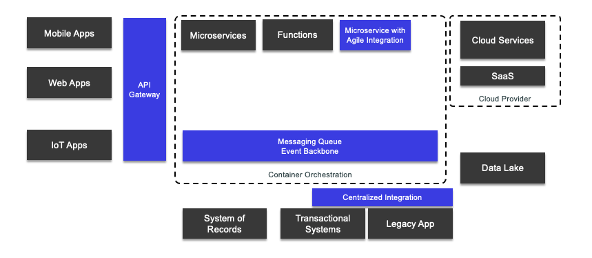
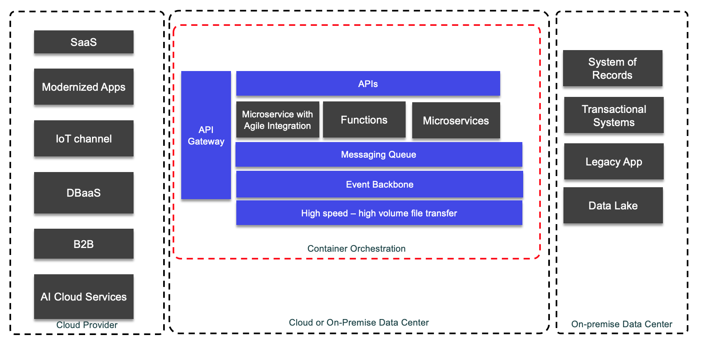

Event driven architecture is a complement of integration reference architecture as [presented in IBM Cloud architecture center](https://www.ibm.com/cloud/architecture/architectures/modern-integration/overview).

In this note we want to summarize some of the important aspects of agile integration and how some of the technologies delivered as part of IBM Cloud Pak for Integration are used in our different labs and reference implementations.

First let do a quick review of the major concept for agile integration.

## Agile integration concepts

This section presents the key points developed in detail in the [IBM cloud on agile integration article](https://www.ibm.com/cloud/integration/agile-integration):

* empower extended teams to create integrations, leverages a complete set of integration styles and capabilities, and increases overall productivity.
* agile integration—a container-based, decentralized, microservices-aligned approach for integrating solutions
* centralized integration architectures cannot support the demand
* ESB pattern provides standardized synchronous connectivity to back-end systems typically over web services. ESB formed a single infrastructure for the whole enterprise, with tens or hundreds of integrations installed on a production server cluster.
* A single, centralized ESB certainly simplifies consistency and governance of implementation.
* Interface maintenance is expensive.
* Any deployment to the shared servers runs the risk of destabilizing existing critical interfaces.
* SOA encounters the issue of who to fund enterprise wide program interface.
* Integration teams are the bottleneck instead of being enabler.
* SOA is about real-time integration between applications, whereas a microservices architecture is about how the applications are built internally.
* microservice enables greater agility:
   * small enough to be understood completely by their owning team and changed independently
   * Elastic scalability
   * Discrete resilience: changes to one microservice will not affect others at runtime

* Three aspects to agile integration:

    1. **Decentralized integration ownership**: give application teams more control over the creation and exposure of their own integration exposed as APIs, or messages
    1. **Fine-grained integration deployment** to separate integration, scalable independently. Changes to individual integration flows can be automatically rebuilt and deployed independently of other flows to enable safer application of changes and maximize speed to production.
    1. **Cloud-native integration infrastructure** to improve productivity, operational consistency and portability for both applications and integration

## Cloud Pak for Integration capabilities relevant to this site

### API management

* easier to discover new business assets (APIs and events) in current enterprise systems
* existing enterprise assets are made available to new channels and new audiences, with enriched customer experience in integrated omnichannel interactions

### App connect

Connect applications and data sources on premises or in the cloud to coordinate the exchange of business information so that data is available when and where it’s needed.

Capabilities:

* Low-code/no-code integration tooling leverages natural language processing (NLP) and AI to offer custom mapping suggestions when building integration flows.
* Pre-built smart connectors and a common, shareable asset repository increases speed of delivery and eliminates concerns about mismatched sources, formats, or standards

#### Labs

* [Secure API, App connect and MQ](https://www.ibm.com/cloud/garage/dte/tutorial/unlock-your-enterprise-data-using-secure-apis-app-integration-flows-and-reliable-messaging): older version of the UI in screen shots

### Messaging

Messaging is to support asynchronous communication between applications. Two technologies are part of the reference architecture, queuing and pub/sub.

#### IBM MQ

See a technology summary in [this note](/technology/mq/) and this [MQ to Kafka lab](/use-cases/connect-mq/). 

#### Kafka based product 

This site includes a lot of content around Kafka [(see this technology summary)](/technology/kafka-overview/), but the major capabilities of interest in term of agile integration is the pub/sub model, long term persistence via append log and replication to support high availability and resiliency, with data streaming logic, and a lot of connectors to source data or sink data to external systems. 

Kafka scale and is a reliable messaging system for modern event-driven microservice solution.

## Bridge your digital ecosystem and core enterprise

At a high level, modern integration involves bridging the capabilities between your digital ecosystem and your traditional core enterprise. The bridging takes place in a seamless, frictionless way so that you can uniformly operate your entire business anytime, anywhere, regardless of technological fluctuations.

In your digital transformation journey, your digital ecosystem and your core enterprise constantly change. You need a set of integration capabilities to support rapid change to interface, develop new business oriented integration flow to consume cloud services and software as a service, get visibility to the data in motion, integrate with existing transactional systems and system of record. 

You modern cloud native applications use microservice design, function as a service, and may use agile, no code, integration logic to integrate with existing systems, SOA services, or cloud based services. Modern applications are reusing public cloud services, like CRM application, Database as a service, Chat bot as a services... Those services can be offered by different cloud providers, and architects will select the best services according to their requirements and cost / benefits analysis. A unique cloud provider will not have all the best useful services, and hybrid cloud is a standard approach in the 2020s. What is important is to get a set of tool that makes the integration easy to do with simple configuration to integrate with the needed data and inject those data in the operational messaging system for other to consumer. This agile integration follows the same DevOps pattern as other microservices. 

The messaging layer can support point to point, request/reply type of communication, or a pub/sub model with long retention time, and data streams processing. This data injection layer can be a [buffer to modern data lake](/introduction/reference-architecture/#modern-data-lake).

Finally existing applications, system of records, transactional systems have to be integrated, consumed and accessed from modern applications, with new digital channel like mobile and single page web application.  

API management is an important elements of the integration, to manage and provide API economy but also secure access to internal systems, with controlled traffic. This is the role of the API gateway.

## Optimize your integration platform

A vendor neutral hybrid cloud, that uses open standards and container orchestration technology, presents the optimal platform for modern integration. It addresses multicloud operations, different deployment options, and integration patterns within a modular and scalable environment.

As shown in the diagram below, the integration platform must accommodate many integration patterns and have that support ready on demand and as a self-service model.

* API integration enables synchronous access to fine-grained services, such as create, retrieve, update, and delete operations to business objects across various backends. Thus, the composition of the integration logic on the consumer side. Modern API management also includes the management of AsynchAPI for messaging systems and asynchronous communication between event-driven microservices.

* Application data integration enables synchronous access to coarse-grained services such as transaction processing across various backends in accordance with enterprise compliance requirements. Thus, the governance of integration logic on the provider side.

* Enterprise messaging enables asynchronous point-to-point access to services such as those that involve closed heritage systems, transactional integrity systems or heterogeneous partner backends.

* Event publish/subscribe integration enables asynchronous many-to-many coordination of services across both cloud and on-premises components in an event-driven architecture context.

* File transfer enables batch integration between SORs that involves the movement of large data files for content across vast physical distances within short time windows.

The integration platform must provide a unified framework for security, management operations, and resiliency. The container orchestration platform provides resiliency through the elasticity of container clusters and platform-level security. The unified management component provides ease of operations with a single view across all integration components within the platform. The gateway services provide runtime-level security and enforce access control policies to integration services.