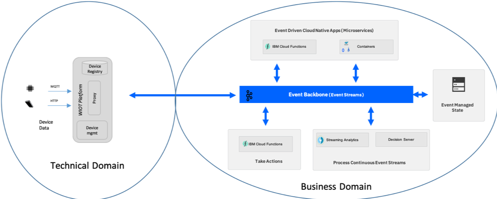
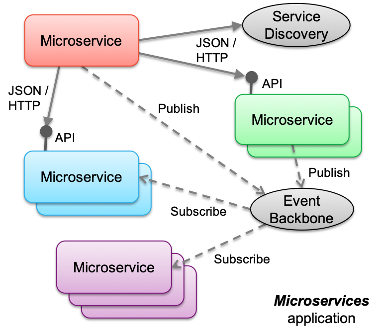

<AnchorLinks>
  <AnchorLink>Events</AnchorLink>
  <AnchorLink>Event streams</AnchorLink>
  <AnchorLink>Event backbone</AnchorLink>
  <AnchorLink>Event sources</AnchorLink>
  <AnchorLink>Microservices</AnchorLink>
  <AnchorLink>Commands</AnchorLink>
  <AnchorLink>Loose coupling</AnchorLink>
  <AnchorLink>Cohesion</AnchorLink>
</AnchorLinks>

## Events

Events are notifications of change of state.  Notifications are issued, or published and interested parties can subscribe and take action on the events. Typically, the issuer of the notification has no knowledge of what action is taken and receives no corresponding feedback that the notification has been processed.

* Events are notifications of change of state.
* Typically, events represent the change of state of something of interest to the business.
* Events are records of something that has happened.
* Events can't be changed, that is, they are immutable. (We can't change something that has happened in the past).

## Event streams

An event stream is a continuous unbounded series of events.

* The start of the stream may have occurred before we started to process the stream.
* The end of the stream is at some unknown point in the future.
* Events are ordered by the point in time at which each event occurred.

When developing event driven solutions, you will typically see two types of event streams:

* Event streams whose events are defined and published into a stream as part of a solution.
* Event streams that connect to a real-time event stream, for example from an IOT device, a voice stream from a telephone system, a video stream, or ship or plane locations from global positioning systems.

## Event backbone

The event backbone is the communication layer in the event driven architecture.  It provides the connection between event driven capabilities and in the *Cloud Native*, it becomes the Pub/Sub communication layer for event driven microservices.

At this high level we would consider two types of relevant technologies for the event backbone, *Message Brokers* and *Event Logs*.  Both technology types could be used to achieve the event communication style, with the "Publish and subscribe" model however, it is also important to consider other capabilities which are frequently used within event driven solutions:

* Keeping an **Event Log** as a time sequenced as it happened recording of events (Source of the truth).
* Enabling direct **replay** of events.
* Enabling **Event Sourcing** as a way of recording state changes in distributed systems.
* Enabling **programmatic access** to the *continuous event stream*.

When viewed across these wider event driven capabilities, an event log style technology can provide a central component which can support all of these capabilities, whereas a message broker would have to be extended with other components.

### Selecting the Event Backbone for the reference architecture

For the event-driven architecture, we defined the following characteristics to be essential for the *event backbone:*

* Publish-subscribe event communication between event producers and consumers
* Facilitate many consumers with shared central “source of truth”.
* Capability to store events for a given period of time (event log). This is the shared source of the truth for events.
* Ability for consumers to subscribe to events.
* Provide replay of events from history for evolving application instances.
* Provide programmatic access to continuous stream of events, with minimum time lag.
* Must be highly scalable and resilient to cloud deployment levels.

<Accordion>
<AccordionItem title="Event backbone considerations">

While choosing an event backbone for your event-driven application development, the following functional and non-functional requirements should be taken into consideration:

#### Persistence

When source systems generate events, the consumers of those are interested in those events may not be online or available at the same time. So you need a way to store these messages for a configurable period of time until they are consumed and acted upon. Event backbone should be able to provide such event persistence.

#### Observability

At times, you need an overall view of how events are ingested by source systems and getting processed by consumers. It could be a management console where events can be observed. Event backbone should provide such observability.

#### Fault tolerance

Event backbone could be made of several components. If one of them becomes unavailable, there should not be any impact on the event processors dependent on the backbone. Event backbone needs to provide this resiliency.

#### High availability
Event backbone provides persistence of messages/events. If one of the components of the backbone becomes unavailable, there should not be any impact on the availability of these messages/events. Event backbone should be highly available.

#### Performance
Event backbone should provide means of accelerating the event processing operations (e.g. parallelising event processing) thereby providing enhanced performance.

#### Delivery guarantees
Event backbone should support guaranteed delivery both for producer and consumer. It should support the delivery guarantee options of `at least once`, `at most once`, and `exactly once`.

#### Security
The data residing in the event backbone should be secured, at rest as well as in transit. Only authenticated and authorized users should be able to publish and consume messages from the backbone. Topic specific authorizations will also help blocking access by unauthorized consumers. Event backbone should provide these security measures.

#### Stateful operations for events streams
Sometimes, source systems generate a continuous flow of 'inter-related' events (e.g. IoT sensors sending data every second). In order to process such messages correctly, the event backbone needs to support for stateful operations like windowing, joins, aggregations. and any type of real time analytics.

#### Event routing options
In EDA, event consumers may not be online at all times. So, it should be easier for consumers to subscribe to a topic when it comes online.

#### On-failure hooks
Event backbone can support pre-configured actions/behaviors for certain messages. E.g. if a consumer fails to process a message more than a certain number of times, that message can be sent to another topic for re-trying the processing action.

</AccordionItem>
</Accordion>

Looking across these capabilities, the potential technologies, the amount of adoption and community activity around the technologies, and the considerations listed above, we selected [Apache Kafka](https://kafka.apache.org) as our event backbone for the event-driven reference architecture.

## Event sources

When you consider an event-driven architecture, think about event producers and event consumers as the interaction points with events. As you develop event-driven applications following a microservices architecture, the microservices you develop play the role of both event producers and event consumers, with the events being passed as the communication payload between them.
However, as you look at the wider opportunities that being event driven offers, you need to widen your view and consider event sources that come from beyond the application code you are writing.  These are events that may be produced from outside our immediate system but have business relevance or enable us to gain valuable insights into things that are affecting your business.

### Here is a list of common event sources:

* IoT devices or sensors showing device status changes
* Click Stream data from web or mobile applications
* Mobile applications (HTTP to Back-end for Front-end service and then to topic)
* Geospatial data
* Weather alerts
* Social media feeds
* Real-time voice feeds
* Other messaging backbone
* Data change event streams from databases (change data capture)

### IoT devices and sensors

With IoT devices and sensors you typically have a gateway providing the connectivity for the device, and a level of event enrichment and filtering. In terms of domain driven design you would see the device and gateway as being the technical domain and the event-driven reference architecture as providing the infrastructure for the applications in a business domain.
In practice, the IoT gateway or platform provides the connectivity and is the point of filtering and consolidation of events so that only business-relevant events are passed up to the business domain. The gateway can also be the point where the technical event is enhanced to relate to something recognizable at the business level.  One example of this is to relate a device number or identifier in the event to something that the business recognizes.

### Clickstream data

Clickstream data is often used to understand the behavior of users as they navigate their way through web or mobile apps. It provides a recording of the actions they take, such as the clicks, the mouse-movements, and the gestures.  Analysis of the clickstream data can lead to a deep understanding of how users actually interact with the application. It enables you to detect where users struggle and to look for ways to improve the experience.

Processing the clickstream in real time in an event-driven architecture can also give rise to the opportunity to take direct action in response to what a user is currently doing, or more accurately has just done.

There are various "collectors" that enable collection of standard clickstream events and allow custom actions to be collected as events typically through tags in Javascript.

Within the Apache Open Source communities the [Divolte](https://divolte.io/) collector is an example of one of these collectors that directly publishes events to Kafka topics.

### Event standards and schemas

Where you have control as the producer of an event we should consider having an event schema and following a standard to provide the best opportunity for portability of the solutions across cloud environments.
With a lack of formal standards, a working group under the Cloud Native Computing Foundation (CNCF) has recently been formed to define and propose [Cloud Events](https://cloudevents.io/) as the standard.

## Microservices

The event-driven reference architecture provides support for event-driven microservices - microservices which are connected through and communicate via the pub/sub communication protocol within an event backbone.

With Kafka as the event backbone and pub/sub messaging provider, microservices can use the Kafka API's to publish and listen for events.

On cloud-native platforms, microservices are the application architecture of choice. As businesses become event-driven, event driven pattern needs to extend into our microservices application space. This means that your microservices are still doing REST calls to well-known microservice but they must respond to and send out events, or in event-driven terms they need to be both event producers and consumers to enforce strong decoupling.

With the adoption of microservices, the focus on synchronous communication between services has increased. Service mesh packages such as [Istio](https://istio.io/) help with the management of communication, service discovery, load balancing, and visibility in this synchronous communication environment.

With event-driven microservices, the communication point becomes the Pub/Sub layer of the event backbone. By adopting an event-based approach for intercommunication between microservices, the microservices applications are naturally responsive (event-driven). This approach enhances the loose coupling nature of microservices because it decouples producers and consumers.  Further, it enables the sharing of data across microservices through the event log.
These *event* style characteristics are increasingly important considerations when you develop microservices style applications. In practical terms microservices applications are a combination of synchronous API-driven, and asynchronous event-driven communication styles. For the implementation point of view a set of established patterns are used, such as Database per Service, Event Sourcing, Command Query Responsibility Segregation, Saga, ...

### Event-driven apps with containers

While the serverless approach with Cloud Functions provides a simplified event-based programming model, the majority of microservices applications today are developed for and deployed to a container-based cloud-native stack.  Within the cloud-native landscape, Kubernetes is the standard platform for container orchestration, and therefore becomes the base for the container platform in the event-driven architecture.

As before, the event backbone is the Pub/Sub communication provider and event log for shared data for the microservices. In this context microservices are developed as direct consumers and producers of events on the backbone via topics.  The extra work in this environment is in managing consumer instances to respond to the demand of the event stream. You must determine how many consumer instances need to be running to keep pace with, or always be immediately available to execute, the microservice in response to an arriving event.

## Commands

<InlineNotification kind="warning">Content currently under review - Elaborate</InlineNotification>

A command, is an instruction to do something. Typically, commands are directed to a particular consumer. The consumer runs the required command or process, and passes back a confirmation to the issuer stating that the command has been processed.

## Loose coupling

Loose coupling is one of the main benefits of event-driven processing. It allows event producers to emit events without any knowledge about who is going to consume those events. Likewise, event consumers don't need to be aware of the event emitters. Because of this, event consuming modules and event producer modules can be implemented in different languages or use technologies that are different and appropriate for specific jobs. Loosely coupled modules are better suited to evolve independently and, when implemented correctly, result in a significant decrease in system complexity.

Loose coupling, however, does not mean “no coupling”. An event consumer consumes events that are useful in achieving its goals and in doing so establishes what data it needs and the type and format of that data. The event producer emits events that it hopes are understood and useful to consumers thus establishing an implicit contract with potential consumers. For example, an event notification in XML format must conform to a certain schema that must be known by both the consumer and the producer.  One of the most important things that you can do to reduce coupling in an event-driven system is to reduce the number of distinct event types that flow between modules. To do this you must pay attention to the cohesiveness of those modules.

## Cohesion

Cohesion is the degree to which related things are encapsulated together in the same software module. For the purposes of this EDA discussion, a module is defined as an independently deployable software unit that has high cohesion. Cohesion is strongly related to coupling in the sense that a highly cohesive module communicates less with other modules, thus reducing the number of events most importantly, the number of event types in the system. The less frequently modules interact with each other, the less coupled they are. Achieving cohesion in software while optimizing module size for flexibility and adaptability is difficult, but something to strive for. Designing for cohesion starts with a holistic understanding of the problem domain and good analysis work. Sometimes it must also take into account the constraints of the supporting software environment. Monolithic implementations and implementations that are excessively fine-grained must be avoided.
