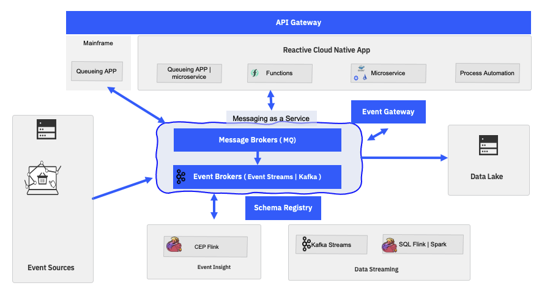

This chapter is to get you understanding what is Event-Driven architecture,
what is Kafka, how to consider Messaging as a service as a foundations for
event-driven solution, and getting started on Event Streams and MQ.

<AnchorLinks>
  <AnchorLink>Important concepts around Event-driven solution and Event-driven architecture</AnchorLink>
  <AnchorLink>Use Cases</AnchorLink>
  <AnchorLink>Why microservices are becoming event-driven and why we should care?</AnchorLink>
  <AnchorLink>Messaging as a service?</AnchorLink>
  <AnchorLink>Understand Kafka technology</AnchorLink>
  <AnchorLink>So what is Event Streams?</AnchorLink>
  <AnchorLink>Fit for purpose</AnchorLink>
  <AnchorLink>Frequently asked questions</AnchorLink>
</AnchorLinks>

## Important concepts around Event-driven solution and Event-driven architecture

The [term and definitions](http://localhost:8000/concepts/terms-and-definitions/) try to get
a clear definitions for events, event streams, event backbone, event sources....

The main [reference architecture presentation is in this section](/introduction/reference-architecture/#event-driven-architecture).

 

With a review of the [main technical use cases]() that cover most of the current business use cases.

## Use Cases

We have different level of use cases in this repository: 

The generic use cases which are the main drivers for EDA adoption are [summarized here](/introduction/usecases/). 

And some reference implementations to illustrate the major EDA design patterns:

| Scenario                           | Description         | Link        |
| --------------------------------| ------------------  |:----------- |
| Shipping fresh food over sea _(external)_ | The EDA solution implementation using event driven microservices in different language, and demonstrating different design patterns. | [EDA reference implementation solution](https://ibm-cloud-architecture.github.io/refarch-kc/)|
| Vaccine delivery at scale _(external)_ | An EDA and cross cloud pak solution | [Vaccine delivery at scale](https://ibm-cloud-architecture.github.io/vaccine-solution-main/)
| Real time anomaly detection _(external)_ | Develop and apply machine learning predictive model on event streams | [Refrigerator container anomaly detection solution](https://ibm-cloud-architecture.github.io/refarch-reefer-ml/)|

## Why microservices are becoming event-driven and why we should care?

There is a section to explain why microservices are becoming event-driven. 

## Messaging as a service? 

Yes EDA is not just Kafka, IBM MQ and Kafka should be part of any serious EDA deployment.

## Understand Kafka technology

You may want to read from the [Kafka] documentation](https://kafka.apache.org/documentation/#intro_nutshell) to understand the main concepts, but we have
also summarized those into [this chapter](/technology/kafka-overview/) and if you like quick 
video, here is a seven minutes review of what Kafka is:

<iframe width="560" height="315" src="https://www.youtube.com/embed/aj9CDZm0Glc" frameborder="0" allow="accelerometer; autoplay; encrypted-media; gyroscope; picture-in-picture" allowfullscreen></iframe>

The major building blocks are summarized in this diagram:

To learn more about:

* Kafka Cluster see [this 101 content](/technology/kafka-overview/#kafka-components)
* For Producer introduction [see this section]()
* For Consumer introduction with consumer group concepts [see this section]()
* For [Kafka Connector framework introduction]()

## So what is Event Streams?

Event Streams is IBM packaging of Kafka with some enhanced features, and available as [Managed Service](https://www.ibm.com/cloud/event-streams)
or as part of Cloud Pak for integration. [Here is a developer.ibm.com article for Event Streams on Cloud](https://developer.ibm.com/articles/event-streams-fundamentals/?mhsrc=ibmsearch_a&mhq=ibm%20event%20streams).

The product documentation as part of cloud pak for integration is [here]().

### Event streams resource requirements

See the [detailed tables](https://ibm.github.io/event-streams/installing/prerequisites/#helm-resource-requirements) in the product documentation.

## Fit for purpose

We have a [general fit for purpose document](/concepts/fit-to-purpose/) that can help you reviewing message versus events,
MQ versus Kafka, but also Kafka Streams versus Apache Flink.

## Getting Started With Event Streams

The most easy way to start is to create a Event Streams on IBM Cloud service, and then connect
a starter application.

Developer who wants to start quickly and run a local simple cluster, can use docker compose to start a simple
Kafka broker and zookeeper. We have developed such compose file in different project
but we have centralize it in [this gitops project](https://github.com/ibm-cloud-architecture/eda-gitops-catalog) under
the `RunLocally` folder.

Finally if you have access to an OpenShift Cluster, version 4.7 + we can deploy 
Event Streams as part of IBM Cloud Pak for Integration very easily using the
OpenShift Admin console, and we did a simple [step by step tutorial here]() 
or use our gitops catalog and the following procedure.

If you want to adopt an pure GitOps approach we have demonstrated how to use
ArgoCD (OpenShift GitOps) to deploy an Event Streams cluster and maintain it states.  

## Frequently asked questions

A [separate FAQ document](/technology/faq) groups the most common questions around Kafka.