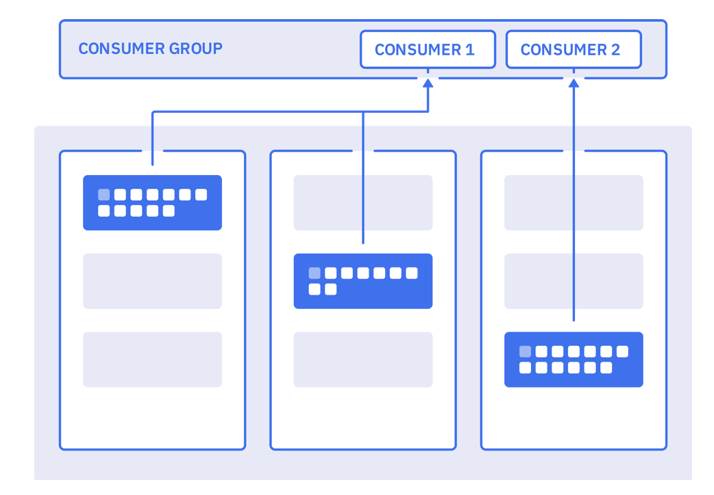

This note includes some quick summary of different pratices we discovered and studied over time. It may be useful for beginner or seasonned developers who want some refresh after sometime out of kafka.

Updated 4/7/2020

## Important concepts

Consumers belong to **consumer groups**. You specify the group name as part of the connection parameters.

```java
  properties.put(ConsumerConfig.GROUP_ID_CONFIG,  groupid);
```

Consumer groups are grouping consumers to cooperate to consume messages from one or more topics. Consumers can run in separate hosts and separate processes.



Organized in cluster the coordinator servers are responsible for assigning partitions to the consumers in the group. The rebalancing of partition to consumer is done when a new consumer joins or leaves the group or when a new partition is added to an existing topic (via admin tool). There is always at least one consumer per partition. If a topic has multiple partitions and there is only one consumer in the consumer group, it will get all the messages from all the partitions.

Membership in a consumer group is maintained dynamically. When a consumer fails, the partitions assigned to it will be reassigned to other consumers in the same group. When a new consumer joins the group, partitions will be moved from existing consumers to the new one. Group rebalancing is also used when new partitions are added to one of the subscribed topics. The group will automatically detect the new partitions through periodic metadata refreshes and assign them to members of the group.


Implementing a Topic consumer is using the kafka [KafkaConsumer class](https://kafka.apache.org/24/javadoc/?org/apache/kafka/clients/consumer/KafkaConsumer.html) which the API documentation is a must read.

In it interesting to note that:

* To support a queue processing like other integration messaging systems are doing, you need to have all the consumers assigned to a single consumer group, so that each record delivery would be balanced over the group like with a queue.
* To support pub/sub like other messaging systems, each consumer would have its own consumer group, and subscribes to all the records published to the topic.

The implementation is simple for a single thread consumer, and the code structure looks like:

* prepare the consumer properties
* create an instance of KafkaConsumer to connect to a topic
* loop on polling events: the consumer subscribes to a set of topics and ensures its liveness with the broker via the poll API
    * process the ConsumerRecords and commit the offset by code or use the autocommit attibute of the consumer

As long as the consumer continues to call poll(), it will stay in the group and continue to receive messages from the partitions it was assigned. When the consumer does not send heartbeats for a duration of `session.timeout.ms`, then it is considered dead and its partitions will be reassigned.

Examples of Java consumers can be found in [the order management microservice project](https://github.com/ibm-cloud-architecture/refarch-kc-order-ms/blob/master/order-command-ms/src/main/java/ibm/gse/orderms/infrastructure/kafka/OrderEventAgent.java) under the order-command-ms folder. 

We are proposing a deep dive study on this manual offset commit in [this consumer code](https://github.com/jbcodeforce/quarkus-event-driven-consumer-microservice-template) that persists events to cassandra. 
Example of Javascript implementation is in [this repository/folder](https://github.com/ibm-cloud-architecture/refarch-kc-ms/blob/master/voyages-ms/server/utils/kafka.js)

But the complexity comes from the offset management and multithreading needs. So the following important considerations need to be addressed while implementing a consumer.

## Assess number of consumers needed

The KafkaConsumer is not thread safe so it is recommended to run in a unique thread. But if needed you can implement a multi-threads solution, but as each thread will open a TCP connection to the Kafka broker, be sure to close the connection to avoid memory leak. The alternate is to start n processus (JVM process).

If you need multiple consumers running in parallel to scale horizontally, you have to define multiple partitions while configuring the topic and use fine-grained control over offset persistence. You’ll use one consumer per partition of a topic.
This consumer-per-partition pattern maximizes throughput. When consumers run in parallel and you use multiple threads per consumer you need to be sure the total number of threads across all instances do not exceed the total number of partitions in the topic.

Also, a consumer can subscribe to multiple topics. The brokers are doing rebalancing of the assignment of topic-partition to a consumer that belong to a group. When creating a new consumer you can specify the group id in the options.

## Offset management

Recall that offset is just a numeric identifier of a consumer position of the last record read within a partition. Consumers periodically need to commit the offsets of messages they have received to show they have processed the messages and in case of failure from where they should reconnect. It is possible to commit by calling API or by setting some properties at the consumer creation level to enable autocommit offset. 

When doing manual offset commit, there are two types of approaches:

* offsets—synchronous
* asynchronous

```
```

As soon as you are coding manual commit, it is strongly recommended to implement the ConsumerRebalanceListener interface to be able to do the state modifications when the topic is rebalanced. 

When dealing with heavy load storing offset in zookeeper is non advisable. It is even, now recognized as a bad practice. To manage offset use the new consumer API, and for example commits offset synchronously when a specified number of events are read from the topic and the persistence to the back end succeed.

Assess if it is acceptable to loose messages from topic.  If so, when a consumer restarts it will start consuming the topic from the end of the queue.

As storing a message to an external system and storing the offsets are two separate operations, and in case of failure between them, it is possible to have stale offsets, which will introduce duplicate messages when consumers restart to process from last known committed offset. In this case, idempotence is needed to support updating the same row in the table, or use the event timestamp as update timestamp in the database record or use other clever solution.

As presented in the producer coding practice, using transaction to support "exactly-once", also means the consumers should read committed data only. This can be achieved by setting the `isolation.level=read_committed` in the consumer's configuration. The last offset will be the first message in the partition beloging to an open not yet committed transaction. This offset is known as the 'Last Stable Offset'(LSO).

## Repositories with consumer code

* Within the Reefer ontainer shipment solution we have a order events consumer: [order event agent](https://github.com/ibm-cloud-architecture/refarch-kc-order-ms/blob/master/order-command-ms/src/main/java/ibm/gse/orderms/infrastructure/kafka/OrderEventAgent.java)
* [Nodejs kafka consumers and producers](https://github.com/ibm-cloud-architecture/refarch-kc-ms/blob/master/voyages-ms/server/utils/kafka.js)
* [A lot of python consumer in the integration tests, with or without Avro schema](https://github.com/ibm-cloud-architecture/refarch-kc/tree/master/itg-tests/kafka)

## Kafka useful Consumer APIs

* [KafkaConsumer](https://kafka.apache.org/11/javadoc/org/apache/kafka/clients/consumer/KafkaConsumer.html) a topic consumer which support:
  * transparently handles brokers failure
  * transparently adapt to partition migration within the cluster
  * support grouping for load balancing among consumers
  * maintains TCP connections to the necessary brokers to fetch data
  * subscribe to multiple topics and being part of consumer groups
  * each partition is assigned to exactly one consumer in the group
  * if a process fails, the partitions assigned to it will be reassigned to other consumers in the same group
* [ConsumerRecords](https://kafka.apache.org/11/javadoc/org/apache/kafka/clients/consumer/ConsumerRecords.html) holds the list ConsumerRecord per partition for a particular topic.
* [ConsumerRecord](https://kafka.apache.org/11/javadoc/org/apache/kafka/clients/consumer/ConsumerRecord.html) A key/value pair to be received from Kafka. This also consists of a topic name and a partition number from which the record is being received, an offset that points to the record in a Kafka partition, and a timestamp

## References

* [IBM Event Streams - Consuming messages](https://ibm.github.io/event-streams/about/consuming-messages/)
* [KafkaConsumer class](https://kafka.apache.org/10/javadoc/?org/apache/kafka/clients/consumer/KafkaConsumer.html)
