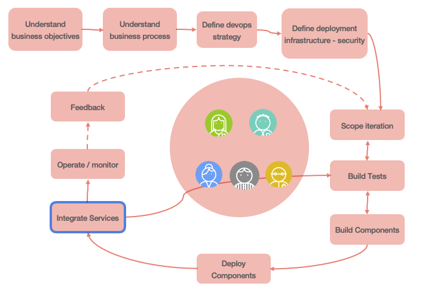
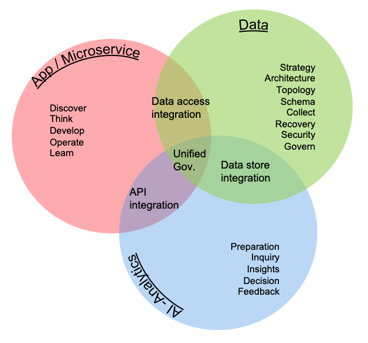

In this section we are introducing the different elements of the software life cycles, particular to the development of intelligent applications that leverage data, machine learned models, analytics and cloud native microservices.

The method supports lightweight development practices, to start the implementation of a MVP [(Minimum Viable Product)](https://en.wikipedia.org/wiki/Minimum_viable_product), to support scaling-up the architecture and the complexity of an end-to-end integrated solution. This method always guarantees to have deployable components at any point in time, a concept known in CI/CD (Continuous Integration, Continuous Delivery) applied to microservices, integration, data and machine learning models.

## Integrating data - devops and AI-Analytics development practices

Most organizations need to manage software lifecycles. The key tenets listed above imply the need for a separate lifecycle for data, because the outcome or deliverable for any of the key tenets should not be considered static and immutable. Like data, you can think of analytics as having its own lifecycle independent from the software lifecycle and the data lifecycle, although they are all complementary.

To help achieve digital transformation, your organization should integrate three development lifecycles:

* Software/Application
* AI-Analytics
* Data

Each development lifecycle is representative of an iterative workflow that can be used by agile development teams to craft higher value business outcomes. Lifecycles are often timeboxed iterations and can follow a fail-fast paradigm to realize tangible assets. Speed is important in business; most businesses work to meet new needs quickly. The objective of each lifecycle iteration is to address business speed efficiently and proficiently while maximizing business value. 

### Personas

We recommend reading [this article](https://www.ibm.com/garage/method/practices/culture/assemble-team-for-data-driven-project) to **assemble the team to support a data-driven project** where many roles support the project execution. The following table presents the icons we are using in subsquent figures, with a short description for the role.

#### Differences between analysts and data scientists

The MITSloan did a review of the major differences between data scientists and business analysts by considering a set of common dimensions. The table below summarizes the results:

|     | Analysts | Data Scientists |
| --- | --- | --- |
| Types of data | Structured mostly numeric data | All data types, including unstructured data | 
| Preferred tools| Statistical and modeling tools using data repository | Programming language with strong statistical library, machine learning, deep learning. Use ML cluster servers| 
| Nature of work | Report, predict, prescribe and optimize| Explore, discover, investigate and visualize | 
| Typical educationl background | Operations research, statistics, applied mathematics, predictive analytics| Computer science, data science, cognitive science| 
| Mindset | Entreprenaurial 69%, explore new ideas 58%, gain insights outside of formal projects  54%| Entreprenaurial 96%, explore new ideas 85%, gain insights outside of formal projects  89%| 

### DevOps lifecycle

The software/application development lifecycle (SDLC) is a well-known and supports both traditional and agile development. The SDLC iterates on incorporating business requirements, adopt test driven development, continuous deployment and continuous integration. The diagram below demonstrates the iteration over recurring developer tasks to build the business intelligent application (internal loop), and the release loop (external) to continuously deliver application features to production.    

Before enterring the development iteration cycles, there are tasks to scope the high level business challenges and opportunities, define the business case for the project, define and build the development and operation strategy, define the target infrastructure, security... 

The smaller loop represents development iteration, while the outer loop represents software release to production with continous feedback to monitor and assess features acceptance. This task list is not exhaustive, but represents a common ground for our discussion.

**"Understanding business objectives"** is a common task in each lifecycle, but in the context of microservice solution, adoption [**event storming**](/methodology/event-storming/) practice and [domain driven design](/methodology/domain-driven-design/) will help understanding the business process, the data aggregates, and the bounded contexts.

The solution will group a lot of out of the shelves components and a set of microservices supporting the implementation of the business logic and the intelligent application. A lot of things need to be considered while implementing each microservice from a data point of view. We recommend reading **[data pipeline for data intensive application](/patterns/data-pipeline/)** to assess what needs to be done, and some best practices. 

Among the tasks described in these release and development iteration loops, we do not need to cover each of them, but may be highlight the **Integration service** task  which has a blue border to demonstrate integration activities between the different lifecycles, like ML model integration which is developed in the [MLops iteration](#mlops-lifecycle).

### DataOps

The data development lifecycle (DataOps) places the data management philosophy into an organic and evolving cycle that is better suited to the constantly changing needs of a business. The DataOps is impacted by the DevOps and the MLOps. It iterates on both the incorporation of business requirements and on the manifestation of data. Data has value and [the evaluation of data article](https://www.ibm.com/garage/method/practices/culture/valuation-of-data/) introduces to the concepts to recognize the value of data.

The **discover business objectives activity** task, groups a set of different subjects depending of the context: data, integration, machine learning model development. The goal is to highlight the measurable outcomes expected by business stakeholders. [The build a business objective article](https://www.ibm.com/cloud/garage/practices/discover/build-a-business-objective)) presents the concepts and some questions that can be used to assess the general business requirements and current knowledge of the data. And the [translating a business problem into an AI and data science solution](https://cloudcontent.mybluemix.net/cloud/garage/practices/discover/business-problem-to-ai-data-science-solution) practice helps the analysis team to assess what data may be needed and what kind of model to develop.

As you can see activities are addressing data preparation and understanding, so data architecture need to be in place before doing any data sciences work.

As part of the **gather data requirements**, it is important to review the dimensions of value as introduced in the ["valuation of data" article](https://www.ibm.com/garage/method/practices/culture/valuation-of-data/), then formalize the [value chain of the data](https://www.ibm.com/garage/method/practices/discover/recognize-value-of-data)  in the scope of the project, and finally address if the data contains the correct information to answer the business challenges and support the business process.

*`Transform data for AI` and `Deploy data integration flow` tasks have different border colors to demonstrate integration activities between the different lifecycles.*

### MLOps lifecycle

The Machine learning development lifecycle supports the full spectrum of analytical work in the artificial intelligence ladder. This lifecycle incorporates model development and remediation to avoid drift. Because one of the purposes of analytics is to enable an action or a decision, MLOps relies on feedback mechanisms to help enhancing machine models and the overall analytical environment. 

An example of a feedback mechanism is capturing data points on the positive or negative effects or outcomes from an action or a decision. This process iterates on data. 

The developed AI or Analytics model is deployed as one to many services that are integrated in the microservice architecture. So synchronization with devops team is important and part of the method.  

**Understanding the data and analytics goals** task is explained in [this note](https://cloudcontent.mybluemix.net/garage/method/practices/discover/business-problem-to-ai-data-science-solution) with the business analytic patterns.

**Defining the analytic approach** task groups sub activities that help to understand the past activity and assess what kind of predictions, actions are expected by the business users. The patterns and goals analysis will help to assess for supervised or unsupervised leaning needs.

### Integrating the cycles

Although the three lifecycles are independents, you can use them together and establish dependencies to help drive business outcomes. Each lifecycle should be agile and should be incorporated into a DevOps process for development and deployment.

The intersection of the three lifecycles highlights the need for unified governance. The intersection between software/app and data, highlights integration and access paths to information. The intersection between data and analytics, highlights integration with the underlying data stores. The intersection between analytics and software/app highlights integration and the use of APIs or other data exchange techniques to assist in resolving complex algorithms or access requirements.

An other interesting view, is to consider the high level artifacts built in those overlapping areas, as they are very important elements to project managed efficiently to avoid teams waiting for others. 

Interface definitions and data schema are important elements to address as early as possible in the SDLC. Data access integration includes dedicated microservices managing the full lifecycles and business operations for each major business entities of the solution. The integration can be event-based and adopt an event-driven architecture.

The `data store integration` addresses storage of high volume data, but also access control, any transformation logic, and event data schema to be consumable by AI workbench.

The AI model as a service can be mocked-up behind `Facade` interface so the developed microservice in need to get prescriptive scoring can be developed with less dependencies. 

Finally the integration of those three lifecycle over time can be presented in a Gantt chart to illustrate the iterations and the different focuses over time.

Each development life cycle includes architecture and development tasks. Architecture activities focus on defining infrastructure for runtimes and machine learning environment as well as data topology etc...

The different iterations of the data, IA-Analytics and devops life cycle are synchronized via the integration artifacts to build. When components are ready for production, the go-live occurs and the different `operate` tasks are executed, combined with the different monitoring. From the production execution, the different teams get continuous feedbacks to improve the application.

The AI-Analytics tasks are colored in blue and green, on purpose to show the strong dependencies between data and AI. This means the data activities should start as early as possible before doing too much of modeling. 

## Challenges

There are a set of standard challenges while developing an IT solution which integrates results from analytics model. We are listing some that we want to address, document and support as requirements.

* How will the model be made available to developers?
* Is it a batch process updating/appending static records or real time processing on a data stream or transactional data
* How to control resource allocation for Machine Learning job.
* How to manage consistency between model, data and code: version management / data lineage
* How to assess the features needed for the training sets.

## The IBM Method for Cloud with DataFirst

Every department within your organization has different needs for data and analytics. How can you start your data-driven journey? The [IBM Method for Cloud with DataFirst](https://www.ibm.com/analytics/datafirst) provides strategy and expertise to help you gain the most value from your data. This method starts with your business outcomes that leverage data and analytics, not technology. Defining focus in a collaborative manner is key to deriving early results. Your roadmap and action plan are continuously updated based on lessons learned. This is an iterative and agile approach to help you define, design, and prove a solution for your specific business problem.
