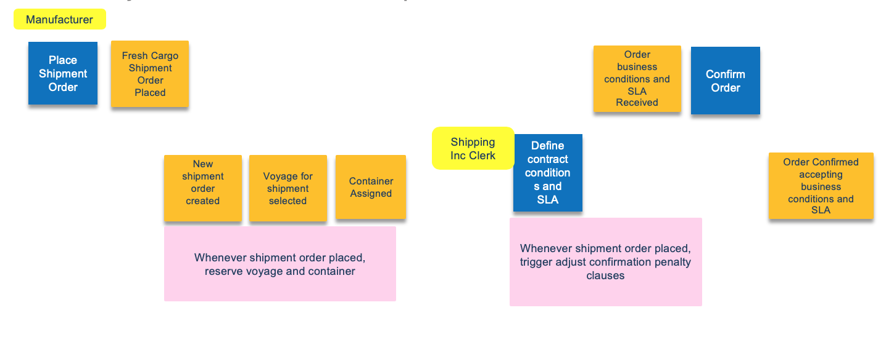
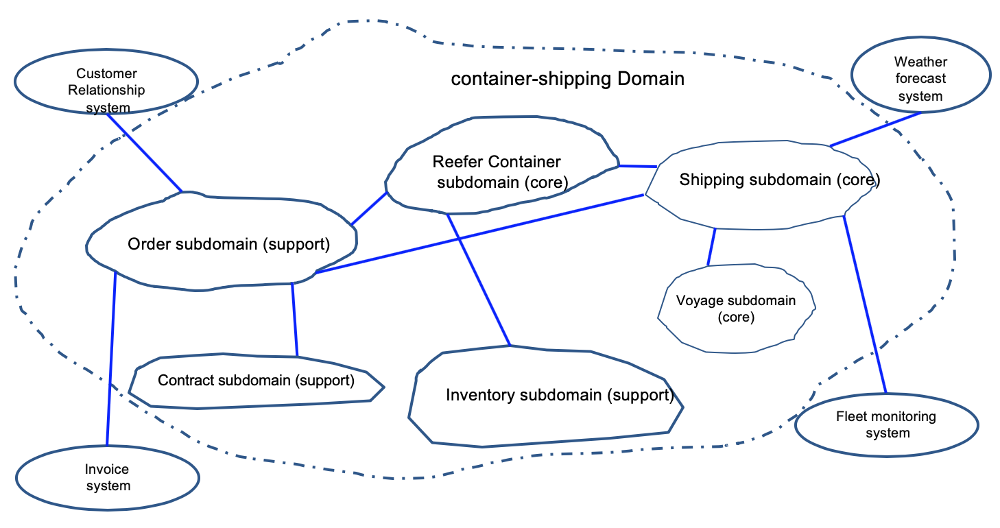
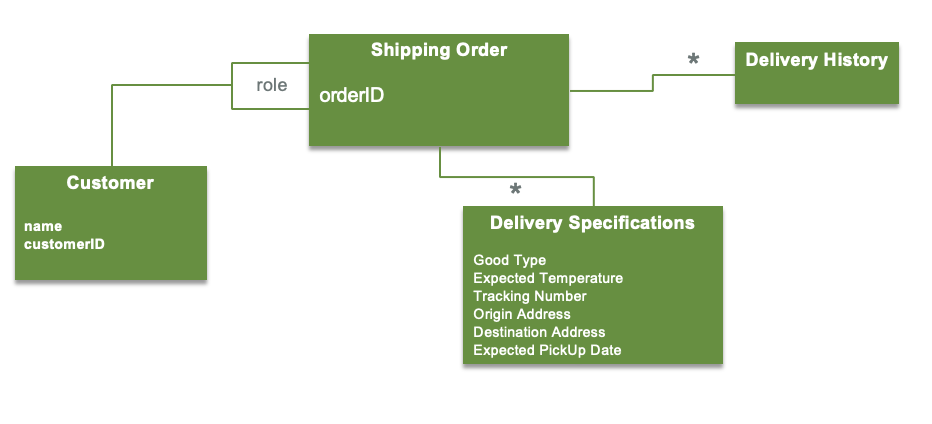

This section describes how to apply domain driven design with event based application and describe the high level steps which uses output from the event storming session and derives a set of micro services design specifications.
<AnchorLinks>
    <AnchorLink>Overview</AnchorLink>
    <AnchorLink>Starting materials</AnchorLink>
    <AnchorLink>Domain driven design steps</AnchorLink>
    <AnchorLink>Applied DDD for the reference implementation</AnchorLink>
</AnchorLinks>

## Overview 

[Event storming](/methodology/event-storming/) is part of the domain-driven design methodology. And domain-driven design was deeply described in [Eric Evans's "Domain Driven Design: Tackling Complexity in the Heart of Software" book](https://www.amazon.com/Domain-Driven-Design-Tackling-Complexity-Software/dp/0321125215/ref=asc_df_0321125215/?tag=hyprod-20&linkCode=df0&hvadid=312118197030&hvpos=1o1&hvnetw=g&hvrand=3363692763187919455&hvpone=&hvptwo=&hvqmt=&hvdev=c&hvdvcmdl=&hvlocint=&hvlocphy=9032152&hvtargid=pla-449269547899&psc=1) from 2004. At IBM, we also summarized the concepts needed for implementing microservice in [Kyle Brown's DDD article](https://www.ibm.com/cloud/garage/practices/code/domain-driven-design/overview).

From this body of knowledge we can derive the following important elements:

* Domain Driven Design is about understanding the business domain in which the solution has to be developed
* Context is important to define the business term definitions within a context
* For microservice we need to find the boundary of responsability to be able to apply clear separation of concern pattern. 

The goals for the design step are:

* To support highly modular cloud native microservices.
* To adopt event coupled microservices - facilitating independent modification and evolution of each microservice separately.
* To allow applying event-driven patterns such as event sourcing, CQRS and SAGA to address some of the challenges of distributed system implementation: data consitency, transaction cross domains, and complex queries between aggregates managed by different services.

## Starting materials

At IBM garage we start with a design thinking workshop enhanced with event storming to model the to-be scenario when end to end business process visibility is needed. Discovering events using event storming simplifies the process discovery and sequencing of tasks. BPMN modeling may also being use to model a process but it has the tendency to lock the thinking in a flow, while event storming focuses on what happened as facts, and so it easier to get events sequencing. Also events coming from no-where could still be discovered and have their value. Event storming workshop starts some domain driven design analysis by getting some of the following materials:

* Domains - sub domains
* Event Sequence flow.
* Events – business term definition: the start of ubiquitous language.
* Critical events.
* Business entities, aggregates
* Commands
* Actores - Users – role based on Empathy maps and stakeholders list.
* Event linkages.
* Business Policies.
* Event prediction and probability flows.

The derivation of those materials was described in [the event storming introduction](/methodology/event-storming/).

Here is an example of starting material illustrating the beginning of the process for the Reefer shipping business process, with order placement and shipping contract elaboration:

From there we complement this analysis by extending it with the domain driven design elements.

## Domain driven design steps

### Step 1: Assess domains and sub-domains

Domain is what an organization does, and it includes the "how to", it performs its operations.  Domain may be composed of sub-domains. A "Core" domain is a part of the business domain that is of primary importance to the success of the organization, the organization needs to excel at it to make business impact and difference.

During the event storming analysis, you define the domains and groups a set of sub-domains together. In the following figure, the container shipping domain is what the application we have to develop belongs to, and is composed of sub-domains like orders, shipping, inventory, .... Other domains like weather, CRM, invoice, are supporting the shipping domain but are not the focus of the design. Here is an example of such domain and subdomains:

We have three core sub-domains and the rest are supports. Shipping over seas company needs to excel at managing container inventory, managing the shipping, the itineraries, and vessels.  

### Step 2: Define the application context

At the high level, when doing the analysis, you should have some insight decisions of the top level application to develop, with some ideas of the other systems to interact with. A classical "system context diagram" is a efficient tool to represent the application high level context. The external systems to integrate with, are strongly correlated to the domains discovered from previous step. 

For the EDA reference implementation solution the [system context diagram is visible here](https://ibm-cloud-architecture.github.io/refarch-kc/design/architecture/#system-context).

Each interface to those system needs to be documented using the [interface characteristics approach](https://www.ibm.com/developerworks/websphere/techjournal/1201_clark/1201_clark.html) presented by IBM Kim Clark.

The full set of interface characteristics to consider for each system to integrate is summarized below:

* FUNCTIONAL DEFINITION

    * Principal data objects
    * Operation/function
    * Read or change
    * Request/response objects

* TECHNICAL INTERFACE

    * Transport
    * Protocol
    * Data format

* INTERACTION TYPE

    * Request-response or fire-forget
    * Thread-blocking or asynchronous
    * Batch or individual
    * Message size

* PERFORMANCE

    * Response times
    * Throughput
    * Volumes
    * Concurrency

* INTEGRITY
    * Validation
    * Transactionality
    * Statefulness
    * Event sequence
    * Idempotence

* SECURITY

    * Identity/authentication
    * Authorization
    * Data ownership
    * Privacy

* RELIABILITY

    * Availability
    * Delivery assurance

* ERROR HANDLING
    * Error management capabilities
    * Known exception conditions
    * Unexpected error presentation

So with a system context diagram and interface characteristics to external system we have a good undestanding of the application context and interaction with external domains.

### Step 3: Define the ubiquitous language

This is where the work from the event storming and the relation with the business experts should help. Domain experts use their jargon while technical team members have their own language tuned for discussing the domain in terms of design. The terminology of day-to-day discussions is disconnected from the terminology embedded in the code, so the ubiquitous language helps to allign knowledge with design elements, code and tests. (Think about EJB, JPA entity, all the JEE design jargon versus ShippingOrder, order provisioning, fullfillment... )

The vocabulary of that ubiquitous language includes the class names and prominent operation names. The language includes terms to discuss rules that have been made explicit in the model. Be sure to commit the team to exercising that language relentlessly in all communication within the business and in the code. Use the same language in diagrams, writing, and especially speech.

Play with the model as you talk about the system. Describe scenarios out loud using the elements and interactions of the model, combining concepts in ways allowed by the model. Find easier ways to say what you need to say, and then take those new ideas back down to the diagrams and code.

#### Entities and Value Objects

Entities are part of the ubiquitous language, and represent business concepts that can be uniquely identified by some atributes. They have a life cycle that is important to model.

Value Object also represent things in the domain but without identity, and they are frequently transient, created for an operation and then discarded.

Some time in a certain context a value object could become an entity. As an example, an Address will be most of the time a value object, excepts in a mapping app or in an agenda app.

Below is an example of entities (Customer and Shipping Order) and value objects (delivery history and delivery specification):

#### Aggregate boundaries

An aggregate is a cluster of associated objects that we treat as a unit for the purpose of data changes. An entity is most likely and aggregate and every things related to it define its boundaries.

#### Bounded Contexts

Bounded Context explicitly defines the boundaries of your model. This concept is critical in large software projects. A Bounded Context sets the limits around what a specific team works on and helps them to define their own vocabulary within that particular context. When you define a bounded context, you define who uses it, how they use it, where it applies within a larger application context, and what it consists of in terms of things like Swagger documentation and code repositories.

Within a business context every use of a given domain term, phrase, or sentence, **the Ubiquitous Language** inside the boundary has a specific contextual meaning. So order context is a boundary context and groups order, ordered product type, pickup and shipping addresses, delivery specifications, delivery history.

#### Repositories

Repository represents the infrastructure service to persist the root aggregate during its full life cycle.
Client applications request objects from the repository using query methods that select objects based on criteria specified by the client, typically the value of certain attributes.

#### Event linked microservices design - structure

A complete event driven microservices specification (the target of this design step) includes specifications of the following:

* Event Topics
    * Used to configure the Event Backbone
    * Mapped to the life cycle of the root entity
    * Topics can be chained to address different consumer semantic
    * Single partition for keeping order and support exactly once delivery
* Event types within each event topic
* Microservices:
    * They may be finer grained than aggregates or mapped to aggregate boundaries.
    * They may separate query and command; possibly multiple queries.
    * They could define demonstration control and serve main User Interface.
    * Reference the related Entities and value objects within each microservice.
    * Define APIs  ( Synchronous or asynchronous) using standards like openAPI. Could be done bottom up from the code, as most of TDD implementation will lead to.
    * Topics and events Subscribed to.
    * Events published / emitted.
* List of end to end interactions:
    * List of logic segments per microservice
* Recovery processing, scaling:
    * We expect this to be highly patterned and template driven not requiring example-specific design.

---

### Step 4: Define modules

* Each aggregate will be implemented as some composition of:
    (1) a command microservice managing state changes to the entities in this aggregate
    (2) possibly one or more separate (CQRS) query services providing internal or external API query capabilities
    (3) additional simulation, predictive analytics or User Interface microservices
* The command microservice will be built around a collection of active entites for the aggregate, keyed by some primary key.
* The separation of each aggregate into specific component microservices as outlined above, will be a complete list of microservices for the build / sprint.
* Identify the data collections, and collection organization (keying structure) in each command and query microservice for this build.

---

### Step 5: Limit the context and scope for this particular build / sprint

We assume that we are developing a particular build for a sprint within some agile development approach, deferring additional functions and complexity to later sprints:

* Working from the initial list of aggregates, select which aggregates will be included in this build
* For each aggregate the possible choices are:
    1. to completely skip and workaround the aggregate in this build.
    1. to include a full lifecycle implementation of the aggregate
    1. to provide a simplified lifecycle implementation - typically a table of entities is initialized at start up, and state changes to existing entities are tracked
* Determine whether there are simulation services or predictive analytics service to be included in the build
* Identify the external query APIs and command APIs which this build should support
* Create entity lifecycle diagrams for entites having a full lifecycle implementation in this build / sprint.

---

### Step 6: Generate microservice interaction diagrams for the build

* The diagram will show API calls initiating state change. They should map the commands discovered during the event storming.
* It shows for each interaction whether this is a synchronous API calls or an asynchronous event interaction via the event backbone.
* The diagram labels each specific event interaction between microservices trigerring a state change.
* Typically queries are synchronous API calls since the caller cannot usefully proceeed until a result is returned.
* From these, we can extract:
    1. a complete list of event types on each event backbone topic, with information passed on each event type.
    1. the complete list of “logic segments” for each microservice processing action in response to an API call or initiating event.

* When, at the next level of detail, the individual fields in each event are specified and typed, the [CloudEvents standard](https://github.com/cloudevents/spec) may be used as a starting point.

---

### Step 7: Specify recovery approach in case a microservice fails

* If a microservice fails it will need to recover its internal state by reloading data from one or more topics, from the latest committed read.
* In general, command and query microservices will have a standard pattern for doing this.
* Any custom event filtering and service specific logic should be specified.

### Concepts and rationale underlying the design approach

*What is the difference between event information stored in the event backbone and state data stored in the microservices?*

The event information stored persistently in the event backbone is organized by topic and, within each topic, entirely by event time-of-occurrence. While the state information in a microservice is a list (collection) of all **currently active** entities of the owning aggregate (e.g. all orders, all voyages etc) and the **current** state of each such entity. The entity records are keyed by primary key, like an OrderID.
While implementing microservice using event sourcing, CQRS, the persisted entity records are complementary to the historically organized information in the event backbone.

*When is it acceptable to be using synchronous interactions between services instead of asynchronous event interacts through the event backbone?*

For non-state-changing queries, for which the response is always instantaneously available a synchronous query call may be acceptable and will provide a simpler more understandable interface. Any processing which can be though of as being triggered by some state change in another aggregate should be modelled with an asynchronous event, because as the solution evolves other new microservices may also need to be aware of such event. We do not want to have to go back and change logic existing service where this event originated to have that microservice actively report the event to all potential consumers.

*How do we save microservices from having to maintain data collections with complex secondary indexing for which eventual consistency will be hard to implement?*

* Each command  microservice should do all its state changing updates using the primary key lookup only for its entities.
* Each asynchronous event interaction between microservices should carry primary entityIds ( orderID, VoyageID, shipID) for any entities associated with the interaction.
* Each query which might require speciaoized secondary indexing to respond to queries can be implemented in a separate CQRS query service which subscribes to events  to do all internal updating and receives events from the event backbone in a ( Consistent) eventually correct order.
* This allows for recovery of any failed service by rebuilding it in "eventually correct" order.

## Applied DDD for the reference implementation

See [this article to see how we applied DDD for the shipping good over seas implementation](https://ibm-cloud-architecture.github.io/refarch-kc/implementation/domain-driven-design/).
