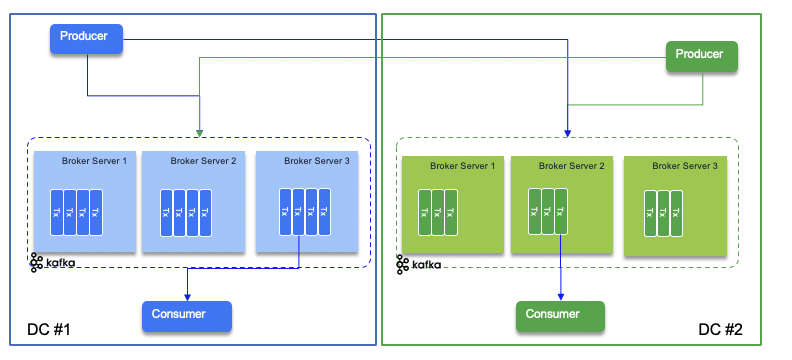
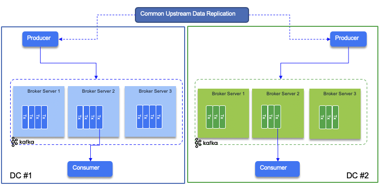
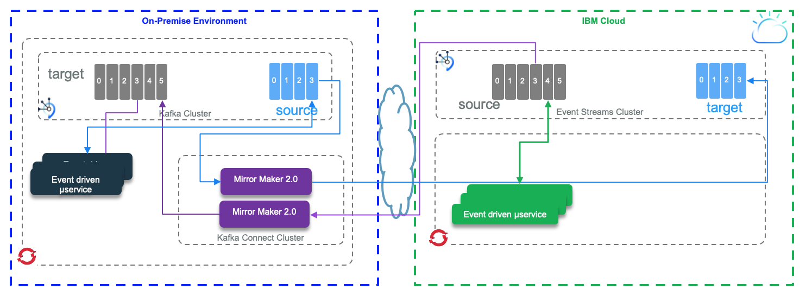
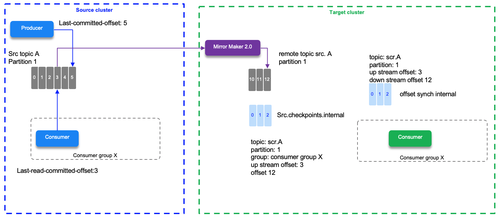
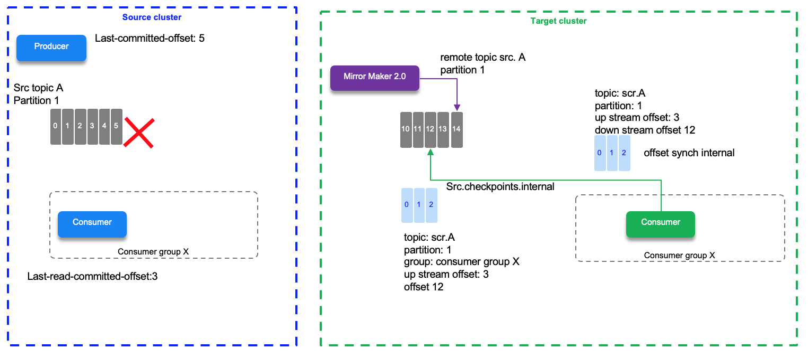
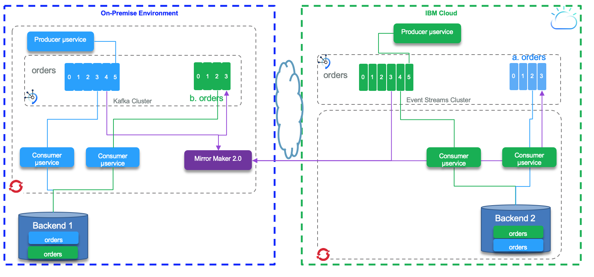

# Data Replication

As an introduction to the scope of the data replication in the context of distributed system, we encourage to read our summary in [this article](https://ibm-cloud-architecture.github.io/refarch-data-ai-analytics/data/data-replication/).

In this section we are going to address the data replication in the context of Kafka clusters, topic mirroring, using Kafka Mirror Maker 2.

## Problem statement

We suppose we need to replicate data in Kafka topics between different Kafka clusters running in different availability zones or data centers. There are multiple motivations for such replication. We can list at least the followings:

* Support disaster recovery, using different data centers to replicate microservice generated data in an active - passive mode.
* Move data closer to end user to improve performance and latency, this is more an active - active model, where the same microservices are deployed on the different data centers.
* The need to build on-premise data aggregation or data lake layer to perform batch analytics jobs from data gathered from different remote environments.
* Isolate secure data from on-premise cluster, with data encryption and data transformation to remove personal identifiable information, but still exchange such data between environments.

## Produce to two data centers

The simplest way to ensure data replication is to have producers writing to two data centers. When using Kafka the producer code needs to connect to two set brokers and write to the two target topics. The diagram below illustrates this approach:

<<<<<<< HEAD

=======

>>>>>>> upstream/master

The problem of this approach is the code needs to write in two clusters and address connectivity issue, and dual writes that may not happen in cohesive way.

An alternate is to have the layer on top of the producers doing the replication itself so producers on both data centers are getting the same source of data and can inject on their related topic:

<<<<<<< HEAD

=======

>>>>>>> upstream/master

In this approach the producer code is classical and less intruisive to the type of deployment.

## Data mirroring

Data mirroring is the technology to consume from one topic and publish to a remote topic, transparently to the core business application. This is an asynchronous mechanism, leveraging the append log mechanism from Kafka. 
MirrorMaker 2.0 is a new feature as part of Kafka 2.4 to support data replication between clusters. It is based on Kafka Connect framework, and it supports data and metadata replication, like the topic configuration, the offset and the consumer checkpoints are synchronously replicated to the target cluster.
We have done extensive testing with MirrorMaker 2 with two different environments:

* One running a local, on-premise cluster using Kafka 2.5 open source packaging, like Strimzi vanilla Kafka, and IBM Event Streams on Cloud.
* One Cloud Pak for Integration Event Streams deployment to  IBM Event Streams on Cloud - managed service.

In the figure above, Mirror Maker 2.0 is used to do bi-directional replication between topics defined in both clusters. The grey topic is replicated from right to left. The light blue topic is replicated from left to right. Microservices on both data centers can consume messages from both topics.

Then we want to address two main scenarios:

* [Active - passive](#active-passive), which addresses a disaster recovery approach where consumers reconnect to a new cluster after the first one fails.
* [Active - active](#active-active) deployments where participant clusters have producers and consumers and some topics are replicated so the messages are processed by different consumers on the two data centers.

We address the active active scenarios for the two test environments in a [separate note](../../technology/kafka-mirrormaker/)

## Active - Passive

To support active - passive, one site has producers and consumers on local topics, and topic data are replicated to the passive cluster without online consumers. The tricky parts for this approach is the retention period in each topic, and then the backend systems impacted by the recovery. So the data replication from active - passive, embraces a larger scope than just topic mirroring. Still knowing how MirrorMaker 2 is doing offset replication is important.

MirroMaker 2 tracks offset per consumer group. There are two topics created on the target cluster to manage the offset mapping between the source and target clusters and the checkpoints of the last committed offset in the source topic/partitions/consumer group. When a producer sends its record it gets the offset in the partition the record was saved.

In the diagram below we have a source topic A - partition 1 with the last write offset done by a producer to be 5, and the last read committed offset by the consumer assigned to partition 1 being 3. The last replicated offset 3 is mapped as 12 in the target partition on the remote topic. offset # do not match between mirrored partitions.
So if the consumer needs to reconnect to the target cluster, it will read from the last committed offset which is 12 in this environment. This information is saved in the `checkpoint` topic.

<<<<<<< HEAD

=======
Offset synch are emitted at the beginning of the replication and when there is a situation which leads that the numbering sequencing diverges. For example the normal behavior increases the offset by one 2,3,4,5,6,7 which is mapped to the offsets 12,13,14,15,16,... If the write operation for offset 20 at the source is a 17 on the target then MM 2 emits a new offset synch records to the `offset-synch` topic, so the offset replication is not done all the time, only when diverging to improve performance.
>>>>>>> upstream/master

The `checkpoint` and `offset_synch` topics enable replication to be fully restored from the correct offset position on failover. 

## Active - Active

For active/ active producers are writing to their topics locally to the local cluster on both data centers. The code is the same, and deployed in both environments. The main consideration is what is their own datasource. If for example the datasource is a click stream data from webapp running locally with different end users, then the local consumer may do something specific for this data center, that the consumer on the other side do not need to know and process. So the consumers that really want to consume from local topic and replicated one, have very special requirements, for example, computing aggregates and joins. In this case the processing is active - active with different semantic. The other example is when we want to have the same data eventually consistent on the backend, the consumer are the same, writing to the same backend system, on both side, but consuming from two different topics. The following diagram illustrates this approach. The data in both backend will be eventual consistent overtime.

