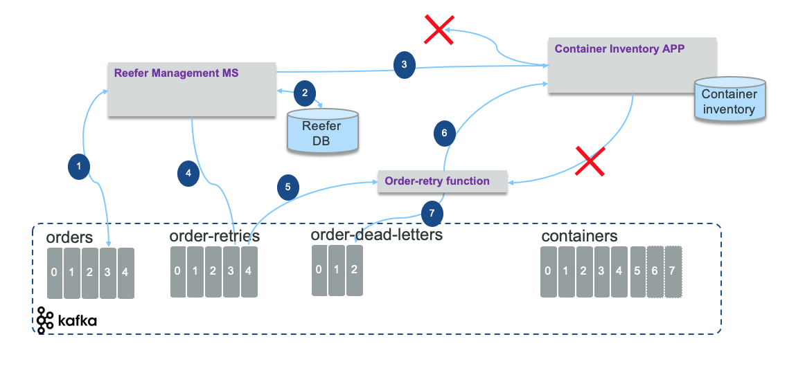

# Dead Letter Queue

## Event reprocessing with dead letter pattern

With event driven microservice, it is not just about pub/sub: there are use cases where the microservice needs to call existing service via an HTTP or RPC call. The call may fail. So what should be the processing to be done to retry and gracefully fail by leveraging the power of topics and the concept of dead letter.

This pattern is influenced by the adoption of Kafka as event backbone and the offset management offered by Kafka. Once a message is read from a Kafka topic by a consumer the offset can be automatically committed so the consumer can poll the next batch of events, or in most the case manually committed, to support business logic to process those events.

The figure below demonstrates the problem to address: the `reefer management microservice` get order event to process by allocating a reefer container to the order. The call to update the container inventory fails.

At first glance, the approach is to commit the offset only when the three internal operations are succesful: write to reefer database (2), update the container inventory using legacy application service (3), and produce new event to `orders` (4) and `containers` (5) topics. Step (4) and (5) will not be done as no response from (3) happened.

In fact a better approach is to commit the read offset on the orders topic, and then starts the processing: the goal is to do not impact the input throughput. In case of step (2) or (3) fails the order data is published to an `order-retries` topic (4) with some added metadata like number of retries and timestamp.

A new order retry service or function consumes the `order retry` events (5) and do a new call to the remote service using a delay according to the number of retries already done: this is to pace the calls to a service that has issue for longer time. If the call (6) fails this function creates a new event in the `order-retries` topic with a retry counter increased by one. If the number of retry reaches a certain threshold then the order is sent to `order-dead-letter` topic (7) for human to work on. A CLI could read from this dead letter topic to deal with the data, or retry automatically once we know the backend service works. Using this approach we delay the call to the remote service without putting too much preassure on it.

We have implemented the dead letter pattern when integrating the container manager microservice with an external BPM end point. The [implementaton detail is in this note](https://ibm-cloud-architecture.github.io/refarch-kc/itg-tests/dlq/dlq/) and the integration test [here](https://github.com/ibm-cloud-architecture/refarch-kc/blob/master/itg-tests/es-it/ContainerAnomalyDlq.py).

For more detail we recommend this article from Uber engineering: [Building Reliable Reprocessing and Dead Letter Queues with Apache Kafka](https://eng.uber.com/reliable-reprocessing/).
