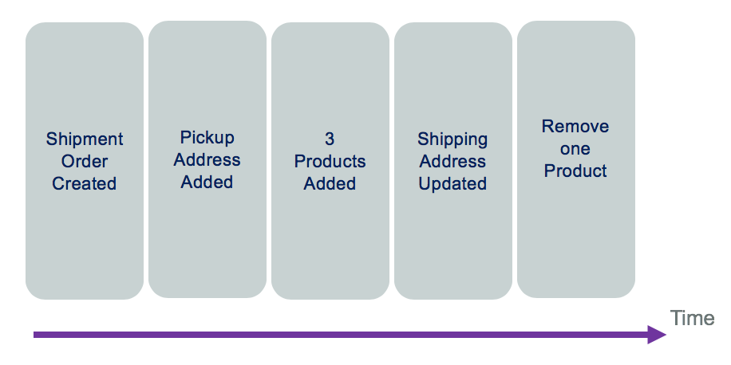
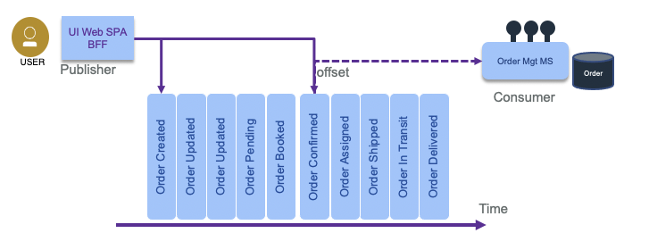

# Event Sourcing

## Problems and Constraints

Most business applications are state based persistent where any update changes the previous state of business entities. The database keeps the last committed update. But some business application needs to **explain how it reaches its current state**. For that the application needs to keep history of business facts.
Traditional domain oriented implementation builds a domain data model and map it to a RDBMS. As an example, in the simple `Order model` below, the database record will keep the last state of the Order entity, with the different addresses and the last ordered items in separate tables.

If you need to implement a query that looks at what happened to the order over a time period, you need to change the model and add historical records, basically building a log table.

Designing a service to manage the life cycle of this order will, most of the time, add a "delete operation" to remove data.  For legal reason, most businesses do not remove data. As an example, a business ledger has to include new record(s) to compensate a previous transaction. There is no erasing of previously logged transactions. It is always possible to understand what was done in the past. Most business application needs to keep this capability.

## Solution and Pattern

**Event sourcing** persists the state of a business entity, such an Order, as a sequence of state-changing events or immuttable "facts" ordered over time. Event sourcing has its roots in the domain-driven design community. 

When the state of a system changes, an application issues a notification event of the state change. Any interested parties can become consumers of the event and take required actions.  The state-change event is immutable stored in an event log or event store in time order.  The event log becomes the principal source of truth. The system state can be recreated from a point in time by reprocessing the events. The history of state changes becomes an audit record for the business and is often a useful source of data for business analysts to gain insights into the business.

You can see the "removing an item" event in the log is a new event. With this capability, we can count how often a specific product is removed for the shopping cart.

In some cases, the event sourcing pattern is implemented completely within the event backbone.  Kafka topic and partitions are the building blocks for event sourcing. However, you can also consider implementing the pattern with an external event store, which provides optimizations for how the data may be accessed and used. For example [IBM Db2 Event store](https://www.ibm.com/products/db2-event-store) can provide the handlers and event store connected to the backbone and can provide optimization for down stream analytical processing of the data.

An event store needs to store only three pieces of information:

* The type of event or aggregate.
* The sequence number of the event.
* The data as a serialized entity.

More data can be added to help with diagnosis and audit, but the core functionality only requires a narrow set of fields. This gives rise to a very simple data design that can be heavily optimized for appending and retrieving sequences of records.

With a central event logs, as provides by Kafka, producers append events to the log, and consumers read them from an **offset** (a sequence number).

To get the final state of an entity, the consumer needs to replay all the events, which means replaying the changes to the state from the last committed offset or from the last snapshot or the origin of "time".

### Advantages

The main goal is to be able to understand what happens to a business entity over time. But there are a set of interesting things that can be done:

* We can rebuild the data view within a microservice after it crashes, by reloading the event log.
* As events are ordered with time, we can apply complex event processing with temporal queries, time window operations, and looking at non-event.
* Be able to reverse the state and correct data with new events.

### Considerations

When replaying the events, it may be important to avoid generating side effects. A common side effect is to send a notification on state change to other consumers. So the consumer of events need to be adapted to the query and business requirements. For example, if the code needs to answer to the question: "what happened to the order ID 75 over time?" then there is no side effect, only a report can be created each time the consumer runs.

Sometime it may be too long to replay hundreds of events. In that case we can use snapshot, to capture the current state of an entity, and then replay events from the most recent snapshot. This is an optimization technique not needed for all event sourcing implementations. When state change events are in low volume there is no need for snapshots.

Kafka is supporting the event sourcing pattern with [the topic and partition](../../technology/kafka-overview/#topics). In our [reference implementation](https://ibm-cloud-architecture.github.io/refarch-kc) we are validating event sourcing with Kafka in the [Order microservices](https://github.com/ibm-cloud-architecture/refarch-kc-order-ms) demonstrate in [this set of test cases.](https://ibm-cloud-architecture.github.io/refarch-kc/itg-tests/itgtests)

The event sourcing pattern is well described in [this article on microservices.io](https://microservices.io/patterns/data/event-sourcing.html). It is a very important pattern to support eventual data consistency between microservices and for data synchronization between system as the event store becomes the source of truth.

See also this [event sourcing article](https://martinfowler.com/eaaDev/EventSourcing.html) from Martin Fowler, where he is also using ship movement examples. [Our implementation](https://github.com/ibm-cloud-architecture/refarch-kc) differs as we are using Kafka topic as event store and use different entities to support the container shipping process: the Order, the Container and Voyage entities...

Another common use case, where event sourcing helps, is when developers push a new code version that corrupts the data: being able to see what was done on the data, and being able to reload from a previous state helps fixing problems.

### Command sourcing

Command sourcing is a similar pattern as the event sourcing one, but the commands that modify the states are persisted instead of the events. This allows commands to be processed asynchronously, which can be relevant when the command execution takes a lot of time.
One derived challenge is that the command may be executed multiple times, especially in case of failure. Therefore, it has to be idempotent ( making multiple identical requests has the same effect as making a single request). Finally, there is a need also to perform validation of the command to avoid keeping wrong commands in queue. For example, `AddItem` command is becoming `AddItemValidated`, then once persisted to a database it becomes an event as `ItemAdded`. So mixing command and event sourcing is a common practice.

* Business transactions are not ACID and span multiple services, they are more a serie of steps, each step is supported by a microservice responsible to update its own entity. We talk about "eventual data consistency".
* The event backbone needs to guarantee that events are delivered at least once and the microservices are responsible to manage their offset from the stream source and deal with inconsistency, by detecting duplicate events.
* At the microservice level, updating data and emitting event needs to be an atomic operation, to avoid inconsistency if the service crashes after the update to the datasource and before emitting the event. This can be done with an eventTable added to the microservice datasource and an event publisher that reads this table on a regular basis and change the state of the event once published. Another solution is to have a database transaction log reader or miner responsible to publish event on new row added to the log.
* One other approach to avoid the two-phase commit and inconsistency is to use an Event Store or Event Sourcing pattern to keep track of what is done on the business entity with enough information to rebuild the data state. Events are becoming facts describing state changes done on the business entity.

## Code repository

All the microservices implementing the Reefer management solution is using event sourcing, as we use kafka with long persistence. The order management service is using CQRS combined with event sourcing: [https://github.com/ibm-cloud-architecture/refarch-kc-order-ms](https://github.com/ibm-cloud-architecture/refarch-kc-order-ms) and an integration test validate the pattern [here](https://ibm-cloud-architecture.github.io/refarch-kc/itg-tests/#how-to-proof-the-event-sourcing).

## Compendium

* [Martin Fowler - event sourcing pattern](https://martinfowler.com/eaaDev/EventSourcing.html)
* [Microservice design pattern from Chris Richardson](https://microservices.io/patterns/data/event-sourcing.html)
* [Greg Young video on event sourcing at the goto; conference](https://www.youtube.com/watch?v=8JKjvY4etTY)
