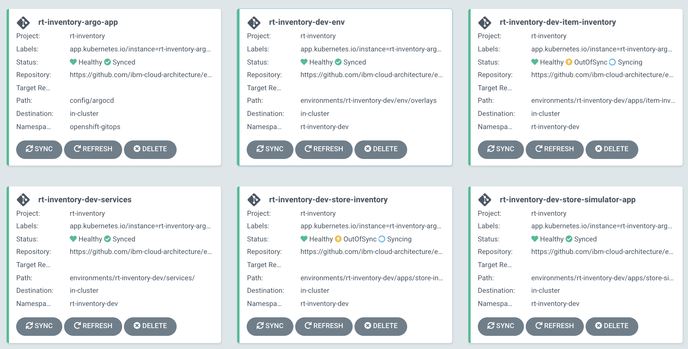
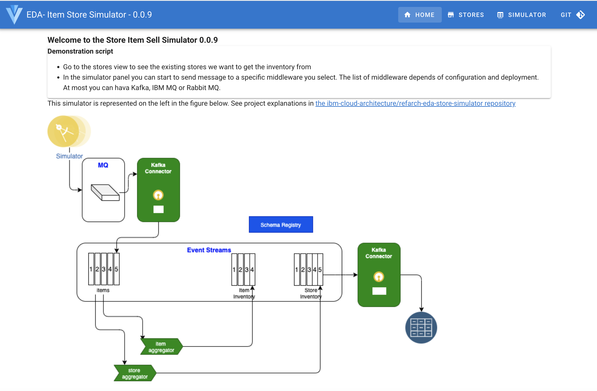
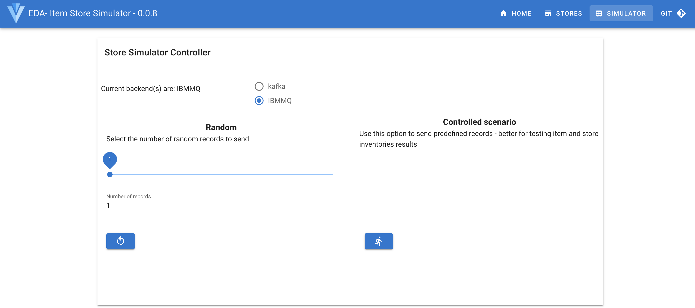
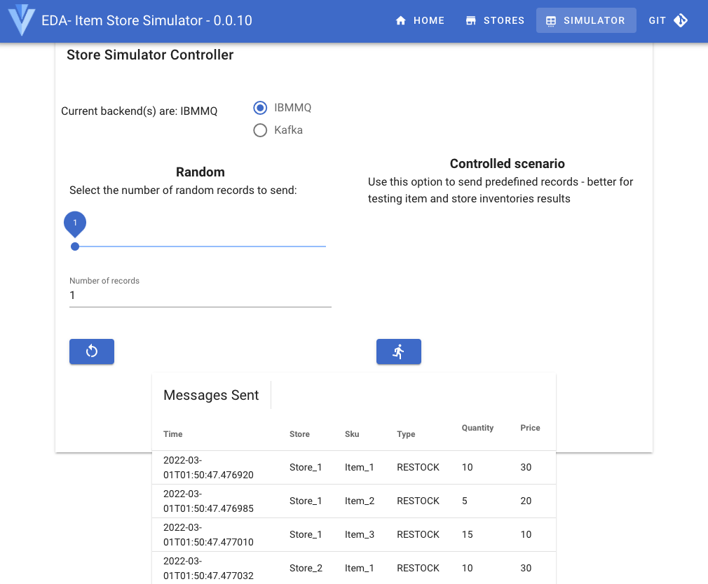
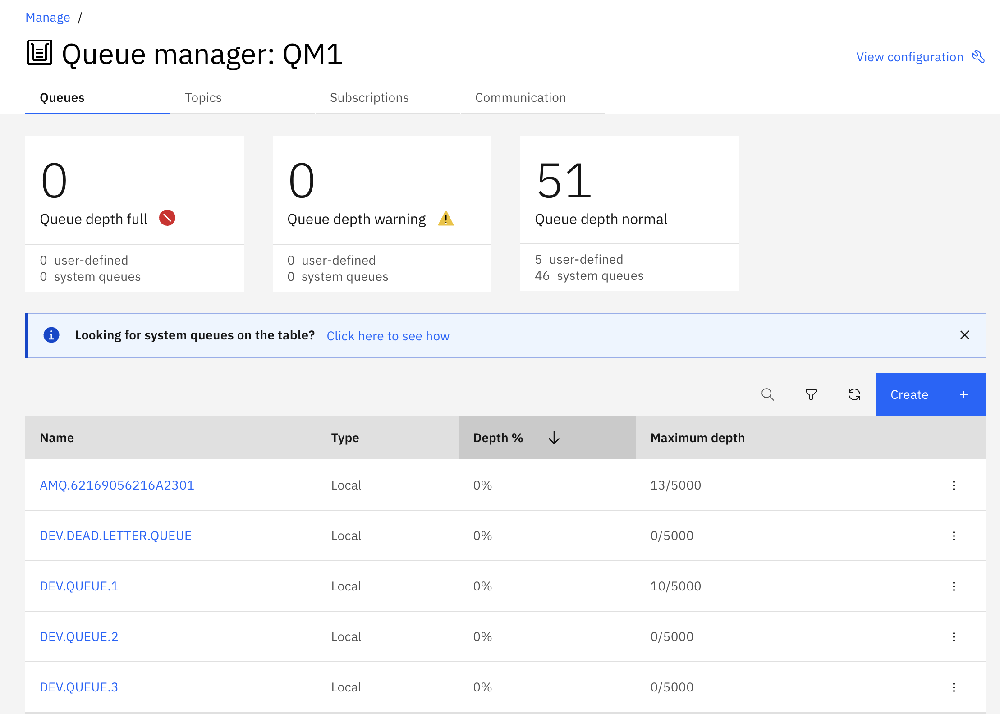
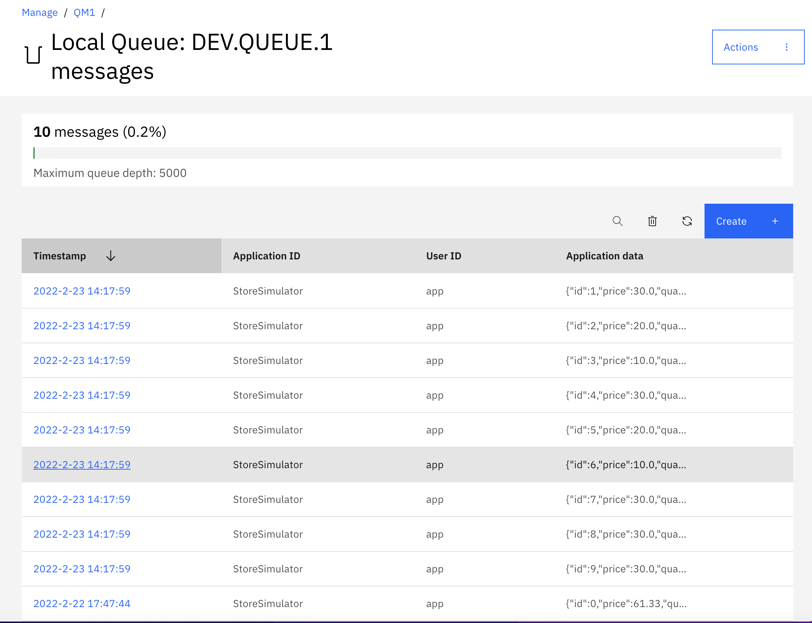
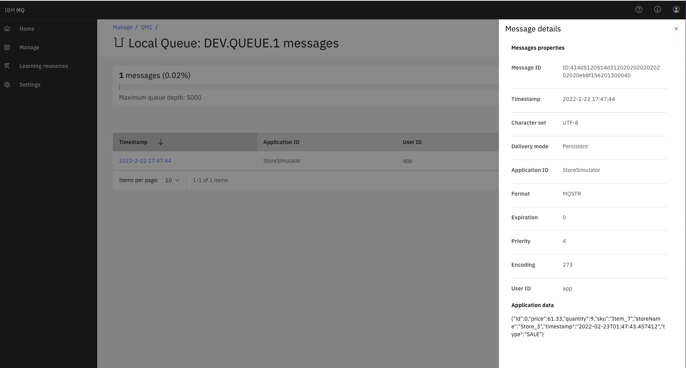

An IBM Cloud Pak for Integration - Event Streams use case

<InlineNotification kind="warning">
<strong>Updated 02/22/2022</strong> - Work in progress
</InlineNotification>

<AnchorLinks>
  <AnchorLink>Introduction</AnchorLink>
  <AnchorLink>Use Case Guided Tour</AnchorLink>
  <AnchorLink>Full Demo Narration</AnchorLink>
  <AnchorLink>Developer Corner</AnchorLink>
 </AnchorLinks>

----
# Introduction 

## Use Case Overview

Today, a lot of companies which are managing item / product inventory are facing real challenges to get a close to real-time view of item availability
and global inventory view. The solution can be very complex to implement while integrating Enterprise Resource Planning products and other custom legacy systems. 
Any new solutions are adopting events as a source to exchange data, to put less pressure on existing ERP servers, and to get better visibility 
into inventory positions while bringing agility to develop new solution with streaming components.

This scenario implements a simple near real-time inventory management solution based on real life MVPs we developed in 2020 for different customers. 
A production deployment will implement different level of store and warehouse inventory aggregators that will push results as event to an event backbone.
Those aggregates are used to build different data caching services, adnd to address use cases such as item availability.

At the high-level, the solution may look like in the following figure:


Servers in the Store are sending sale transactions to a central messaging platform, where streaming components are computing the different aggregates 
and are publishing them to other topics. This is a classical data streaming pipeline. Sink connectors, based on Kafka Connect framework,
 may be used to move data to long persistence storage like a Database, integrate results back to Legacy ERP, use indexing like Elastic Search, 
 propagate events to dashboards...

In real life, an as-is solution will include back-end applications to manage the warehouses inventory, connected to a home-built fulfillment application,
combined with store applications and servers, e-commerce suite, and a set of SOA services exposing backend systems. This is the larger view of the
following figure:

 

We may have integration flows to do data mapping, but most of those calls are synchronous.  To get one item availability, a lot of SOAP calls are done, 
increasing latency, and the risk of failure. There is [an interesting video](https://www.youtube.com/watch?v=FskIb9SariI) from Scott Havens explaining the needs 
from transitioning from a synchronous architecture to an event-driven asynchronous architecture when scaling, and low latency are must have. 
This lab reflects this approach.

## Demonstration components

In this demonstration we are deploying the following components:


Diagram source: [rt-inventory diagram](https://github.com/ibm-cloud-architecture/eda-rt-inventory-gitops/blob/main/docs/diagrams/mq-es-demo.drawio)

1. The [store simulator application](https://github.com/ibm-cloud-architecture/refarch-eda-store-simulator) is a Quarkus based microservice, used to generate item sales 
to different possible messaging middlewares ( RabbitMQ, IBM MQ or directly to IBM Event Streams). 
If you want to browse the code, the main readme of this project includes how to package and run this app with docker compose. A code explanation
section may give some ideas to developers. The docker image is [quay.io/ibmcase/eda-store-simulator/](https://quay.io/ibmcase/eda-store-simulator) and can be used for demonstration.
1. The item inventory aggregator is a Kafka Stream, Quarkus application, done with Kafka Stream API. The source code is in [the refarch-eda-item-inventory project](https://github.com/ibm-cloud-architecture/refarch-eda-item-inventory). 
Consider this more as a black box in the context of the scenario, it consumes items events, aggregate them, expose APIs on top of Kafka Streams interactive queries and publish inventory events on `item.inventory` topic. 
As a developer you may want to understand Kafka Stream programming with the [following labs](/use-cases/kafka-streams/), and then considering looking at the classes: [ItemProcessingAgent.java](https://github.com/ibm-cloud-architecture/refarch-eda-item-inventory/blob/master/src/main/java/ibm/gse/eda/inventory/domain/ItemProcessingAgent.java).
1. The store inventory aggregator is a Kafka Stream Quarkus application, done with Kafka Stream API. The source code is in [the refarch-eda-store-inventory project](https://github.com/ibm-cloud-architecture/refarch-eda-store-inventory). The output is in `store.inventory` topic. 
1. The MQ to Kafka, Kafka connector is defined in the [eda-rt-inventory-GitOps](https://github.com/ibm-cloud-architecture/eda-rt-inventory-gitops) repository under the [kconnect](https://github.com/ibm-cloud-architecture/eda-rt-inventory-gitops/tree/main/kconnect) folder
1. The Kafka to Cloud Object Storage Kafka connector is also defined in the same [GitOps repository/folder](https://github.com/ibm-cloud-architecture/eda-rt-inventory-gitops).

[Kafka Connect](/technology/kafka-connect/) is used to integrate external systems into Kafka. For example external systems can inject item sale messages to queue, from which a first MQ source Kafka connector 
publishes the messages to the `items` Kafka topic. Items sold events are processed by a series of streaming microservices down to different topics to keep aggregation results.
Those topics content could be which will be used by Sink connectors
 to send records to other external systems.

## A GitOps approach for solution deployment

As any cloud-native and kubernetes based solution, we use continuous integration and continuous deployment practices. From a demonstration point of view, the most interesting part is
to execute continuous deployment using a [GitOps approach](/use-cases/gitops/). This demonstration has a [GitOps repository](https://github.com/ibm-cloud-architecture/rt-inventory-gitops.git) 
(represented as the yellow rectangle in figure below) which defines ArgoCD apps 
to monitor and deploy the different microservices, streaming processing apps,
and the different IBM products needed: Event Streams, MQ, API management, event-end-point management. The figure belows presents the adopted strategy:


The [gitops catalog repository](https://github.com/ibm-cloud-architecture/eda-gitops-catalog.git), represented with a blue rectangle, defines the different operator subscriptions
for the cloud pak for integration components. Centralizing to one repository such operator subscriptions enforces reuse between solutions.

The solution [gitops](https://github.com/ibm-cloud-architecture/rt-inventory-gitops.git) was created with [KAM CLI](https://github.com/redhat-developer/kam) and is structured as follow:

* **Boostrap** folder: to install different operators and to define the ArgoCD project named `rt-inventory`.
* **config** folder, is for defining the ArgoCD apps and the app of apps. 
* **kconnect** folder is used to build a custom docker image of Kafka connector with MQ source, Elasticsearch sink and Cloud Object storage sink.
* **local-demo** folder is for running the solution on your laptop using docker-compose.
* **environments** folder, is the most important one, it uses [Kustomize](https://kustomize.io/) 
to declare environments (dev, staging) and component deployments (See next section for details). 

### A little bit more on environments

For demonstration purpose, only the `rt-inventory-dev` environment is detailed. One ArgoCD app: [rt-inventory-dev-env](https://github.com/ibm-cloud-architecture/eda-rt-inventory-gitops/blob/main/config/argocd/rt-inventory-dev-env-app.yaml) is monitoring
 the folder [environments/rt-inventory-dev/env/overlays](https://github.com/ibm-cloud-architecture/eda-rt-inventory-gitops/tree/main/environments/rt-inventory-dev/env/overlays) which define the namespace and roles,... 
Each application of the solution are also monitored by an ArgoCD and their declarations are done using standard kubernetes manifests. Here is an exampe of app tree structure:

```
── store-inventory
│   ├── base
│   │   └── kustomization.yaml
│   ├── kustomization.yaml
│   ├── overlays
│   │   └── kustomization.yaml
│   └── services
│       └── store-inventory
│           ├── base
│           │   ├── config
│           │   │   ├── configmap.yaml
│           │   │   ├── deployment.yaml
│           │   │   ├── kustomization.yaml
│           │   │   ├── rolebinding.yaml
│           │   │   ├── route.yaml
│           │   │   ├── service.yaml
│           │   │   └── serviceaccount.yaml
│           │   └── kustomization.yaml
│           ├── kustomization.yaml
│           └── overlays
│               └── kustomization.yaml
```

The last intesting part is to declare the products used within the Cloud Pak for Integration, and deployed in the context of
the respective environments. Everything is in `services` folder. The tree looks like below:

```
── apicurio
│   ├── base
│   │   ├── es-kafka-topics.yaml
│   │   ├── kustomization.yaml
│   │   └── registry.yaml
│   └── overlays
│       └── kustomization.yaml
├── event-endpoint
│   ├── base
│   │   ├── eventendpointmanager-eepm-eda.yaml
│   │   └── kustomization.yaml
│   └── overlays
│       ├── kustomization.yaml
│       └── v10.0.4.0
│           ├── kustomization.yaml
│           └── patch-version.yaml
├── ibm-eventstreams
│   ├── base
│   │   ├── es-topics.yaml
│   │   ├── eventstreams-dev.yaml
│   │   ├── kustomization.yaml
│   │   ├── scram-user.yaml
│   │   └── tls-user.yaml
│   └── overlays
│       ├── kustomization.yaml
│       └── v10.5
│           ├── kustomization.yaml
│           └── patch-version.yaml
├── ibm-mq
│   ├── base
│   │   ├── kustomization.yaml
│   │   └── qmgr.yaml
│   └── overlays
│       ├── kustomization.yaml
│       └── v9.2.4
│           ├── kustomization.yaml
│           └── patch-channel.yaml
├── kconnect
│   ├── README.md
│   ├── kafka-connect.yaml
│   ├── kafka-cos-sink-connector.yaml
│   ├── kustomization.yaml
│   └── mq-source.json
└── kustomization.yaml
```

With the public docker images, and the public GitOps repository, the solution can be deployed to an OpenShift cluster with or without Cloud Pak for Integration already deployed.

## Choose an option:

* [Run on your laptop](/scenarios/realtime-inventory/#run-on-your-laptop)
* [Run on OpenShift](/scenarios/realtime-inventory/#install-yourself-on-openshift)

### Pre-requisites for both options

* [Docker](https://docs.docker.com/) and docker compose to run the solution locally.
* [git CLI](https://git-scm.com/downloads).
* Clone the Inventory lab repository: 

  ```sh
  git clone  https://github.com/ibm-cloud-architecture/rt-inventory-gitops.git
  ```


### Run on your laptop

As a developer or technical seller you could demonstrate this scenario on your laptop. 
The docker images used in this solution are in public registry ([Quay.io](https://recovery.quay.io/organization/ibmcase)), the docker compose in
the [rt-inventory-gitops.git](https://github.com/ibm-cloud-architecture/rt-inventory-gitops.git) local-demo/kstream [folder](https://github.com/ibm-cloud-architecture/eda-rt-inventory-gitops/tree/main/local-demo/kstreams) 
uses IBM Event Streams, IBM MQ Images, Kafka Connect and the custom images of the services.

Once you have cloned the gitops repository (see pre-requisites section), go under the `local-demo/kstreams` folder and run

  ```sh
  docker-compose up -d
  ```

  To stop the demonstration do the following command:

  ```sh
  docker-compose down
  ```

The demonstration script is the [same as below](/scenarios/realtime-inventory/#demonstrate-the-real-time-processing), except that we use Kafdrop to visualize the content of Event Streams topics. 
See [this section](https://github.com/ibm-cloud-architecture/eda-rt-inventory-gitops#run-the-solution-locally) in the main readme for expected screen shots.

### Install Yourself on OpenShift

In this approach, we propose to use a GitOps repository and deploy the solution using few scripts and `oc` CLI commands.
In the figure below, all the components are deploy with GitOps and ArgoCD. The blue components are IBM product components like Event Streams and MQ and some other operators, like Elastic Search.
The green rectangles represent the microservices and kafka connectors source or sink.


--- 

# Use Case Guided Tour

## Bootstrap GitOps

Bootstrapping GitOps is mostly to install the different operators, and pre-requisites.

We prefer to keep those instructions in the source repository, therefore follow [the up to date instructions](https://github.com/ibm-cloud-architecture/eda-rt-inventory-gitops#bootstrap_gitops) from the gitops main readme.

## Deploy the Solution

Once operators are deployed. 

* Deploying the full solution is by starting ArgoCD app of apps:

  ```sh
  oc apply -k config/argocd
  ```

* Access the OpenShift GitOps (ArgoCD) console

  ```sh
   chrome https://$(oc get route openshift-gitops-server -o jsonpath='{.status.ingress[].host}'  -n openshift-gitops)
   ```

The expected set of ArgoCD apps looks like:

  

  * **rt-inventory-Argo-app** is an app of apps
  * **rt-inventory-dev-env** is for the rt-inventory-dev namespace
  * **rt-inventory-dev-services** is for event streams, kafka connect cluster and mq deployments in dev-env namespace
  * **rt-inventory-store-simulator-app** is for the simulator app used in the demo.
  * **rt-inventory-item-inventory** for the item aggregator application
  * **rt-inventory-store-inventory** for the store aggregator application

* Verify pods

```sh
  oc project rt-inventory-dev
  oc get pods

  NAME                                         READY   STATUS    RESTARTS   AGE
  dev-kafka-cruise-control-6d6bf8b774-99rwl    2/2     Running   0          4d
  dev-kafka-entity-operator-75f7bc8f5c-x4vkt   3/3     Running   0          4d
  dev-kafka-kafka-0                            1/1     Running   0          4d
  dev-kafka-kafka-1                            1/1     Running   0          4d
  dev-kafka-kafka-2                            1/1     Running   0          4d
  dev-kafka-zookeeper-0                        1/1     Running   0          4d
  dev-kafka-zookeeper-1                        1/1     Running   0          4d
  dev-kafka-zookeeper-2                        1/1     Running   0          4d
  item-inventory-669fd4fffc-4fvhk             1/1     Running   0          30h
  store-inventory-7df98556ff-f2ndq            1/1     Running   0          29h
  store-simulator-56f8958498-mvhp9             1/1     Running   0          4d
  ```

## Demonstrate the real-time processing

1. Get the Store simulator route using the following command and start a Web Browser

  ```sh
  chrome $(oc get routes store-simulator  -o jsonpath="{.spec.host}")
  ```

  You should reach the Home page of the simulator

  

1. Look at existing stores, using the top right `STORES` menu. This is just for viewing the data. 

  

1. Go to the SIMULATOR menu, and start the controlled scenario which will send predefined records:

  

  Here is the ordered list of messages sent:

  | Store | Item | Action |
  | --- | --- | --- |
  | Store 1 | Item_1 | +10 |
  | Store 1 | Item_2 | +5 |
  | Store 1 | Item_3 | +15 |
  | Store 2 | Item_1 | +10 |
  | Store 3 | Item_1 | +10 |
  | Store 4 | Item_1 | +10 |
  | Store 5 | Item_1 | +10 |
  | Store 1 | Item_2 | -5 |
  | Store 1 | Item_3 | -5 |


  once started a table should be displayed to present the records sent to Kafka. (The UI needs some enhancement ;-)

   

4- Verify messages are in queue: 

   * Access the MQ Console admin: 

  ```
  chrome http://$(oc get routes store-mq-ibm-mq-web  -o jsonpath="{.spec.host}")
  ```

  * Go to the QM1 Queue manager 

  

  * Select the DEV.QUEUE.1 queue to verify the messages reach the queue. It may be possible that the Kafka Connector already consumed those messages
  so the queue may look empty.

  

  Below is a view of one of those message.

  


5- Let assess if we can see the item stock cross stores: using the `item-aggregator` route, something like ` item-aggregator-rt-inventory.dte-ocp46-73awfj-915b3b336cabec458a7c7ec2aa7c625f-0000.us-east.containers.appdomain.cloud ` but completed with '/q/swagger-ui' as we want to access the API
  
  To get this route use the following command:

  ```sh
  chrome http://$(oc get routes item-inventory -o jsonpath="{.spec.host}")
  ```

   Select the get `/api/v1/items/{itemID}` operation:

  

  Use one of the following item id: [Item_1, Item_2, Item_3, Item_4, Item_5, Item_6, Item_7]. You should get 
  the current stock cross stores

  

6- Let assess a store stock, for that we access the store aggregator URL: `store-aggregator-rt-inventory.dte-ocp46-73awfj-915b3b336cabec458a7c7ec2aa7c625f-0000.us-east.containers.appdomain.cloud ` with the `/q/swagger-ui` suffix.

  To get this route use the following command:

  ```sh
  chrome http://$(oc get routes store-aggregator -o jsonpath="{.spec.host}")
  ```

  Then using the GET on the `api/v1/stores/inventory/{storeID}`, and enter one of the available store: `[Store_1, Store_2, Store_3, Store_4, Store_5]`

  

  The response should look like:

  

---

# Full Demo Narration

We will first go over the demonstration using the store simulator then using and end to end test script


---

# Developer Corner

## What you will learn

* Use Quarkus, with reactive programming API like Mutiny, and Kafka API to produce messages to Kafka
* Same Quarkus app can generate messages to RabbitMQ using the AMQP API
* Same Quarkus app can generate messages to IBM MQ using JMS
* Use Quarkus and Kafka Streams to compute aggregates to build an inventory view from the stream of sale order events
* Use the IBM MQ source connector from IBM Event messaging open source contribution


## Solution anatomy

1. The [store simulator application](https://github.com/ibm-cloud-architecture/refarch-eda-store-simulator) is a Quarkus app, which generates item sales to different possible messaging middlewares ( RabbitMQ, MQ or directly to Kafka). 
The code of this application is in this https://github.com/ibm-cloud-architecture/refarch-eda-store-simulator. If you want to browse the code, the main readme of this project includes how to package and run this app with docker compose, 
and explains how the code works. 
The docker image is [quay.io/ibmcase/eda-store-simulator/](https://quay.io/ibmcase/eda-store-simulator)
1. The item inventory aggregator is a Kafka Stream Quarkus application, done with Kafka Stream API. The source code is in [the refarch-eda-item-inventory project](https://github.com/ibm-cloud-architecture/refarch-eda-item-inventory). 
Consider this more as a black box in the context of the scenario, it consumes items events, aggregate them, expose APIs on top of Kafka Streams interactive queries and publish inventory events on `item.inventory` topic. 
1. The store inventory aggregator is a Kafka Stream Quarkus application, done with Kafka Stream API. The source code is in [the refarch-eda-store-inventory project](https://github.com/ibm-cloud-architecture/refarch-eda-store-inventory) the output is in `store.inventory` topic. 
2. The mock up Inventory mainframe application is not implemented and we will use the MQ tools to view the message in the `item.inventory` MQ queue.

 

