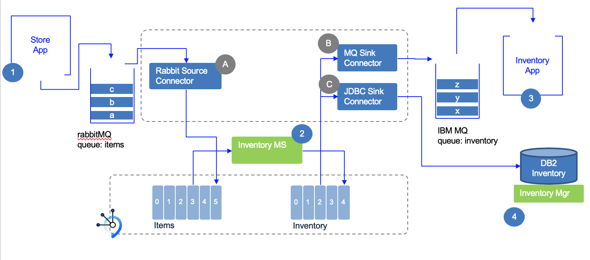

<InlineNotification kind="warning">
<strong>Update 10/20/2020</strong> - Work in progress
</InlineNotification>

<AnchorLinks>
  <AnchorLink>Overview</AnchorLink>
  <AnchorLink>Solution anatomy</AnchorLink>
  <AnchorLink>General pre-requisites</AnchorLink>
  <AnchorLink>Scenario setup</AnchorLink>
  <AnchorLink>Step 1: Deploy the MQ Sink Connector locally</AnchorLink>
  <AnchorLink>Step 2: Deploy the MQ Sink Connector on OpenShift</AnchorLink>
  <AnchorLink>Step 3: Deploy the RabbitMQ Source Connector locally</AnchorLink>
  <AnchorLink>Step 4: Deploy the JDBC Sink Connector locally</AnchorLink>
  <AnchorLink>Step 5: Run the solution components end-to-end on Kubernetes</AnchorLink>
  <AnchorLink>TODOs</AnchorLink>
</AnchorLinks>

## Overview

This lab addresses multiple scenarios that aim to build an end to end data pipeline, as depicted by the following figure, using Event Streams / Kafka on Premise. At the high level Kafka connect is used to integrate external systems into the Kafka ecosystem. For example external system can inject item sale messages to queue manager, from which a first Kafka source connector publishes the messages to a Kafka topic, which then will be processed by a series of event driven microservices down to a final topic, which will be used by Sink connectors.

 

To support this lab we are reusing a classical business use case around `real time inventory` where stores are sending their sale transactions to a central messaging platform, based on queues, and with the adoption of loosely coupled microservices, real time analytics and complex event processing, Kafka is added to this legacy environment. Adopting Kafka connect lets integrate with existing applications without any changes.

All the components of this scenario are ready to run on OpenShift, but we are also providing a docker compose to run all of them on your local workstation. The important knowledge is on the programming model we used, and the Kafka Connect configuration and code.

## Solution anatomy

The lab is divided into smaller scenarios that can be combined to support the real time inventory data pipeline as illustrated in the figure below:

 

1. The store simulator application is a Quarkus based app, which generate item sales to different possible messaging middlewares ( RabbitMQ, MQ or event direct to Kafka). The code of this application is in this [ refarch-eda-store-simulator repository](https://github.com/ibm-cloud-architecture/refarch-eda-store-simulator). If you want to browse the code, the main read me of this project includes how to package and run this app, and the code approach used. The docker image is [ibmcase/eda-store-simulator/](https://hub.docker.com/r/ibmcase/eda-store-simulator)

    * RabbitMQ runs in docker image started locally via docker compose. The messages are in the `items` queue.
    * The first lab consists of setting up the Rabbit MQ source Kafka connector to get items from the queue to the `items` topic in Kafka.  focusing on the injection to Kafka, is documented in the [use case: Kafka connect - Rabbit MQ](../../use-cases/connect-rabbitmq/).
    * [A] The Sink connector description is in the [real time inventory lab](https://github.com/ibm-cloud-architecture/refarch-eda-tools) folder. The Kafka connector source is in [this project.](https://github.com/ibm-messaging/kafka-connect-rabbitmq-source)
    
2. The inventory MS is a Kafka Stream application, done with Kafka Stream API. The source code is in [this project](https://github.com/ibm-cloud-architecture/refarch-eda-item-inventory). Consider this more as a black box in the context of the scenario, it consumes items events, aggregate them, expose API on top of Kafka Streams interactive queries and publish inventory events on `inventory` topic. The code is also used in the [Kafka Streams lab 3](../../use-cases/kafka-streams/lab-3/)
3. The mock up Inventory mainframe application is not implemented and we will use the MQ tools to view the message in the `inventory` MQ queue.

    * The MQ Sink connector [B] configuration is defined in the [real time inventory lab](https://github.com/ibm-cloud-architecture/refarch-eda-tools) folder, `mq-sink.json` file.
    * MQ broker runs in docker container started with docker-compose
    * The lab scenario is [describe in the Connect MQ use case ](../../use-cases/connect-mq/)
1. The Inventory Application, using DB2 as datasource is a quarkus app using hibernate with panache, defined in the [nventory-app](https://github.com/jbcodeforce/eda-kconnect-lab/tree/master/inventory-app) folder

    * The JDBC Sink connector [C] configuration is defined in the the [real time inventory lab](https://github.com/ibm-cloud-architecture/refarch-eda-tools) folder, `jdbc-sink.json` file .
    * The [Connect JDBC use case](../../use-cases/connect-jdbc/) lab goes over how the Kafka Connect JDBC sink works.
1. The [last scenario](#scenario-4:-run-the-solution-components-end-to-end-on-kubernetes) addresses the end to end solution, which is basically an end to end demonstration of a simple data pipeline for a real time view of an inventory solution.

## Demonstration Script 

For an end to end demonstration the following steps can be demonstrated once the environment is up and running.

1. The Stores view present the stores Acme Inc is managing. 

1. Start to send 10 messages to [Rabbit MQ]()

## General pre-requisites

<InlineNotification kind="info">You need to decide what your 'on-premise' environment is for this lab. You can run with docker compose, or deploy to an OpenShift cluster. We propose to run the components with docker compose for the scenario 1,2,3 and scenario 4 is for a deployment of the components on a Kubernetes cluster that could run on-premises or on any Cloud provider using Openshift. If you do not want to build all the components, we have each of them available in Docker Hub and the Docker Compose file should run them automatically.
</InlineNotification>

We need the following tools to run the lab. We try to use docker images as much as possible to do not impact your local laptop.

* [Docker](https://docs.docker.com/) and docker compose to run the solution locally.
* You need to get [docker compose](https://docs.docker.com/compose/).
* [git CLI](https://git-scm.com/downloads).
* [Maven](https://maven.apache.org/install.html).

Clone the lab repository: [refarch-eda-tools](https://github.com/ibm-cloud-architecture/refarch-eda-tools)

## Scenario setup

1. Start the main docker compose: 

```shell
docker-compose up
```

1. Prepare the Kafka Connect environment, as we need to use three connectors. Therefore we need to clone the source, build and get the jars file in the connectors. In fact we have developed scripts to automate those tedious steps:

  * Under the `kconnect` folder run `./setupConnectors.sh` script and get the three connectors downloaded and built.
  * Build a docker image for the connector: this is also done by running a second script: `./createOrStartKconnect.sh build`.

## Step 1: Deploy the RabbitMQ Source Connector locally

Follow the [RabbitMQ Source Connector](/use-cases/connect-rabbitmq/) use case to deploy the connector runtime, connecting your source RabbitMQ environment to the target Kafka environment and topic.

## Step 1: Deploy the MQ Sink Connector locally

Follow the [MQ Sink Connector](/use-cases/connect-mq/) use case to deploy the connector runtime, connecting your source Kafka environment and topic to the target MQ queue manager.

## Step 2: Deploy the MQ Sink Connector on OpenShift

Optionally, follow the [MQ Sink Connector](/use-cases/connect-mq/) use case to deploy the connector runtime to OpenShift, connecting your source Kafka environment and topic to the target MQ queue manager.


## Step 4: Deploy the JDBC Sink Connector locally

Follow the [JDBC Sink Connector](/use-cases/connect-jdbc/) use case to deploy the connector runtime, connecting your source Kafka environment and topic to the target DB2 database.

## Step 5: Run the solution components end to end on Kubernetes

This solution covers all the components of the data pipeline. It still uses DB2 and Event Streams on Cloud but deploy all the other component in OpenShift as part of IBM Kubernetes Service.

### Pre-requisites

Create the following services in IBM Cloud:

* [DB2 instance](https://cloud.ibm.com/docs/Db2onCloud?topic=Db2onCloud-getting-started).
* [IBM Kubernetes Service](https://cloud.ibm.com/docs/containers?topic=containers-cs_cluster_tutorial#cs_cluster_tutorial).

### Deployment

To be finished !

1. Verify the Store Sale Simulator runs
1. Verify the connectors `http://localhost:8083/connectors`


## TODOs

- Update deployment instructions to prioritize OCP, utilzing Tekton and/or Build/DeploymentConfigs as necessary
  - [ ] Provide PRIMARY deployment instructions to OCP, including necessary backend services
  - [ ] Provide SECONDARY deployment instructions via Docker Compose, including necessary backend services
- Provide support for IBM Event Streams on Cloud and IBM Event Streams V10 via CP4I.
  - [ ] IBM Event Streams on Cloud
  - [ ] IBM Event Streams V10

Older content to classify


1. Login to the cloud via CLI: `ibmcloud login`
1. Initialize the Event Streams CLI and select the target Event Streams cluster: `ibmcloud es init`
1. Define connect topics: When running in distributed mode, the connectors need three topics as presented in the `create topics` table [here](https://ibm.github.io/event-streams/connecting/setting-up-connectors/).

    * **connect-configs**: This topic will store the connector and task configurations.
    * **connect-offsets**: This topic is used to store offsets for Kafka Connect.
    * **connect-status**: This topic will store status updates of connectors and tasks.

    Using IBM Event Streams CLI, the topics are created via the commands like:

    ```shell
    # log to the kubernetes cluster:
    ibmcloud login -a https://icp-console.apps.green.ocp.csplab.local
    # initialize the event streams CLI plugin
    ibmcloud es init
    # Create the Kafka topics for Kafka connect
    ibmcloud es topic-create -n connect-configs -p 1 -r 3 -c cleanup.policy=compact
    ibmcloud es topic-create -n connect-offsets -p 25 -r 3 -c cleanup.policy=compact
    ibmcloud es topic-create -n connect-status -p 5 -r 3 -c cleanup.policy=compact
    # Create the topic for the scenarios
    ibmcloud es topic-create inventory
    ibmcloud es topic-create items
    ibmcloud es topics
    ```
1. Create API KEY with a manager-level access.
1. Clone the lab repository: `git clone https://github.com/jbcodeforce/eda-kconnect-lab && cd eda-kconnect-lab`.
1. Prepare the script to set the environment variables used by all the components of the solution, like the Kafka broker URLs and APIKEy.

    * First rename the `scripts/setenv-TMP.sh` to `scripts/setenv.sh`
    * Then modify the KAFKA_BROKERS and KAFKA_APIKEY with the respecting values as defined in the Event Streams credentials.

  ```json
  {
    "api_key": "bA ... Qp",
    "apikey": "bA ... Qp",
    "iam_apikey_description": "Auto-generated for key 4d ... c6",
    "iam_apikey_name": "es-mgr-creds",
    "iam_role_crn": "crn:v1:bluemix:public:iam::::serviceRole:Manager",
    "iam_serviceid_crn": "crn:v1:bluemix:public:iam-identity::a/db ... f2::serviceid:ServiceId-7a ... 6d",
    "instance_id": "29 ... 15",
    "kafka_admin_url": "https://70 ... 1g.svc01.us-east.eventstreams.cloud.ibm.com",
    "kafka_brokers_sasl": [
      "broker-1- ... kafka.svc01.us-east.eventstreams.cloud.ibm.com:9093",
      "broker-0- ... kafka.svc01.us-east.eventstreams.cloud.ibm.com:9093",
      "broker-4- ... kafka.svc01.us-east.eventstreams.cloud.ibm.com:9093",
      "broker-2- ... kafka.svc01.us-east.eventstreams.cloud.ibm.com:9093",
      "broker-5- ... kafka.svc01.us-east.eventstreams.cloud.ibm.com:9093",
      "broker-3- ... kafka.svc01.us-east.eventstreams.cloud.ibm.com:9093"
    ],
    "kafka_http_url": "https://70 ... 1g.svc01.us-east.eventstreams.cloud.ibm.com",
    "password": "bA ... Qp",
    "user": "token"
  }
  ```
