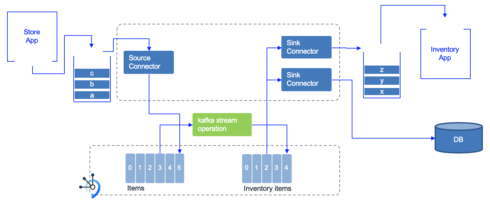
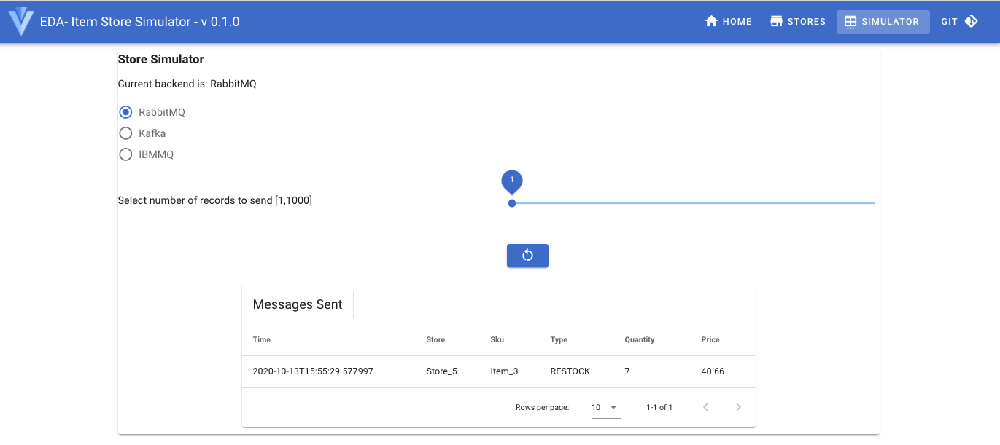

<InlineNotification kind="warning">
<strong>Updated 05/18/2021</strong> - Work in progress
</InlineNotification>

<AnchorLinks>
  <AnchorLink>Overview</AnchorLink>
  <AnchorLink>What you will learn</AnchorLink>
  <AnchorLink>Solution anatomy</AnchorLink>
  <AnchorLink>General pre-requisites</AnchorLink>
  <AnchorLink>Lab 1: Kafka only solution to demonstrate real-time inventory</AnchorLink>
  <AnchorLink>Lab 2: Deploy the MQ Source Connector</AnchorLink>
  <AnchorLink>Lab 3: Deploy the MQ Sink Connector [B]</AnchorLink>
  <AnchorLink>Lab 4: Deploy the JDBC Sink Connector</AnchorLink>
 </AnchorLinks>

## Overview

This scenario implements a simple real time inventory management solution based on real life MVPs we developed in 2020. 
Stores are sending their sale transactions to a central messaging platform, based on queues or topics, and with the adoption of loosely coupled microservices, 
real time analytics Kafka is part of the architecture. Adopting Kafka Connect helps to integrate with existing applications 
without any changes to their base code.


This scenario addresses multiple use cases that aim to build an end to end data pipeline solution from source to different potential sinks:

* The store simulator inject directly sell events to Kafka to the `items` topic
* The store simulator can also generate message to IBM MQ using JMS API or to RabbitMQ using AMQP protocol
* When messages are sourced to Queues, then a Kafka Source Connector is used to propagate message to `items` topics.
* The Inventory computation is done using Kafka Stream component which produces inventory items and keep, in-memory a stock per store. 
This inventory is exposed by API and used the interactive query capability of Kafka Streams.
* Different sink connectors can be plugged into this `inventory` topic to move data to DB2, Elastic Search, Cloud Object Storage...

We try to make the business scenario, easily demonstrable by running locally with docker or on an OpenShift Cluster.

### Component view

At the high level Kafka Connect is used to integrate external systems into Kafka. For example external systems can inject item sale messages to queue, from which a first Kafka source connector 
publishes the messages to a Kafka topic, which then will be processed by a series of event-driven microservices down to a final topic, which will be used by Sink connectors
 to send records to other external systems.

 


All the components of this scenario are ready to run on OpenShift, but we are also providing different docker compose files to run all of those components on your local computer. 
The important body of knowledge of this scenario is related to the programming model we used, and the Kafka Connect configuration and code.

## What you will learn

* Use Quarkus, with reactive programming API like Mutiny, with Kafka API to produce message to Kafka
* Same Quarkus app can generate messages to RabbitMQ using the AMQP API
* Same Quarkus app can generate mesasges to IBM MQ using JMS
* Use Kafka Connect to get source and sink cluster to get date from the RabbitMQ queue and to IBM MQ queue or DB2
* Use Quarkus and Kafka streams to compute aggregates to build an inventory view from the stream of events
* Use the RabbitMQ source connector from IBM Event messaging open source contribution
* Use the IBM MQ sink connector from IBM Event messaging open source contribution
* Use the JDBC sink connector from IBM Event messaging open source contribution

## Solution anatomy

1. The [store simulator application](https://github.com/ibm-cloud-architecture/refarch-eda-store-simulator) is a Quarkus based app, which generates item sales to different possible messaging middlewares ( RabbitMQ, MQ or event directly to Kafka). 
The code of this application is in this https://github.com/ibm-cloud-architecture/refarch-eda-store-simulator. If you want to browse the code, the main readme of this project includes how to package and run this app with docker compose, and explains how the code works. 
The docker image is [quay.io/ibmcase/eda-store-simulator/](https://quay.io/ibmcase/eda-store-simulator)
1. The inventory aggregator is a Kafka Stream Quarkus application, done with Kafka Stream API. The source code is in [the refarch-eda-item-inventory project](https://github.com/ibm-cloud-architecture/refarch-eda-item-inventory). 
Consider this more as a black box in the context of the scenario, it consumes items events, aggregate them, expose APIs on top of Kafka Streams interactive queries and publish inventory events on `inventory` topic. 
2. The mock up Inventory mainframe application is not implemented and we will use the MQ tools to view the message in the `inventory` MQ queue.

    * The MQ Sink connector [B] configuration is defined in the [real time inventory lab](https://github.com/ibm-cloud-architecture/refarch-eda-tools) folder, `mq-sink.json` file.
    * MQ broker runs in docker container started with docker-compose
    * The lab scenario is [describe in the Connect MQ use case ](../../use-cases/connect-mq/)
1. The Inventory Application, using DB2 as datasource is a quarkus app using hibernate with panache, defined in the [inventory-app](https://github.com/ibm-cloud-architecture/refarch-eda-inventory-app) folder

    * The JDBC Sink connector [C] configuration is defined in the the [real time inventory lab](https://github.com/ibm-cloud-architecture/refarch-eda-tools) folder, `jdbc-sink.json` file .
    * The [Connect JDBC use case](../../use-cases/connect-jdbc/) lab goes over how the Kafka Connect JDBC sink works.
1. The [last scenario](#scenario-4:-run-the-solution-components-end-to-end-on-kubernetes) addresses the end to end solution, which is basically an end to end demonstration of a simple data pipeline for a real time view of an inventory solution.

### Pre-requisites for all labs


* [Docker](https://docs.docker.com/) and docker compose to run the solution locally.
* You need to get [docker compose](https://docs.docker.com/compose/).
* [git CLI](https://git-scm.com/downloads).
* Get access to an OpenShift Cluster
* [OpenShift CLI]() on your local environment.
* [jq]() on your local environment.
* Clone the Inventory lab repository: 

```sh
oc clone  https://github.com/ibm-cloud-architecture/eda-lab-inventory.git
```


## Lab 1: Kafka only solution to demonstrate real-time inventory

In this lab we will deploy the solution using Strimzi on OpenShift. The diagram looks like the following:


The Kafka version is Strimzi 2.7.

Here are the simplest steps to deploy the solution in minimum configuration:

1. Login to the OpenShift cluster (4.6 version): `oc login --token=sha256~d... --server=https://....containers.cloud.ibm.com...`
1. Work from the clone repository: `cd eda-lab-inventory`
1. Define the environment variables for your deployment in the: `scripts/env-strimzi.sh`
1. Start the deploy with one script `./scripts/deployInventorySolutionWithStrimzi.sh --skip-login`

The following pods should be up and running:

```sh
NAME                                            READY   STATUS      RESTARTS   AGE
apicurio-registry-operator-5d6fc6ccb5-s9mfd     1/1     Running     0          94m
my-apicurioregistry-deployment-qq6zz-1-deploy   0/1     Completed   0          84m
my-apicurioregistry-deployment-qq6zz-1-rfbcn    1/1     Running     0          84m
my-kafka-cruise-control-5866484456-nb8jl        2/2     Running     0          117m
my-kafka-entity-operator-6c88b5c68c-62fhf       3/3     Running     0          117m
my-kafka-kafka-0                                1/1     Running     0          118m
my-kafka-kafka-1                                1/1     Running     0          118m
my-kafka-kafka-2                                1/1     Running     0          118m
my-kafka-zookeeper-0                            1/1     Running     0          118m
my-kafka-zookeeper-1                            1/1     Running     0          118m
my-kafka-zookeeper-2                            1/1     Running     0          118m
store-simulator-2-deploy                        0/1     Completed   0          35m
store-simulator-2-hh5st                         1/1     Running     0          35m
```


### Demonstration Script 

For an end-to-end demonstration the following steps can be demonstrated once the environment is up and running.

1. Start with the Store Simulator -> Stores view to present the stores Acme Inc is managing. Those stores ID will be used as key for sending events to Kafka.

 

1. In the Simulator view start to send 10 messages to 

 

1. Validate Data arrived into RabbitMQ using the RabbitMQ console [http://localhost:15672/](http://localhost:15672/#/)

 

1. Validate Data is injected to Kafka once the RabbitMQ connector is deployed using:

```shell
docker exec -ti real-time-inventory_kafka_1  bash -c "/opt/kafka/bin/kafka-console-consumer.sh --bootstrap-server localhost:9092 --topic items --from-beginning"

```

## General pre-requisites


We need the following tools to run the different labs. We try to use docker images as much as possible to do not impact your local laptop with tools you may not want python for example.


## Lab 2: Deploy the MQ Source Connector

The lab context is outlined in the following figure:


See [the EDA Lab MQ to Kafka repository](https://github.com/ibm-cloud-architecture/eda-lab-mq-to-kafka) for instructions to run locally or on OpenShift

## Lab 3: Deploy the MQ Sink Connector

Follow the [MQ Sink Connector](/use-cases/connect-mq/#lab-2:-mq-sink-from-kafka) use case to deploy the connector runtime to OpenShift, connecting your source Kafka environment and topic to the target MQ queue manager.


## Lab 4: Deploy the JDBC Sink Connector

Follow the [JDBC Sink Connector](/use-cases/connect-jdbc/) use case to deploy the JDBC sink connector runtime, connecting your source Kafka environment and topic to the target DB2 database. This project uses a simple Inventory App to present the content of the DB2 tables. The component view looks like in the following diagram:

 

## Lab 5: RabbitMQ Source Connector to Kafka items topic

Follow the [RabbitMQ Source Connector lab](/use-cases/connect-rabbitmq/) to deploy the Kafka connector runtime, and deploy the RabbitMQ source connector configuration so it can get messages from RabbitMQ `items` queue to the target Kafka `items` topic.

 


