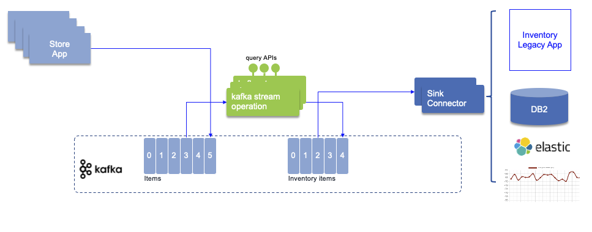
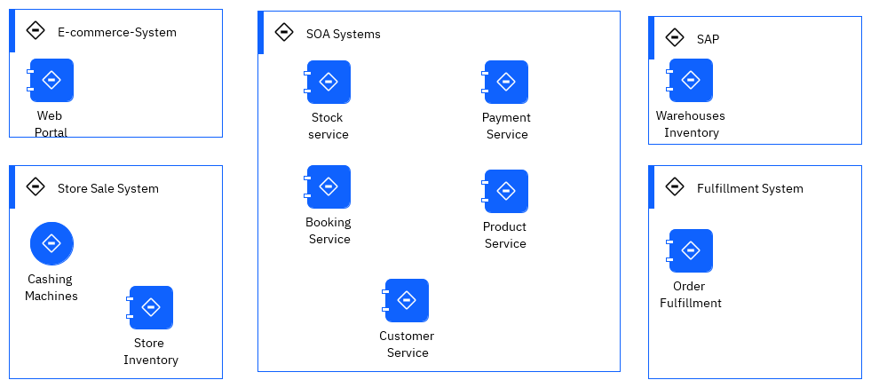
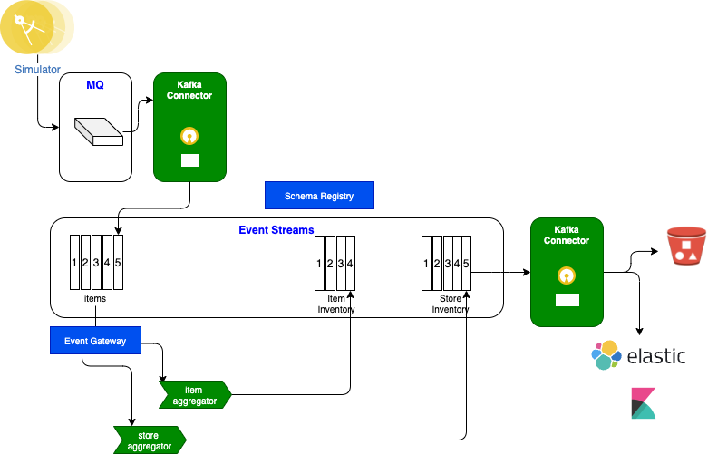
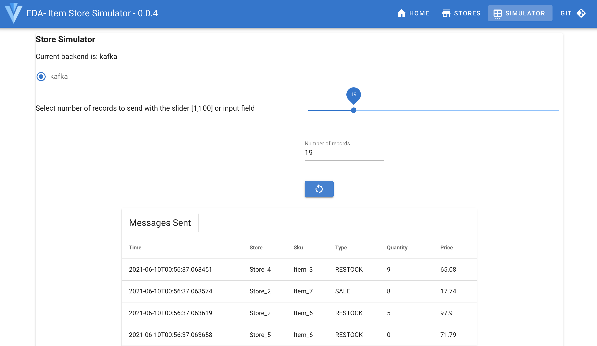
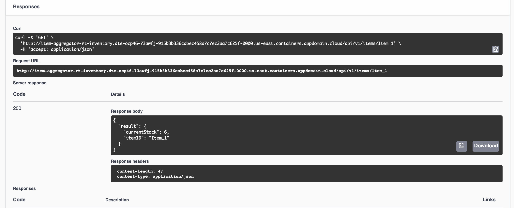
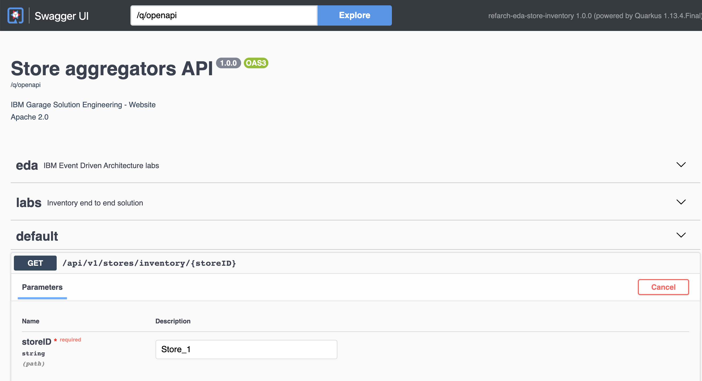

An IBM Cloud Pak for Integration - Event Streams use case

<InlineNotification kind="warning">
<strong>Updated 02/22/2022</strong> - Work in progress
</InlineNotification>

<AnchorLinks>
  <AnchorLink>Introduction</AnchorLink>
  <AnchorLink>Use Case Guided Tour</AnchorLink>
  <AnchorLink>Full Demo Narration</AnchorLink>
  <AnchorLink>Developer Corner</AnchorLink>
 </AnchorLinks>

----
# Introduction 

## Use Case Overview

Today a lot of companies that are managing item / product inventory are facing real challenge to get a close to real-time view of item availabity
and inventory. The solution can be very complex to implement while integrate Enterprise Resource Planning products. But any new solutions
are adopting events as a source to exchange data, to put less pression on existing ERP, and to get visibility into inventory positions.

This scenario implements a simple near real-time inventory management solution based on real life MVPs we developed in 2020 for different customers. 
A production deployment will implement different level of stores and warehouse inventory aggregators that will be push to event backbone to build
different caching services, to address use cases like item availability or inventory query at the item or store level.

At the high level the solution may look like in the following figure. Store applications are sending sale transactions to a central messaging platform,
where streaming components are computing the different aggregates and publish them to other topics.



Sink connector, based on Kafka Connect framework may be used to move data to Database, Legacy ERP, Elastic Search, dashboards...

In real life, an as-is solution will include back-end applications to manage the warehouses inventory, connected to a fulfillment home built application,
combined with store applications and servers, e-commerce suite, and a set of SOA services exposing backend systems.

 

We may have integration flows to do data mapping, most of those calls are synchronous.  To get one item availability, a lot of SOAP calls are done, 
increasing latency, and risk of failure. There is [an interesting video](https://www.youtube.com/watch?v=FskIb9SariI) from Scott Havens explaining the needs 
from transitioning from a synchronous architecture to an event-driven asynchronous one when scaling is a must. This lab reflects this approach.

## Demonstration components



Diagram source: [rt-inventory diagram](https://github.com/ibm-cloud-architecture/eda-rt-inventory-gitops/blob/main/docs/diagrams/mq-es-demo.drawio)

1. The [store simulator application](https://github.com/ibm-cloud-architecture/refarch-eda-store-simulator) is a Quarkus app, which generates item sales 
to different possible messaging middlewares ( RabbitMQ, IBM MQ or directly to IBM Event Streams). 
If you want to browse the code, the main readme of this project includes how to package and run this app with docker compose, 
and explains how the code works. The docker image is [quay.io/ibmcase/eda-store-simulator/](https://quay.io/ibmcase/eda-store-simulator)
1. The item inventory aggregator is a Kafka Stream Quarkus application, done with Kafka Stream API. The source code is in [the refarch-eda-item-inventory project](https://github.com/ibm-cloud-architecture/refarch-eda-item-inventory). 
Consider this more as a black box in the context of the scenario, it consumes items events, aggregate them, expose APIs on top of Kafka Streams interactive queries and publish inventory events on `item.inventory` topic. 
1. The store inventory aggregator is a Kafka Stream Quarkus application, done with Kafka Stream API. The source code is in [the refarch-eda-store-inventory project](https://github.com/ibm-cloud-architecture/refarch-eda-store-inventory) the output is in `store.inventory` topic. 
1. The MQ to Kafka, Kafka connector is defined in the GitOps repository
1. The Kafka to Cloud Object Storage Kafka connector is also defined in the [GitOps repository](https://github.com/ibm-cloud-architecture/eda-rt-inventory-gitops) folder `kconnect`.

Kafka Connect is used to integrate external systems into Kafka. For example external systems can inject item sale messages to queue, from which a first Kafka source connector 
publishes the messages to a Kafka topic, which then will be processed by a series of event-driven microservices down to a final topic, which will be used by Sink connectors
 to send records to other external systems.


## Choose an option:

### Run on your laptop

As a developer or technical seller you could demonstrate this scenario on your laptop. 
The docker images used in this solution are in public registry ([Quay.io](https://recovery.quay.io/organization/ibmcase)), the docker compose in
the [rt-inventory-gitops.git](https://github.com/ibm-cloud-architecture/rt-inventory-gitops.git) uses IBM Event Streams and IBM MQ Images and the custom images of the services.

Once you have cloned the gitops repository (see pre-requisites section below), go under the `local-demo/kstreams` folder and run

  ```sh
  docker-compose up -d
  ```

  To stop the demonstration do

  ```sh
  docker-compose down
  ```

### Install Yourself on OpenShift

In this approach, we propose to use a GitOps repository and deploy the solution using few scripts and `oc` CLI commands.

### Pre-requisites for both options

* [Docker](https://docs.docker.com/) and docker compose to run the solution locally.
* [git CLI](https://git-scm.com/downloads).
* Clone the Inventory lab repository: 

  ```sh
  git clone  https://github.com/ibm-cloud-architecture/rt-inventory-gitops.git
  ```


--- 

# Use Case Guided Tour


## Demo start package

In the home page, the main figure illustrates the components involved in the demonstration. You can leverage [this component description]() to present
each component main goal.

---

# Full Demo Narration

We will first go over the demonstration using the store simulator then using and end to end test script

1. Go to the Simulator user interface using the route like: `https://store-simulator-rt-inventory.dte-ocp46-73awfj-915b3b336cabec458a7c7ec2aa7c625f-0000.us-east.containers.appdomain.cloud`

  To get this route use the following command:

  ```sh
  oc get routes store-simulator  -o jsonpath="{.spec.host}" && echo
  ```

  

  The simulator will send random sell events for the stores as listed in the Stores table (the content may change in future release):

  

1. Send some events by selecting the toggle Kafka and then the number of records to send:

  

  once started a table should be displayed to present the records sent to Kafka. 

1. Let assess if we can see the item stock cross stores: use the item-aggregator route, something like ` item-aggregator-rt-inventory.dte-ocp46-73awfj-915b3b336cabec458a7c7ec2aa7c625f-0000.us-east.containers.appdomain.cloud ` but completed with '/q/swagger-ui' as we want to access the API
  
  To get this route use the following command:

  ```sh
  oc get routes item-aggregator -o jsonpath="{.spec.host}" && echo
  ```

   Select the get `/api/v1/items/{itemID}` operation:

  

  Use one of the following item id: [Item_1, Item_2, Item_3, Item_4, Item_5, Item_6, Item_7]. You should get 
  the current stock cross stores

  

1. Let assess a store stock, for that we access the store aggregator URL: `store-aggregator-rt-inventory.dte-ocp46-73awfj-915b3b336cabec458a7c7ec2aa7c625f-0000.us-east.containers.appdomain.cloud ` with the `/q/swagger-ui` suffix.

  To get this route use the following command:

  ```sh
  oc get routes store-aggregator -o jsonpath="{.spec.host}" && echo
  ```

  Then use the GET on the `api/v1/stores/inventory/{storeID}`, and enter one of the available store: `[Store_1, Store_2, Store_3, Store_4, Store_5]`

  

  The response should look like:

  

---

# Developer Corner

## What you will learn

* Use Quarkus, with reactive programming API like Mutiny, and Kafka API to produce messages to Kafka
* Same Quarkus app can generate messages to RabbitMQ using the AMQP API
* Same Quarkus app can generate messages to IBM MQ using JMS
* Use Quarkus and Kafka Streams to compute aggregates to build an inventory view from the stream of sale order events
* Use the IBM MQ source connector from IBM Event messaging open source contribution


## Solution anatomy

1. The [store simulator application](https://github.com/ibm-cloud-architecture/refarch-eda-store-simulator) is a Quarkus app, which generates item sales to different possible messaging middlewares ( RabbitMQ, MQ or directly to Kafka). 
The code of this application is in this https://github.com/ibm-cloud-architecture/refarch-eda-store-simulator. If you want to browse the code, the main readme of this project includes how to package and run this app with docker compose, 
and explains how the code works. 
The docker image is [quay.io/ibmcase/eda-store-simulator/](https://quay.io/ibmcase/eda-store-simulator)
1. The item inventory aggregator is a Kafka Stream Quarkus application, done with Kafka Stream API. The source code is in [the refarch-eda-item-inventory project](https://github.com/ibm-cloud-architecture/refarch-eda-item-inventory). 
Consider this more as a black box in the context of the scenario, it consumes items events, aggregate them, expose APIs on top of Kafka Streams interactive queries and publish inventory events on `item.inventory` topic. 
1. The store inventory aggregator is a Kafka Stream Quarkus application, done with Kafka Stream API. The source code is in [the refarch-eda-store-inventory project](https://github.com/ibm-cloud-architecture/refarch-eda-store-inventory) the output is in `store.inventory` topic. 
2. The mock up Inventory mainframe application is not implemented and we will use the MQ tools to view the message in the `item.inventory` MQ queue.


## Lab 1: Demonstrate near real-time inventory with IBM Event Streams

In this lab we will deploy the solution using IBM Event Streams on OpenShift. The diagram looks like the following:


The Kafka version in IBM Event Streams is 2.7.

The deployment to OpenShift using IBM Event Streams operator, and gitops approach is described in dedicated lab you can read the details in the [Kafka Stream use case section](/use-cases/kafka-streams/lab-3/).

Here are the simplest steps to deploy the solution in minimum configuration:

1. Login to the OpenShift cluster (4.7 version): `oc login --token=sha256~d... --server=https://....containers.cloud.ibm.com...`
1. Work from the cloned repository: `cd rt-inventory-gitops`
1. Define the environment variables for your deployment in the: `scripts/env-AMQStreams.sh`. You mostly want to change the following variables or use our default settings:

  ```
  YOUR_PROJECT_NAME=rt-inventory
  ```

  > as of now the admin user and password are not used... may be in the future.

1. Start the deployment with the script `./scripts/deployInventorySolutionWithAMQStreams.sh --skip-login`. This should create AMQ streams cluster, and deploy the 4 applications.

  ```sh
  oc project rt-inventory
  oc get pods

  NAME                                         READY   STATUS    RESTARTS   AGE
  dev-kafka-cruise-control-6d6bf8b774-99rwl    2/2     Running   0          4d
  dev-kafka-entity-operator-75f7bc8f5c-x4vkt   3/3     Running   0          4d
  dev-kafka-kafka-0                            1/1     Running   0          4d
  dev-kafka-kafka-1                            1/1     Running   0          4d
  dev-kafka-kafka-2                            1/1     Running   0          4d
  dev-kafka-zookeeper-0                        1/1     Running   0          4d
  dev-kafka-zookeeper-1                        1/1     Running   0          4d
  dev-kafka-zookeeper-2                        1/1     Running   0          4d
  item-aggregator-669fd4fffc-4fvhk             1/1     Running   0          30h
  item-aggregator-669fd4fffc-gtvls             1/1     Running   0          30h
  item-aggregator-669fd4fffc-kxvfh             1/1     Running   0          30h
  store-aggregator-7df98556ff-cxjz5            1/1     Running   0          29h
  store-aggregator-7df98556ff-dl9wz            1/1     Running   0          29h
  store-aggregator-7df98556ff-f2ndq            1/1     Running   0          29h
  store-simulator-56f8958498-mvhp9             1/1     Running   0          4d
  ```

