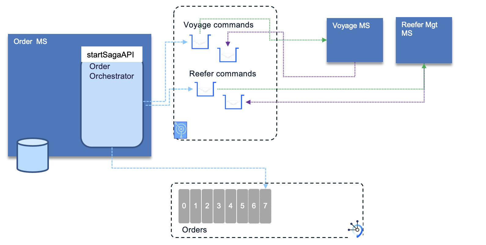

An IBM Cloud Pak for Integration - Event Streams use case

<InlineNotification kind="warning">
<strong>Updated 02/22/2022</strong> - Work in progress
</InlineNotification>

<AnchorLinks>
  <AnchorLink>Introduction</AnchorLink>
  <AnchorLink>Use Case Guided Tour</AnchorLink>
  <AnchorLink>Full Demo Narration</AnchorLink>
  <AnchorLink>Developer Corner</AnchorLink>
 </AnchorLinks>

----

# Introduction 

The [Saga pattern](/patterns/saga) helps to support a long running transaction that can be broken up to a collection of sub transactions that 
can be interleaved any way with other transactions. The SAGA orchestration is done by the order service that sends commands to drive each SAGA 
participant on what to do and when. To support strong consistency and exactly once delivery we are using Queues managed by IBM MQ.
The Saga will be started by adding a new order, or updating major characteristics of an existing order. 
The demonstration illustrates the happy path, where each participants respond positively, and one incomplete path, where the order will not 
be satisfied because of lack of refrigerator containers. So the compensation logic will roll back the Vessel assignment.

The following figure illustrates the component of this demonstration:

* [The order microservice](https://github.com/ibm-cloud-architecture/eda-kc-order-cmd-mq) implements the SAGA orchestration, and Create Read operations for the Order Entity.
* [The voyage microservice](https://github.com/ibm-cloud-architecture/eda-kc-voyage-ms-mq) implements one of the participant of the SAGA and manages Vessel itineraries. 
This project illustrates how you can use the AMQP JMS client from Apache Qpid to interact with IBM MQ AMQP 1.0 servers in a Quarkus application using the Quarkus Qpid JMS extension.
* [The reefer microservice]()

---

# Use Case Guided Tour

---

# Full Demo Narration

---

# Developer Corner

