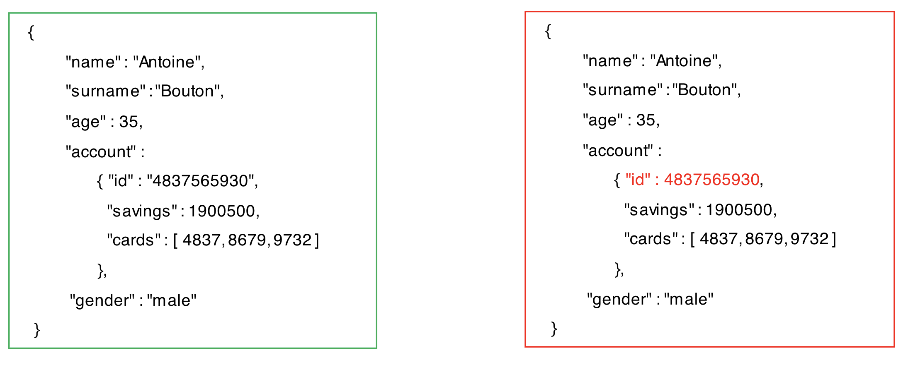
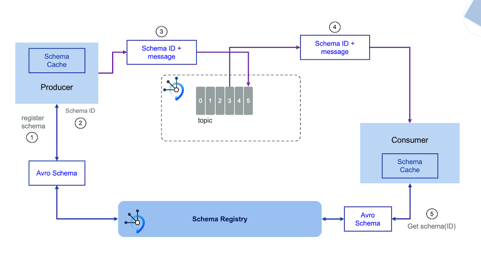

## Apache Avro

Avro is an open source data serialization system that helps with data exchange between systems, programming languages, and processing frameworks. Avro helps define a binary format for your data, as well as map it to the programming language of your choice.

### Why Apache Avro

There are several websites that discuss the Apache Avro data serialization system benefits over other messaging data protocols. A simple google search will list dozens of them. Here, we will highlight just a few from a [Confluent blog post](https://www.confluent.io/blog/avro-kafka-data/):

- It has a direct mapping to and from JSON
- It has a very compact format. The bulk of JSON, repeating every field name with every single record, is what makes JSON inefficient for high-volume usage.
- It is very fast.
- It has great bindings for a wide variety of programming languages so you can generate Java objects that make working with event data easier, but it does not require code generation so tools can be written generically for any data stream.
- It has a rich, extensible schema language defined in pure JSON
- It has the best notion of compatibility for evolving your data over time.

## Data Schemas

Avro relies on schemas. When Avro data is produced or read, the Avro schema for such piece of data is always present. This permits each datum to be written with no per-value overheads, making serialization both fast and small. An Avro schema defines the structure of the Avro data format.

### How does a data schema look like?

Let's see how a data schema to define a person's profile in a bank could look like:

```json
{
  "namespace": "banking.schemas.demo",
  "name": "profile",
  "type": "record",
  "doc": "Data schema to represent a profile for a banking entity",
  "fields ": [
    {
      "name": "name",
      "type": "string"
    },
    {
      "name": "surname",
      "type": "string"
    },
    {
      "name": "age",
      "type": "int"
    },
    {
      "name": "account",
      "type": "banking.schemas.demo.account"
    },
    {
      "name": "gender",
      "type": {
        "type": "enum",
        "name": "genderEnum",
        "symbols": [
          "male",
          "female"
        ]
      }
    }
  ]
}
```

Notice:

1. There are primitive data types like `string` and `int` but also complex types like `record` or `enum`.
2. Complex type `record` requires a `name` attribute but it also can go along with a `namespace` attribute which is a JSON string that qualifies the name.
3. Data schemas can be **nested** as you can see for the `account` data attribute. See below.

```json
{
  "namespace": "banking.schemas.demo",
  "name": "account",
  "type": "record",
  "doc": "Data schema to represent a customer account with the credit cards associated to it",
  "fields": [
    {
      "name": "id",
      "type": "string"
    },
    {
      "name": "savings",
      "type": "long"
    },
    {
      "name": "cards",
      "type": {
        "type": "array",
        "items": "int"
      }
    }
  ]
}
```

In the picture below we see two messages, one complies with the above Apache Avro data schema and the other does not:



You might start realising by now the benefits of having the data flowing into your Apache Kafka event backbone validated against a schema. See next section for more.

For more information on the Apache Avro Data Schema specification see <https://avro.apache.org/docs/current/spec.html>

### Benefits of using Data Schemas

- **Clarity and Semantics**: They document the usage of the event and the meaning of each field in the "doc" fields.
- **Robustness**: They protect downstream data consumers from malformed  data, as only valid data will be permitted in the topic. They let the producers or consumers of data streams know the right fields are need in an event and what type each field is (contract for microservices).
- **Compatibility**: model and handle change in data format.

## Avro, Kafka and Schema Registry

In this section we try to put all the pieces together for the common flow of sending and receiving messages through an event backbone such as kafka having those messages serialized using the Apache Avro data serialization system and complying with their respective messages that are stored and managed by a schema registry.

Avro relies on schemas. When Avro data is produced or read, the Avro schema for such piece of data is always present. An Avro schema defines the structure of the Avro data format. Schema Registry defines a scope in which schemas can evolve, and that scope is the subject. The name of the subject depends on the configured subject name strategy, which by default is set to derive subject name from topic name.

In this case, the messages are serialized using Avro and sent to a kafka topic. Each message is a key-value pair. Either the message key or the message value, or both, can be serialized as Avro. Integration with Schema Registry means that Kafka messages do not need to be written with the entire Avro schema. Instead, Kafka messages are written with the **schema id**. The producers writing the messages and the consumers reading the messages must be using the same Schema Registry to get the same mapping between a schema and schema id.

### How does it all work



When the producer sends a message/event to a Kafka topic for the first time, it sends the schema for that message/event to the Schema Registry. The Schema Registry registers this schema to the subject for the Kafka topic we want to send the message/event to, and returns the **schema id** to the producer. The producer **caches this mapping between the schema and schema id** for subsequent message writes, so **it only contacts Schema Registry on the first message/event write** (unless the schema has changed, that is evolved, when the schema registry will be contacted again for validation and storage of this new version of the schema). Kafka messages are written along with the **schema id** rather than with the entire data schema.

When a consumer reads this data, it sees the **Avro schema id and sends a schema request to the Schema Registry**. The Schema Registry retrieves the schema associated to that schema id, and **returns the schema to the consumer**. The consumer **caches** this mapping between the schema and schema id for subsequent message reads, so it only contacts Schema Registry on the first schema id read.

## Schema Registry

<InlineNotification kind="info">

The information below corresponds to the Schema Registry implementation in the IBM Event Streams product that is part of the IBM CloudPak for Integration. For the IBM Event Streams on IBM Cloud offering, this implementation might differ.

</InlineNotification>

Kafka is used as Schema Registry storage backend. The special Kafka topic `<kafkastore.topic>` (default `_schemas`), with a single partition, is used as a highly available write ahead log. All schemas, subject/version and ID metadata, and compatibility settings are appended as messages to this log. A Schema Registry instance therefore both produces and consumes messages under the `_schemas` topic. It produces messages to the log when, for example, new schemas are registered under a subject, or when updates to compatibility settings are registered. Schema Registry consumes from the `_schemas` log in a background thread, and updates its local caches on consumption of each new `_schemas` message to reflect the newly added schema or compatibility setting. Updating local state from the Kafka log in this manner ensures durability, ordering, and easy recoverability.

## Labs

We have developed two labs, one for the IBM Event Streams product that comes with the IBM CloudPak for Integration installed on a RedHat OpenShift cluster and the other for the IBM Event Streams on IBM Cloud offering, to get hands-on experience working with Apache Avro, data schemas and the IBM Event Streams Schema Registry:

- [IBM Event Streams on IBM Cloud lab](/use-cases/schema-registry-on-cloud/)
- [IBM Event Streams from IBM CloudPak for Integration lab](/use-cases/schema-registry-on-ocp/)
