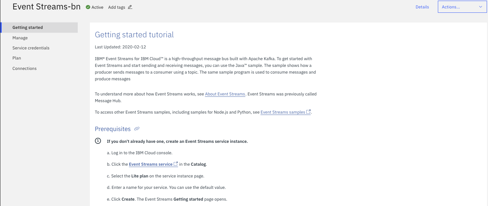
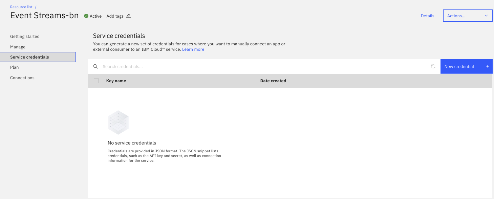

## Pre-requisites

* Get a IBM Cloud Account by using the register link in [https://cloud.ibm.com/login](https://cloud.ibm.com/login)
Create a new account is free of charge. 

### Account and resource groups

It is recommended to study [the concepts of IBM account](https://cloud.ibm.com/docs/account?topic=account-overview) 
and how it is related to resource group and services. 

To summarize:

* Account represents the billable entity, and can have multiple users.
* Users are given access to resource groups.
* Applications are identified with a service ID.
* To restrict permissions for using specific services, you can assign specific access policies to the service ID
* Resource groups are here to organize any type of resources (services, clusters, VMs...) that are managed by  Identity and Access Management (IAM).
* Resource groups are not scoped by location
* Access group are used to organize a set of users and service IDs into a single entity and easily assign permissions

## Create a service instances

From the IBM Cloud Dashboard page, you can create a new resource, using the right top button `Create resource`. 

which leads to the service and feature catalog. From there in the `services` view, select the `integration` 
category and then the `Event Streams` tile:

You can access this screen from this URL: [https://cloud.ibm.com/catalog/event-streams](https://cloud.ibm.com/catalog/event-streams).

### Plan characteristics

Within the first page for the Event Streams creation, you need to select the region, the pricing plan, a service name and the resource group.

For the region, it is important to note that the 'lite' plan is available only in Dallas, and it used to do some proof of concept. 
It is recommended to select a region close to your on-premise data center. For the Plan description, 
the [product documentation](https://cloud.ibm.com/docs/EventStreams?topic=eventstreams-plan_choose) goes over the different plans in details.

The 'multi-tenancy' means the Kafka cluster is shared with other people. The cluster topology is covering multi availability zones inside
the same data center. The following diagram illustrates a simple view of this topology with the different network zones and availability zones:

We will address fine-grained access control in [this section](#acl).

As described in the [Kafka concept introduction](https://cloud.ibm.com/docs/EventStreams?topic=eventstreams-apache_kafka), topic may have partitions.
Partitions are used to improve throughput as consumer can run in parallel, and producer can publish to multiple partitions.

The plan set a limit on the total number of partitions. With enterprise plan it is possible to go over this limit by contacting IBM.

Each partition records, are persisted in the file system and so the maximum time records are kept on disks 
is controlled by the maximum retention period and total size. Those Kafka configurations are described in the
[topic and broker documentation](https://kafka.apache.org/documentation/#topicconfigs). 

This first page has also a price estimator. The two important concepts used for pricing are the number of 
partition instances and the number of GB consumed: each consumer reading from a topic/partition will increase
the number of byte consumed. The cost is per month.

## Getting started

Once created you reach the getting started panel:

### ACL