This documentation aims to be a introductory hands-on lab on IBM Event Streams on Cloud with topic creation.

## Index

<AnchorLinks>
  <AnchorLink>Pre-requisites</AnchorLink>
  <AnchorLink>Create a Event Streams service instance</AnchorLink>
  <AnchorLink>Creating Event Streams instance with IBM Cloud CLI</AnchorLink>
  <AnchorLink>Create topic</AnchorLink>
  <AnchorLink>Create topic with CLI</AnchorLink>
</AnchorLinks>

## Pre-requisites

This lab requires the following components to work against:

1. An IBM Cloud account. Get a IBM Cloud Account by using the register link in [https://cloud.ibm.com/login](https://cloud.ibm.com/login)
Create a new account is free of charge. 

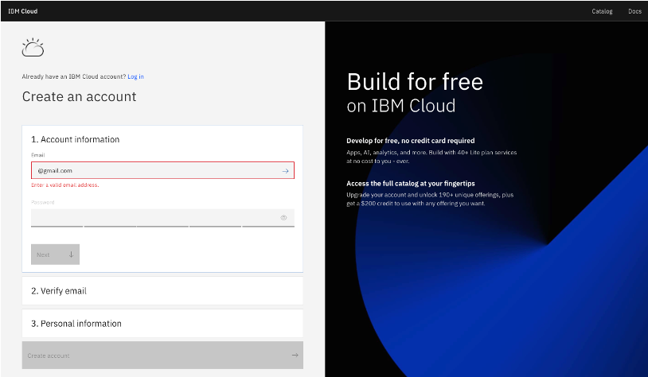

On your development workstation you will need:

1. IBM Cloud CLI (<https://cloud.ibm.com/docs/cli?topic=cloud-cli-getting-started>)
1. IBM CLoud CLI Event Streams plugin (`ibmcloud plugin install event-streams`)

### Login CLI

```
ibmcoud login
```

### Account and resource group concepts

As any other IBM Cloud services, Event Streams can be part of a resources group, is controlled by user roles, and is accessible via API keys. 
To get familiar with those concepts, it is recommended to study [the concepts of IBM account](https://cloud.ibm.com/docs/account?topic=account-overview) 
and how it is related to resource group and services. The following diagram is a summary of the objects managed in IBM Cloud:


To summarize:

* Account represents the billable entity, and can have multiple users.
* Users are given access to resource groups.
* Applications are identified with a service ID.
* To restrict permissions for using specific services, you can assign specific access policies to the service ID and user ID
* Resource groups are here to organize any type of resources (services, clusters, VMs...) that are managed by  Identity and Access Management (IAM).
* Resource groups are not scoped by location
* Access group are used to organize a set of users and service IDs into a single entity and easily assign permissions

## Create a Event Streams service instance

From the IBM Cloud Dashboard page, you can create a new resource, using the right top button `Create resource`. 

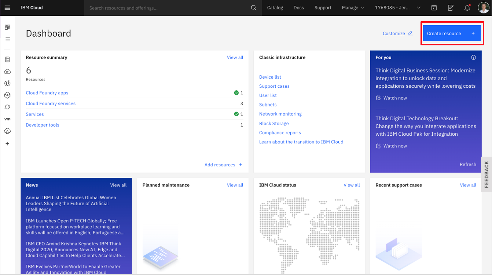

which leads to the service and feature catalog. From there in the `services` view, select the `integration` 
category and then the `Event Streams` tile:

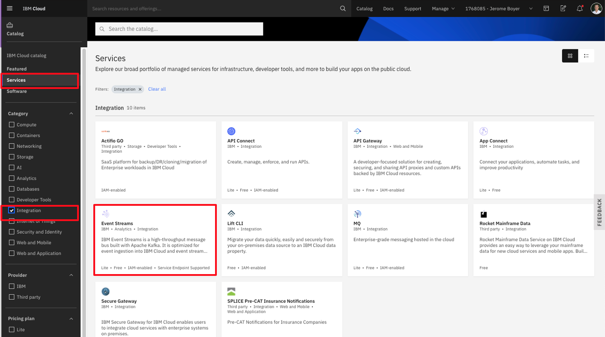

You can access this screen from this URL: [https://cloud.ibm.com/catalog/event-streams](https://cloud.ibm.com/catalog/event-streams).

### Plan characteristics

Within the first page for the Event Streams creation, you need to select the region, the pricing plan, a service name and the resource group.

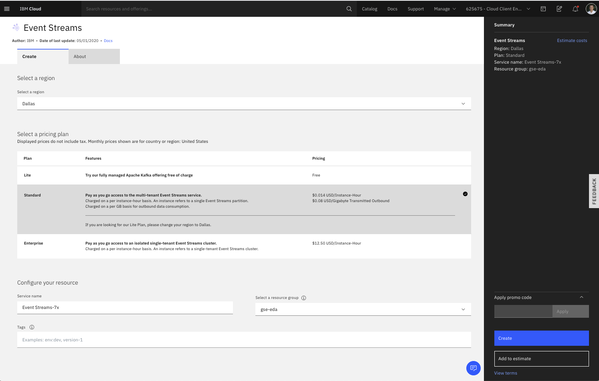

For the region, it is important to note that the 'lite' plan is available only in Dallas, and it used to do some proof of concept. 
It is recommended to select a region close to your on-premise data center. For the Plan description, 
the [product documentation](https://cloud.ibm.com/docs/EventStreams?topic=eventstreams-plan_choose) goes over the different plans in details.

The 'multi-tenancy' means the Kafka cluster is shared with other people. The cluster topology is covering multi availability zones inside
the same data center. The following diagram illustrates a simple view of this topology with the different network zones and availability zones:


We will address fine-grained access control in [the security lab](security).

As described in the [Kafka concept introduction](https://cloud.ibm.com/docs/EventStreams?topic=eventstreams-apache_kafka), topic may have partitions.
Partitions are used to improve throughput as consumer can run in parallel, and producer can publish to multiple partitions.

The plan set a limit on the total number of partitions. 

Each partition records, are persisted in the file system and so the maximum time records are kept on disks is controlled by the maximum retention period and total size. Those Kafka configurations are described in the
[topic and broker documentation](https://kafka.apache.org/documentation/#topicconfigs). 

Fro the Standard plan, the first page has also a price estimator. The two important concepts used for pricing are the number of  partition instances and the number of GB consumed: each consumer reading from a topic/partition will increase the number of byte consumed. The cost is per month.

### Creating Event Streams instance with IBM Cloud CLI

1. Go to IBM Cloud and click on the user avatar on the top right corner. Then, click on _Log in to CLI and API_ option:

   

1. Copy the `IBM Cloud CLI` login command

   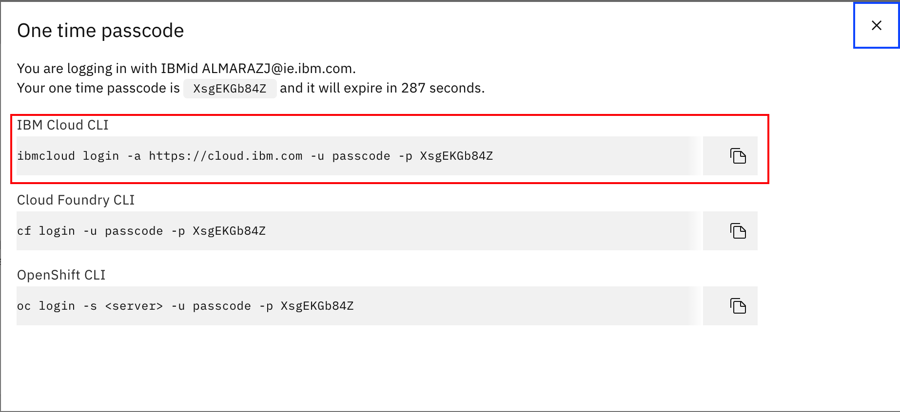

1. Open a terminal window, paste and execute the command:

	```shell
	$ ibmcloud login -a https://cloud.ibm.com -u passcode -p XsgEKGb84Z
	API endpoint: https://cloud.ibm.com
	Authenticating...
	OK

	Targeted account bill s Account (b63...) <-> 195...
	Select a region (or press enter to skip):
	1. au-syd
	2. in-che
	3. jp-osa
	4. jp-tok
	5. kr-seo
	6. eu-de
	7. eu-gb
	8. us-south
	9. us-south-test
	10. us-east
	Enter a number> 6
	Targeted region eu-de

	API endpoint:      https://cloud.ibm.com
	Region:            eu-de
	User:              A<>
	Account:           Bill s Account (b63...) <-> 195...
	Resource group:    No resource group targeted, use ibmcloud target -g RESOURCE_GROUP
	CF API endpoint:
	Org:
	Space:
	```

1. List your services with `ibmcloud resource service-instances` and make sure your IBM Event Streams instance is listed:

	```shell
	$ ibmcloud resource service-instances
	Retrieving instances with type service_instance in all resource groups in all locations under account Kedar Kulkarni's Account as ALMARAZJ@ie.ibm.com...
	OK
	Name                                   Location   State    Type
	IBM Cloud Monitoring with Sysdig-rgd   us-south   active   service_instance
	apikey for simple toolchain            us-east    active   service_instance
	aapoc-event-streams                    us-south   active   service_instance
	Event Streams-wn                       eu-de      active   service_instance
	```

	We can see our instance called: **Event Streams-wn**

1. Create an Event Streams instance using CLI

	```shell
	ibmcloud resource service-instance-create EventStreamsEDA2 messagehub standard us-south
	```

1. List your IBM Event Streams instance details with `ibmcloud resource service-instance <instance_name>`:

	```shell
	$ ibmcloud resource service-instance Event\ Streams-wn 
	Retrieving service instance Event Streams-wn in all resource groups under account Kedar Kulkarni's Account as ALMARAZJ@ie.ibm.com...
	OK

	Name:                  Event Streams-wn
	ID:                    crn:v1:bluemix:public:messagehub:eu-de:a/b636d1d8...cfa:b05be9...2e687a::
	GUID:                  b05be932...e687a
	Location:              eu-de
	Service Name:          messagehub
	Service Plan Name:     enterprise-3nodes-2tb
	Resource Group Name:
	State:                 active
	Type:                  service_instance
	Sub Type:
	Created at:            2020-05-11T15:54:48Z
	Created by:            bob.the.builder@someemail.com
	Updated at:            2020-05-11T16:49:18Z
	Last Operation:
						Status    sync succeeded
						Message   Synchronized the instance
	```
	Mind the `\` character in your IBM Event Streams instance.

1. Initialize your IBM Event Streams plugin for the IBM Cloud CLI with `ibmcloud es init`:

	```shell
	$ ibmcloud es init

	Select an Event Streams instance:
	1. Event Streams-2t
	2. Event Streams-wn
	3. aapoc-event-streams
	4. tutorial
	Enter a number> 2
	API Endpoint: 	https://mh-tcqsppdpzlrkdmkb.....175-0000.eu-de.containers.appdomain.cloud
	OK
	```

1. Check all the CLI commands available to you to manage and interact with your IBM Event Streams instance with `$ ibmcloud es`:

	```shell
	$ ibmcloud es
	NAME:
	ibmcloud es - Plugin for IBM Event Streams (build 1908221834)

	USAGE:
	ibmcloud es command [arguments...] [command options]

	COMMANDS:
	broker                 Display details of a broker.
	broker-config          Display broker configuration.
	cluster                Display details of the cluster.
	group                  Display details of a consumer group.
	group-delete           Delete a consumer group.
	group-reset            Reset the offsets for a consumer group.
	groups                 List the consumer groups.
	init                   Initialize the IBM Event Streams plugin.
	topic                  Display details of a topic.
	topic-create           Create a new topic.
	topic-delete           Delete a topic.
	topic-delete-records   Delete records from a topic before a given offset.
	topic-partitions-set   Set the partitions for a topic.
	topic-update           Update the configuration for a topic.
	topics                 List the topics.
	help, h                Show help

	Enter 'ibmcloud es help [command]' for more information about a command.
	```

1. List your cluster configuration with `$ ibmcloud es cluster`:

	```shell
	$ ibmcloud es cluster
	Details for cluster
	Cluster ID                                                      Controller
	mh-tcqsppdpzlrkdmkbgmgl-4c20...361c6f175-0000   0

	Details for brokers
	ID   Host                                                                                                     Port   Rack
	0    kafka-0.mh-tcqsppdpzlrkdmkbgmgl-4c201a12d......22e361c6f175-0000.eu-de.containers.appdomain.cloud   9093   fra05
	1    kafka-1.mh-tcqsppdpzlrkdmkbgmgl-4c201a12d......22e361c6f175-0000.eu-de.containers.appdomain.cloud   9093   fra02
	2    kafka-2.mh-tcqsppdpzlrkdmkbgmgl-4c201a12d......22e361c6f175-0000.eu-de.containers.appdomain.cloud   9093   fra04
	No cluster-wide dynamic configurations found.
	```
1. Looking at broker details: `ibmcloud es broker  0`:

	```shell
	ibmcloud es broker  0
		Details for broker
		ID   Host                                                                        Port   Rack   
		0    broker-0-t19zgvnykgdqy1zl.kafka.svc02.us-south.eventstreams.cloud.ibm.com   9093   dal10   

		Details for broker configuration
		Name                   Value                                                                                            Sensitive?   
		broker.id              0                                                                                                false   
		broker.rack            dal10                                                                                            false   
		advertised.listeners   SASL_EXTERNAL://broker-0-t19zgvnykgdqy1zl.kafka.svc02.us-south.eventstreams.cloud.ibm.com:9093   false   
		OK

	```

1. Get detail view of a broker configuration: `ibmcloud es broker-config  0`

We will see other CLI commands in future labs.

### Coming back another time

When coming back to the IBM Cloud dashboard the simplest way to find the Event Streams service is to go 
to the `Services`:

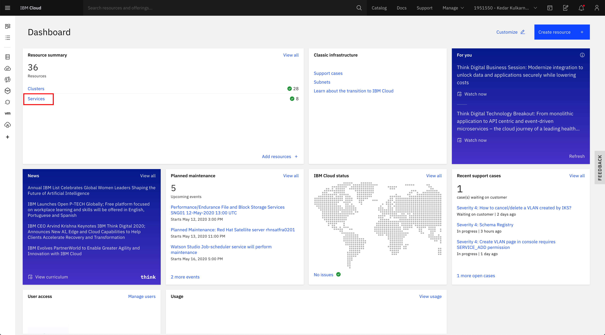

* Click on your IBM Event Streams instance:


* Click on _Launch Dashboard_ button to open the IBM Event Streams dashboard

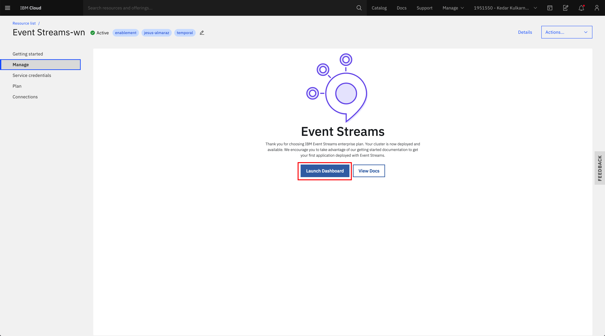

### Main Event Streams Dashboard page

Once the instance is created, or when you come back to the service, you reach the `manage`panel, as illustrated in previous figure.

From the Dashboard we can access the _Topics_ and _Consumer groups_ panels.

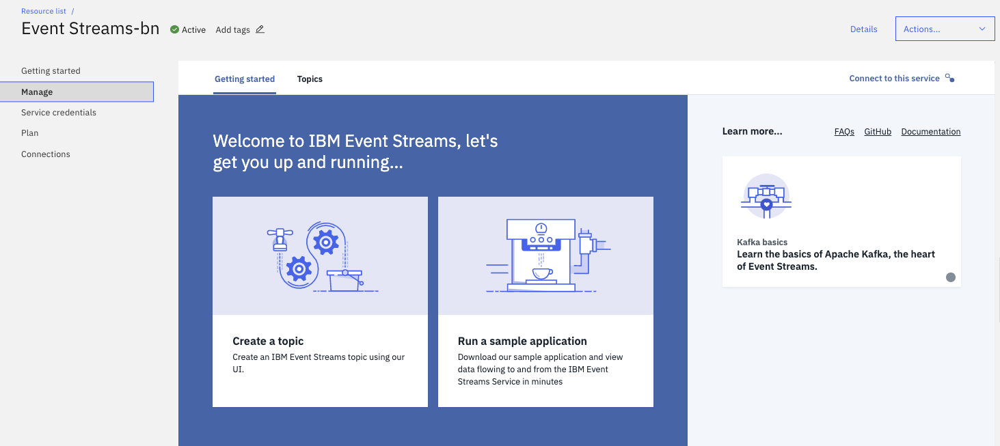

## Create topic 

In this section we are going to see how to create, list and delete topics both using the User Interface and then the IBM Event Streams CLI.


1. Open the IBM Event Streams user interface (go into your IBM Event Streams service within your IBM Cloud portal and click on the launch dashboard button). Once there, click on the _Topics_ tab from the top menu:

	


Let create a `demo-topic-ui` topic. If you need to revisit the topic concepts, you can read [this note](http://localhost:8000/technology/kafka-overview/#topics). When you go to the topics view you get the list of existing topics.

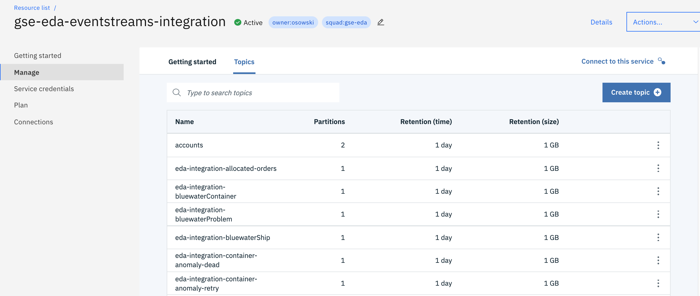

From this list an administrator can delete an existing topic or create new one. 

1. The 'create topic' button leads to the step by step process. 
1. Switch to the _Advanced_ mode to get access to the complete set of parameters. The first panel is here to define the core configuration

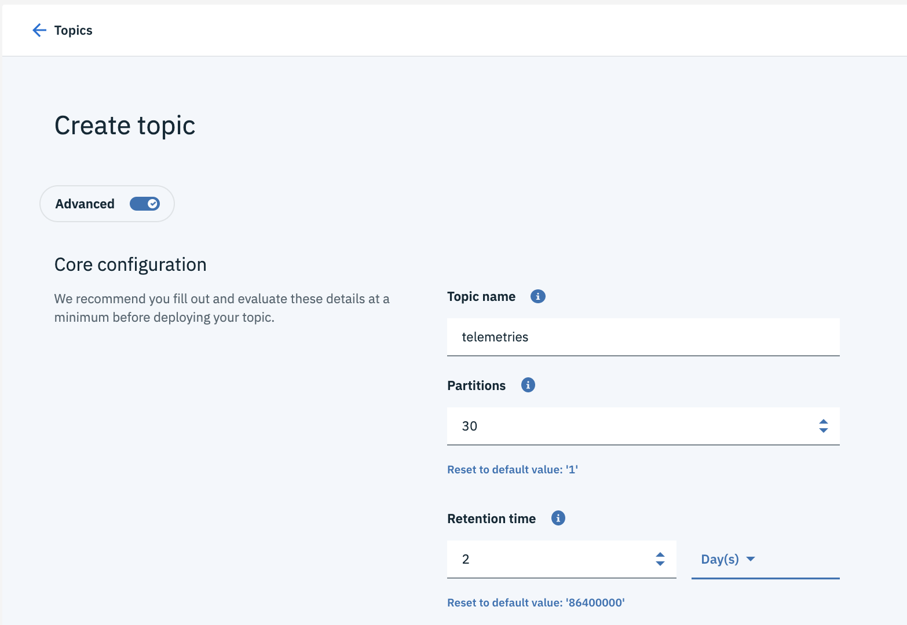

Some parameters to understand:

* **Number of partitions**: the default value should be 1. If the data can be partitioned without loosing semantic, you can increase the number of partitions.
* **Retention time**: This is how long messages are retained before they are deleted to free up space. If your messages are not read 
by a consumer within this time, they will be missed. It is mapped to the [retention.ms](https://kafka.apache.org/documentation/#retention.ms) kafka topic configuration.

The bottom part of the configuration page, includes _logs, cleanup_ and _indexing_.


* The partition's log parameter section includes a [cleanup policy](https://kafka.apache.org/documentation/#cleanup.policy) that could be:
    * delete: discard old segments when their retention time or size limit has been reached
    * compact: retain at least the last known value for each message key within the log of data for a single topic partition. The topic looks like a table in DB.
    * compact, delete: compact the log and remove old records

* [retention bytes](https://kafka.apache.org/documentation/#retention.bytes): represents the maximum size a partition (which consists of log segments) can grow to, before old log segments will be discarded to free up space.
* [log segment size](https://kafka.apache.org/documentation/#segment.bytes) is the maximum size in bytes of a single log file. 
* [Cleanup segment time - segment.ms](https://kafka.apache.org/documentation/#segment.ms) controls the period of time after which Kafka will force the log to roll, even if the segment file isn't full, this is to ensure that retention can delete or compact old data.
* [Index - segment.index.bytes](https://kafka.apache.org/documentation.html#segment.index.bytes)controls the size of the index that maps offsets to file positions.

The log cleaner policy is supported by a log cleaner, which are threads that recopy log segment files, removing records whose key appears in the head of the log.

The number of replications is set to three with a `min-in-sync` replicas of two.

<InlineNotification kind="info">A message is considered committed when all in sync replicas for that partition have applied it to their log. The leader maintains a set of in-sync-replicas: all the nodes which are up-to-date with the leader’s log, and actively acknowledging new writes. Every write goes through the leader and is propagated to every node in the In Sync Replica set, or ISR. 
</InlineNotification>


1. We can now see our new topic:

	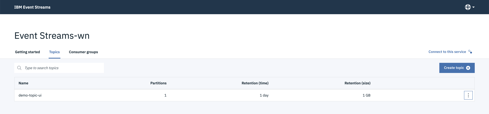

1. To delete a topic, click on the topic options button at the right end of a topic, click on _Delete this topic_ and then on the _Delete_ button in the confirmation pop-up window:

	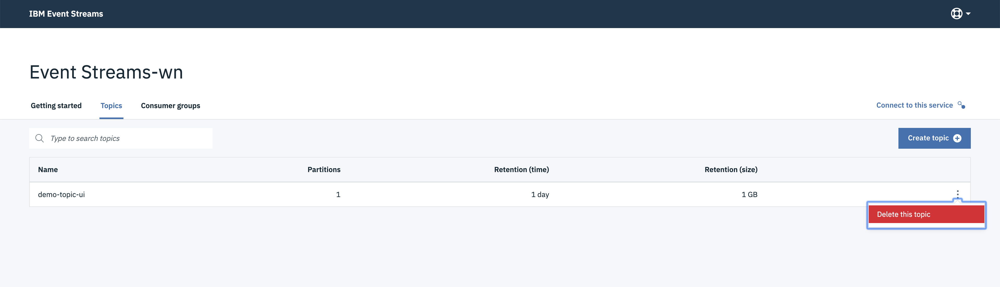

1. The topic should now be deleted:

	

### Create topic with CLI 

1. List your topics with `$ ibmcloud es topics`:

	```shell
	$ ibmcloud es topics
	OK
	No topics found.
	```
1. Create a topic: (Default 1 partition - 3 replicas)

	```shell
	$ ibmcloud es topic-create --name demo-topic
	Created topic demo-topic
	OK
	```
	\* Execute `$ ibmcloud es topic-create --help` for more further configuration of your topic creation

1. List topics:

	```shell
	$ ibmcloud es topics
	Topic name
	demo-topic
	OK
	```

1. Display details of a topic:

	```shell
	$ ibmcloud es topic demo-topic
	Details for topic demo-topic
	Topic name   Internal?   Partition count   Replication factor
	demo-topic   false       1                 3

	Partition details for topic demo-topic
	Partition ID   Leader   Replicas   In-sync
	0              2        [2 1 0]    [2 1 0]

	Configuration parameters for topic demo-topic
	Name                  Value
	cleanup.policy        delete
	min.insync.replicas   2
	segment.bytes         536870912
	retention.ms          86400000
	retention.bytes       1073741824
	OK
	```

1. Delete records in a topic
In the command below, we want to delete record on a partition 0 offset 5 and partition 1 from offset 0: 

	```shell
	$ ibmcloud es topic-delete-records --name demo-topic --partition-offset 1:0;0:5 --force
	```

1. Add partitions to an existing topic, by setting the new target number of partition: 

	```shell
	$ ibmcloud es topic-partition-set --name demo-topic --partitions 30
	```

1. Delete a topic:

	```shell
	$ ibmcloud es topic-delete demo-topic
	Really delete topic 'demo-topic'? [y/N]> y
	Topic demo-topic deleted successfully
	OK
	```

1. List topics:

	```shell
	$ ibmcloud es topics
	OK
	No topics found.
	```

For the last list of commands see the [CLI Reference manual](https://cloud.ibm.com/docs/EventStreams?topic=eventstreams-cli_reference#cli_reference).