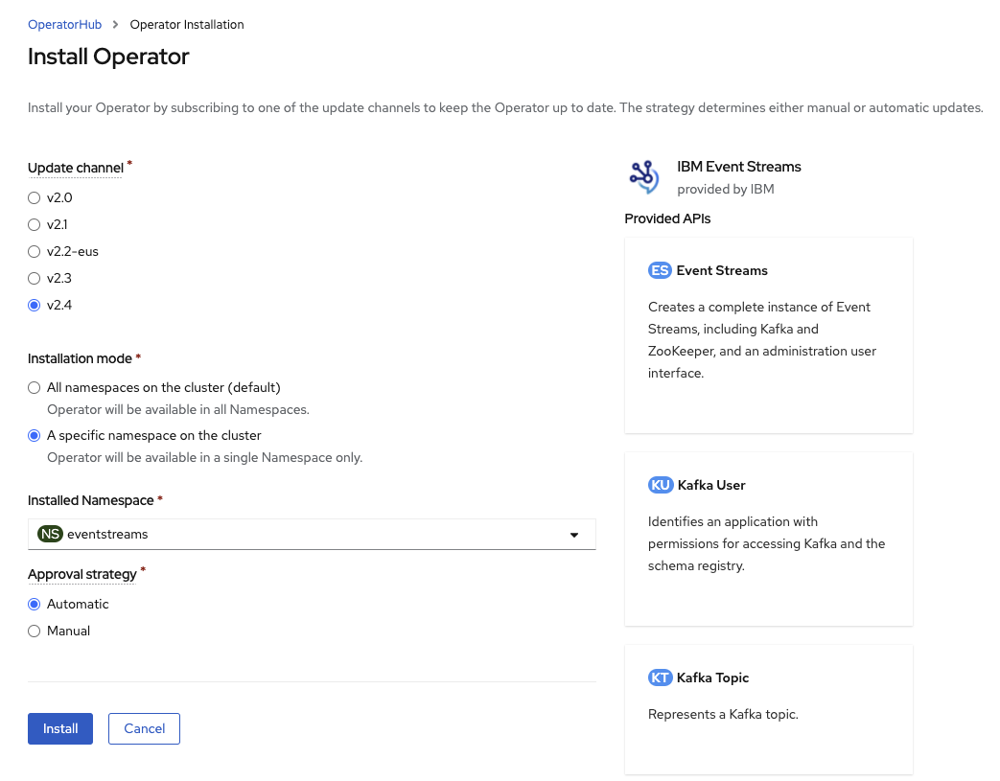
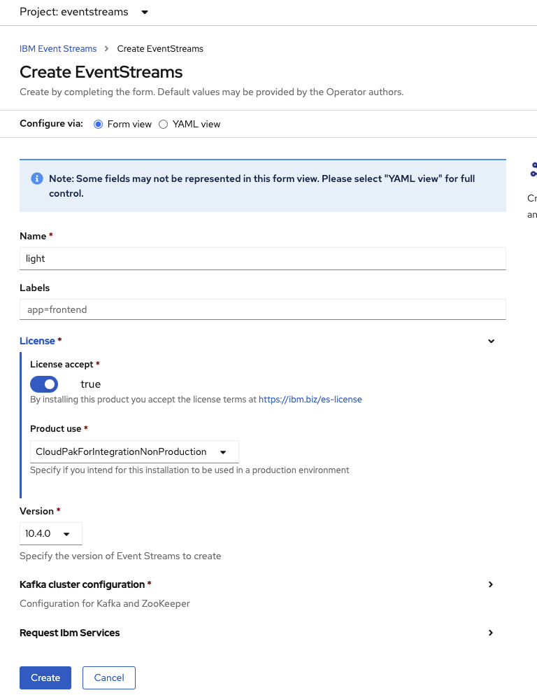
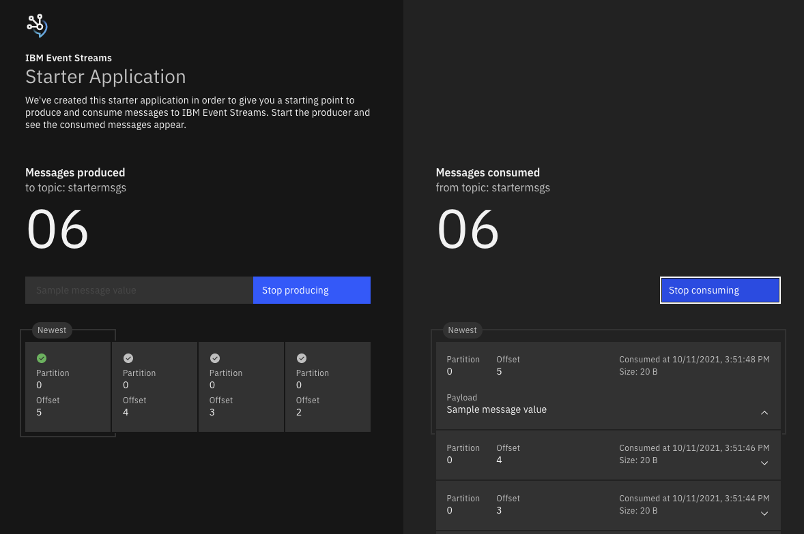
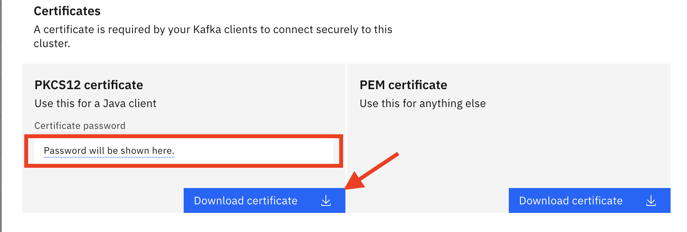

<InlineNotification kind="warning">
<strong>Updated 10/11/2021 </strong>
</InlineNotification>

In this tutorial you will learn how to install Event Streams on OpenShift, using a the Administration Console, or using CLI.
We propose two installation tutorials: 

* one using the OpenShift Admin console, then the Event Streams console to create Kafka topics and use the Starter Application,
to validate the installation.
* one using `oc CLI` from your terminal or from Cloud Shell Terminal.

<AnchorLinks>
  <AnchorLink>Prerequisites</AnchorLink>
  <AnchorLink>Install Event Streams Using OpenShift Console</AnchorLink>
  <AnchorLink>Run starter application</AnchorLink>
  <AnchorLink>Install Event Streams Using CLIs</AnchorLink>
  <AnchorLink>Common operations to perform on cluster</AnchorLink>
</AnchorLinks>


The Kafka Cluster configuration is for a development or staging environment with no persistence.

Once the installation is successful, the final pods running in the `eventstreams` project are:

 ```sh
dev-entity-operator-69c6b7cf87-bfxbw   2/2     Running   0          43s
dev-kafka-0                            1/1     Running   0          2m
dev-kafka-1                            1/1     Running   0          2m
dev-kafka-2                            1/1     Running   0          2m
dev-zookeeper-0                        1/1     Running   0          2m46s
dev-zookeeper-1                        1/1     Running   0          3h23m
dev-zookeeper-2                        1/1     Running   0          3h23m
 ```

**Updated October 07/2021 - Operator Release 2.4 - Product Release 10.4 - Kafka 2.8**

We recommend to read the following ["structuring your deployment" chapter from product documentation](https://www.ibm.com/docs/en/cloud-paks/cp-integration/2021.3?topic=installation-structuring-your-deployment)
to give you more insight of the things to consider for deployment. 

In this tutorial we select to deploy Event Streams in one namespace, and the Operator to monitor multiple namespaces.

## Prerequisites

* Get access to an OpenShift Cluster.
* Get `oc ` CLI from OpenShift Admin Console

### Install Cloudctl CLIs 

* Install IBM Cloud Pak CLI: Cloudctl is a command line tool to manage Container Application Software for Enterprises (CASEs). 
This CLI will allow us to manage Cloud Pak related components as well as software, like IBM Event Streams, installed through any IBM Cloud Pak. In order to install it, execute the following commands in your IBM Cloud Shell:

  * Download the IBM Cloud Pak CLI (example below is for Mac but  other downloads are [available here](https://github.com/IBM/cloud-pak-cli/releases/tag/v3.12.0)): 

  ```sh
  curl -L https://github.com/IBM/cloud-pak-cli/releases/latest/download/cloudctl-darwin-amd64.tar.gz -o cloudctl.tar.gz
  ```
  * Untar it

  ```sh
  tar -xvf cloudctl.tar.gz
  ```

  * Rename it as cloudctl and move to a folder within your PATH:

  ```sh
  mv cloudctl-darwin-amd64 cloudctl
  ```

  * Make sure your IBM Cloud Pak CLI is in the path: `which cloudctl`
  * Make sure your IBM Cloud Pak CLI works: `cloudctl help`

  


See also the product documentation for [prerequisites details](https://ibm.github.io/event-streams/installing/prerequisites/)

### Install IBM catalog

Use the EDA Gitops project with the different operator subscriptions and IBM catalog to define
the IBM Operator catalog.

```sh
# List existing catalog
oc get catalogsource -n openshift-marketplace
# Verifi ibm-operator-catalog is present in the list
# if not add IBM catalog 
oc apply -f https://raw.githubusercontent.com/ibm-cloud-architecture/eda-gitops-catalog/main/ibm-catalog/catalog_source.yaml
```

### Get IBM Software entitlement key and create a secret

* Obtain [IBM license entitlement key](https://github.com/IBM/cloudpak-gitops/blob/main/docs/install.md#obtain-an-entitlement-key).
* Verify you can access the IBM Image repository with

    ```sh
    docker login cp.icr.io --username cp --password <key-copied>
    ```

* Create a OpenShift secret in the `openshift-operator` project 

    ```sh
    # Get on good project
    oc project openshift-operators
    # Verify if secret exists
    oc describe secret ibm-entitlement-key
    # Create if needed
    oc create secret docker-registry ibm-entitlement-key \
        --docker-username=cp \
        --docker-server=cp.icr.io \
        --namespace=eventstreams \
        --docker-password=your_entitlement_key 
    ```

### Install IBM foundational services

When using security with IAM and other services, Event Streams needs IBM foundations services. It will install it
automatically if you install the operator at the cluster level. 
In case you need to control the deployment and if *Cloud Pak for Integration* is not installed yet, you need to install the IBM foundational services operator
for that, follow these [simple instructions](https://www.ibm.com/docs/en/cpfs?topic=311-installing-foundational-services-by-using-console).

Create the same ibm-entitlement-key in the `ibm-common-services`  namespace.

```sh
# verify operator installed
oc get operators -n ibm-common-services
# -> response:
ibm-common-service-operator.openshift-operators    
ibm-namespace-scope-operator.ibm-common-services   
ibm-odlm.ibm-common-services                       
```

Those are the deployments the foundational services are creating:

```
NAME                                   READY   UP-TO-DATE   AVAILABLE   AGE
ibm-common-service-webhook             1/1     1            1           68m
ibm-namespace-scope-operator           1/1     1            1           69m
operand-deployment-lifecycle-manager   1/1     1            1           68m
secretshare                            1/1     1            1           68m
```

Recalls that operands are what operators manage. 

---

## Install Event Streams Using OpenShift Console

* As Cluster Administrator, create a project using Home > Projects, and create button, and enter `eventstreams` as project name.

    

The goal is to create a shareable Kafka cluster. 

* As Administrator, use `Openshift console -> Operators > OperatorHub` to search for `Event Streams` operator, then install the operator by selecting
the `All namespaces on the cluster`, the version v2.4. The Operator will monitor all namespaces.

  

  The installation of this operator will also include pre-requisites operators like `Cloud Pak foundational services (3.11)`
  
* Once the Operator is ready, go to the `Installed Operator` under the `eventstreams` project

 

* Create an Event Streams cluster instance using the operator user interface:

 

  Enter the minimum information for a development cluster, like name, license,.. 

  

  Or go to the `Yaml view` and select one of the proposed Sample:
  
  
  
  The `Development` configuration should be enough to get you started. For production
  deployment [see this article](/technology/event-streams/es-cp4i/es-production/).
  
  Do not forget to set `spec.license.accept` to true.

  Before creating the instance, we recommend you read [the security summary](/technology/security/) 
  so you can relate the authentication configured by default with what application
  needs to use to connect to the Kafka cluster. For example the following declaration stipulates
  to use TLS authentication for internal communication, and SCRAM for external connection.

    ```yaml
        listeners:
        external:
          authentication:
            type: scram-sha-512
          type: route
        tls:
          authentication:
            type: tls
    ```

The first deployment of Event Streams, there may be creation of new deployments into the `ibm-common-services` if
those services were not present before. Here is the updated list of `ibm-common-services` deployments:

  ```sh
  NAME                                   READY   UP-TO-DATE   AVAILABLE   AGE
  auth-idp                               1/1     1            1           27m
  auth-pap                               1/1     1            1           32m
  auth-pdp                               1/1     1            1           32m
  cert-manager-cainjector                1/1     1            1           31m
  cert-manager-controller                1/1     1            1           31m
  cert-manager-webhook                   1/1     1            1           30m
  common-web-ui                          1/1     1            1           20m
  configmap-watcher                      1/1     1            1           31m
  default-http-backend                   1/1     1            1           31m
  iam-policy-controller                  1/1     1            1           32m
  ibm-cert-manager-operator              1/1     1            1           32m
  ibm-common-service-webhook             1/1     1            1           3h12m
  ibm-commonui-operator                  1/1     1            1           32m
  ibm-iam-operator                       1/1     1            1           33m
  ibm-ingress-nginx-operator             1/1     1            1           32m
  ibm-management-ingress-operator        1/1     1            1           33m
  ibm-mongodb-operator                   1/1     1            1           32m
  ibm-monitoring-grafana                 1/1     1            1           32m
  ibm-monitoring-grafana-operator        1/1     1            1           33m
  ibm-namespace-scope-operator           1/1     1            1           3h12m
  ibm-platform-api-operator              1/1     1            1           31m
  management-ingress                     1/1     1            1           23m
  nginx-ingress-controller               1/1     1            1           31m
  oidcclient-watcher                     1/1     1            1           32m
  operand-deployment-lifecycle-manager   1/1     1            1           3h11m
  platform-api                           1/1     1            1           31m
  secret-watcher                         1/1     1            1           32m
  secretshare                            1/1     1            1           3h12m
  ```

It could take few minutes to get these pods up and running.

The result of this cluster creation should looks like: 


with the list of pod as illustrated at the top of this article.

See also [Cloud Pak for integration documentation](https://www.ibm.com/docs/en/cloud-paks/cp-integration/2021.3?topic=installing-overview-installation) for other
deployment considerations.

### Adding users and teams 

You need to be a platform administrator to create users and teams in IAM.

To get the admin user credential, use the following command:

```sh
oc get secret platform-auth-idp-credentials -o jsonpath='{.data.admin_password}' -n ibm-common-services | base64 && echo ""
```

### Log into Event Streams

You can get the User Interface end point by doing the following command.

```sh
oc get route dev-ibm-es-ui -o jsonpath='{.spec.host}'
```

> Change `dev` prefix with the name of your Kafka cluster you defined earlier.

Or using the Admin Console 

* Select the Event Streams Operator in the project where you install it
* Select Click on the IBM Event Streams Operator and then on the `Event Streams` option listed at the top bar
1. Click on the IBM Event Streams cluster instance you want to access to its console and see the `Admin UI` attribute that displays the route to this IBM Event Streams instance's console.
  
1. Click on the route link and enter your IBM Event Streams credentials.

Here is the Console home page:


### Create Event Streams Topics

This section is a generic example of the steps to proceed to define a topic with Event Streams on OpenShift. 
The example is to define a topic named INBOUND with 1 partition and a replica set to 3.

1. Log into your IBM Event Streams instance through the UI as explained in the previous section.
1. Click on the Topics option on the navigation bar on the left. 
1. In the topics page, click on the `Create topic` blue button on the top right corner

  

1. Provide a name for your topic.

  

1. Leave Partitions at 1.

  

1. Depending on how long you want messages to persist you can change this.

  

1. You can leave Replication Factor at the default 3.

  

1. Click Create.
1. Make sure the topic has been created by navigating to the topics section on the IBM Event Streams user inteface you can find an option for in the left hand side menu bar. 

## Run starter application

From the Event Streams Home page, we can access the Starter appication that is an excellent
way to demonstrate sending messages and consume them. It is a good source of inspiration for Vert.x based application.

Use the step-by-step instructions from Event Streams Starter application page:


The figure above illustrates that you can download a zip file containing the properties of the application according to
the Event-Streams cluster configuration, and a `p12` TLS certificate to be added to a local folder.

This Starter application will run locally to the user's laptop with the command:

```sh
java -jar target/demo-all.jar -Dproperties_path=./kafka.properties 
```

Point to [http://localhost:8080/](http://localhost:8080/) and you can start sending 
messages:


 
 
This application can be deployed to OpenShift within the same namespace as Event Streams so it will
be easy to test the internal communication. Here are the steps:

```sh
# From the folder where you downloaded the kakfa.properties file
# create a secret to keep the content of this file
oc create secret generic demo-app-secret --from-file=./kafka.properties
# then use our deployment definition
oc apply -k https://raw.githubusercontent.com/ibm-cloud-architecture/eda-quickstarts/main/kafka-java-vertz-starter/app-deployment/kustomization.yaml
```
The source code for this application is in this git repo: [ibm-messaging/kafka-java-vertx-starter](https://github.com/ibm-messaging/kafka-java-vertx-starter/)

--- 

## Install Event Streams Using CLIs

This section is an alternate of using OpenShift Console. We are using our GitOps catalog repository which
defines the different operators and scripts we can use to install Event Streams and other services
via scripts. All can be automatized with ArgoCD / OpenShift GitOps.

* Create a project to host Event Streams cluster:

  ```shell
  oc new-project eventstreams
  ```
* Clone our eda-gitops-catalog project

  ```sh
  git clone https://github.com/ibm-cloud-architecture/eda-gitops-catalog.git
  ```
* Create the `ibm-entitlement-key` secret in this project.

  ```sh
  oc create secret docker-registry ibm-entitlement-key \
        --docker-username=cp \
        --docker-server=cp.icr.io \
        --namespace=eventstreams \
        --docker-password=your_entitlement_key 
  ```

* Install Event Streams Operator subscriptions

  ```sh
  oc apply -k cp4i-operators/event-streams/operator/overlays/v2.4/
  ```

* Install one Event Streams instance: Instances of Event Streams can be created after the Event Streams operator is installed. 
You can use te OpenShift console or our predefined cluster definition:

  ```shell
  oc apply -k cp4i-operators/event-streams/instances/dev/
  ```

  If you want to do the same thing for a production cluster

  ```shell
  oc apply -k cp4i-operators/event-streams/instances/prod-small/
  ```
---

## Common operations to perform on cluster

We list here a set of common operations to perform on top of Event Streams Cluster.

### Download ES CLI plugin

From Event Streams Console, go to the "Find more in the Toolbox" tile, and then select
`IBM Event Streams command-line interface`, then select your target operating system:


Initialize the Event Streams CLI plugin (make sure you provide the namespace where your IBM Event Streams instance is installed on as the command will fail if you dont have cluster wide admin permissions)

  ```shell
  $ cloudctl es init -n eventstreams
                                                  
  IBM Cloud Platform Common Services endpoint:   https://cp-console.apps.eda-sandbox.gse-ocp.net   
  Namespace:                                     integration   
  Name:                                          kafka   
  IBM Cloud Pak for Integration UI address:      https://integration-navigator-pn-integration.apps.eda-sandbox.gse-ocp.net   
  Event Streams API endpoint:                    https://kafka-ibm-es-admapi-external-integration.apps.eda-sandbox.gse-ocp.net   
  Event Streams API status:                      OK   
  Event Streams UI address:                      https://kafka-ibm-es-ui-integration.apps.eda-sandbox.gse-ocp.net   
  Apicurio Registry endpoint:                    https://kafka-ibm-es-ac-reg-external-integration.apps.eda-sandbox.gse-ocp.net   
  Event Streams bootstrap address:               kafka-kafka-bootstrap-integration.apps.eda-sandbox.gse-ocp.net:443   
  OK
  ``` 

### Access to Event Streams Console using CLI

In order to log into IBM Event Streams console through the CLI, 
we are going to use the `oc` OpenShift CLI, the `cloudctl` Cloud Pak CLI and 
the `es` Cloud Pak CLI plugin. 

We assume you are already logged into your OpenShift cluster.

1. Get your Cloud Pak Console route (you may need cluster wide admin permissions to do so as the Cloud Pak Console is usually installed in the `ibm-common-services` namespace by the cluster admins)

  ```shell
  $ oc get routes -n ibm-common-services | grep console
  cp-console                       cp-console.apps.eda-sandbox.gse-ocp.net                                                  icp-management-ingress           https      reencrypt/Redirect     None
  ```

1. Log into IBM Event Streams using the Cloud Pak console route from the previous step:

  ```shell
  $ cloudctl login -a https://cp-console.apps.eda-sandbox.gse-ocp.net --skip-ssl-validation

  Username> user50

  Password>
  Authenticating...
  OK

  Targeted account mycluster Account

  Enter a namespace > integration
  Targeted namespace integration

  Configuring kubectl ...
  Property "clusters.mycluster" unset.
  Property "users.mycluster-user" unset.
  Property "contexts.mycluster-context" unset.
  Cluster "mycluster" set.
  User "mycluster-user" set.
  Context "mycluster-context" created.
  Switched to context "mycluster-context".
  OK

  Configuring helm: /Users/user/.helm
  OK
  ```

### Create Topic with es CLI

1. Create the topic with the desi specification.

   ```shell
   cloudctl es topic-create --name INBOUND --partitions 1 --replication-factor 3
   ```

1. Make sure the topic has been created by listing the topics.

  ```shell
  $ cloudctl es topics
  Topic name   
  INBOUND   
  OK
  ```

### Get Kafka Bootstrap Url

For an application to access the Kafka Broker, we need to get the bootstrap URL.

#### UI

You can find your IBM Event Streams Kakfa bootstrap url if you log into the IBM Event
 Streams user interface, and click on the `Connect to this cluster` option displayed
  on the dashboard. This will display a menu where you will see a url to the left 
  of the `Generate SCAM credentials` button. Make sure that you are on 
  the **External Connection**.


#### CLI

You can find your IBM Event Streams and Kakfa bootstrap url when you init the 
IBM Event Streams Cloud Pak CLI plugin on the last line:

```shell
$ cloudctl es init -n eventstreams
                                                  
IBM Cloud Platform Common Services endpoint:   https://cp-console.apps.eda-sandbox-delta.gse-ocp.net   
Namespace:                                     integration   
Name:                                          kafka   
IBM Cloud Pak for Integration UI address:      https://integration-navigator-pn-integration.apps.eda-sandbox-delta.gse-ocp.net   
Event Streams API endpoint:                    https://kafka-ibm-es-admapi-external-integration.apps.eda-sandbox-delta.gse-ocp.net   
Event Streams API status:                      OK   
Event Streams UI address:                      https://kafka-ibm-es-ui-integration.apps.eda-sandbox-delta.gse-ocp.net   
Apicurio Registry endpoint:                    https://kafka-ibm-es-ac-reg-external-integration.apps.eda-sandbox-delta.gse-ocp.net   
Event Streams bootstrap address:               kafka-kafka-bootstrap-integration.apps.eda-sandbox-delta.gse-ocp.net:443   
OK
``` 
  
### Generate SCRAM Service Credentials

For an application to connect to an Event Streams instance through the secured 
external listener, it needs SCRAM credentials to act as service credentials
to authenticate the application. We also need TLS certificate to encrypt the
communication with the brokers.

#### UI

1. Log into the IBM Event Streams user interface as explained previously in this readme and click on the `Connect to this cluster` option displayed on the dashboard. This will display a menu. Make sure that you are on the **External Connection**.

  

1. Click on the `Generate SCRAM credentials` button.

  

1. Introduce a name for your credentials and choose the option that better suits the needs of your applications (this will create RBAC permissions for you credentials so that a service credentials can do only what it needs to do). For this demo, select `Produce messages, consume messages and create topics and schemas` last option.

  

1. Decide whether your service credentials need to have the ability to access all topics or certain topics only. For this demo, select `All Topics` and then click Next.

  

1. Decide whether your service credentials need to have the ability to access all consumer groups or certain specific consumer groups only. For this demo, select `All Consumer Groups` and click Next.

  

1. Decide whether your service credentials need to have the ability to access all transactional IDs or certain specific transactional IDs only. For this demo, select `All transaction IDs` and click on `Generate credentials`.

  

1. **Take note** of the set of credentials displayed on screen. 
You will need to provide your applications with these in order to get authenticated 
and authorized with your IBM Event Streams instance.

  

1. If you did not take note of your SCRAM credentials or you forgot these, the above will create a `KafkaUser` object in OpenShift that is interpreted by the IBM Event Streams Operator. You can see this `KafkaUser` if you go to the OpenShift console, click on `Operators --> Installed Operators` on the right hand side menu, then click on the `IBM Event Streams` operator and finally click on `Kafka Users` at the top bar menu.

  

1. If you click on your `Kafka User`, you will see what is the Kubernetes secret behind holding your SCRAM credentials details.

  

1. Click on that secret and you will be able to see again your `SCRAM password` (your `SCRAM username` is the same name as the `Kafka User` created or the secret holding your `SCRAM password`) 

  


#### CLI

1. Log into your IBM Event Streams instance through the CLI.

1. Create your SCRAM service credentials with the following command (adjust the topics, consumer groups, transaction IDs, etc permissions your SCRAM service credentials should have in order to satisfy your application requirements):

  ```shell
  $ cloudctl es kafka-user-create --name test-credentials-cli --consumer --producer --schema-topic-create --all-topics --all-groups --all-txnids --auth-type scram-sha-512
  
  KafkaUser name         Authentication   Authorization   Username                                                Secret   
  test-credentials-cli   scram-sha-512    simple          EntityOperator has not created corresponding username   EntityOperator has not created corresponding secret   
  
  Resource type     Name        Pattern type   Host   Operation   
  topic             *           literal        *      Read   
  topic             __schema_   prefix         *      Read   
  topic             *           literal        *      Write   
  topic             *           literal        *      Create   
  topic             __schema_   prefix         *      Alter   
  group             *           literal        *      Read   
  transactionalId   *           literal        *      Write   
  
  Created KafkaUser test-credentials-cli.
  OK
  ```

1. List the `KafkaUser` objects to make sure yours has been created:

  ```shell
  $ cloudctl es kafka-users
  KafkaUser name                    Authentication   Authorization   
  test-credentials                  scram-sha-512    simple   
  test-credentials-cli              scram-sha-512    simple   
  OK
  ```

1. To retrieve your credentials execute the following command:

  ```shell
  $ cloudctl es kafka-user test-credentials-cli 
  KafkaUser name         Authentication   Authorization   Username               Secret   
  test-credentials-cli   scram-sha-512    simple          test-credentials-cli   test-credentials-cli   

  Resource type     Name        Pattern type   Host   Operation   
  topic             *           literal        *      Read   
  topic             __schema_   prefix         *      Read   
  topic             *           literal        *      Write   
  topic             *           literal        *      Create   
  topic             __schema_   prefix         *      Alter   
  group             *           literal        *      Read   
  transactionalId   *           literal        *      Write   
  OK
  ```

1. Above you can see your `SCRAM username` under `Username` and the secret holding your `SCRAM password` under `Secret`. In order to retrieve the password, execute the following command:

  ```shell
  $ oc get secret test-credentials-cli -o jsonpath='{.data.password}' | base64 --decode 
  
  *******
  ```

**NEXT:** For more information about how to connect to your cluste, read the [IBM Event Streams product documentation](https://ibm.github.io/event-streams/getting-started/connecting/)

### Get Event Streams TLS Certificates

In this section we are going to see how to download the TLS certificats to securely connect to our IBM Event Streams instance.

#### UI

1. Log into the IBM Event Streams console user interface as explained before in this readme.

1. Click on the `Connect to this cluster` option displayed on the dashboard. This will display a menu where you will see a `Certificates` section:

  

1. Depending on what language your application is written into, you will need a `PKCS12 certificate` or a `PEM certificate`. Click on `Download certificate` for any of the options you need. If it is the `PKCS12 certificate` bear in mind it comes with a password for the truststore. You don't need to write this down as it will display any time you click on `Download certificate` button.

#### CLI

1. Log into IBM Event Streams through the CLI as already explained before in this readme.

1. To retrieve the `PKCS12 certificate` execute the following command:

  ```shell
  $ cloudctl es certificates --format p12
  Trustore password is ********
  Certificate successfully written to /Users/testUser/Downloads/es-cert.p12.
  OK
  ```

1. To retrieve the `PEM certificate` execute the following command:

  ```shell
  $ cloudctl es certificates --format pem
  Certificate successfully written to /Users/testUser/Downloads/es-cert.pem.
  OK
  ```

